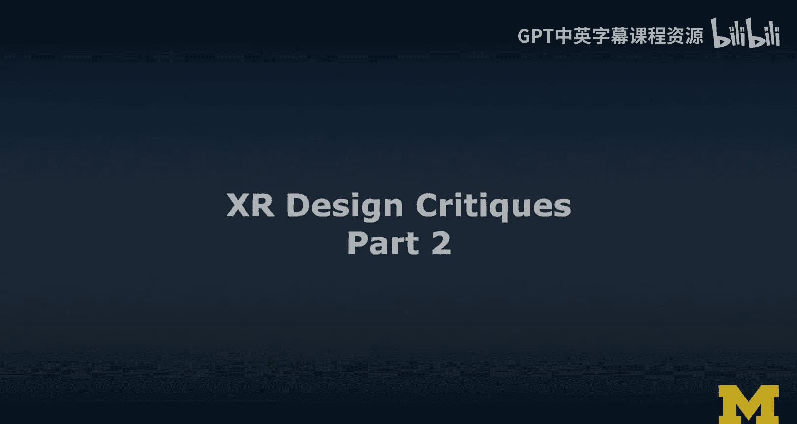
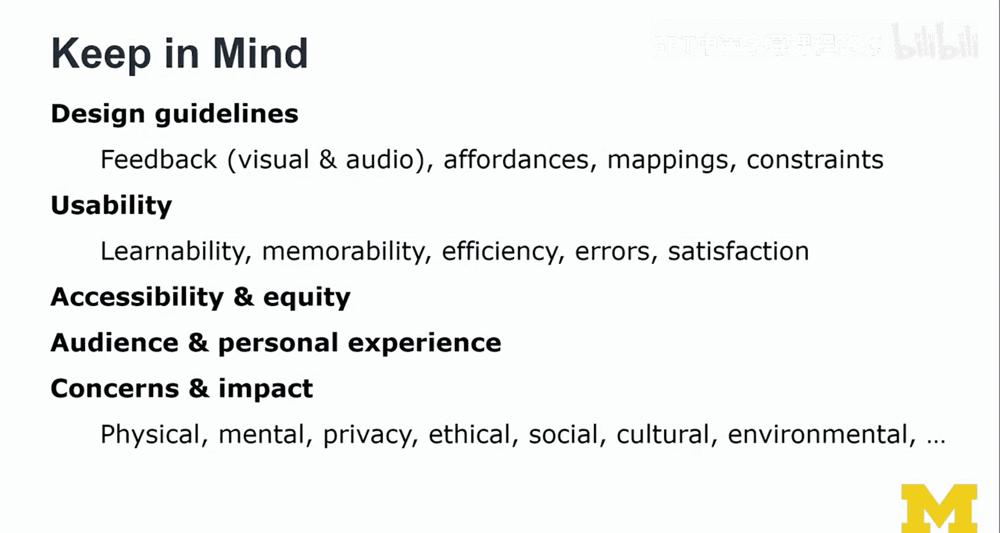

# 扩展现实设计：2.3：XR设计评审第二部分 🧐

在本节课中，我们将学习如何对XR应用进行深入的设计评审。我们将以Google Expeditions应用为例，分析其在VR和AR模式下的设计、交互与体验，并学习一套结构化的评审方法。

上一节我们介绍了设计评审的基本概念，本节中我们来看看如何将理论应用于实际案例。

---

## VR模式体验分析 🕶️

该应用支持一个我认为相当不错的功能：退出Cardboard VR模式。这就像暂时放下设备一样。我们有一个按钮，可以退出立体视图，进入360度全景视图。在这个模式下，我们可以环顾四周，欣赏日落景色。

有趣的是，它虽然不如完整的VR体验那样出色，但依然有效。它的一个优点是能记住状态。你仍然在同一个场景中，已激活的地标也保持不变，交互方式也基本相同。

不过，文字现在更难触及，因为所有东西都变小了。这种导航方式依然有效，但低头看Sophie这样的物体会显得别扭。这个过渡过程也值得思考：我该如何进行这个过渡？如果我转动幅度过大，可能会让人感到不适。因此，如何在场景间导航是一个有趣的设计点。

总的来说，这是一个很酷的体验。你可以探索许多不同的“探险”内容。我在这里以纽约的“世界奇观”为例。

---

## 练习任务与AR模式预览 📱

在练习中，我们也将查看它的AR版本，我认为这同样很酷。并非所有“探险”都同时支持AR和VR，我还没发现两者都支持的内容。但Expeditions作为一个工具或应用，其框架设计非常有趣，值得比较它在AR和VR下的表现。

如果你只有AR或VR设备可用（例如，VR可能通过Cardboard实现），那么AR可能对你更可行。我建议你探索一些“探险”内容，并进行设计评审。

以下是练习的核心步骤：
*   应用设计准则进行分析。
*   从伦理角度进行审视。

这些是我们希望在练习中完成的步骤，应该会很有趣，希望你也能学到很多。显然，除了Expeditions，还有其他应用可以探索，但仅就这个应用而言，就有许多值得我们探索和学习的地方。

---

## 切换到AR模式分析 🔄

以上就是对Google Expeditions VR版的评审，我们以纽约城市为例进行了分析。这仅仅是众多“探险”中的一个。现在，我将切换到AR模式，向你展示它是如何工作的，也许你的手机也支持此功能。请随时对AR或VR体验提出批评。

我认为我的反馈侧重点会有所不同，主要集中在环境以及物体如何放置在物理环境中（锚定）上。我注意到在旋转和缩放方面存在一些问题——它似乎不支持缩放，只支持沿Y轴进行某种平移，这让我有些困惑。让我们一起看看吧。

再次强调，这种评审可以重构为 **“我喜欢/我希望/如果…会怎样”** 方法。对于任何需要你试用的界面，你仍然应该先进行出声思维测试，然后用“我喜欢/我希望/如果…会怎样”的方法来总结你的反馈。

---

## AR交互实例与限制 🦴

我们即将查看一个AR内容。这里我们会把它放在地板上。这是一个骨骼系统。

让我们看看这个家伙，它相当大。它看起来不太开心。再看看这个女孩。它的动画方式很有趣，基本上会散开。然后是脊柱，有点吓人，不是吗？在这种情况下，我们会把它抬高一点，但它应该可以缩放。

总的来说，AR交互功能相当有限。Expeditions的设计方式很有趣，它是为课堂使用而设计的。你可能真的会在课堂上和一群学生、学习者一起运行它。也许这就是没有音频的原因，以避免声音干扰，这可能是一个设计决策，只是没有明确传达出来。

所以请记住，并非所有的批评在这里都一定有效。这只是基于我在工作室或你在家等任何地方试用这一个用例的反馈。请考虑它是为课堂使用而设计的事实，并且它实际上有一种模式可以让教师与一组学生一起使用，这也值得体验。

---

## 结构化设计评审要点 📋

我想再次强调几个关键点：我们的批评应真正基于既定的设计准则，这会使批评更加客观。这显然是一种非常好的批评方式。

设计准则可以基于设计原则，例如**诺曼的设计原则**：反馈、示能、映射和约束。评估某物是否遵循自然映射，物体是否向你暗示了如何与它们互动，以及约束条件。

你还应该从**可用性**角度进行批评：可学习性、可记忆性、效率、错误率和满意度。这些是常见的可用性考量因素。

你还应从**可访问性和公平性**的角度进行批评。考虑那些可能只在最新一代头显上可用的高级功能，这些头显目前仍然非常昂贵。思考这是否真的必要，并考虑其有限的影响力，因为很多人可能负担不起这种体验。这也是我喜欢Google Expeditions的一点：它为低端设备设计，因此也可能在课堂上推广。

考虑受众，即用户及其背景。引入人物角色的概念，并可能从那个角度进行评审。在有限程度上，你也可以带入个人经验。

最后，你应该考虑关于体验及其可能对用户产生影响的更广泛关切。这里我仅列出一些常见的关切点：

以下是常见的伦理与社会关切点：
*   **隐私**是一个大问题。
*   **心理健康**与**身体健康**。
*   任何你认为与伦理问题相关的事情，例如真实感程度、沉浸感水平以及这是否可能具有潜在危险。
*   考虑**社会影响**。这种体验可以在课堂上使用吗？
*   考虑你在设计中看到的**文化问题**，或者是否冒犯了用户。（例如，如果我来自一个不玩棒球的国家，使用棒球隐喻我可能完全无法理解。这是我初到美国时遇到的问题之一，仅作为一个旁注。）
*   任何**环境与可持续性**方面的关切。

在你的评审中要广泛思考，提出这些问题，仅仅提出它们就能引发非常有趣的讨论。

---

## 总结 ✨

本节课中，我们一起学习了如何对XR应用进行深入的设计评审。我们以Google Expeditions为例，实际分析了其在VR和AR模式下的用户体验、交互设计以及存在的限制。我们重点介绍了基于**诺曼设计原则**和**可用性标准**的客观评审方法，并强调了从**可访问性、公平性及更广泛的伦理与社会影响**角度进行综合考量的重要性。通过结构化的“我喜欢/我希望/如果…会怎样”的反馈框架，我们可以更系统、更建设性地提出改进意见。希望你能将这些方法应用到自己的XR设计评审实践中。