# 用户体验与交互设计课程：荣誉课程说明：动手实践之旅 🚀

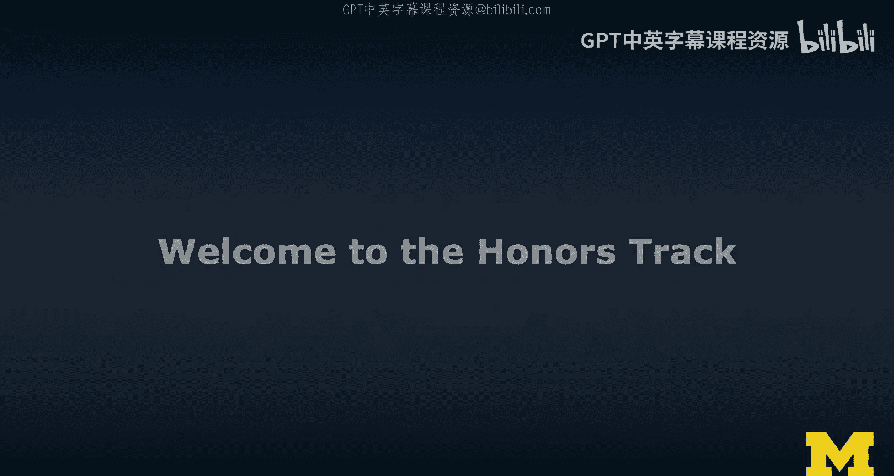

在本节课中，我们将开启用户体验与交互设计课程的“荣誉课程”学习路径。本节将详细介绍该路径的目标、核心活动以及你将通过一系列实践练习完成的项目。我们将从设计角度出发，创建一个XR项目原型，重点在于掌握设计方法而非成为开发专家。

上一节我们介绍了设计思维的概念，本节中我们来看看如何将这些概念付诸实践。

## 课程路径概述

荣誉课程路径旨在让你亲自动手实践。我们将从现有项目（例如Google Expeditions）出发，通过一系列结构化的设计活动，最终完成一个数字原型。这为你后续深入学习开发（第三门课程）打下坚实基础。

考虑到在线学习的特点，本课程将项目范围适当缩小，以便你在有限时间内有效学习。

## 核心活动步骤

以下是荣誉课程包含的核心设计活动步骤，我将引导你完成每一步。

**设计评论**
首先，你需要选择一个现有的XR应用（如Google Expeditions）进行设计评论。这包括从设计准则和伦理角度进行评估，思考其在公共与私人场景下的使用差异以及数据收集等问题。

**故事板与线框图**
接下来，基于选定的应用，你将进行故事板绘制和线框图设计。目的是理解应用流程，并尝试为其构思一个新功能。我们将使用多种保真度的技术进行探索。

以下是故事板与线框图的制作方法：
*   **纸上草图**：从最基础的纸上草图开始。
*   **360度模板**：利用课程中提到的360度环境模板进行构思。
*   **3D故事板**：在Tilt Brush等工具中进行沉浸式3D故事板创作。

**实体原型制作**
在完成初步设计后，我们将开始制作实体原型。

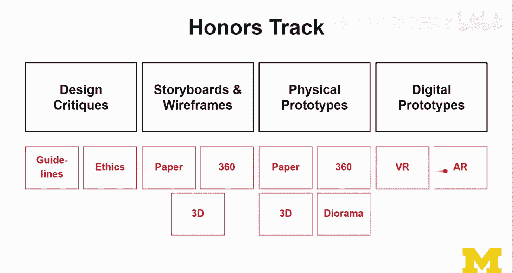

以下是实体原型的制作阶段：
*   **纸质模型**：从纸质模型开始，快速验证想法。
*   **场景模型**：利用360度模板构建环境，规划布局。
*   **3D模型**：使用黏土等材料制作3D模型，我推荐使用可长期保存的黏土而非石膏。
*   **立体布景**：最终，你可以利用手边的材料（如纸箱）搭建一个展示用的立体布景。

**数字原型与沉浸式创作**
最后，我们将进入数字原型制作阶段，涵盖VR和AR两种形式。

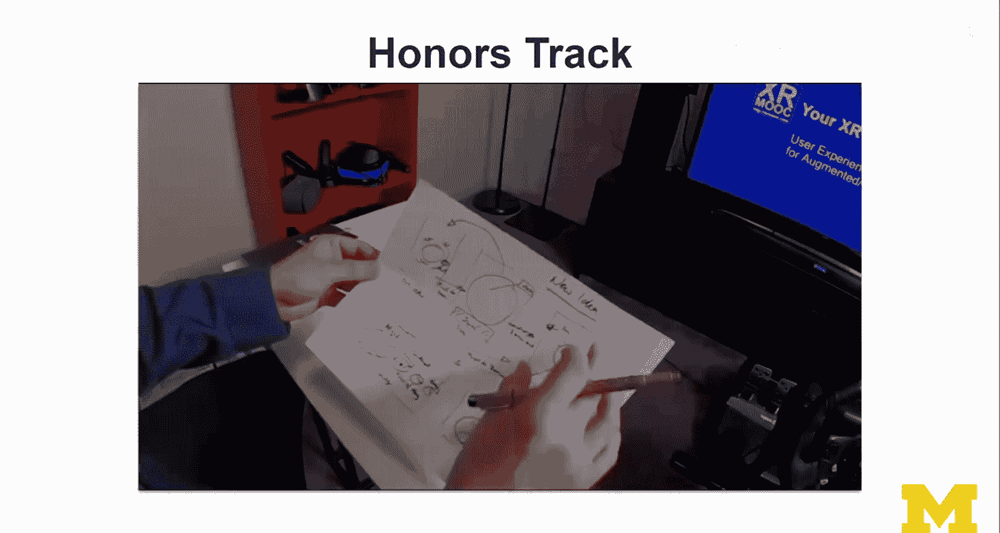

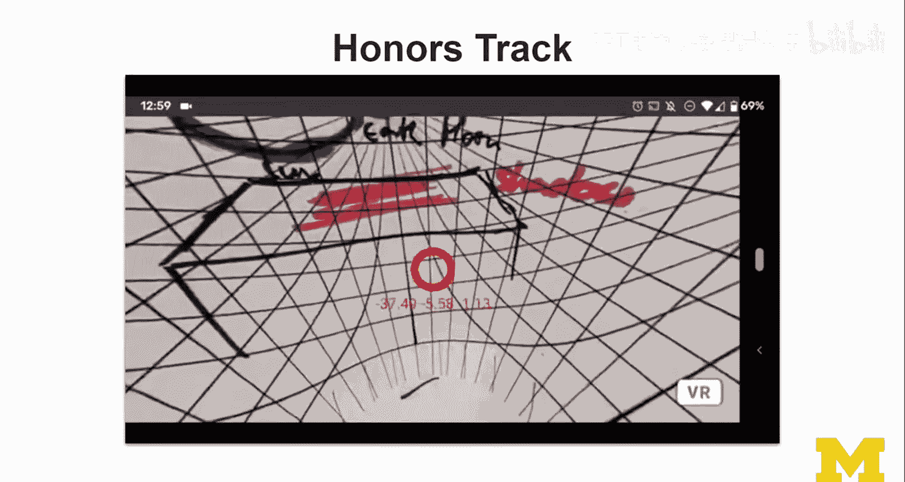

以下是数字原型的实现方式：
*   **数字原型设计**：使用相关软件创建交互原型。
*   **沉浸式创作**：直接在VR或AR环境中进行设计和构建。我将为你展示不同工具（如A-Frame、Blocks）的示例。

请注意，在实际项目中，你无需完成上述所有类型的练习（例如做四种故事板）。应根据项目需求选择合适的工具和方法快速推进。我在此展示多种方式是为了提供全面的示例。

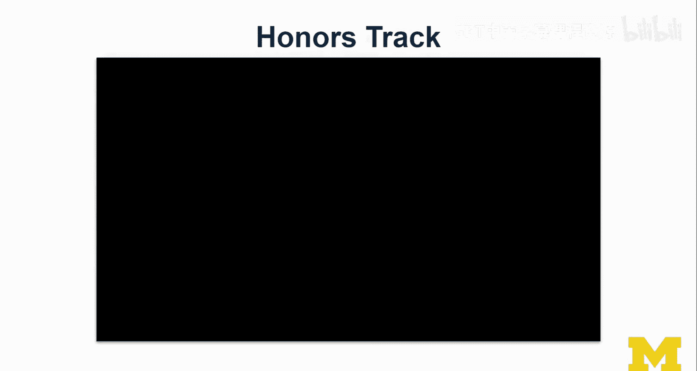

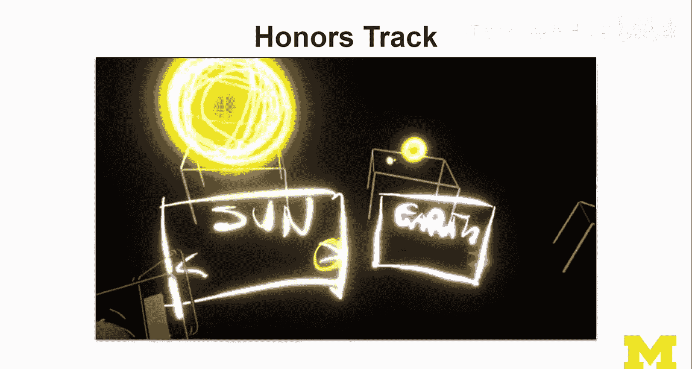

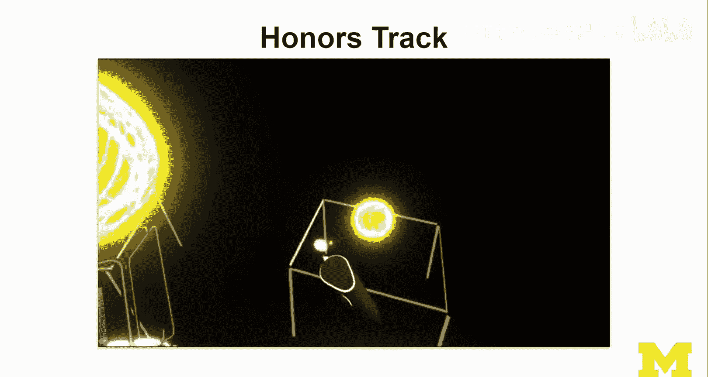

## 项目实践演示

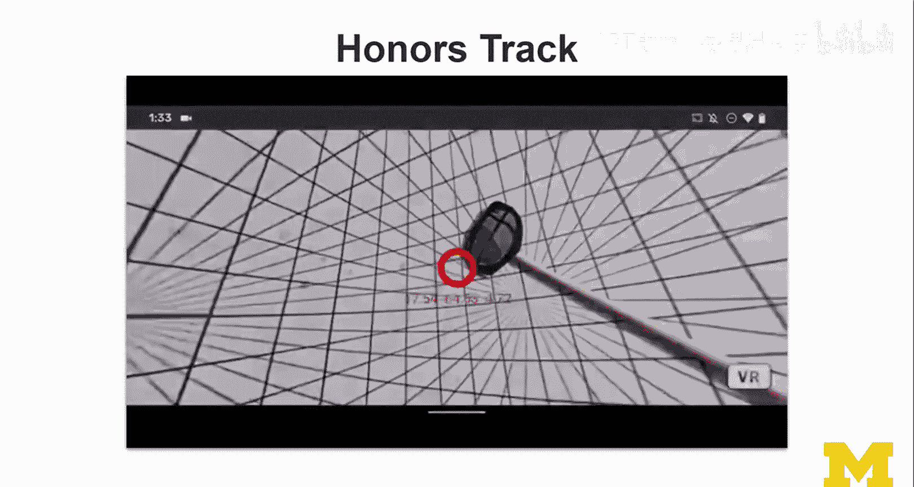

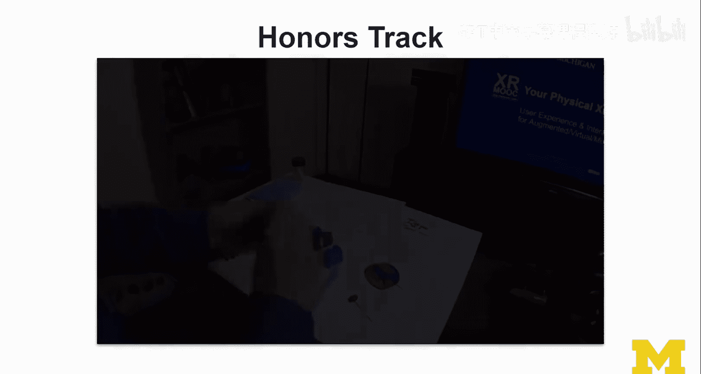

为了让你更直观地理解整个过程，我将通过一个视频总结来演示我如何完成“太阳系”主题项目的部分练习。演示内容包括：

1.  **故事板与线框图**：在纸上梳理应用流程并构思新想法（例如同时查看多个行星）。
2.  **360度故事板**：在360度模板中绘制场景，考虑光影和布局。
3.  **沉浸式故事板**：在Tilt Brush中创建3D故事板，规划不同场景和交互。
4.  **实体原型迭代**：
    *   制作纸质行星并固定在牙签上，在360模板上尝试不同构图。
    *   使用黏土探索动态关系（如月球绕地球旋转）。
    *   搭建立体布景，并混合使用实体物体与AR投影来理解空间关系。
5.  **数字原型制作**：
    *   在iPad上使用Apple Reality Composer和Adobe Aero进行AR沉浸式设计，专注于内容布局。
    *   在VR中使用Blocks工具重建场景，并测试交互（如抓取和旋转行星）。
6.  **最终实现**：展示一个使用A-Frame构建的、可在VR（如Oculus）和AR（通过ARCore）浏览器中运行的最终原型，并讨论了为性能优化所做的调整（如移除粒子系统）。同时也确保其兼容Google Cardboard等简易VR设备。

## 关键步骤回顾

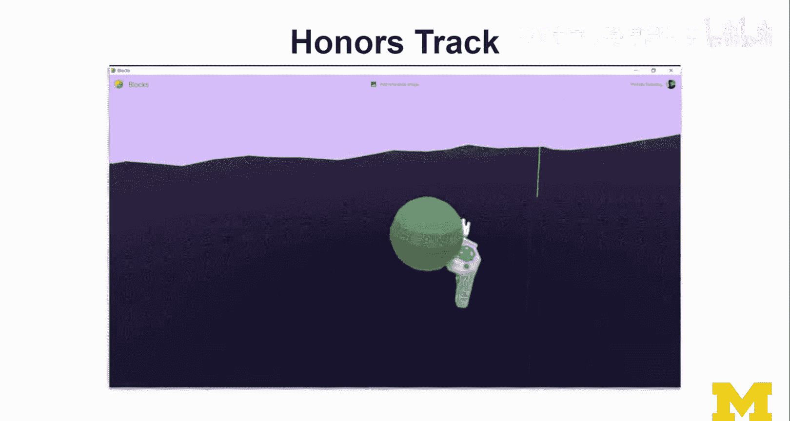

以下是你将在荣誉课程中完成的关键步骤总结：

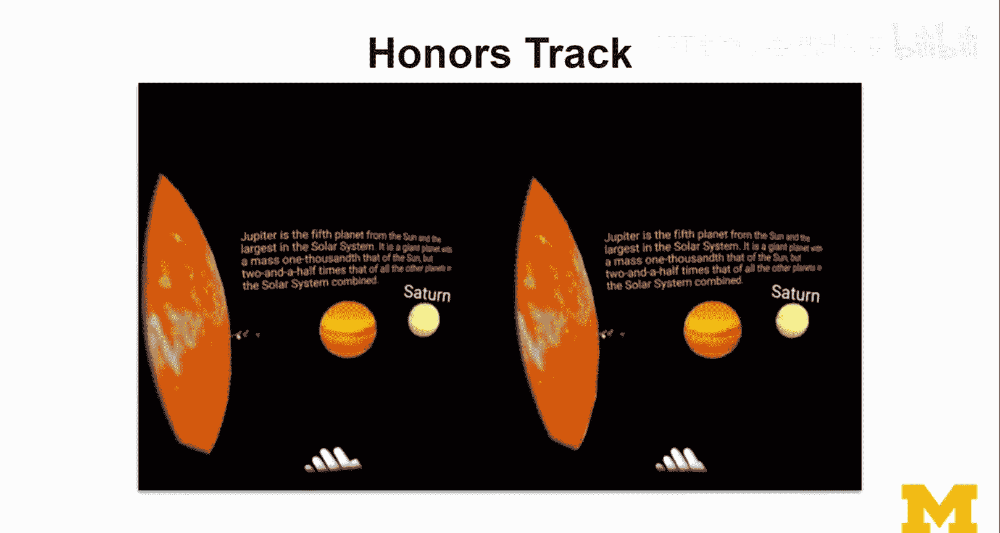

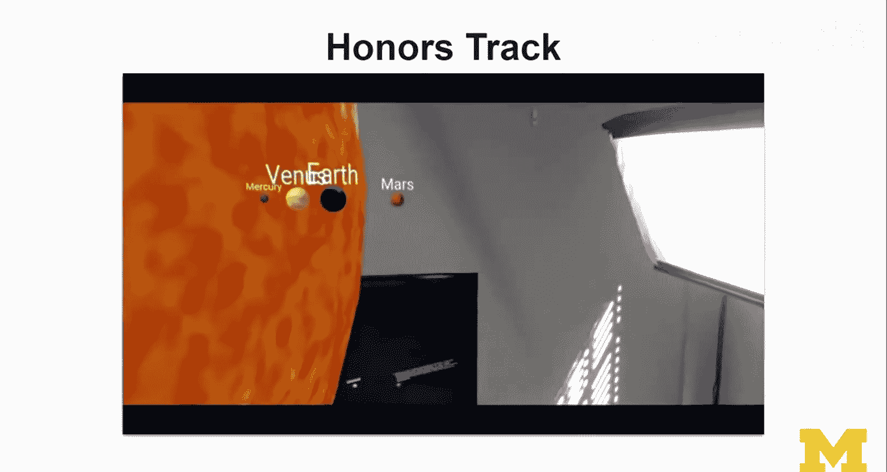

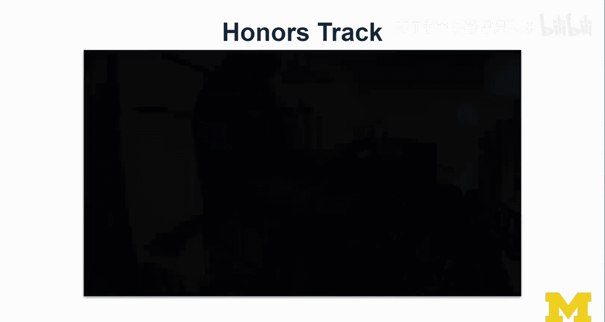

**步骤1：设计评论**
选择任意一个Google Expeditions旅程进行评论，我选择的是“太阳系”。

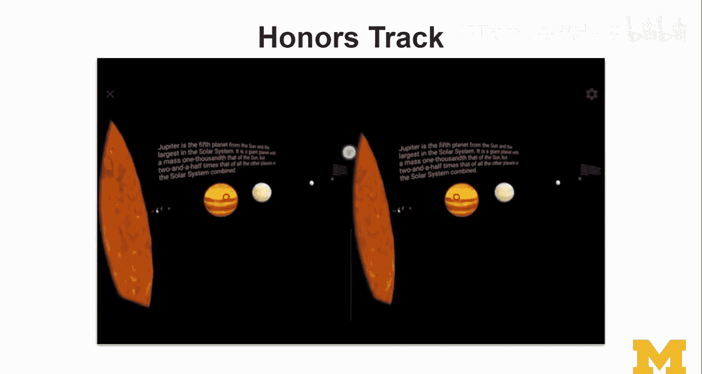

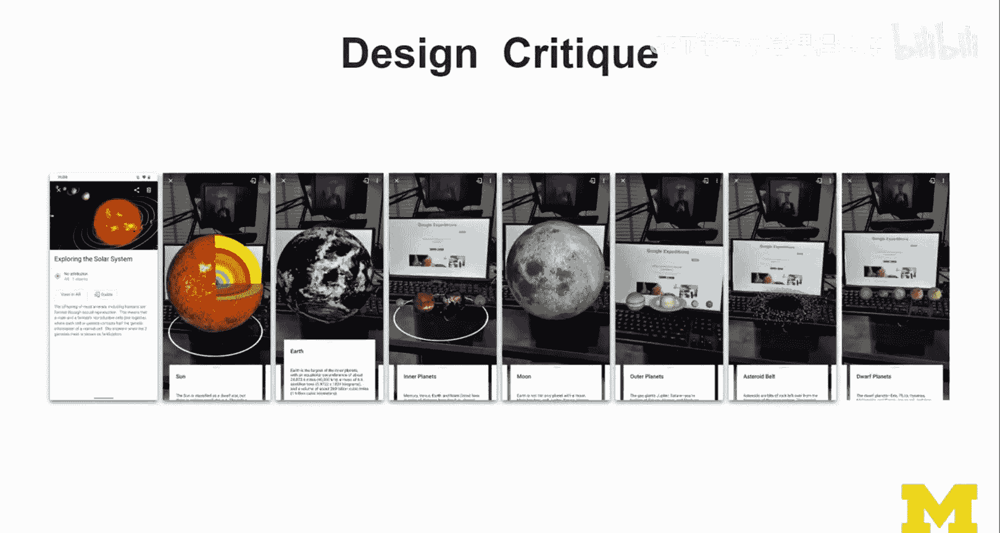

**步骤2：故事板绘制**
分析应用现有流程，并在此基础上构思和草图绘制新功能创意。

**步骤3：进阶故事板**
将想法发展为360度故事板或使用Tilt Brush等工具创建的3D沉浸式故事板。

**步骤4：实体原型制作**
制作纸质原型，并将其发展为可互动的实体模型（利用手机拍摄模拟交互），进而使用黏土等材料探索3D构图，最终可以搭建混合实体与AR元素的立体布景来激发创意。

**步骤5：数字原型与沉浸式创作**
使用免费或易得的工具（如Blocks）进行AR/VR沉浸式设计和资产创建，并最终集成到一个可运行的VR或AR场景中。

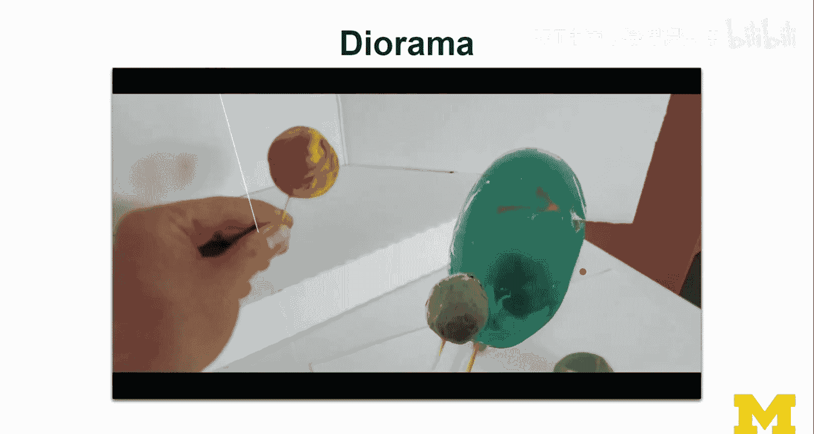

## 总结与鼓励

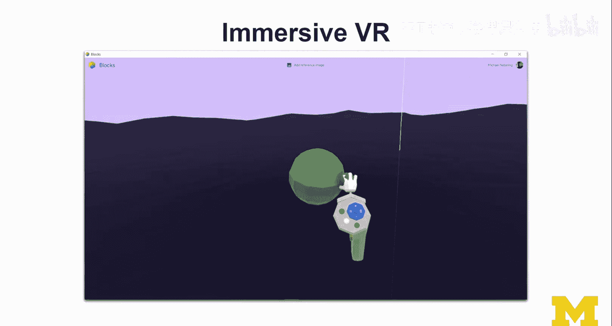

本节课中，我们一起学习了荣誉课程路径的完整框架。你将从设计评论开始，经历故事板、实体原型到数字原型的完整设计流程，最终基于一个现有应用创造出属于自己的XR功能原型。

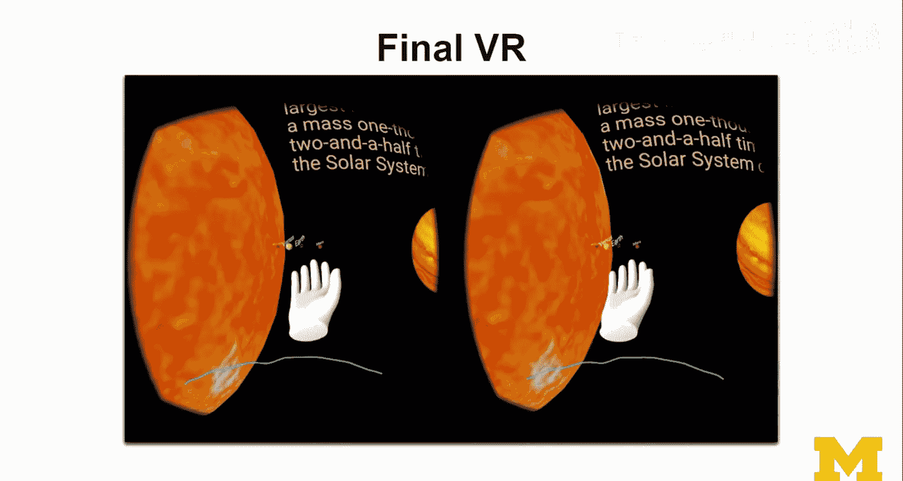

这是一个实践性极强的学习过程，重点在于掌握设计方法、培养创造力，并为后续开发学习做好准备。我鼓励你尝试这些练习，如果在学习过程中有任何疑问，请随时在讨论区提出，我们可以互相帮助，共同学习。

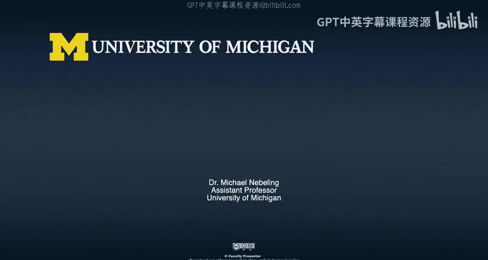

享受这个动手创造的过程吧！