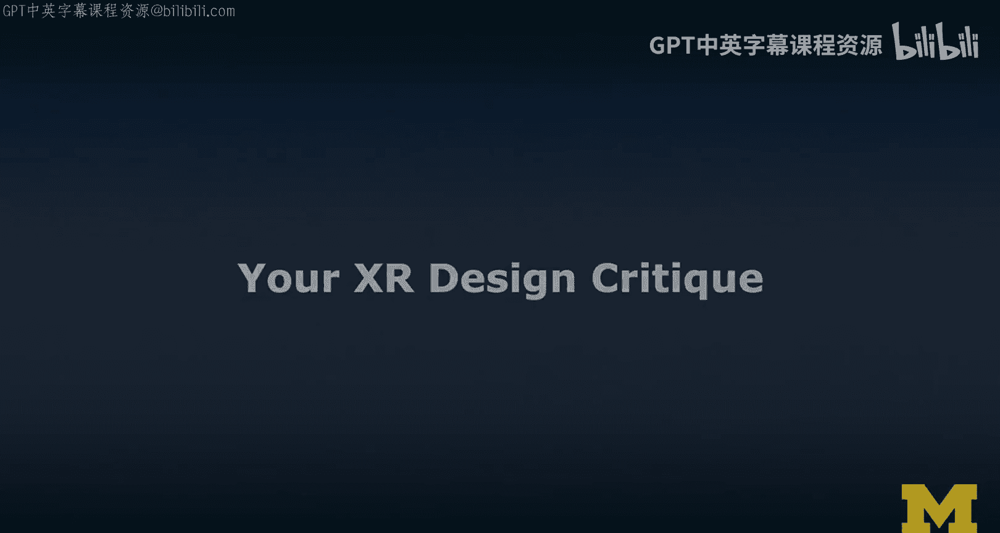
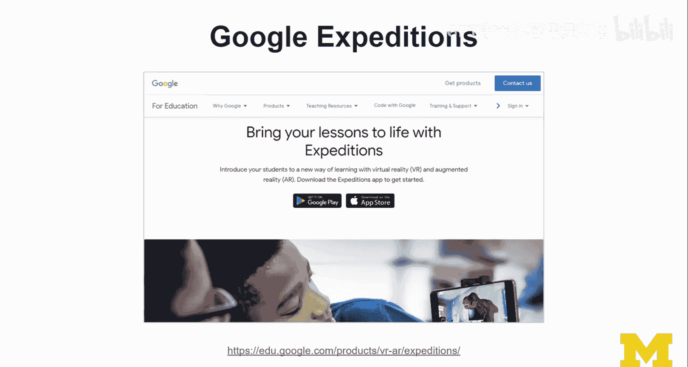
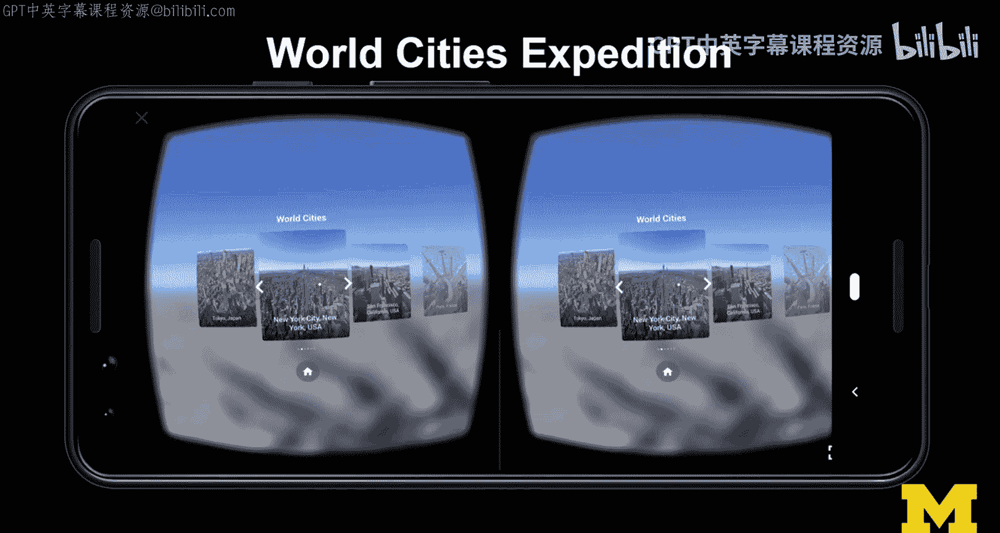
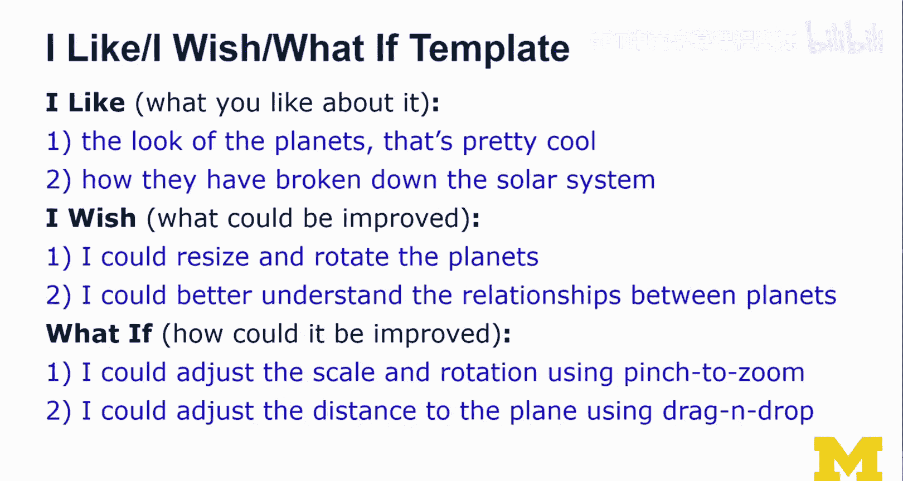

# XR设计评审实践：1：XR设计评审练习概述

在本节课中，我们将学习如何进行XR设计评审。这是一个重要的实践练习，旨在帮助我们以结构化的方式分析和评价现有的XR应用，从而提升我们的设计思维与批判性能力。

## 练习介绍

再次欢迎来到“诚实之路”轨道。本次练习是XR设计评审。这是“诚实之路”轨道的第一项练习，旨在让我们熟悉设计评审的流程。对于每一项练习，我都会提供一个简短的介绍视频，而具体的练习说明将通过课程阅读材料分享。本视频将概述练习的主要步骤及其存在的意义。

设计评审非常重要，我将在专门的讲座中详细讨论。事实上，在我的线下课程中，设计评审是一个固定环节，每位学生都需要评审一个现有的AR/VR应用。当所有学生聚集在一起评审这些应用时，每个人都能了解现有的应用，同时我们也能练习如何进行深思熟虑、富有成效且包含建设性批评的评审，从中学习。这正是我们在此要练习的内容。接下来，我将引导你完成这个练习的主要步骤。

## 练习任务

以下是本次练习的核心任务。

*   **选择应用**：你需要评审一个现有的、类似“探险”的XR应用，可以是360度视频、VR或AR应用。我这样说是为了提供最大的灵活性。你不一定需要VR或AR设备，用智能手机体验360度内容也可以。我说的“类似探险”的应用，主要指像“Google Expeditions”这样的应用，稍后我会详细介绍。它也可以是你最喜欢的博物馆应用、城市导览应用，或任何感觉像是一次虚拟导览的应用。我希望这个应用不要太复杂，因为本次活动的核心是评审。如果应用太复杂，这本身可能就会成为一个主要的批评点。
*   **记录“出声思考”**：任务要求你录制一段视频，描述你的XR体验过程，并使用“出声思考”法。这一点非常重要。你应该先体验应用，然后再体验一次并录制你的思考过程。通常，第一次体验的印象是最值得在“出声思考”中捕捉的。我们可能不习惯在使用某物时“出声思考”，这需要练习。稍后我会展示一个我自己使用“出声思考”法体验现有Google Expeditions（我选择了太阳系主题）的例子。
*   **描述使用情境**：我希望你描述你的XR体验情境。基本上，当你分享评审结果时，需要说明你是在360度、VR还是AR环境下操作这个应用的，以及你是在私人还是公共场合使用的。你不需要说得太具体，但使用情境可能会影响你对应用的评审。也许应用并非为你所使用的场景而设计，这也是我们可以讨论的一点。
*   **使用模板进行评审**：我希望你使用“我喜欢、我希望、如果…会怎样”这个模板来评审所选的应用。我在讲座中介绍过这个模板，并将在接下来的幻灯片中再次简要提及。
*   **依据设计指南分析**：你需要根据设计指南来分析这个“探险”应用。首先，我提供了一些设计指南的例子。正如你从我的讲座中所知，我对现有的指南并不完全满意——我们既没有足够多的指南，现有的指南也不够好。但无论如何，这是一个起点。
*   **阐明伦理、社会或隐私问题**：我还希望你阐明可能存在的伦理、社会或隐私问题。你可能没有遇到这些问题，但用户可能会遇到。因此，我们需要思考这一点。

## 预期成果

本次活动的预期成果如下。

*   **提供平衡的评审**：你现在能够提供一份平衡的评审，涵盖正面和负面的设计方面。请记住，要从正面评价开始。
*   **形成初步改进想法**：你已经对如何改变和改进设计形成了初步想法。这对于你继续学习并进入下一阶段（故事板绘制）非常有帮助。作为故事板绘制的一部分，我们会进行头脑风暴。
*   **更好地理解设计指南**：你对需要关注哪些设计指南有了更好的认识。

如果我们能实现所有这些成果，我会非常高兴。这就是我希望我们能从这次练习中获得的东西。如果你认真练习评审，并广泛思考一些相关问题，我认为这将非常有价值，并且与你的同伴学习者讨论也会很有趣。我们将提供论坛供大家交流。

## 应用示例：Google Expeditions

我之前提到的“探险”应用，具体指的是Google Expeditions。现在，Google Expeditions提供VR和AR版本，并且在课堂环境中很受欢迎，因为Google主要针对教育场景。我认为这对我们来说是一个很好的应用示例。但我说“类似探险”的应用，实际上可以是任何应用，只是希望它不要太复杂，最好是公开可用的，这样其他人也可以尝试。如果你选择的不是Google Expeditions，请清楚地说明你是如何获取该应用的。

## “出声思考”示范

以下是我运行“世界奇观”探险应用的例子，我在讲座中已经介绍过。

现在，我将展示一段我在工作室里实际体验太阳系应用并进行设计评审的视频。

> 好的。我将对Google Expeditions的“探索太阳系”应用进行一次XR设计评审。我们将从AR模式开始。首先，我认为这个应用运行得相当不错。它成功检测到了平面，很好。
>
> 然后，问题是出现的行星真的非常大。任何尝试调整大小的操作似乎都不起作用。我只能把它举起来，但我还没找到缩放或旋转的方法。这实际上是我通常期望一个应用应该具备的功能。
>
> 然后，你可以了解更多关于太阳的信息。我们接下来要看看地球。显然，地球比太阳小，但它仍然绝对非常大。同样存在无法调整大小的问题。
>
> 但我确实喜欢……当它们出现在键盘上方时，这很酷。这就是地球。我们可以查看一些细节，也许甚至能找到你居住的地方，这可能很有趣。
>
> 追踪功能运行稳健，这很好。然后是月亮，同样，一个巨大的月亮。它非常庞大。我们还有外行星。这也很酷。如果能给这些行星加上标签就好了。我真的很喜欢行星的外观，但加上标签会非常有用。这样你才能真正学到东西。我的意思是，现在看起来只是很酷。
>
> 小行星带看起来也很酷、很好。还有矮行星。但你确实会想了解更多信息，而这里的交互相当有限。不过，我必须承认，它看起来确实很酷。
>
> 所以我会说，我喜欢行星的外观，这很酷。我尤其喜欢内行星。我也喜欢它们分解太阳系的方式。尽管对我来说，要理解不同行星、小行星带和卫星（显然通常围绕地球运行）的不同视图之间的关系比较困难。如果能展示出来就更好了。
>
> 我希望……我能够重新缩放、调整大小。这个……我只是不明白为什么我想把它举得那么高。当我把它放在某个位置时，这确实有意义，但我也不知道如何重新定位它。我不知道该怎么做。可以发送反馈。
>
> 那么，如果……允许我一次性缩放呢？然后，我认为另一个问题是距离。当我切换时，我确定它又会……它确实考虑了我想要的距离。哦，它没有。它不能旋转和缩放。所以，这真的是我最大的抱怨。

## 评审模板应用

你刚才看到的只是其中一部分，这些是所有屏幕的截图。显然，这是下载屏幕，你进入应用，放置它（我没有放置部分的截图），一旦放置好，你会在下方看到这个卡片式界面。这个边缘提示非常重要，它暗示还有更多内容。向左滑动，你会看到地球；向上滑动，你会看到一些关于地球的信息；再次向左滑动，你会调出这个屏幕，依此类推。这就是“探险”应用的工作方式。

我希望你使用“我喜欢、我希望、如果…会怎样”这个模板来评审你选择的“探险”类应用。

*   **我喜欢**：你喜欢它的哪些方面？重要的是从积极方面开始，并且应该有两个积极的方面。
*   **我希望**：哪些方面可以改进？这里要尽量具体、客观，而不是主观。
*   **如果…会怎样**：你会如何改进它？如何改进是一个问题，但你会如何改进它？这确实是困难的部分，也是我们在这里追求的目标。这将帮助我们在改进应用时产生一些新的想法。

以下是一些例子。

*   **我喜欢**：行星的外观很酷（我在视频中说过）。我喜欢它们分解太阳系的方式。
*   **我希望**：我希望能调整行星的大小和旋转。我希望能更好地理解行星之间的关系，因为比例真的很不清楚。
*   **如果…会怎样**：例如，使用捏合手势进行缩放，这是一个非常常见的手势。我如何调整与行星的距离？另一个想法是使用拖放来调整与平面的距离。这指的是，一旦“探险”被放置，我基本上必须重启应用，我不知道如何将它移动到不同的平面。也许应用里有这个功能，只是我没注意到，但那样我们就需要改进这个方面。如果人们无法发现应用能做什么，那就是糟糕的可用性，你就有问题了。

## 伦理评审

以上是基于设计指南、使用“我喜欢、我希望、如果…会怎样”模板进行的评审。接下来，我还希望你进行一次伦理评审。我在关于XR设计伦理的讲座中讨论过设计伦理评审，并描述了评审中的四个主要步骤或考虑因素。

1.  **情境与场合**：你在什么情境下使用？
2.  **感官信息与数据**：应用收集了哪些信息？
3.  **处理流程**：就你的理解而言，应用背后进行了哪些处理？
4.  **数据所有权与治理**：应用在条款中告知了你什么，你同意了哪些内容？这也是我们关注数据所有权和治理的关键。

在我的例子中，情况如下。

*   **情境与场合**：我在工作室里使用了AR版本。实际上，我是设备附近唯一的用户。
*   **感官信息与数据**：它主要看到我，看到家具，看到这里昂贵的设备（请记住，这些设备是密歇根大学借出的，不是我自己的设备）。还有桌子和地板表面的区域。显然，你可以从这些信息中理解一些东西，既用于追踪和注册，也可能用于负面用途，这更多地属于伦理部分。
*   **处理流程**：我认为这是一个相当简单的应用。它进行标准的表面检测，没有使用空间网格，实际上它没有空间网格，不进行场景理解。它可能会收集匿名的使用统计数据，我不确定。但它维护了一个资料库，记录了我下载的不同类型的“探险”。有一个教师模式，我认为更高级，支持多用户，这可能有更复杂的处理流程，并实际上会引发额外的担忧。
*   **数据所有权与治理**：Expeditions应用管理下载内容，正如我刚才谈到的，有“资料库”标签。这就是我知道的信息。我不知道他们收集了什么数据。而且，因为这些“探险”实际上是独立开发的，有些是Google的，有些是其他人开发的，所以更有趣的是更好地理解“探险”框架，并了解实际上收集了哪些数据并与这些第三方供应商共享。

## 总结

本节课中，我们一起学习了如何进行XR设计评审。通过实际思考，我们将学到很多关于伦理的知识。同时，我们也将进行更广泛的设计评审，显然要考虑社会和伦理问题，但也要大量思考设计和设计指南。

请注意你是在AR、VR还是360度环境下进行“探险”评审的，并与我们和同伴学习者分享，以便我们更好地理解你的评审。告诉我们你如何使用以及在何处使用它，以及你发现了哪些令人困惑的地方。

我们应该能初步了解你认为需要在哪些方面进行改进，以便在你继续学习“诚实之路”轨道的后续步骤（即故事板绘制和构思框架，实际上是头脑风暴新想法并将其具体化）时，能够有所依据。