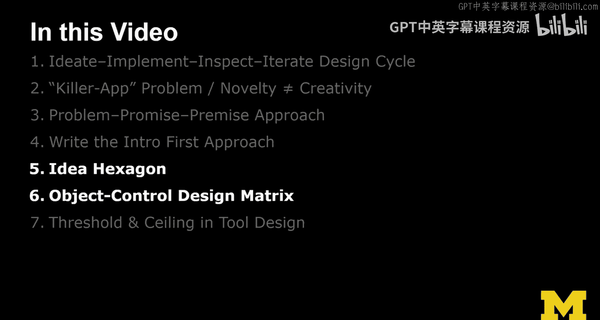
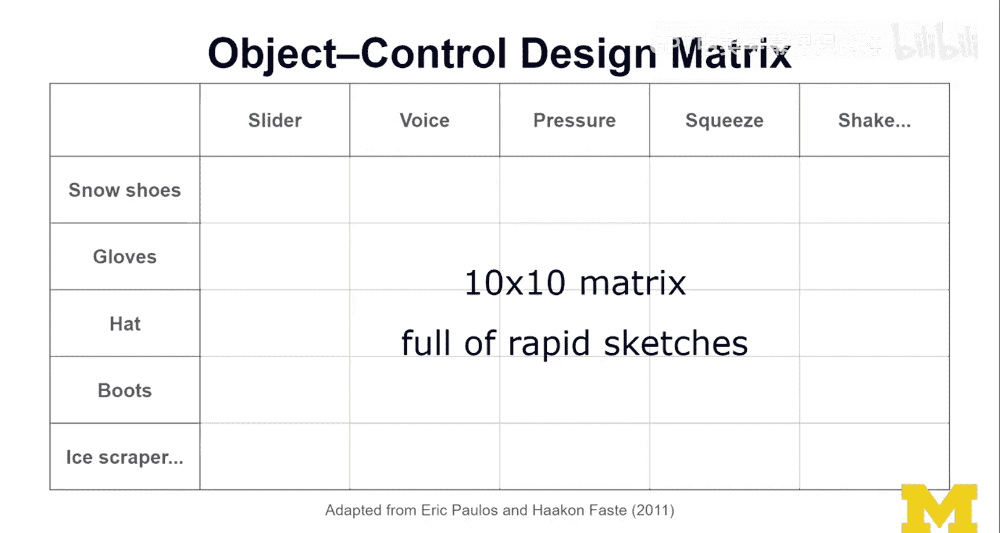

# 密歇根大学《面向所有人的扩展现实（介绍⧸设计⧸开发）｜Extended Reality for Everybody Specialization》中英字幕 p64 27_六边形创意法.zh_en -BV1jM4m1k73q_p64-

So in this lecture， I'm gonna share 7 techniques to help you innovate。

 One technique that I really like is this idea of the idea hexagon introduced by Ramishreska in a lot of his motivational talks。

 and I really like it。 And I want to give some examples from the extra space。

 So the idea hexagon is basically given an idea X， What is the next good idea。😊。

From that idea， one way to innovate is to try to extend to the next dimension。

 example C gives is from Flr， which is images to YouTube， which is videos。

 The next way to innovate is to fuse the dissimilar。So， x plus y。

And I'm going have an example here in a second then the other way to innovate。

 which is the one that I really like is the doing the exact opposite of what's been done before。

 and we're going to see in a second whether you like my XI example here or not and then comes these given a hammer。

 find all the nails and given a nail， find all the hammers， it's a very popular approach。

 especially in the technical human computer interaction design community and research community。😊。

And this idea of like coming up with a new system and then seeing what this new system or a solution。

 what kinds of problems can it actually solve。 So having this idea because you think it's cool because you think it's creative because you think we kind of need this and then see what we can do with it in my opinion is actually very good way to innovate and ideate and do research。

 but not everybody agrees。 So that's fine。 The last one that's missing here。

 And that's just actually the one that's done all the time when you look at all the new product announcements。

 etcter， is just adding your favorite adjective。 faster， lighter， better So these are some examples。

 And now I'm gonna translate this to the Excel space。😊，Tada， here we go。

 So taking it to the next dimension， my example here is Hollolens， we've seen a lot of VR things。 So。

 for example， Oculus came out， a cool， really， a cool headset。😊，And that was just virtual reality。

 and all the AR stuff up to this point was relatively limited。 And then the Hols came out。

 and then the Hollands ported us into augmented reality。

 But this idea that a CEO walks up on stage and says， this is a five year mission。

 we are trying to figure it out and we're using and we need you to help us figure it out。

That to me was really cool。 And I think it's the right approach。

 And now we're going to look up there。 So here for the x plus y， so fusion of the decseminator。

 my example is the Oculus link。 So for this example。

 I quickly stole you see from the back theocululus actually inocululus。

 the originalocculus which is tethered So right So then Que came out cool now we have it。😊。

All on device， not tethered standalone dedicated headset。

 pretty cool And then we're introducing Oculus link right we're gonna to give you a USB cable initially you had to buy a specific one a 3。

1 USB so you C cable and what it gives you is it turns your well standalone dedicated into a tther device and turns your Ocus well Que into a hang on。

😊，Essentially a rift S， which had just come out。 But this idea of turning the quest into anocululus rift S to because for this one。

 you really have to optimize your stuff to get it to work on mobile。 And for this one。

 you kind of can throw whatever because you just buy a better computer if it doesn't work。

 I think that was quite disruptive。 And it was actually quite upsetting that。

This quest can now be turned into an Oculus Rift S because people just bought the rift S and now this one seems to be the one that Oculus is pushing forward。

 which well， we'll see what that goes。Now we're gonna jump over here。

 So cardboard doing the exactly the opposite。 So the example that I have here is this kind of plastic version of cardboard。

 but it's still。😊，carddboard， okay， this idea of just doing something like this。

 a device wrapper or actually giving you cardboard and putting that on your face and putting your phone inside。

Well， that was like the opposite from everything else we had explored at the time。

 So if you have a hammer like a smartphone， what all the things， all the nails you can hit with it。

 And AR and B are actually things you can hit with it。 Well。

 because we have a hammer and turning this into an AR via display just by wrapping something around it。

 I thought this was pretty cool。 Now， my other example is Webex are down here。😊。

So given a nail find all the hammers so if you let's say if we now do AR and VR。

 what are all the hammers that could benefit from it and the web is a hammer that gives access as a platform to a lot of different content and so bringing AR VR into the web and empowering the web is just going to take it to the next level and I think that's why I put the WebEx here as an example。

And finally， coming back to the Oculus quest。 Well， here。

 the idea with the Oculus quest was just like， okay， we've always had it somehow tethered。

 And initially， the first VR headsets were like really heavy and had to be mounted。

 So the one adjective maybe to be associated with a headset is mobile and portable and pervasive if you want。

 so。😊，Now I want to jump gears a little bit and look more at innovating in interaction design。

 so the object control design matrix works as follows。😊，So you're putting out a 10 by 10。

 I don't actually draw a 10 by 10 matrix here。 But the idea is you do a 10 by 10 matrix。

 and then you're thinking about winter and cold。 And then you're putting down all the objects you associate with winter。

 like snowshoes， gloves， hats， boots， ice scrapper。😊。

So you're putting those here in the rows and then in the columns。

 you're putting all kinds of controls that you can imagine in like slideer voice pressure control squeeze。

 shake dial， whatever comes to mind and then you're looking at the combinations of these and you're sketching out in each of these little quartersrants you just sketching out all the different little funny combinations that you can come up with like an icescraper that can be shaken Now that will be an interesting device。

 Now we have a combination of objects that we can control in funny ways。

 And if you sketch those ideas out， there' is really an activity you should do in class。

 I've done this in a lot of interaction design classes is actually quite fun。

 This idea of pushing it out quickly， like doing really a 10 by 10 matrix like1 hundred of these ideas pushes you to be quick sketch them out quickly idea8 quickly。

😊，Don't criticize， Don't spend too much time on shaping this perfect idea。 No， just go about it。

 Try out all these different combinations。 That is really cool。

 Like going all the way through line by line， diagonally。😊。

And I think that is why it's really a valuable technique。

It will not always work like it works really well for like warming up， brainstorming。

 So translating this directly to coming up with innovative XR interface and interaction design ideas。

Probably not going to work so well， but as a warm up in a class or in a workshop。

 I think this is actually really helpful。

