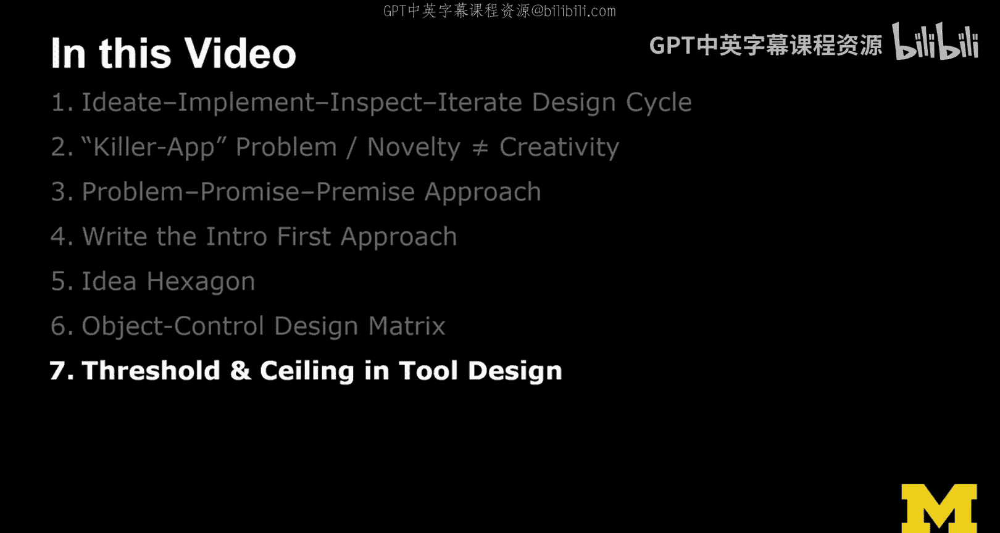
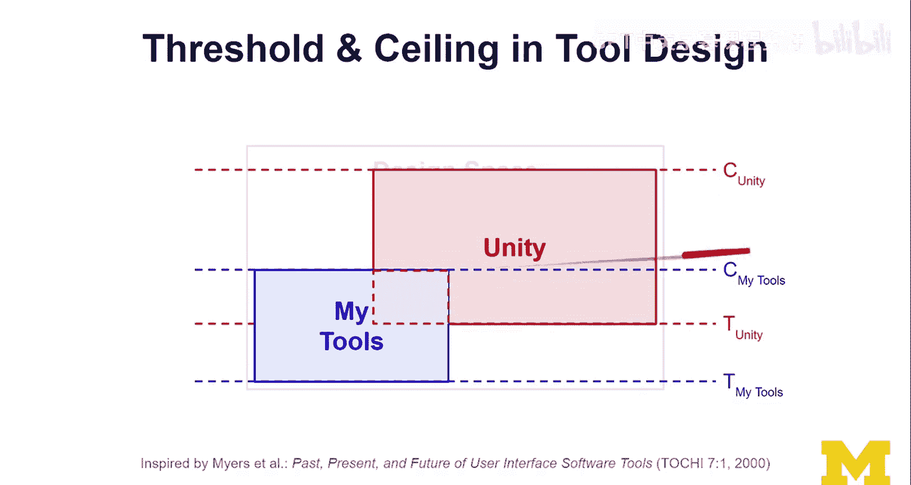

# 面向所有人的扩展现实：28：工具设计中的阈值与上限 🛠️




在本节课中，我们将学习一个评估XR（扩展现实）工具设计的重要概念：**阈值**与**上限**。这个概念源自Brad Myers及其同事在2000年发表的一篇论文，它为我们提供了一种清晰的方式来思考不同工具的学习成本与功能潜力。

## 核心概念：阈值与上限

上一节我们探讨了各种XR设计工具，本节中我们来看看如何从“学习成本”和“功能边界”两个维度来理解它们。

任何工具的设计都可以用两个关键属性来定义：
*   **阈值**：指使用该工具前必须克服的**入门障碍**。这包括你需要学习的所有知识、技能和概念。阈值越高，学习曲线越陡峭。
*   **上限**：指使用该工具**所能实现功能的上限**。它定义了该工具能力的边界，超出此边界的事情，该工具无法完成。

我们可以用一个简单的**公式**来理解工具的设计空间：
```
工具能力范围 = { 所有功能 | 阈值 ≤ 所需学习成本 ≤ 上限 }
```
其中，**阈值**是使用工具的最低学习成本，**上限**是工具所能提供的最大功能价值。

## 以Unity为例的分析

以下是使用阈值与上限模型分析流行XR开发引擎Unity的示例：

*   **高阈值**：Unity的学习曲线非常陡峭。对于初学者，尤其是没有编程或游戏引擎背景的人来说，第一次打开Unity可能会感到不知所措。
*   **高上限**：一旦你跨越了那个高阈值，你就进入了一个功能极其强大的领域。Unity的上限非常高，几乎可以实现XR领域的绝大部分复杂想法和交互。

## 不同工具的设计权衡

理解了Unity的例子后，我们来看看工具设计中的普遍权衡。在XR设计领域，存在许多不同类型的工具，尤其是各种原型设计工具。

我的研究目标与Unity这类工业级工具不同。我致力于设计**低阈值**的工具，以降低初学者的入门门槛，让更多设计师能够快速上手并参与到XR设计中来。这自然意味着一个**妥协**：我的工具无法达到像Unity那样高的功能上限。

但这完全没有问题，因为我们的目标不是取代Unity。Unity在专业XR开发中有着不可动摇的地位。我的工具更像是**一座桥梁**，帮助更多人平滑地过渡到使用Unity这类更强大的工具，从而赋能更多设计师。

## 工具能力的重叠与选择

那么，面对功能可能重叠的不同工具，我们该如何选择呢？这个模型提供了一个清晰的决策框架。

不同工具的能力范围可能存在**重叠区域**。这意味着某些设计问题，既可以用我的工具解决，也可以用Unity解决。

选择逻辑很简单：
1.  如果你已经掌握了我的工具，并且要解决的问题在其能力范围内，继续使用即可。
2.  如果你已经精通Unity，并且要解决的问题Unity也能处理，那就没有必要再学习我的工具。

关键在于评估：**为了掌握某个工具所需投入的学习成本，是否值得它所能带来的功能收益？**

## 总结与课程回顾

本节课中我们一起学习了评估XR工具设计的“阈值与上限”模型。



我们首先定义了**阈值**（入门学习成本）和**上限**（功能能力边界）这两个核心概念。接着，我们以**Unity**为例，分析了高阈值、高上限的工业级工具特点。然后，我们探讨了不同工具在设计上的**权衡**，例如研究型工具可能通过降低阈值来吸引更广泛的用户，尽管其上限也相应降低。最后，我们讨论了如何利用这个模型，根据自己已有的技能和项目需求，在功能有重叠的工具之间做出**明智的选择**。


理解这个概念，不仅能帮助你更好地选择适合当前阶段的工具，也能让你以更批判性的眼光看待工具厂商的宣传，并最终在广阔的XR设计空间中找到自己的定位。