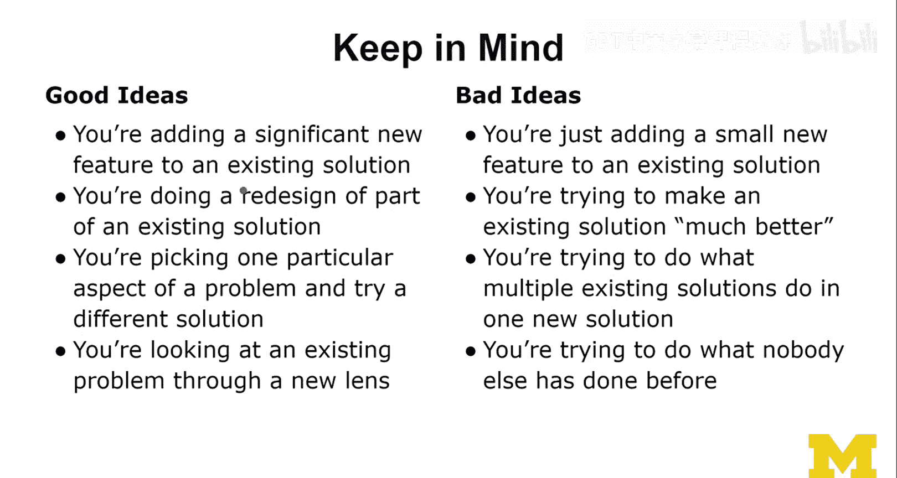

# 密歇根大学《面向所有人的扩展现实（介绍⧸设计⧸开发）｜Extended Reality for Everybody Specialization》中英字幕 p66 29_有效创意评估方法.zh_en -BV1jM4m1k73q_p66-

So I'm gonna introduce you to these two piles of good ideas and bad ideas。

 And you can use them as a checklist， like the things that I say。 if that is true about your idea。

 Then maybe it's a good or a bad idea。 Well， I don't want to offend you， I could still be wrong。

 It's just an intuition that I've developed over the years。 So if you can say this about your idea。

 You're adding a significant new feature to an existing solution。 That's a cool idea。 Do it。

 You're doing a complete redesign of a solution。 Well， actually， that's not a good idea。

 Let me fix this。 So I'm gonna go in here， you're doing a redesign。😊，Of。Part of an existing solution。

Now， that is a good idea。Okay let's look at it。 So you're doing a redesign of part of an existing solution。

 Don't do the full redesign of something existing。 Don't redo Amazon。

 There's probably something good about it。 It's quite popular and stuff。

 So don't So if you can say this about your idea， then you probably have a good idea。

 You're picking one particular aspect of a problem and try a different solution。

 Now there's a big problem and maybe lots of solutions out there。

 but then you're trying to focus on this narrow thing and you're trying it slightly differently that I think is a really good way。

 and this is similar to what I'm saying here， you're looking at an existing problem through a new lens。

 Now you're actually like looking at this whole problem and you're recasting it from this different lens。

 and now you're not coming up with the same solution。

 but you're coming up with a slightly different solution。

 and that solution might be novel or at least innovative in some way。

 especially if that new lens is really a new lens like nobody has looked at it this way yet。 I mean。

 that lens is not new but nobody has actually applied。That lends to the problem。

 then I think is a very good way to innovate。 And this is actually what a lot of researchers do。

 and it's actually a very good way to make progress。So looking at the candidates for bad ideas。

 So if you can say something like this about your problem or your project。

 then may not be the best idea。You're just adding a small new feature to an existing solution。

You probably agree with this unless you are the designer of that existing solution。

 in which case youre creating a new version of it， which is fine。

 You should really not be saying anything like this about your idea。

 You're trying to make an existing solution。Much better。 Now， I've heard this all the time。

 So the problem with a much better part。 Well in theory， it's a cool idea。

 but the problem is if you can't say the much better， if you can't quantify。

 if you can't specify in which way you're making it much better。 then it's really a problem。

 So a good way to specify something like this would be like I'm making it easier to learn it。

 or I'm automating this part， which makes it faster to do that part。

 And then you're trying to do what multiple existing solutions do in one new solution。😊，Oh， yeah。

 you're doing the dashboard， you know， trying to wrap around things and then coming up with this whole new thing that brings everything together and makes it better。

 not a good idea。 First of all， if that is your project and you're like working in a class or something like this。

 you have only so so much time actually every project is time limited。

 So abandon that and refocus and reshape。Finally， you're trying to do what nobody else has done before。

Really， now I've heard that so many times and it's probably never ever true。

 The problem might be that you don't know whether somebody has done it before。

 so you haven't done your homework， you haven't read the literature。

 you haven't tried out the tools you haven't played around with this existing technology maybe you didn't know about it that's fine。

 So run your ideas by people could be professors could be other designers and your team could be your users。

 your future users or any kind of stakeholders and that's a good way to shape and reformulate ideas。

 Now， if your ideas fall into these calories like the good pile or the bad pile there's always room for improvement doesn't mean that if you're here that it's safe and you know you'll be fine。

 doesn't mean that you could still have introduced issues as you're executing the ideas you're not really involving users for example。

 when you're designing a new product Now you maybe you had a really cool idea in the beginning。

 but you could still mess it。

As you're trying to implement that idea and so now these are not fail saves or guarantees that your product will be successful。

 but really if you're in this pile you should really reframe your problem a big problem is really about scope most of the time you're taking on something too big like the dashboard thing I just talked about recope。

 make it smaller now that's a good way to innovate as well because it's easier to come up with new things in a much more constrained and small problem。

 don't make it too small， shouldn't be trivial that's the other thing that I sometimes complain about when I work with students on projects so don't make it too small there should still be room for exploration。

 creativity and in some sense obviously innovation and that's what this whole lecture was about so I hope you enjoyed some of these lessons in this case I try to be a little bit more fun than usual and we cut this slightly differently at。

😊，Supposed to be stimulating and inspiring and not as serious。

 But they' are actually really valuable lessons in here。

 I think these are cool techniques that help me at least try to innovate and come up with the next research problem。

 And maybe they'll also help you as you're thinking about the next solution for a real problem and a real XR solution in that space。

 Now， that would be amazing。😊。

