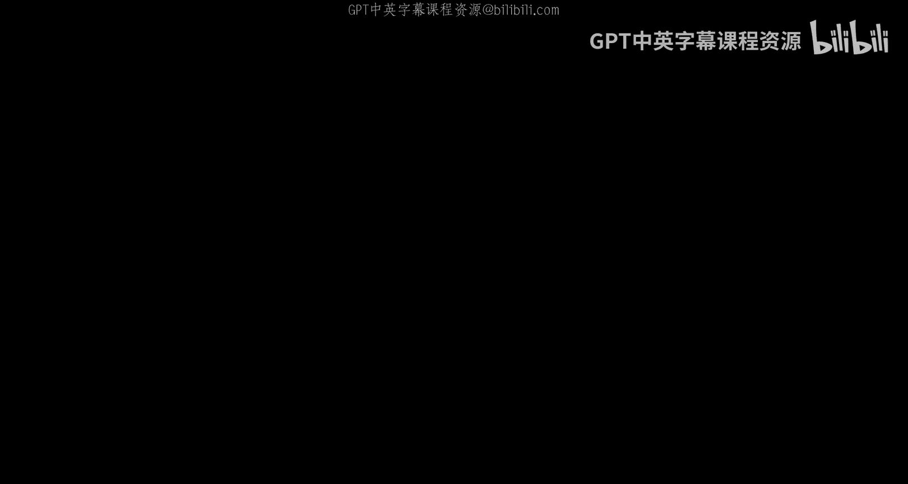
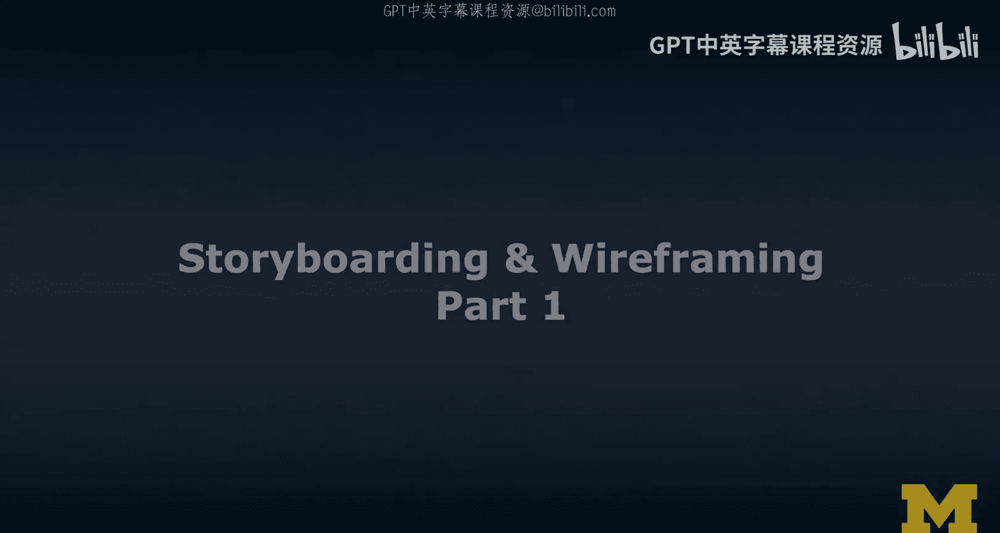
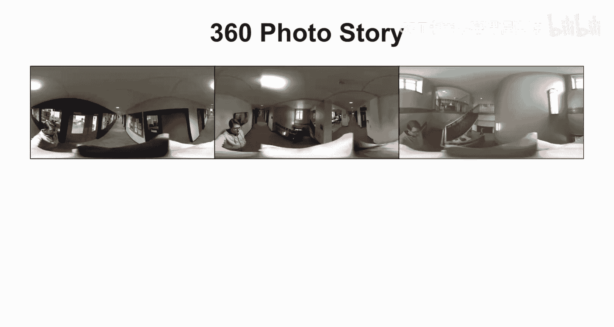
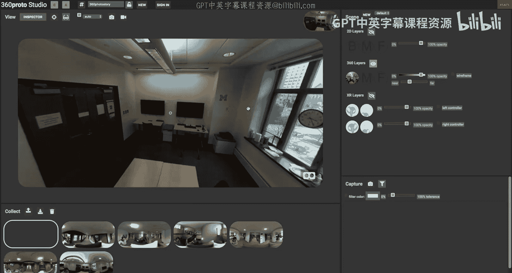
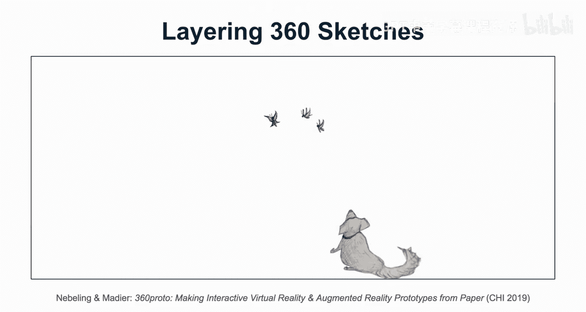

# 扩展现实设计：第30课：故事板与线框图设计第一部分 🎬

在本节课中，我们将学习扩展现实（XR）设计流程中两个至关重要的早期设计步骤：故事板与线框图设计。我们将探讨它们的重要性，并介绍几种从低保真到高保真的具体设计技术。

上一节我们介绍了XR原型设计的宏观流程，本节中我们将聚焦于流程的第一步：故事板与线框图。

故事板与线框图是指将你的界面构思草图化，并将这些草图组织成我们称之为故事板和线框图的形式。当这些草图比通常的草图更为精确时，我们通常称之为线框图。它们实际上是后续我们将看到的AR/VR界面中屏幕和潜在3D场景的蓝图。

接下来，我将通过一个设计案例来具体说明。这个案例来自我们的一次设计工作坊，学生们向我展示了一款AR家具摆放应用的原型构思。这款应用灵感来源于宜家和Wayfair等现有产品。

以下是该应用的工作流程：
*   用户可以在不同类型家具中进行选择。
*   例如，可以旋转图中的椅子。
*   可以通过菜单调整颜色等选项，获得所选家具在特定颜色和尺寸下的真实预览。

这个故事板的有趣之处在于，它包含了大量细节。你可以清晰地看到AR界面如何与左侧和底部的2D菜单融合。学生们在构思上做得非常出色。

我们刚刚看到的只是众多故事板技术中的一个例子。接下来，我将按照从低保真到高保真、从易到难的顺序，为你介绍四种具体的技术。

以下是我们将要涵盖的四种技术：
1.  **传统故事板**：适用于将草图组织成一个连贯的故事序列。
2.  **360度照片故事**：使用360度相机捕捉你周围的物理空间，并将这些捕捉到的环境作为虚拟现实环境的原型或模型。
3.  **360度故事板**：这是一种更深入的技术，特别有助于围绕用户进行空间思考，这对于AR/VR界面设计至关重要。
4.  **3D故事板**：在VR头显内部，直接在你周围的3D世界中绘制草图。这是可视化3D世界的绝佳方式，但也需要较多练习。

现在，让我们更详细地了解每一种技术。

首先来看360度照片故事。记住，我们需要使用360度相机来捕捉环境，例如示例中我的实验室。初始图像看起来可能非常扭曲，这是不同的投影格式（如等距柱状投影）。但你可以将其映射到一个3D球体上，这个球体本质上环绕着用户。你在社交媒体上看到的360度照片和视频就是这样工作的。

例如，这里是我的实验室。这张照片是在特定位置拍摄的，由我的前博士后Max拍摄。它展示了实验室早期的样子。我们可以利用这张360度照片，为实验室原型化一个虚拟现实应用。我们对该房间的空间布局有较好的了解，甚至可以将此作为环境的占位符，来原型化AR体验，而无需亲临实际地点。

如果你将多张这样的360度照片组合起来，就可以构建一个故事。通过这种方式，你可以原型化诸如在密歇根大学校园中行走、寻找我的实验室或办公室等体验。

这是一种思考照片故事的传统方式，但我希望我们将其视为一种为交互体验制作故事板的方法。其中一些可能涉及传统意义上的导航，也可以是交互技术中不同步骤的序列。我们将在后续为你设计的活动中花更多时间探讨这些技术。

这就是360度照片故事板。

接下来，让我们回到360度故事板的概念。你在这里看到的是一个模板。其工作原理是：如果我遵循这些网格线，我所描绘的内容将对应出现在用户前方的视野中。同样，其他部分对应出现在用户左侧90度、右侧90度或底部等位置。这是一个非常强大的模板。

我想展示几个使用这个模板能做什么的例子。

例如，我们曾创建一个场景：在中间放置蝴蝶，用户会看到这些蝴蝶，同时还有一只小狗和一辆汽车。然后我们添加第二层，开始绘制树木。我们仍然在纸上进行故事板原型设计，描绘你突然置身于这个环境中的场景。

现在我们有了三层：背景中的山脉、前景中的小狗和蝴蝶、以及中景中的树木。

那么如何实现呢？正如我刚才解释的这些层次，如果我们结合之前提到的360度照片技术，可以将它们映射到一个球体上。当用户戴上VR头显后，他们将在这个球体内部“导航”。其工作方式是，用户实际上看到的是这个被“扁平化”呈现的体验原型。用户将体验到小狗、蝴蝶、树木和山脉。

现在我已经组合好了场景，你可以看到一点视差效果。我们基本上是将前景、中景和背景的这些层次分离开来。这产生了这样的效果：我们现在可以走向这些蝴蝶，可以转身看到小狗、汽车和树木。我们仅仅通过360度故事板的三层就组合出了这个场景。这非常酷。你可以调整这些参数，比如你希望每层之间相距多远，以创造更真实的体验和预览。

本节课中，我们一起学习了扩展现实设计中的故事板与线框图。我们了解了它们作为早期设计步骤的重要性，并通过案例看到了传统故事板的应用。接着，我们系统性地介绍了四种故事板技术：传统故事板、360度照片故事、360度故事板以及3D故事板，并着重讲解了360度照片故事和360度故事板的具体原理与强大之处。掌握这些技术将帮助你更有效地在早期构思和可视化你的XR创意。