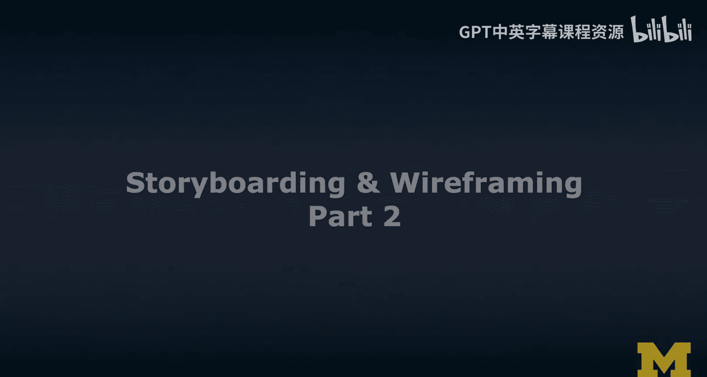
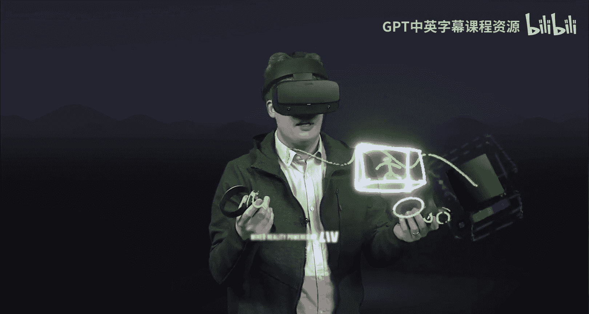
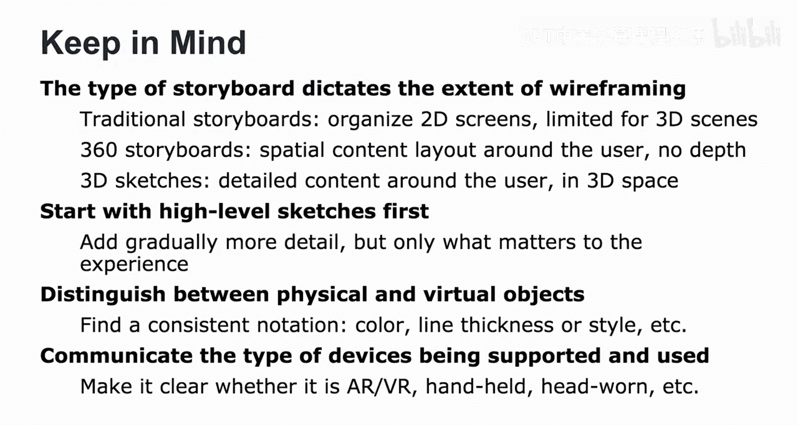
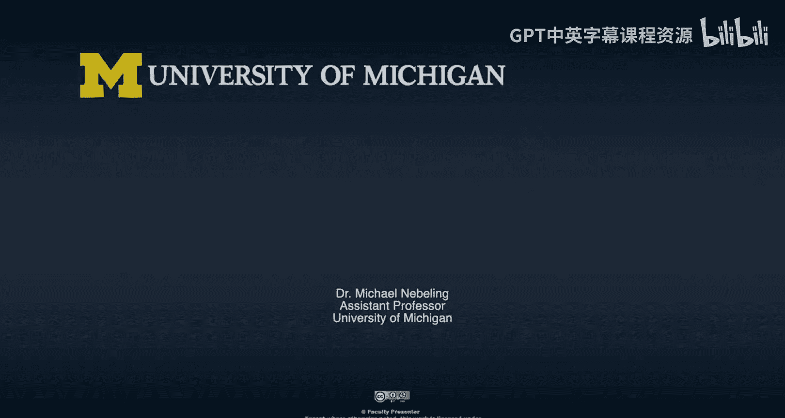

# 密歇根大学《面向所有人的扩展现实（介绍⧸设计⧸开发）｜Extended Reality for Everybody Specialization》中英字幕 p68 31_故事板与线框图设计第二部分.zh_en -BV1jM4m1k73q_p68-

I've talked about foreground background and background and now what we can also do is actually move out some of these spheres that we are mapping these 360 storybos onto。

 And so we can create an experience like this Star Trek experience where it's possible for the user to actually walk into the observation deck that is just next door the bridge。

 And I'm going to show you this as well in a quick example here。

 What I'm going to do now is walk around and I'm going to walk into this room over there。

 so we have to walk around the bridge。😊，A little bit physically constrained here。

 but the beautiful thing is that this room nicely， the physical room nicely maps into our AR version of it。

And like I in the room and I have some see through。Effects here。And we can go back。

Into the other room， hop， up， up。And there we have space。

This is actually the film studio where we're working。And we are back at。The captain's chair。Alright。

 I talked a lot about storyboarding and so in this case。

 I want to specifically focus on 360 storyboarding。 Now 360 storyboarding。

 I brought like basically three examples here， and I want to briefly show what is required to create those examples。

 So one of the things you see throughout the course is this scene with the doggy and the butterflies and then we have a little bit of background like the trees here and we have mountains in the background and I explained how these are different layers and that we can then kind of like remove the white and layer them and actually have a really cool experience that way。

Now the way we created this is through 360 grid that I kind of like tried the line here and you can see that the butterflies are in the center and I talked about this grid in a lot more detail。

 So next I briefly want to talk about what it's like to prototy an existing experience。

 So if you are familiar with the Star Trek， this is the bridge with a captain's chair and that's the bridge behind and then what we also did is we actually created a room that is the observation deck and when we created this experience in Vr。

 we can actually move these spheres so that they're intersecting。

 it can actually walk over into this other room。 Now what is very interesting when we created this experience。

 this was actually an8r prototyping experiment with Kaie。

 a very talented designer in my lab and we also used additional tools。

 So one thing that we were actually really a little concerned about was the amount of movement that is required to really explore the Star Trek and what users would。

See initially when they start this experience so this is giving us the range of motion of a user when they are seated in VR and to be honest。

 this experience the Star Tre we prototype for both VR and for AR So the more interesting thing for us was the field of view So what would a user especially when they are starting out I will show you later the final experience to the user when they are starting out what would be the initial field of view and how much of the bridge would they actually see。

And so this are these are some useful templates and tools that I share with you so you can actually prototype some of these experiences and learn about how to do this actually well on paper One of the issues with paper is that things often appear different in terms of scale and so you will actually have to experiment a little bit with this so a good way of prototyping this is actually putting a blank sheet of paper on top of templates and then。

See the pattern shine through。 And so you can orient yourself around the center and actually start drawing content in the middle content that it would appear。

And then content that would appear to the left of the user would appear over here。

 content that would appear to the right of the user。

 so 90 degrees to the right you draw in there and you can also draw the top and bottom so you can actually draw 360 around the user so this's a really powerful template。

Finally， one way we often use this is actually if you want to prototype experiences for my lab at Michigan。

 we also have a template that is essentially a 360 sketch of my lab now we wanted to try out how difficult it is to prototype rectangngular rooms using in 360 template you can see lots of distortions here just the way it is but when you actually view it in 360 on a VR headset it will be even out it's right it's like it goes around the user it's like wrapping it around their head and so these what appears to be distorted or actually recangngular shapes and suddenly they become windows and walls and this is a very good way of using VR techniques to prototype AR experiences。

Finally， once we have created some of these prototypes， we often use cardboard。😊。

To rapidly preview these kinds of things and I'll introduce it to tools where all it takes is like put your phone in there and take a picture this way and then start previewing the experience in VR and's something I'll talk about and then we also talk about some of the AR ways of prototyping things we we make use of markers。

 Fial markers that are visible to the camera and so when we prototype these experiences we only work on paper we often want to actually quickly preview things in VRR and an AR and so the way we often do this is at least in my classes we use software that I've developed that can run on our phone and all we need to do is actually put the phone inside cardboard。

Run the software。Take a photo of the experience， click and then preview it in VR and these are things that I'll actually show you throughout theOOC and we can do similar stuff for AR so we actually I also brought a few paper markers here that are popular and there is a cardboard version of AR which is called Holockki and so same idea phone goes in there。

The experience looks a little little different。You have to make sure that the camera is exposed。

 otherwise it will not work， so it has to go inside this way。And。We run the software。

 we put it on our head， and we actually use these markers。To tell。The phone， well。

 the coordinate system of our prototype， and then we can actually preview fairly quickly any of the things we have prototyped here。

Actually， a preview at in A R。So I've talked about storyboarding。

 I've talked about 360 photo stories， and I've talked about 360 storyboarding。

 none of them are actually 3D。 and so this last technique is storyboarding in 3D。All right。

 I want to show you 3D sketching and the way I'm going to do this is I'm actually。

Also explaining to you。How we actually created this experience So what I'm doing right now is actually sketching out the room。

That I'm in， okay， and it is， as you can tell， it's already a 3D kind of。🎼Room。

 but there's nothing interesting in it。 So where is Michael in this room。 Okay。

 so this is pretty easy。 I'm kind of like here standing and waving at you。 So that's me。 Okay。

 and you guys are at the other side of the room。 Obviously。

 the camera is roughly here and pointing towards me。😊，And you can。

See it I'm never sure which is the best perspective for you guys because it's like 3D but you know this is kind of like the experience that you get and how do we do this actually how can you actually be part of the experience so the way we record this is there's actually a green screen behind me。

🎼O，那。This is what it looks like， and。Well， you don't see the green right。

 you have this really cool interesting background behind me from tiltil brush and the way we do this is we're using software that is essentially removing the green screen through Chromema Ke so it's gone and we can fill in some really cool stuff in the background。

 We could actually do anything。 We could have a rainbow or other things behind me and create a really interesting experience for you that way。

And， obviously。Well this sounds like movie production， I mean。

 as you can tell from how I talk about some of these concepts when it comes to XR。

 it actually seems very related， it's a lot of technologies that blend and blur between moviemaking。

 virtual production and actually ARVR content creation Now this is a 3D sketch and it's very useful in the early stages of design but it also is actually could be one of your first assets。

 you could actually export this into other kind of ARVR software and process it further so that they can appear in AR or N VR which is right now but we can process it further as I said。

 and could really do a really cool experience that way。

So I've introduced you to four powerful storyboarding techniques and the extent of wire framing really built into these techniques really depends on the type of storyboard that you are creating。

 So if you're paying attention to the detail。 the traditional storyboards are usually very rich in terms of 2D wireframes。

 but traditional storyboards are quite limited when it comes to ARVR scenes which are in 3D。

 So I've introduced to two additional techniques like the 360 storyboarding technique。

 which allows you to plan layout around the user in 360 degrees but you don't have depth。

 It's not really 3D。 So the last technique I was just talking about 3D sketches。

 really allow you to detail the content around the user， plan it out in 3D space。 In fact。

 you know draw it in 3D and then you can actually create assets that way and download them and process them further so that they can actually become elements in your final ARVR experiences。

I want to wrap up with a few tips here。 So I would say start with a high level sketches first。

 add gradually more detail， but only what matters to the experience。 For example。

 don't focus too much on the physical world around it。

 only on specific elements that dictate the AR or VR experience。 For example。

 if the room that your prototyping for has a very particular shape。

 then you should really pay attention to this。 otherwise it's just a rec angular environment and you don't have to draw out every wall。

 what I've noticed a lot is really when I work with my students and there's this implicit notation that comes up when that people use to distinguish between drawing out the physical elements and drawing out the virtual elements。

 really the overlays。 And so what I often see is like for example。

 color being used So red is virtual and green is physical。 And if that is used consistently。

 it really becomes a good notation that allows you to communicate one these storyboards actually translate to design in later design specifications when you work with。

😊，Developers。Finally， I would communicate the type of devices being supported。

 I would pay a lot of attention to what kind of experience you have in mind。 so keep in mind。

 we have lots of different types of ARVR。 It could be handhel。 It could be headwor。

 and you should really keep that in mind even at the storyboarding stage。 However， at that stage。

 we are still brainstorming a lot。 and storyboarding is a very powerful tool for brainstorming。

 new kinds of experiences you want to create for ARVR。

