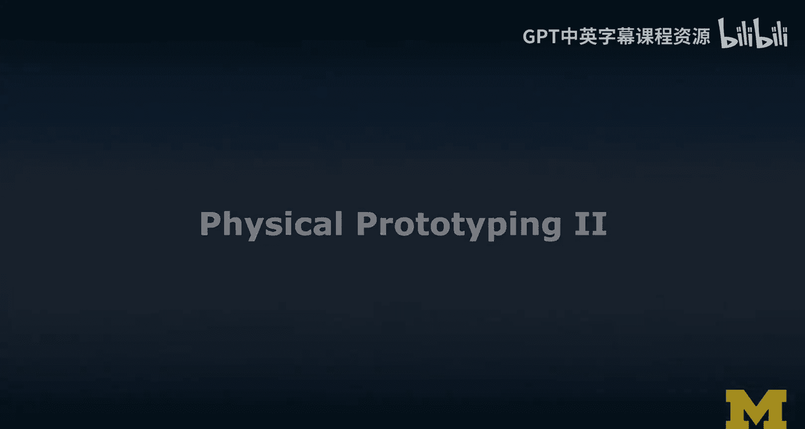
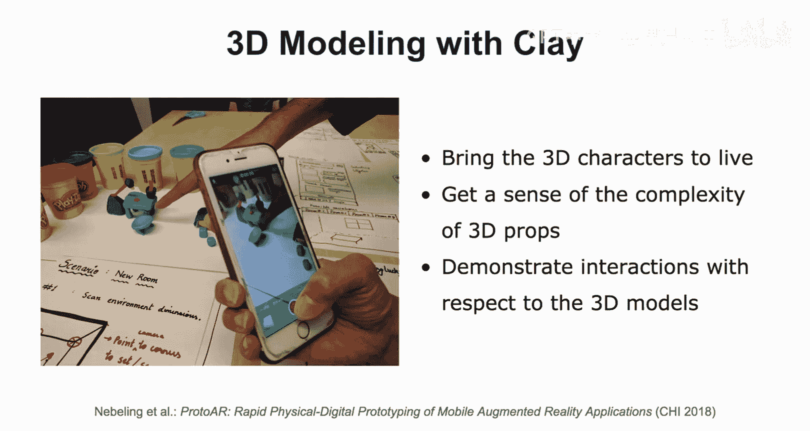
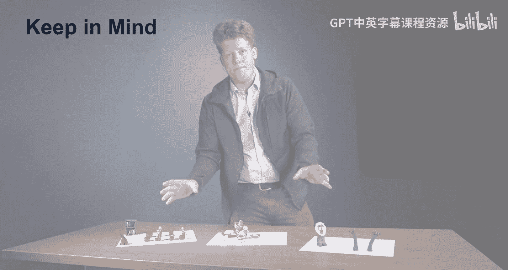
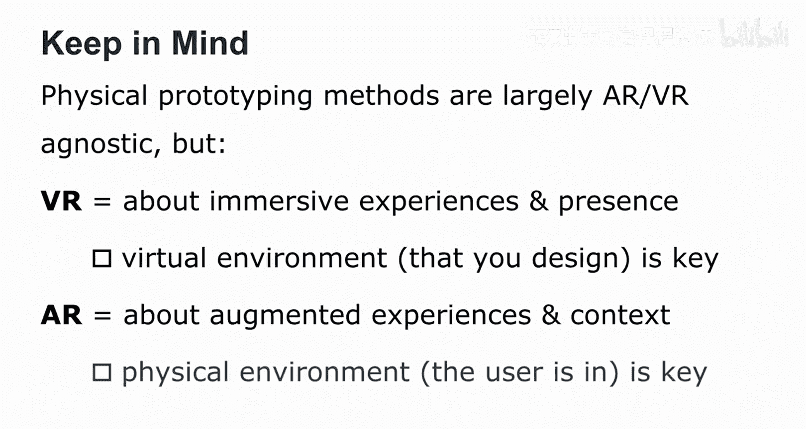
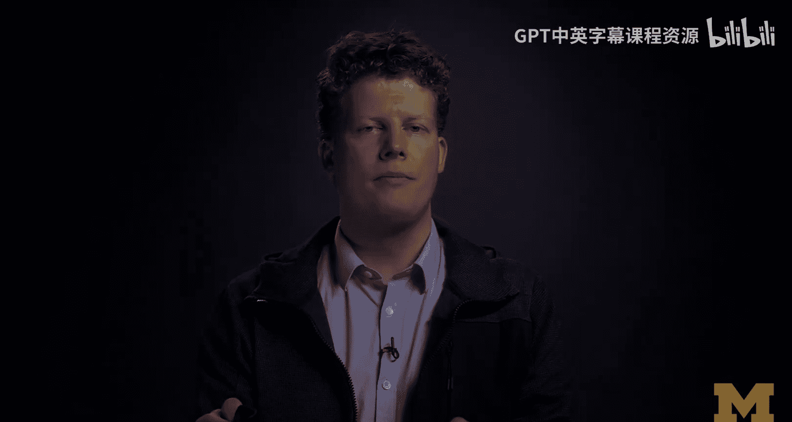
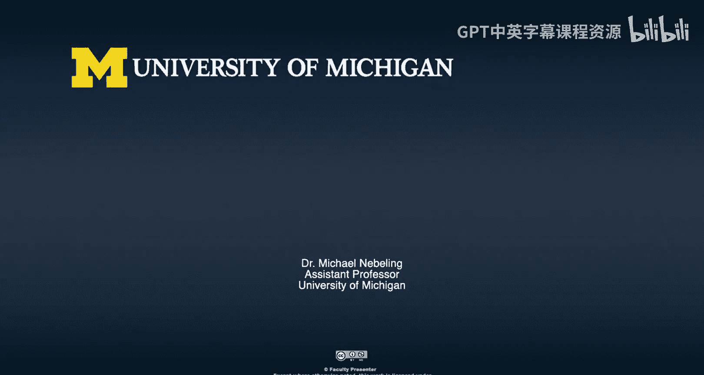

# 扩展现实设计：第70章：实体原型设计Ⅱ 🧱

在本节课中，我们将继续深入学习实体原型设计。上一节我们介绍了纸面原型和360度纸面原型，本节中我们将探讨在物理空间中工作以及使用物理建模工具的方法，特别是**立体布景模型**和**粘土3D建模**。

## 在物理空间中工作：立体布景模型 🏗️

立体布景模型本质上是一个三维的、通常是微缩版的场景模型，用于模拟AR/VR场景。它允许你在物理世界中构建并演示那个三维场景。

以下是使用立体布景模型的几个关键优势：
*   **团队协作**：你可以与多位设计师合作，共同构建场景。
*   **用户演示**：你可以向用户演示交互，设计师可以扮演场景中的角色来响应用户操作。
*   **空间评估**：你可以有效评估空间需求，并理解构成AR/VR体验原型的不同物理对象之间的关系。

我将展示一个我们实验室曾制作的原型示例。这仍然是我们喜欢的森林场景。我们有一只猫头鹰飞入，然后有人与之互动，现在这个物体被另一个物体替换了。虽然从某些角度看可能有点奇怪，但关键在于，它是一个非常好的物理呈现，填补了之前仅在2D纸面上或使用360度模板思考时的空白。

实际上，在物理空间中工作会让事情变得简单得多。我的学生和我本人都深有体会，尤其是将一些纸面原型转化为立体模型时。

显然，我很乐意分享我和学生在课堂及研究中的许多工作。这里有一个快速展示：我们曾使用立体布景模型原型化VR园艺体验；我们也讨论过公开演讲体验（这常引发焦虑），你可以用这种方式原型化一次演讲；我的一些学生还原型化了沉浸式剧院，你在这里可以看到舞台的3D版本，之后它将进入VR。立体布景模型非常强大，通常只需45分钟就能原型化这些场景。你可以在课堂上与任何背景的设计师一起完成，并且不需要很多技术技能或任何数字工具。我认为这是目前最便宜、最快速的3D工具，物理空间和立体布景模型可能是实现这一点的绝佳方式。

## 物理建模工具：粘土3D建模 🎨

我想添加到我们工具箱中的最后一个技巧是**粘土3D建模**，你在之前的视频中已经看到过一些。我们经常用它来塑造场景中的主要角色。

以下是粘土建模的应用方式：
*   **聚焦角色**：我们专注于场景中的主要角色（或物体）。
*   **故事板实体化**：之前使用的故事板现在变得实体化，你可以很好地捕捉这些3D角色的动作。
*   **评估复杂度**：角色在3D中活了过来，可以被移动、旋转，这让你能感受到后期需要创建的3D模型的复杂度，并再次在真实的3D空间中演示交互，这让很多事情变得更容易。

然而，对于一些交互，设计师和用户之间需要更好的协调，这需要一点练习。正如我即将展示的一个视频例子：用户正在执行一个旋转手势，而设计师（此时作为“人肉计算机”）则在移动椅子。

学生们快速原型化了这个体验，并对他们想在AR家具摆放应用中支持的交互有了感觉。这是感受物理空间并以此方式创建3D资源的一种非常酷的方法。

## 实体原型实例解析 🔍

我带来了几个实体原型，想说明如何仅用实体原型来为虚拟现实和增强现实原型化有趣的概念。

我准备了三个场景，每个场景背后有不同的想法。我将从这个开始：这个原型源于我的一门课程项目，学生们有兴趣使用虚拟现实来原型化标准化考试场景。许多学生实际上害怕标准化考试，通常是在大房间、面对大量观众进行。这个原型让他们能够思考基本的交互、角色是谁以及哪些视角会很有趣。例如，坐在前排总是能看到门的体验，可能与坐在一群人后面在这种标准化考试场景中的体验非常不同，后者可能引发更多焦虑。VR是建立共情的强大工具，这是我在课堂上最喜欢的学生项目之一。

这也是一个非常酷的想法：其理念是将语言和文化更贴近观众。实际上，这是关于中国食物和各种看起来非常美味的食物。事实上，它看起来太好吃了，我真的很想吃，但它实际上是粘土做的，所以你不应该吃。还有一些额外的元素我现在没有展示（只聚焦于粘土和物理方面），但周围有写着中文的纸。其理念是真正原型化一种体验，让学习者可以了解不同的语言和文化。

以上是两个原型示例，在某种意义上它们是允许我们思考交互的新想法，也是我们在实体原型活动中练习的一些内容。

现在这是最后一个场景：显然，如果你熟悉一些电影，这应该会让你想起《狮子王》。我们在许多研究和学生项目中也尝试过，即取现有的场景并重新创造它们。在这里你看到了拉飞奇（我们实际上不得不制作两个拉飞奇模型）。在这个MOOC专项课程的其他部分，你可能看到我们实际上动画化了拉飞奇，尤其是那个他将辛巴举起分开的困难场景，这是预告片中一个非常好的元素。这让我们能够思考角色移动和3D模型的复杂度。

这就是通过实体操作所学到的东西。当你开始分析这些实体原型时，我相信你能获得大量关于需求的知识：我们有什么样的用户需求？需要什么样的显示和追踪要求？这对我们的3D模型意味着什么？素材能有多复杂？我们可以下载现有的吗？还是必须自己创建？用粘土在一小时内完成这些，你可以在课堂环境中进行，让学生们快速思考。我是实体原型设计的坚定支持者。

## 总结与核心区别 📝

在最后两节“实体原型设计Ⅰ”和“实体原型设计Ⅱ”中，我向你介绍了多种实体原型方法，例如使用纸张、添加360度网格到纸上、使用粘土和立体布景模型。最让我着迷的是，这些实体原型方法在很大程度上是**与AR/VR技术无关的**，不像数字工具通常只擅长AR或VR（如果擅长的话）。实体原型设计真的非常快速和廉价，能让你快速迭代设计。

然而，请记住：
*   **为VR进行实体原型设计**时，核心是关于**沉浸式体验**和创造**临场感**。因此，在你的原型中应特别注意创造这种环绕环境，例如使用360度网格，因为这是让你围绕用户进行空间思考的最佳方法。
*   **为AR进行实体原型设计**时，核心是关于**增强体验和上下文**。这里的“上下文”真正指的是用户所处的物理环境。你的AR设备会读取这个环境，然后向你的界面发送信号。因此，你需要注意的原型化重点是：用户周围物理环境中那些可能触发你体验中某些方面的微小事物。

本节课中我们一起学习了利用立体布景模型进行空间关系推演，以及使用粘土进行快速3D角色与物体建模的方法。我们分析了多个实例，并总结了为VR和AR进行实体原型设计时的核心关注点差异。掌握这些快速、低成本的实体原型技巧，将为你的扩展现实设计打下坚实的基础。