# 面向所有人的扩展现实：第71章：XR故事板实践 🎬

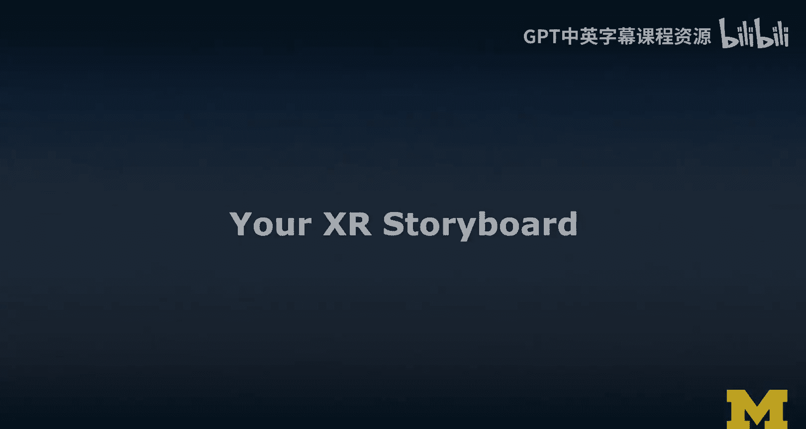

在本节课中，我们将学习如何为XR设计项目创建故事板。我们将专注于理解现有应用流程，并在此基础上构思和设计一个新功能。通过实践不同类型的草图，你将更好地把握应用的整体感觉和交互设计。

上一节我们介绍了故事板在设计中的重要性，本节中我们来看看具体的实践练习。

## 练习任务说明

你的任务是为一款类似“Google Expeditions”的XR应用创建一个故事板。请遵循以下步骤：

1.  **理解现有流程**：首先，在不考虑新功能的情况下，理解并描绘出所选应用的现有操作流程。
2.  **构思一个新功能**：基于你的理解，为这款应用构思并设计一个你认为很酷的新功能。
3.  **创建故事板**：围绕这个新功能，创建故事板来展示其使用场景和交互流程。

**重要提示**：请基于现有应用进行改进，而不是从头设计一个全新的应用。这样其他学习者能更容易理解你的设计意图并提供有效反馈。

## 故事板与线框图绘制要点

当我们进行故事板和线框图绘制时，需要关注核心的设计要素。

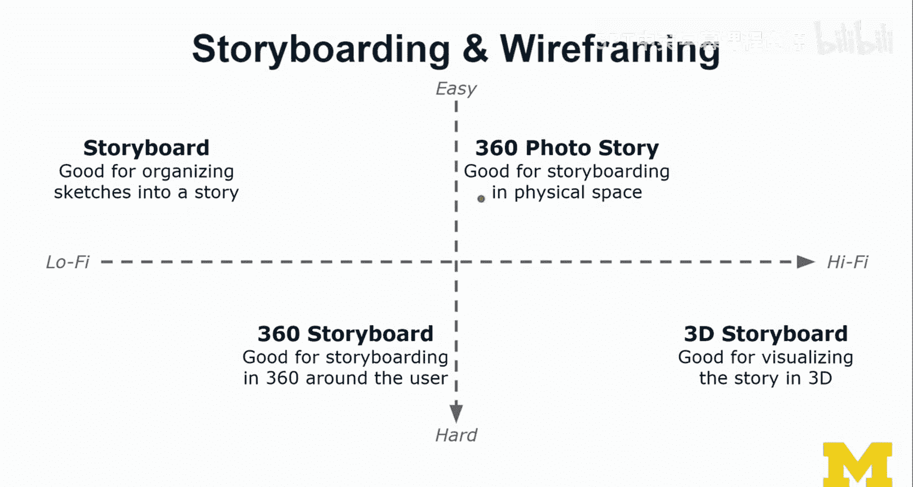

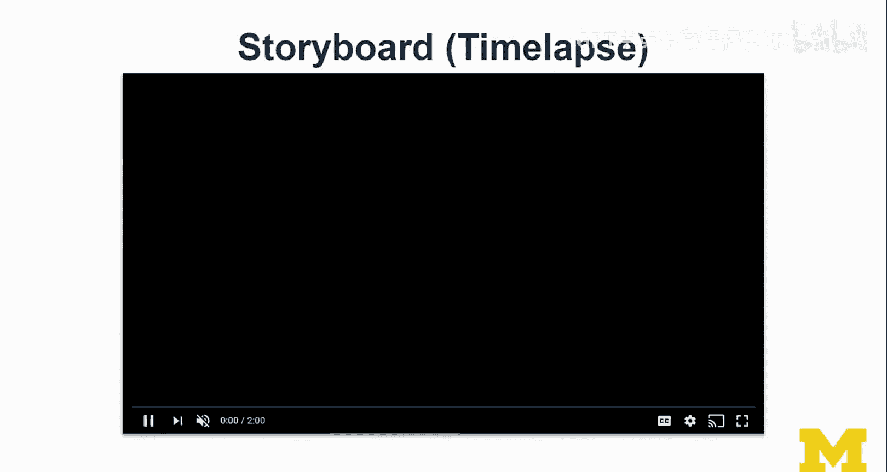

以下是绘制时需要注意的几个关键点：

*   **从高层级草图开始**：首先绘制2-3张高层级草图，捕捉应用的核心流程、状态转换和交互方式。
*   **区分虚实对象**：在草图中，使用颜色编码等方式清晰地区分物理对象和虚拟对象。
*   **添加标注**：使用箭头和简短标签对草图进行注解，帮助他人理解你的设计意图和关键元素。
*   **注重传达而非美观**：草图的核心是传达想法，而非追求艺术美感。只绘制必要的细节，将注意力集中在核心创意上。

## 练习步骤详解

以下是完成本次练习的具体步骤指南。

**步骤一：创建故事板**
你可以选择创建一种或多种类型的故事板。理想情况下，可以尝试几种不同的类型。如果只做一种，请从2-3张高层级流程图开始，然后逐步添加细节，描绘现有界面或场景，并清晰区分虚实对象。

**步骤二：绘制新功能线框图**
基于你的新功能创意，绘制2-3个包含具体内容的替代性线框图。这能帮助我们理解新功能的界面布局、内容呈现以及用户如何通过交互到达这些新界面。

**步骤三（可选但推荐）：尝试360度或3D故事板**
在真实项目中，你可能不会尝试所有类型的故事板，但本次练习鼓励你尝试**360度或3D故事板**。这能让你对应用在AR/VR中的空间感和体验有更具体的认识。

## 练习成果与工具演示

完成本练习后，你将能更深入地理解应用的整体流程，并对如何改进设计（包括添加新功能）有更具体的想法。如果你使用了360度或3D故事板，还能更好地感知应用在AR/VR环境中的体验。

为了帮助你更好地完成练习，我将分享一些我在实践中的过程和工具。

### 传统故事板实践

首先，我以“太阳系”Expedition应用为例，进行了传统故事板的绘制。我首先勾勒了应用的基本流程，然后在构思新功能（例如，展示行星间关系、地球的昼夜变化、地月系统等）时，不断参考原应用以完善想法。这个过程通过延时视频记录了下来。

### 360度故事板实践

接下来，我尝试了360度故事板。这种方法使用特殊的等距柱状投影模板，能将2D草图转换为沉浸式的360度预览。

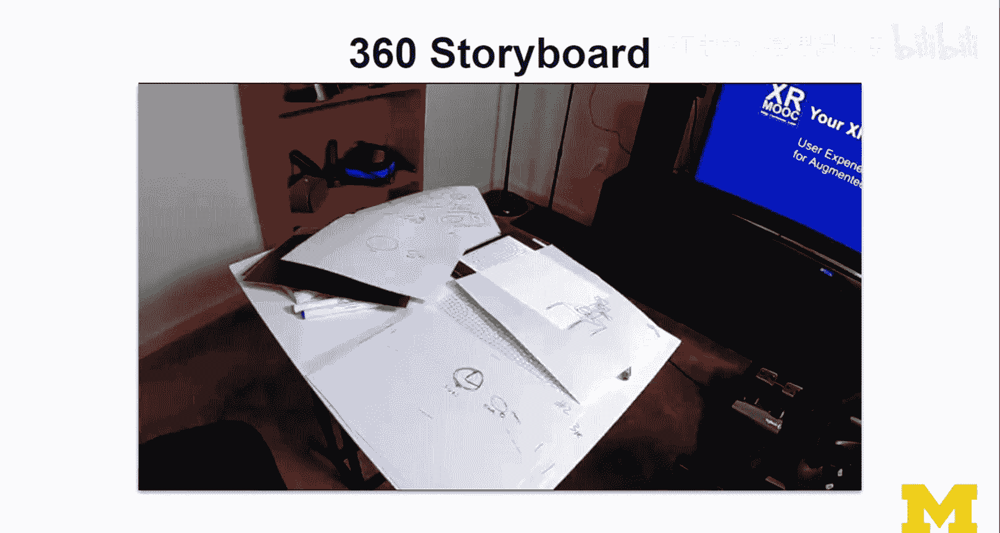

**核心工具与概念**：
我使用了一个研究原型应用，它可以将你拍摄的、绘制在特定模板上的草图，在手机上预览成VR场景。其原理是将平面草图通过 `等距柱状投影 -> 球面投影` 的转换，包裹在用户头部周围。

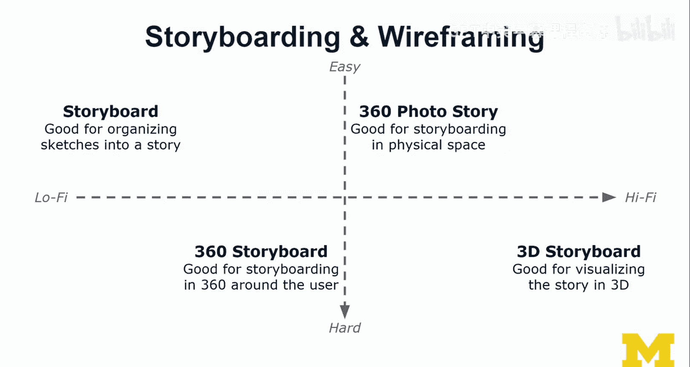

在绘制时，我使用了颜色编码来区分元素：**红色**用于标注（非显示内容），**蓝色**代表虚拟内容，**黑色**代表现实环境。绘制完成后，我通过手机和Cardboard眼镜进行了VR预览，这能有效评估用户在VR中的视野和所需头部运动范围。

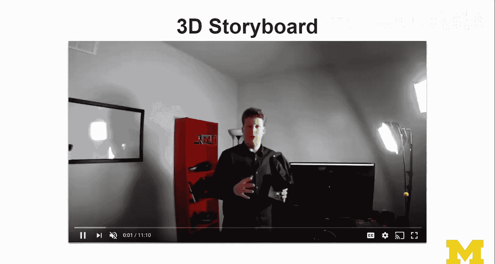

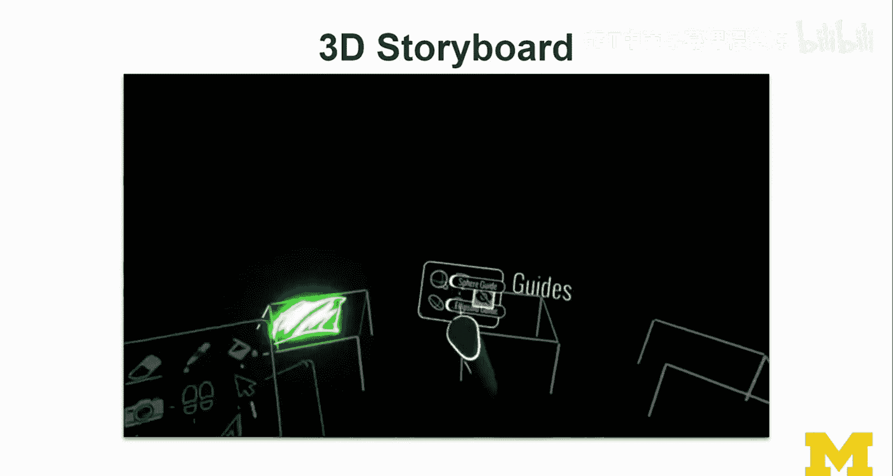

### 3D故事板实践

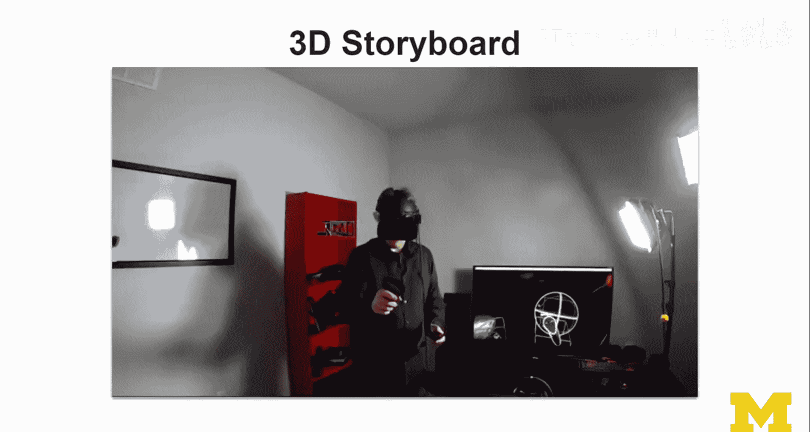

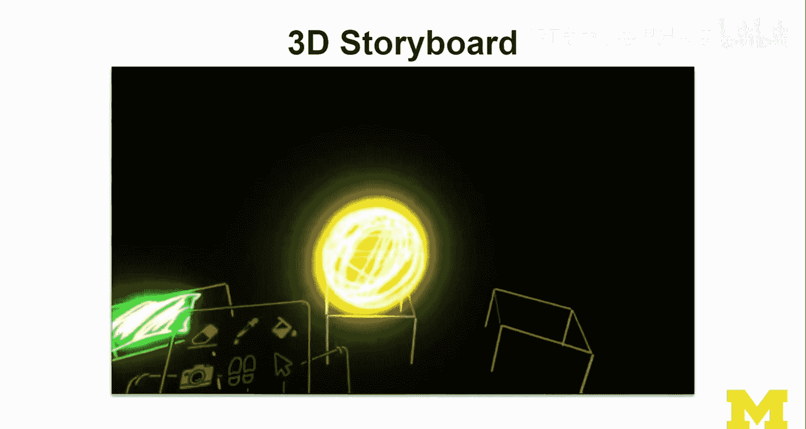

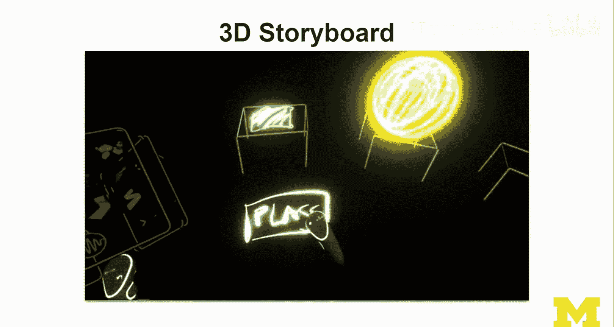

最后，我演示了在VR内部使用Tilt Brush等工具进行3D故事板创作。我在VR空间中直接绘制了不同场景（如放置太阳、添加地球和月亮），并思考了状态间的转换和用户可能的交互。虽然Tilt Brush并非免费工具，但市面上存在许多其他VR素描工具（如Quill, Gravity Sketch）可供选择。

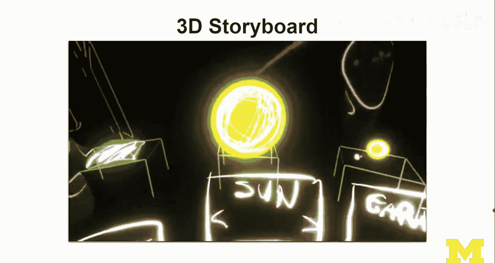

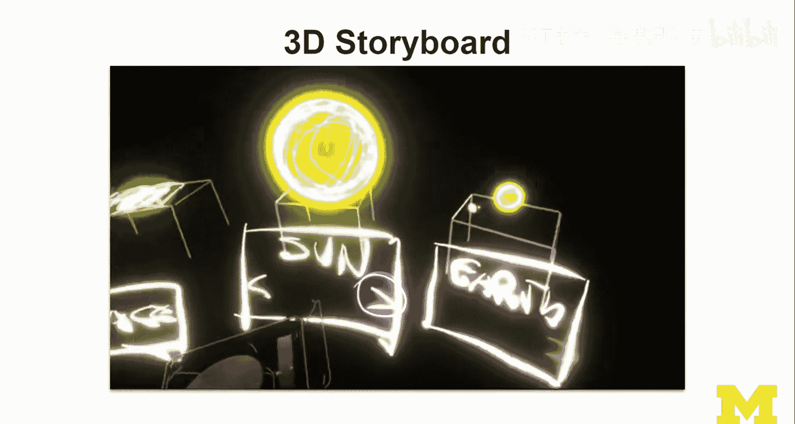

**核心建议**：
3D故事板能带来非常直观的空间理解。每次尝试360度故事板，即使挑战性较高，也能让我对项目和自己有限的绘画技能有新的认识，而这正是练习的价值所在。

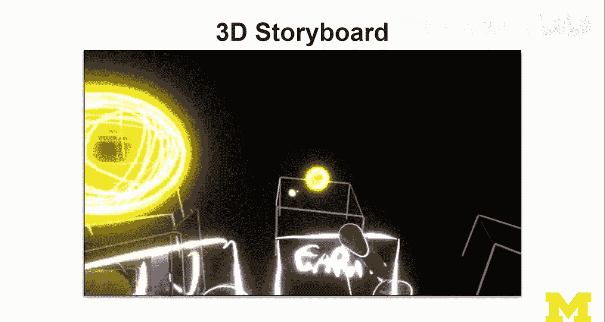

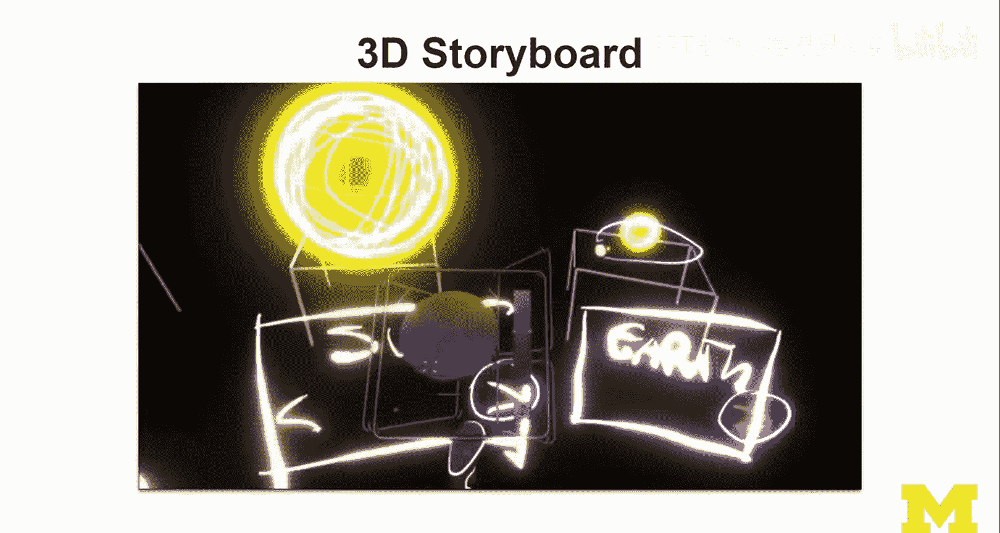

---

本节课中我们一起学习了如何为XR应用设计故事板。我们明确了练习的核心是理解现有流程并构思一个新功能，掌握了绘制故事板和线框图的要点（如区分虚实、添加标注），并了解了传统、360度和3D等不同故事板类型的实践方法与价值。请记住，草图的目标是清晰传达想法，大胆尝试，享受这个创意过程。