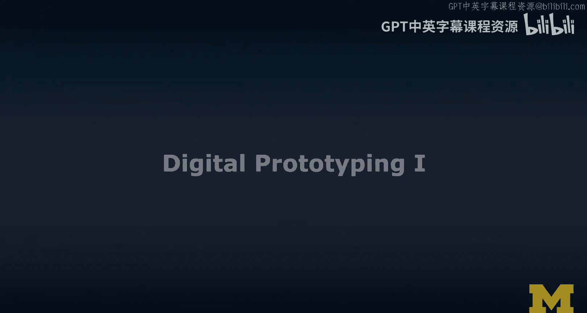
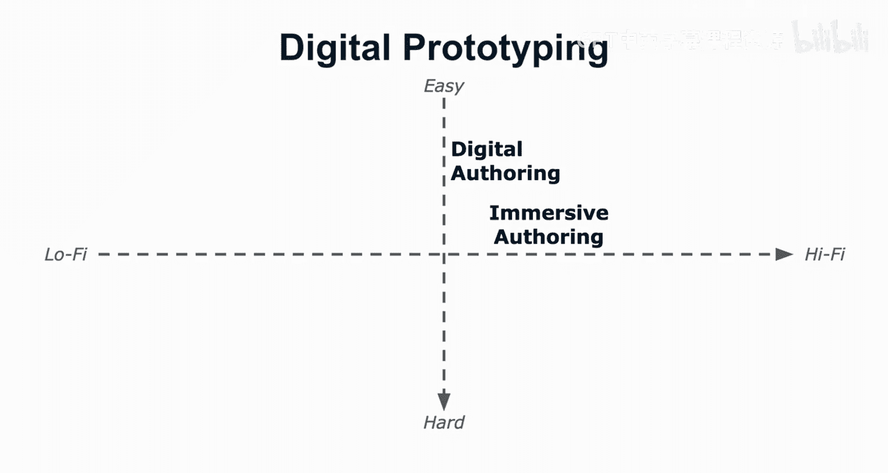
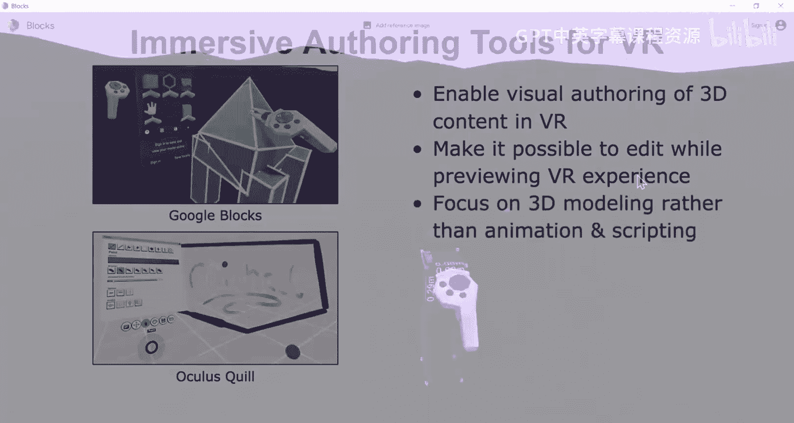
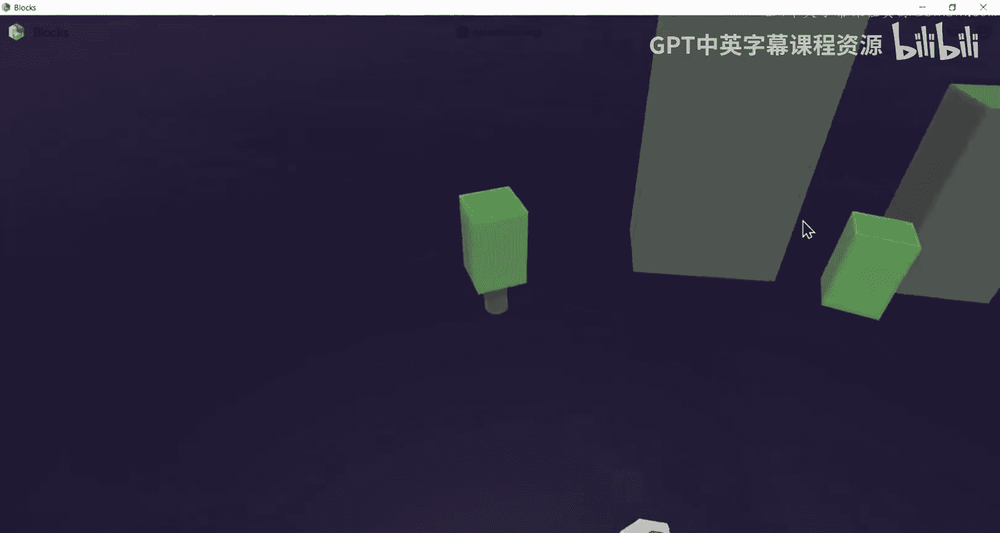
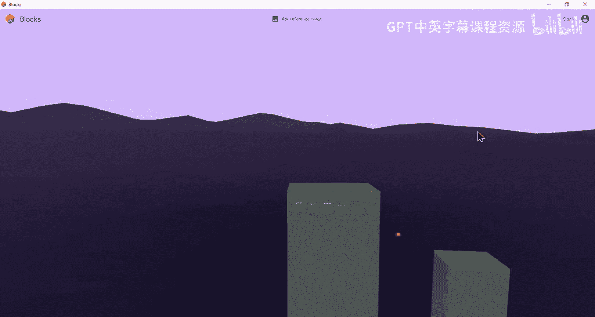
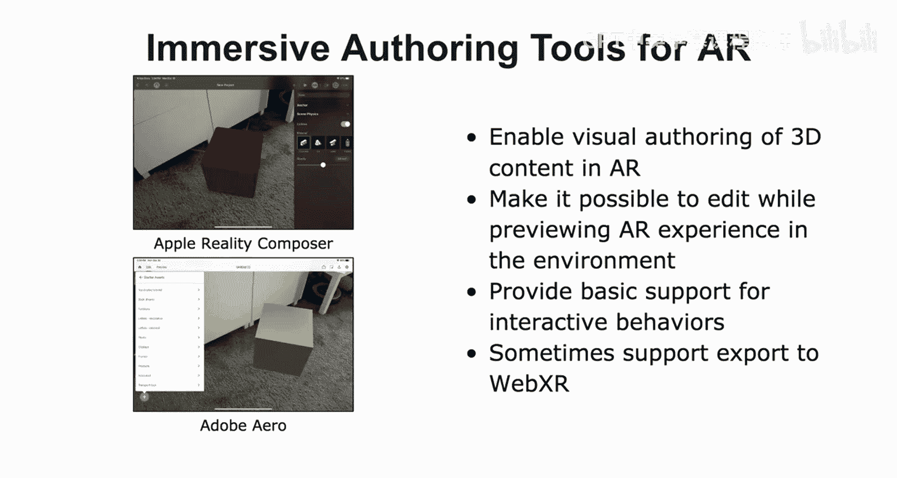
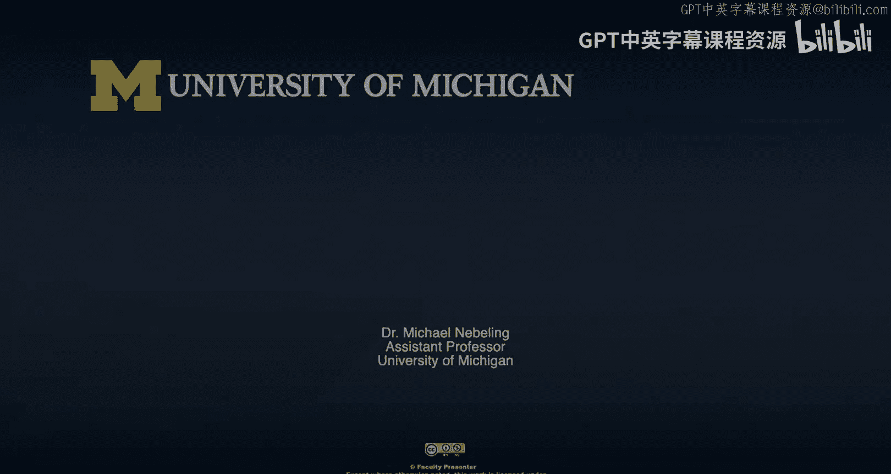

# 扩展现实设计：第36章：数字原型设计Ⅰ

## 概述

在本节课中，我们将学习如何将纸上故事板或实体原型转化为更高保真度的数字原型。我们将探讨数字原型设计的几种技术，包括使用增强现实和虚拟现实设备进行沉浸式创作。

---

## 从实体到数字：提升保真度

上一节我们讨论了实体原型设计，本节中我们来看看如何将设计提升到数字领域。数字原型设计的目标是让体验更接近我们最终设想的成品。

数字原型设计的方法从易到难，保真度从低到高。数字创作工具允许我们通过可视化编辑来创建内容，而沉浸式创作则意味着直接在AR或VR环境中进行设计。

---

## 扩展现实工具概览

在深入数字原型设计之前，我们先回顾一下扩展现实的整体工具生态。这有助于我们理解不同工具的定位。

以下是主要的工具类别：

*   **数字与沉浸式创作工具**：例如一些可视化编辑器，允许点击和拖拽操作。
*   **基于Web的开发**：基于WebXR规范，使用如A-Frame等工具进行开发。
*   **跨平台开发**：使用Unity或Unreal等游戏引擎，结合特定厂商的AR/VR SDK。
*   **原生开发**：针对特定设备或平台，使用如Cardboard、Oculus或Vive的SDK进行开发。

---

## 不同工具路径的适用场景

每种工具路径都有其最适合的应用场景和优缺点。

以下是各类工具的适用性分析：

*   **数字与沉浸式创作工具**：适用于故事板和初步原型设计，但对复杂交互的支持有限。
*   **基于Web的开发**：适用于具有基本交互的XR应用，但当前体验有时不如Unity或Unreal成熟。
*   **跨平台开发（如Unity/Unreal）**：适用于功能完整的XR应用，能创建视觉效果出色的体验，但学习曲线通常较高。
*   **原生开发**：适用于充分利用特定平台或设备特性的完整XR应用，能提供最佳体验，但会限制用户覆盖范围。

---

## 聚焦数字与沉浸式创作

现在，让我们聚焦于数字原型设计的核心领域：数字创作与沉浸式创作。我们将沿用从低保真度到高保真度的思路。

**数字创作**指的是一类特定的工具，允许你通过可视化编辑（如在编辑器中进行点击和操作）来创建内容，并通常可以直接在AR设备上运行体验。

**沉浸式创作**意味着你在AR或VR环境中工作。你完全沉浸在虚拟或增强现实中，交互方式也因此改变。这是一种边设计边测试的有趣原型设计方式。

这两种方式都受限于工具本身能实现的原型复杂度。当你转向基于Web的开发、使用Unity/Unreal的跨平台开发或针对特定SDK的原生开发时，虽然能创建更丰富的体验（迈向高保真度），但难度也会显著增加。

---

## 数字创作工具详解

让我们深入探讨数字创作工具。首先从VR的数字创作工具开始。

以下是VR数字创作工具的特点：

*   **支持可视化创作**：使用鼠标、键盘，以第一人称视角（如WASD键控制移动）的方式在3D场景图中导航和编辑。
*   **支持VR预览**：通常可以快速连接VR设备或通过部署方式，在头显中预览刚刚创建的内容。
*   **可实现基础交互**：通常无需编程即可实现用户注视、使用VR控制器点击或在手机上触摸等基础交互。
*   **高级交互需借助工具包或编程**：要实现更高级的交互，通常需要添加特定工具包（如Unity的XR Interaction Toolkit）或编写代码。

---

## AR数字创作工具

AR的数字创作工具有其独特之处。

以下是AR数字创作工具的特点：

*   **支持基于标记或无标记AR应用的可视化创作**：在基于标记的场景中，你可以使用默认或自定义的标记进行跟踪和原型设计。
*   **支持增强现实预览**：通过电脑上的模拟器软件，或将应用快速部署到连接的智能手机等AR设备上进行测试。

---

## 沉浸式创作工具的优势

正如之前提到的，数字创作工具在测试时通常需要部署到设备上，因为现有的模拟器或预览效果往往不够好。这正是沉浸式创作工具的优势所在。

沉浸式创作工具允许你在设计的同时就在AR/VR环境中预览，无需反复切换和部署，大大提升了原型设计的效率和真实感。

---

## VR沉浸式创作工具

让我们看看VR沉浸式创作工具的例子，如Google Blocks和Oculus Quill。

以下是VR沉浸式创作工具的特点：

*   **在VR中进行可视化3D创作**：你佩戴VR头显，在三维空间中进行建模或绘制，这与在桌面上的数字创作截然不同。
*   **编辑与预览同步**：整个创作过程都在VR中完成，实现了即时的编辑和预览。
*   **侧重于3D建模与预览**：现有工具的支持主要集中在3D建模、动画和某种程度的脚本编写上，非常适合为最终体验创建和预览3D模型或环境。
*   **支持导出通用3D模型格式**：创建的作品可以导出为常见格式，或直接分享到Google Poly、Sketchfab等在线平台。

---

## AR沉浸式创作工具

AR的沉浸式创作工具也在不断发展，例如Apple的Reality Composer和Adobe Aero。

以下是AR沉浸式创作工具的特点：

*   **在增强现实中可视化创作3D内容**：通常使用具有AR功能的平板电脑作为取景器，在物理空间中进行编辑。
*   **边创建边预览**：直接在AR设备上工作，无需先在电脑上设计再部署。
*   **为特定环境设计**：通常在设计目标环境中进行创作，使原型更具上下文相关性。
*   **提供基础交互行为支持**：通常无需编程即可支持基于位置的触发器（如接近物体、点击虚拟物体、识别标记等）。
*   **部分工具支持导出至WebXR**：允许你将原型导入像A-Frame这样的工具中进行进一步编辑。

---

## 总结

本节课中，我们一起学习了数字原型设计的基础。我们了解了如何从实体原型过渡到数字原型，并概览了XR工具生态。我们重点探讨了数字创作工具和沉浸式创作工具，分析了它们对于VR和AR原型设计的不同特点、优势与限制。这些工具使我们能够以更高的保真度和更直观的方式，将初步构想转化为可交互、可体验的数字原型。在接下来的课程中，我们将更详细地了解像A-Frame和Unity这样的具体工具。