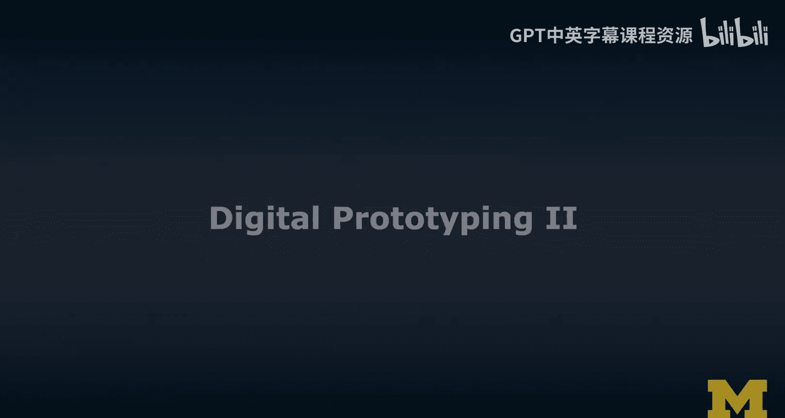
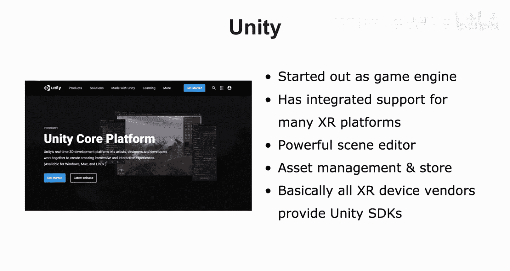
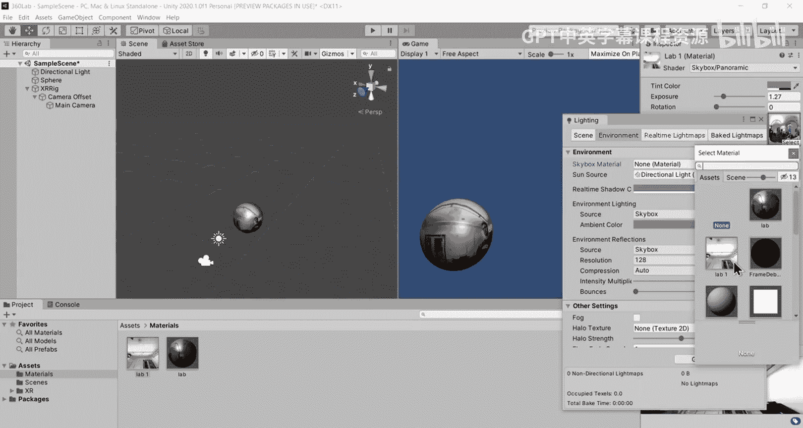
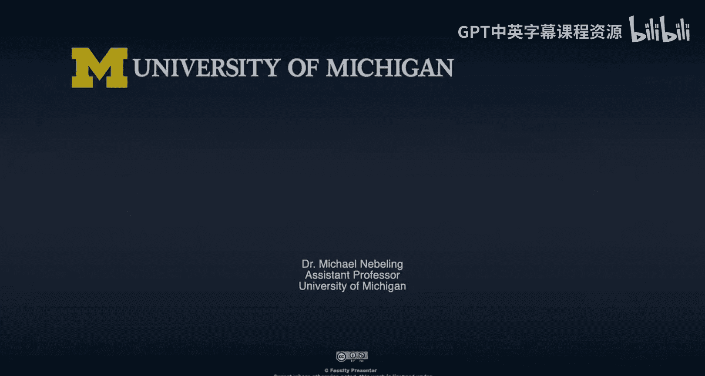

# 面向所有人的扩展现实：课程编号：数字原型设计工具 🛠️




在本节课中，我们将学习两种用于扩展现实（XR）应用开发的数字原型设计工具：A-Frame 和 Unity。我们将了解它们的基本概念、核心功能以及如何利用它们快速创建和迭代 XR 原型。

---

## A-Frame：基于Web的XR开发 🌐

上一节我们介绍了数字原型设计工具的概念。本节中，我们来看看一个基于Web标准的工具——A-Frame。

A-Frame 基于 **HTML5**、**Three.js** 和 **WebGL** 技术栈。这意味着在遵循HTML5标准的网页中，我们可以使用 `<canvas>` 元素来渲染2D或3D内容。WebGL 通常特指在网页中渲染3D内容。

A-Frame 提供了一套新的HTML标签，所有标签均以 `a-` 开头，例如 `<a-scene>`、`<a-box>`、`<a-cylinder>`。这些标签会被转换为3D场景中的特定**实体**。因此，你可以通过编写HTML代码来创建3D场景。

以下是A-Frame的一些核心特性：

*   **检查器**：A-Frame 提供一个检查器（Inspector），用于查看场景内部结构，例如光源位置或动画问题。
*   **资源管理**：支持引入典型的网络资源，如图像、视频、声音，以及通过**3D模型加载器**引入常见的3D模型文件格式。
*   **实体组件系统（ECS）架构**：这是A-Frame的核心编程架构。网上有大量开源组件可供使用，你可以将它们轻松集成到你的A-Frame代码中，以添加VR控制器支持、特定3D模型或行为，实现“即插即用”。
*   **跨平台支持**：A-Frame 支持跨平台的AR和VR体验开发。

### 实践示例：使用360度照片创建场景

我们将使用一张之前拍摄的实验室360度照片来创建一个简单的VR场景原型。

1.  **场景设置**：在A-Frame中，我们将这张360度照片映射到天空（`<a-sky>`）和场景中的一个球体（`<a-sphere>`）上作为纹理。
2.  **代码结构**：在类似CodePen的环境中，HTML主体代码大致如下：
    ```html
    <a-scene>
      <a-assets>
        
      </a-assets>
      <a-sky src="#lab-photo"></a-sky>
      <a-sphere src="#lab-photo" position="0 1.5 -3"></a-sphere>
    </a-scene>
    ```
3.  **材质调整**：通过调整球体的材质属性，如**金属度（metalness）**和**粗糙度（roughness）**，可以改变物体表面的反光特性，使其看起来更逼真。
4.  **迭代与预览**：我们可以直接在网页中预览，或使用VR头显（如Oculus Rift）进行沉浸式预览。利用检查器实时调整参数（如球体位置、材质属性），满意后再将数值复制回代码中。这个过程结合了数字原型设计和沉浸式原型设计。

---

## Unity：强大的跨平台XR引擎 🎮

了解了基于Web的A-Frame后，我们转向一个功能更全面的专业工具——Unity。

Unity 起源于游戏开发社区，现已成长为一个对AR和VR提供强大支持的平台。它集成了许多XR平台的官方支持，例如，基于标记的AR库 **Vuforia** 现已内置在Unity中。此外，你也可以轻松集成其他厂商的SDK。

以下是Unity作为原型设计工具的优势：

*   **强大的3D场景编辑器**：Unity编辑器允许你在桌面电脑上直接创建和编辑3D体验，并能即时预览，帮助你感知最终在AR/VR中的效果。
*   **资源管理与资源商店**：Unity拥有一个庞大的资源商店（Asset Store），你可以从中下载各种资源包、库和3D模型，极大地提高了开发效率。
*   **广泛的设备支持**：几乎所有主流的AR/VR硬件厂商都提供Unity SDK，方便你针对特定平台和设备进行开发。
*   **模拟器支持**：Unity提供了日益完善的模拟器支持，方便在没有实体设备时进行测试。

### 实践示例：在Unity中重建场景



我们同样使用那张360度实验室照片在Unity中创建场景。

1.  **导入与设置**：将360度照片导入Unity，创建一个球体，并将照片作为材质赋予球体。
2.  **材质调整**：在Unity的材质面板中，我们可以调整**平滑度（Smoothness）**等参数。平滑度控制光线的反射强度，调整它并结合旋转场景中的光源方向，可以创造出更丰富的光影效果。
3.  **场景布局**：通过编辑器轻松调整摄像机或球体的位置（例如，将球体向左移动），直到在3D视图中获得满意的构图。
4.  **环境设置**：为了创建完整的VR环境，我们将360度照片设置为场景的**天空盒（Skybox）**，替换掉默认的天空背景。
5.  **VR预览与迭代**：通过Unity的XR插件设置好XR设备（如Oculus Rift）后，按下播放键即可在VR头显中实时预览场景。我们可以反复调整球体材质、环境旋转或亮度，并在VR中即时查看效果，进行快速迭代。

这种方法的强大之处在于，你可以基于一张事先拍摄的360度环境照片，在任何地方快速原型化一个XR应用场景。你既可以在实际环境中进行设计，也可以在任何地方基于照片“重建”环境并进行设计。

---

## 总结 📝

本节课中，我们一起学习了两种重要的数字原型设计工具：**A-Frame** 和 **Unity**。



*   **A-Frame** 是一个基于Web技术的工具，通过扩展HTML标签让开发者能够用熟悉的网页开发方式构建XR场景，适合有Web背景的初学者快速上手和进行轻量级原型设计。
*   **Unity** 是一个功能强大的专业引擎，提供可视化的3D编辑器和丰富的资源生态，虽然学习曲线较陡，但能支持创建更复杂、高性能的XR应用，是进行深入开发和高质量原型设计的首选。




两者都支持跨平台的AR/VR开发，并允许开发者结合数字编辑和沉浸式预览进行快速迭代。掌握这些工具，将为你设计和开发扩展现实应用打下坚实的基础。