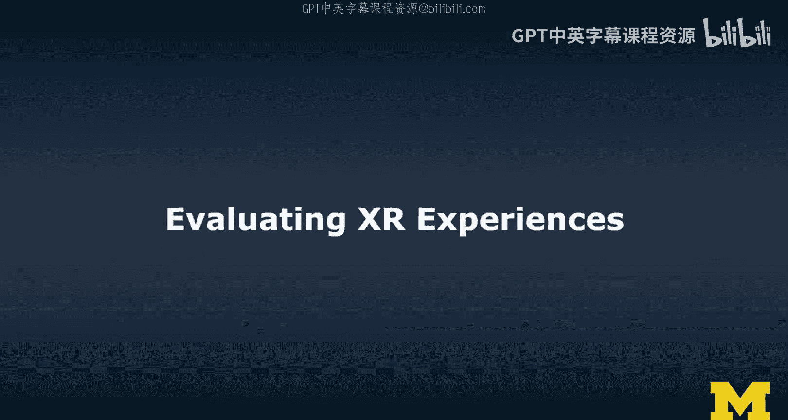
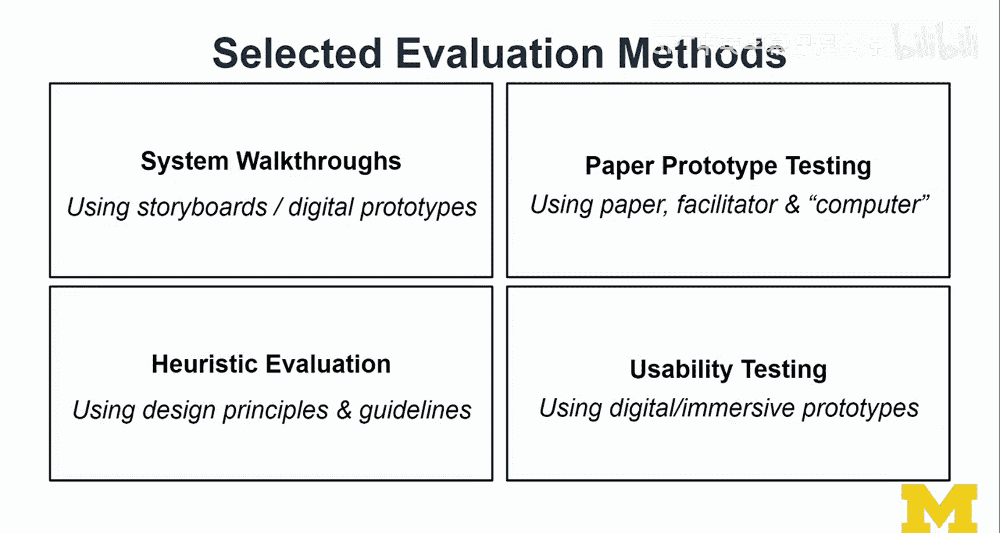
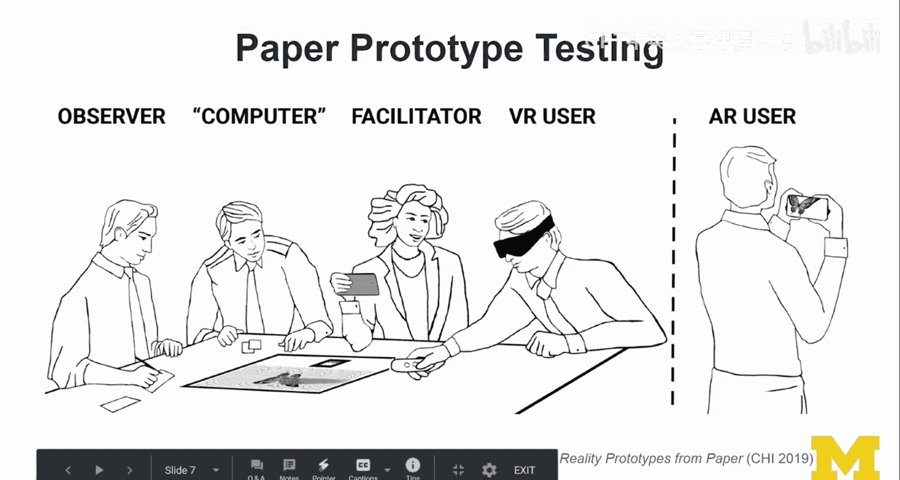
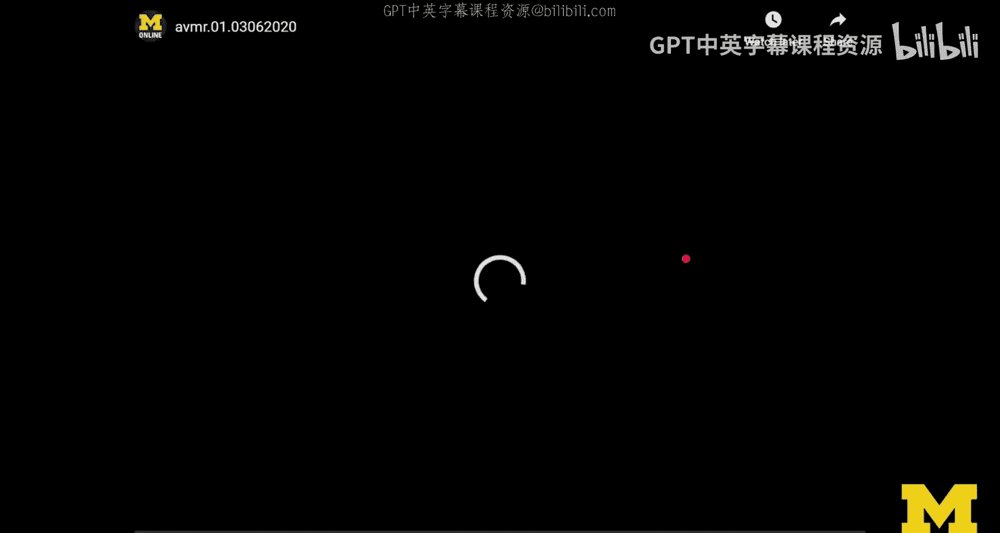
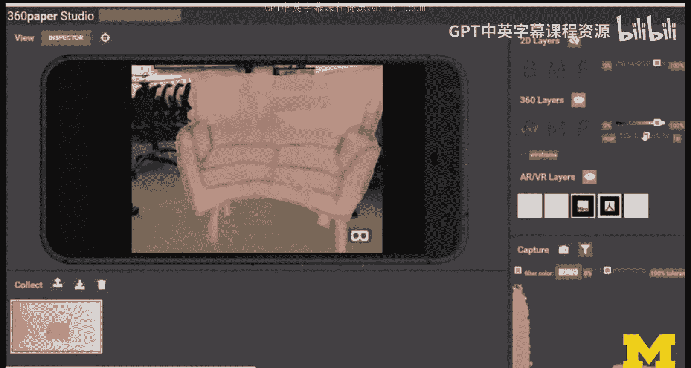
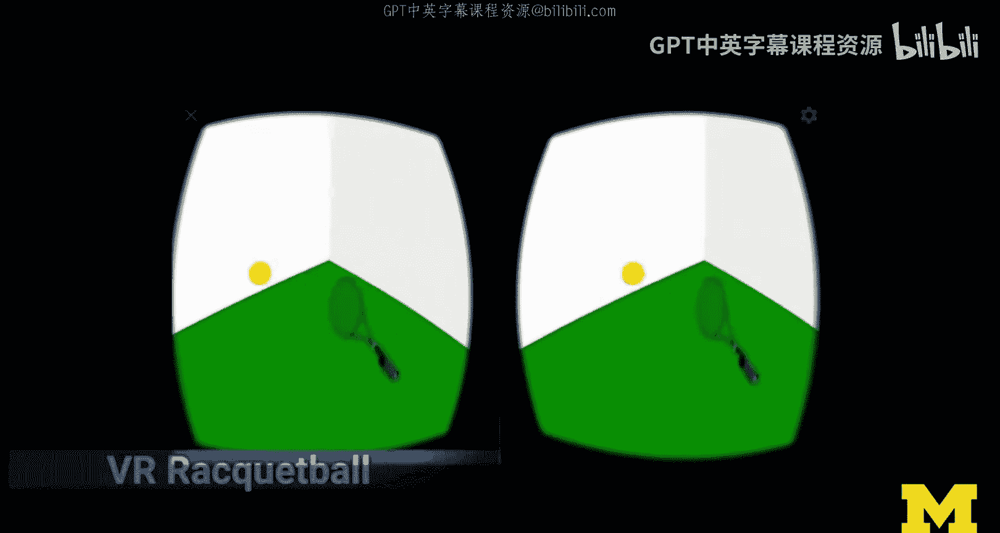
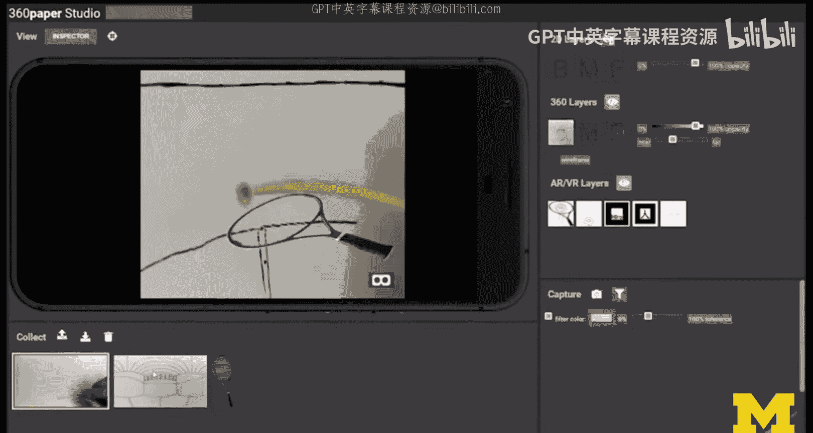
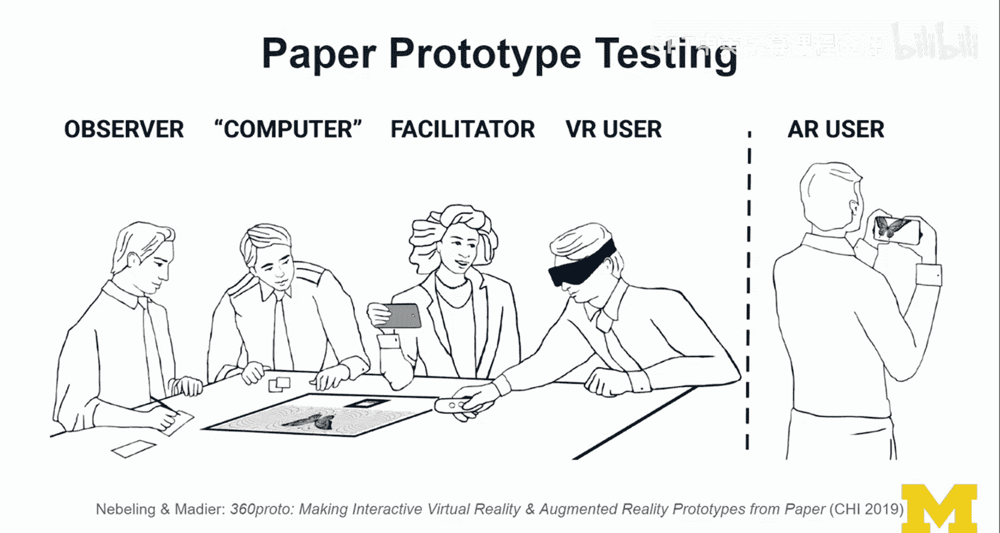
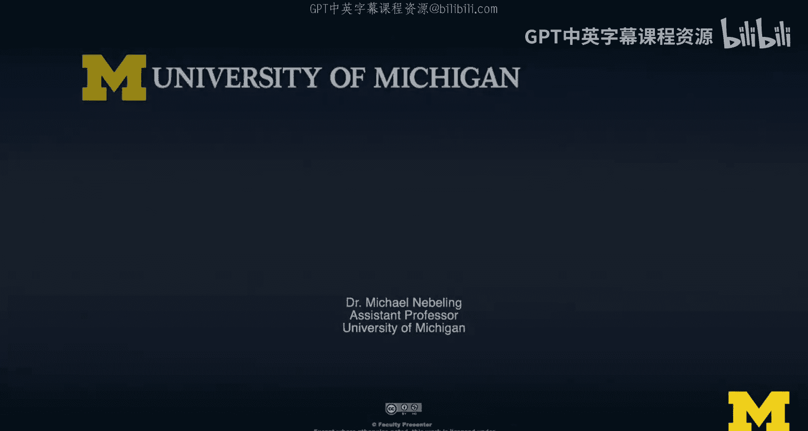
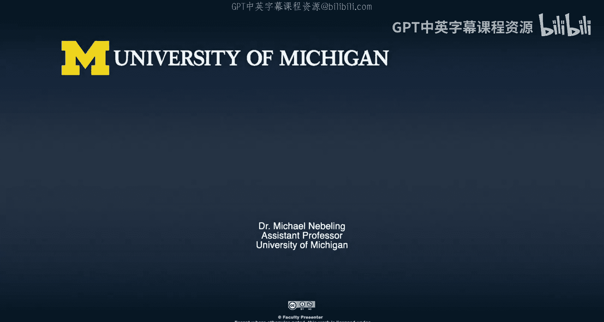

# 密歇根大学《面向所有人的扩展现实（介绍⧸设计⧸开发）｜Extended Reality for Everybody Specialization》中英字幕 p75 38_XR体验评估方法.zh_en -BV1jM4m1k73q_p75-

When I say evaluation， I really think in terms of three big things and depending on who you are。

 it may just be one of them。 so I'll give you a little bit of an overview of what evaluation can actually mean usability test。

User study or play test。And so how do these differ Well they differ in terms of metrics that you're looking at so for usability testing。

 you think in terms of usability metrics so efficiency， effectiveness， satisfaction for user studies。

 you may actually have this idea of showing an effect so maybe determining whether the participants so your subjects in a user study whether they feel or get this feeling of presence and whether they see whether they feel immersed。

So there are present in immersion questionnaires， for example。

 that might be the instruments that you would be using in those types of studies。

Or you might have a hypothesis somehow embodied in your prototype。

 and now you are testing whether you can find support。

 some kind of evidence support for your hypothesis。

Or you might just be interested in doing some kind of benchmarking。

 maybe you've come up with a cool new interaction technique in the X space。

 and so now you're doing some kind of performance or user performance benchmarking。

As a game designer and developer， you approach this probably a little bit differently。

 One of the things you really， really care about is gameplay Yeah， do the participants， well。

 actually do your players have fun， In fact， you don't talk about users。

 you probably just talk about players。 but they're all the same。 So if I use the term user。

 participant subject or player It's all the same。 The people that are trying out our X experience。

 you pay a lot of attention to fun， you want to find out weaknesses in gameplay。

 whether something gets boring after some time。 Yeah。

 the questions that you ask are a little bit different as opposed to the other two。

 which are really detail in this video， I'm going to talk more about usability testing and user studies。

😊，Finally， and this may also be depending on whether you're approaching this more from a marketing perspective。

 user retention， whether the users would be willing to continue using your experience， your product。

 your title or whatever you call it your application。Whether they would come back。

 whether they would continue to use it， and that is usually a function of whether they can see some kind of value in it and whether it's engaging and fun。

😊，So this value might be productive or might be entertaining。

So these are the things that we are trying to figure out how well are we doing along all these different kinds of metrics and criteria So speaking of criteria I think at the highest level we can distinguish four different sets of criteria and then associated questions one big one is usability as I said。

 so how well can our users use that interface a really really important question and then we're talking about efficiency。

 effectiveness and satisfaction usually and there are other usability metrics that I'll talk about later as well。

Usefulness。Its a very different question。 whether or not something is usable。

 is very different from whether it's actually useful。 Do our users find it helpful。

 Now there could be this most helpful， most useful tool， but it's just really difficult to use。

 so usability is poor， but it's really high on the usefulness and then if you get the usefulness right。

 you will probably still have users， but if you don't have anything useful。

 but it's super well designed in terms of usability。

 it mostly becomes something that us as designers would look at and study。

 it's not necessary something that speaks to the users。😊，Utility。Whether the user see real value。

 does it actually solve their problem， That is really， really an important question。

 And that question you cannot figure out and answer with usability testing。

 There has to be more to it。 Usually this is a question of some kind of longer term use。

 and there are longitudinal studies to explore this in more depth。

But utility and usefulness are really higher goals， higher ambitions that are harder to evaluate。

And then finally， user acceptance will the users actually continue to use the product。

 Will they come back Will they see value， do they use it on a daily basis How frequent does usage become a trend is using just some kind of novelty effect and that novelty effect is something that especially researchers need to be very concerned about your users seeing XR for the first time might be like yeah。

 I'm told going to use this again， this is great。 I mean， I didn't know that you could do this。

 but now that they know this and let's say they buy the product and then they have it will they actually really continue to use it and that is a function of whether that product now provides utility is useful and is usable。

 So ultimately use the acceptance is really the combination of all those civilization criteria and questions。

😊，Now I'm going to talk about four selected evaluation methods and these are more closely aligned towards user studies and usability testing and usability testing is actually one of them。

 but we start with system walkthroughs， these you can do based on storyboards so really in the early stages of design or digital prototypes。

 so when you have something implemented in a digital kind of platform or tool。

Paper prototype testing， so this is really that can happen in the phase between storyboarding and digital prototypes still very early。

 and I'll show you some cool things you can do this way and you need to improvise it a little bit。

 you need a facilitator and you meet a person working as a functioning as a computer as we say here。

 there's this idea of the wizard of us， It's idea of human simulating system functionality that is not implemented yet。

 and we can simulate that to some extent with paper prototypes。

 but this may also play a role later when it comes to digital prototypes。

Theres this idea for heuristic evaluation and this is something based on the design guidelines that you talked about and then you becoming more and more knowledgeable in the field of XR design heuristic evaluation is something that is usually done by experts considering established design principles and guidelines and then also their own experience actually from designing lots of XR things and also testing and then usability testing is the one big field and method well it is both a method and it's a whole field because a lot of people have studied how to improve usability testing and basically the way I'd like to think about it here is like you have something digital or maybe even immersive。

😊，So that means you can actually go into AR of VR。 you have that kind of prototype ready。

 and now you're going to do some kind of usability testing。

 It's a little bit different from paper prototype testing I mean you can figure out questions to do with usability even with a paper prototype。

 especially when it comes to like terminology and user flow through an application but whether or not something is truly usable in XR So in AR of VR that is something you can only figure out when you actually have digital or immersive prototype Allright so these are four big methods and system walkthrough to usability testing so depending on how much we have and the one thing that you noticed in my selection of the methods is that they really depend a little bit on the stage of design。

 some of the things that make a lot of sense early on and then you would choose different methods if you have more design artifacts So if you have a complete system to test and I'm going to show you one example here a system walkthrough is something you can do almost at any time。

You can do it based on the storyboard or you can do it based on the thing that you have implemented and you do this system walkthrough to help users think through the system and well not maybe users but other experts I got a critique and kind of opinion that way without them actually doing a user test a usability test okay and a walkthrough and often this is done as a cognitive walkthrough So you're thinking in terms of the tasks that users might want to do and then how would they be able to use your system So let me show you an example based on our own work。

So here I'll walk you through some of the key features of proto AR so you can create screen mockups on paper then you can do some annotations and prepare it for capture。

 Then you would just use your phones， capture those screens all the paper actually become screens and then also capture 3D objects using some kind of we call the 360 capture technique and now what which is done is digitizing a Plato object and previewing it in AR pretty cool actually So this was a 30 second video summary of one of my research projects published in 2018 in the ACM chi conference。

 The project was called pro to AR and I've mentioned it before and you may have read the paper already so that's pretty cool and yeah so in fact as part of one of the early evaluations in this project we actually did a system walkthrough I didn't have the full thing implemented and ready it I invited。

Students to design jams in my lab。 I often like to work with students。

 Obviously these are all masters students focusing on HCI so human computer interaction and user experience and interaction design。

 So pretty knowledgeable。 And so I had them critique what I had。

 And the one thing that I don't always get right in my own research is the usability of the projects just because I have larger goals。

 I'm interested in other issues then usability， whether something is pixel perfectly aligned and makes sense whether it follows Gual principles and all those kinds of things。

 I usually get that feedback and it is always fascinating to me how and actually pretty cool how the students destroy some of my own work and obviously in my mind I'm thinking yeah that's not really the main concern here but okay that's fine。

 so you get this kind of feedback as part of a system walkthrough。 maybe you had a few questions。

 I mean in 30 seconds I went over a project that took half a year to build。

 and then to do we used this to do。ant research about it and now I just walked you through it in 60 seconds。

 Well， that was the key idea and a system walkthrough be can be very quick but can also be like task based and you show the system step by step by step and then you have your your critiques let's just watch it again and look at what I actually did。

 So I selected a few key scenes from the project。😊。

Here I show some of the key interactions， actually one interaction allows you to capture paper and then bring it into the system。

 The second interaction allows you to capture a physical object and we don't do photogrammetry or all kinds of 3D reconstruction that you imagine no we're doing a much simpler technique here and then the third technique is we can actually preview that captured object in AR。

And that's that's really key so I structure the system walk through around three key interactions。

 these are really the important things and also actually form the contributions of the paper and Plato played a really important part。

 this idea of quickly physically prototyping mobile AR experiences and then showing how to actually transition from the physical so from both from paper which become 2D screens and then paper sketches which become 2D screens and then Plato which become actually 3D models。

And then Plato props modeled physically， which then actually become 3D models。 those。

 those kinds of transitions to make those really quickly， digitization really quickly。

 I think that was the key。 and that was also a little novel， I would say， if not at least creative。

 So。😊，That was a system walkthrough and the system walkthrough helps you get initial feedback again in the early stages of design。

 you can also use it later， but let's look at another method。

 another method that we can do before we have the final real thing and I really like paper prototypes so let's look at paper prototype testing I'm going to play a second video here and let's look at it together。

So we talked about paper prototyping before。And here I show basically how this technique works we are using a specific type of 360 template here。

 there's a 360 grid and some kind of marker embedded in the paper that is then scanned by the phone。

 and then we're streaming from that phone to a VR user。

We are capturing that content live to a VR user， or to an AI user and removing the paper background。

 and so this is basically the 360 Proto project described in my Kaipe。

So this is from the 360 Pro project that my student， Katie Medi and I were working on。

 and it also considers the role of a computer， so a person that actually helps assemble content here on our little surface and keep in mind anything and everything we place on this grid appears in 360 around the VR user or around the AR user。

And so that's pretty cool。And so we can actually prototype quite a few things this way。

 paper prototype testing Now the first thing that I'm going to show you that doesn't actually involve a lot of live streaming and interactivity is I'm going to layer a interface that actually Katie created for me。

 I really wanted the Star Trek and I'm going to show you the Star Trek。😊。

So this is the 360 Star Trek and you may have seen this in other portions of the MOC。

Because it's really a cool prototype to me here I'm going to show it actually in our academic innovation studios at the University of Michigan and what really nicely worked here is how it mapped onto the physical world and how it was just basically leaving this Atre bridge now looking into outer space。

And now I'm going back into the bridge， onto the bridge and looking at the captain's chair。

 actually looking at outer space。 again， this is the screen on screen。

 And then here we look at the captain's chair。Well， kind of a walkthrough， in this case。

 I could actually experience it myself。So this was also kind of a walkthrough but like quite literally I was walking through that paper prototype。

 So I just made it interactive。 It was just sketches on a 360 paper templates So in the physical prototyping aspects of this course we talk about more how to do this kind of stuff but you know。

 I just wanted to bring it back as an example of how powerful 360 prototyping could be and these pros can be tested Now as I'm walking around with that thing in my hand with a tablet I could think aloud。

 like what are the things that I notice did I expect is this behaves in an interesting way。

 and I get a pre-visualization maybe you don't want to have that 360 thing。

 the final thing maybe this is a pre-visualization of what you are going to implement later and you get early feedback even before you have made that commitment to not implement that in unity or in unreal。

 which could be。😊，The next iteration。 And now I'm gonna show you another example。

 So this is the Amazon shopping A view that we prototyped。

 and we're just putting paper furniture in front of the user basically showing it on the camera。

 And then here is our Vr rackquet ball example， Katie actually implemented this。 using Web Xr。

 And now we prototype this。 we implemented this first to set a baseline。

 but now we prototyped this together with a toothpick and Plato as a tennis ball and we had a voucher racket。

 So the way we prototyped this Katie my student was actually in the daydream。

 So this is a VR headset。 and she was controlling the tennis racket on using this threedouff controller。

 So not too much you could do with a daydream smartphone inside。 and I was the tennis ball。

 And the way we did it was we used the 360 paper template。 And I had a toothpick。 Well and well。

 I don't have the exact Plato here。 So in this case， we're gonna have a little bit of an orange。

tennis ball， but basically。I'm just recreating that prototype very quickly here。

 this is all we did with my toothpick， okay， we got it。Da now we have our tennis ball。

 and then I had to follow the specific paper template that was printed。

 and I was moving up and down or I don't remember exactly。Yeah， I was moving up and down， I think。

 yeah， and I was moving up and down。To let the ball bounce。 and then I was watching。

 I had a live preview and then I was watching whether Katie actually hit it or not。

 and then I could like bounce it somewhere here， bounce it off or somewhere there。

 and that allowed Katie as the VR user to get a sense for oh yeah okay this could be interesting and obviously what I could do as because I'm simulating the ball and therefore the physics I could we could do whatever。

 we could also play with the really， really big tennis ball some of the coolest games created by my students in my courses usually always there's always one or two tennis or table tennis games every semester。

 which is pretty cool I like those that allow me to cheat because I'm not that good at tennis so give me a big know a really big tennis ball and then we can play around with physics and actually have some fun as well。

 and you can play around with physics by simulating that as I said Wizard of a style even way before you implement it。

 That's why I think these paper。😊，The typess are so powerful。

So let me quickly go over the roles just I mean I just explained it。

 basically there's a facilitator that guides the process。

 introduces the tasks and helps the user if they get stuck usually the interfaces are not that complex on paper but if the user gets stuck the facilitator prompts them to ask a question it's really important that you don't just like go in there and like tell them what to do because you're losing your temper。

 you don't have enough patience now you can see whether the user is struggling and as you see this you actually think about well you prompt them。

Is there a question you have， could you formulainate it as a question。

 and then you jump in as a facilitator， you give a short answer to the user。

 but you still keep it short so that the user's attention is still on the task okay？

And then if the user keeps asking， then something is wrong with the interface and the experience and so as the facilitator。

 you can actually gradually provide more detail and then well as the facilitator and also you have an observer together you can determine the piece of information that really gets the user unstuck and that is key because that will potentially help you refine your interface in the future。

😊，AndThen there's obviously this computer in quotes and this computer simulates system dialogueos of both system input and output。

 so I was talking about the tennis ball example， I was the tennis ball and that was my computer example here。

And then there is the observer， the person that actually documents the study very important。

 what did the user do and how did the facilitator actually help that's really important so in here again is a visual overview of our paper prototype testing method and again I invite you to read the 360 prototype paper if you thought this was cool and fun and definitely quite a lot of fun for us。

And these are techniques we can do even in the early stages next we're going to expand on some of the other techniques。

 usability， inspection， usability testing， and then also automated usability testing。

