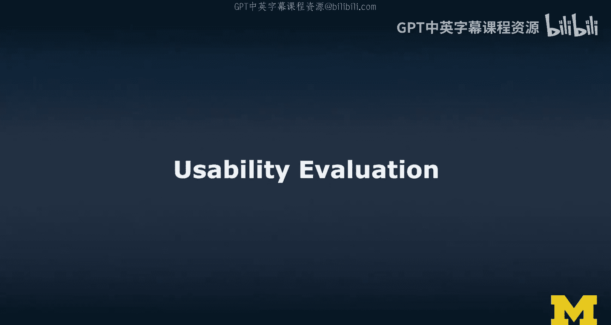
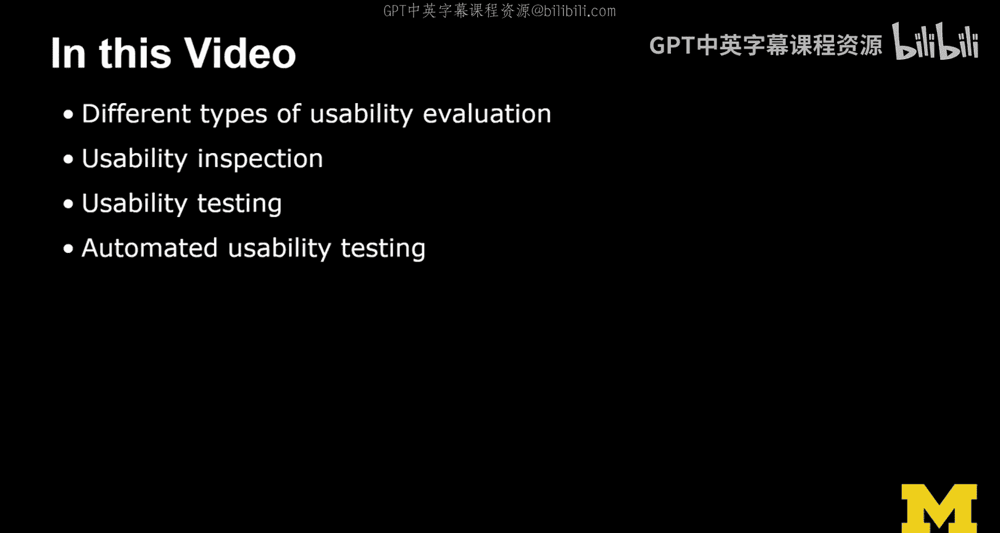
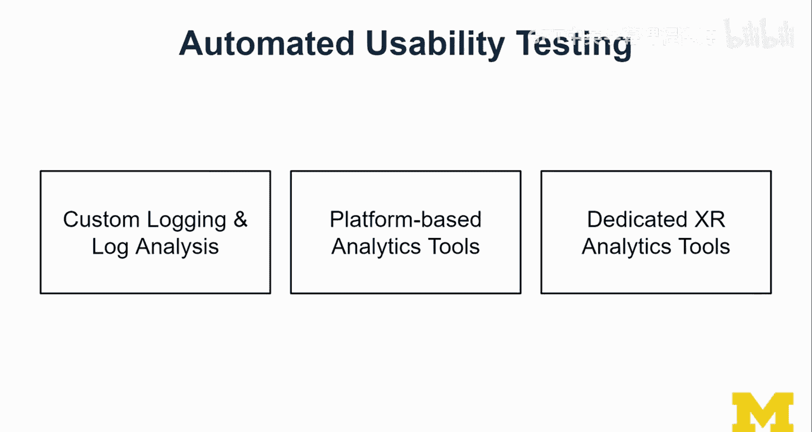

# 密歇根大学《面向所有人的扩展现实（介绍⧸设计⧸开发）｜Extended Reality for Everybody Specialization》中英字幕 p76 39_可用性评估.zh_en -BV1jM4m1k73q_p76-

In this video， I'm going to talk about different types of usability evaluation。

We have talked about different forms of evaluation before with different kinds of metrics。

 And in this one， we focus on usability。So we're going to talk about usability inspection involving experts。

 usability testing involving users and automated usability testing。

 which we're going to keep relatively short because this is a new area and we don't have so much to talk about yet when it comes to using systems for automated。

 not automated but automated usability testing。

So let's talk about different types of usability evaluation。

 so there are three main categories of usability evaluation。

 I would say usability inspection with expert designers。

 usability testing with actually with target users and automated usability testing。

With computer algorithms， that's what I say here。 So these are the three main categories that we can distinguish when it comes to usability evaluation。

 So basically， having experts do it for you， involving users and learning this way and trying to involve systems。

Now in practice， you may combine some of these methods doing the expert evaluation later。

 doing the usability testing， maybe earlier and then maybe at the very end as well and involving systems throughout you shouldn't think of any of these techniques to be basically perfect and all of them could actually contribute unique knowledge and so you should think of ways of combining and incorporating some of these techniques so there are many different factors for the choice of evaluation method the stage of design so again if you're early or mid or end stage of the project。

 the novelty of the project depending on how much expertise might be there or how many users trained in this technology you may actually able to。

Well how many users of the technology you may actually be able to find so think of an AR application for example。

 that is designed for a kind of condition or environment that is very hard to access so NASA for example。

 has several competitions going on about lunar and Mars exploration and so there involving mixed reality is a thing and so the nature of the project may dictate whether or not you can actually do this kind of testing。

A big factor is obviously the number of users you're expecting your application to be used by and also the budget and time。

So if you don't think that the interfacese will be used by a lot of users。

Then I think the budget and time is probably also going to be relatively small but you really want to get it right。

 the more users you have and budget and time shouldn't be the main reason why you don't test I do think that you should always try to make room in the budget and in your time for some kind of getting user feedback for some kind of feedback from users。

Finally， the experience of your team may also be a factor contributing to the choiceification method。

 so for example， if you're leaning towards a different style。

 if you have an established process or workflow in the company in which you're working。

 so these are all kinds of factors that together determine which of these methods you might be using。

Again， I don't think that any of the methods I'm going to show you today will replace user testing。

 In fact， we should actually focus our attention on usability testing and thinking more about ways of actually making this work for X R。

 So let's look at usability inspection first。There is is the concept of heuristic evaluation which is informal。

 holistic and actually checks against established principles and guidelines。

 and it's usually done by experts really understanding the type of interface and the technology in our case。

 AR and VR。 So heuristic evaluation is something we can actually do in this course since we are learning about the guidelines and the principles of designing XR interfaces so we can look at each other's interface and provide some kind of。

😊，Expert opinion based on the experience that we have。

 both of the things you've learned in the course， but maybe also some of your prior experience in terms of good user experience design。

The second concept is the idea of a cognitive walkthrough。

 so the cognitive walkthrough is a procedural walkthrough of the system， it is usually task oriented。

 so you're imagining tasks， you're actually picking tasks that you imagine your users will carry out with the system。

And it checks if simulated user goals and the memory content at the time at which they are actually pursuing those goals can be assumed to lead to the correct action。

In other words， if youre thinking like the users。And we are just assuming the knowledge that we have from operating the interface at the time。

 So the flow so far， the screens and the scenes we have seen so far。

Can we assume that what they know at the time will lead to the correct action。

And there is this idea of formal usability inspection。

 that is now something that I often do in my class。 It's a combination of the bath methods。

 and I'll walk you through it a little bit。 So this is something I often do in classes。

 So the idea is to assemble stakeholders。 So this could be different kinds of designers and also users and then also product owners and all the kinds of stakeholders you can imagine for a project and assign roles to them。

 Then you're going to distribute the design artifacts。

 So there is a team that is essentially reviewing the interface。

And they will receive the design artifacts， so this could be the personas the storyboards or any kind of scenarios or narrative storyboards and also obviously any kind of interface prototypes。

 because that is what they're going to be looking at。

 so these could be paper prototypes or an existing kind of implementation in the form of a digital prototype or even if working interface a on an Xr device。

 and then they will inspect the design。So they will actually go through this and look at it from the principles and guidelines that they know about good X are design and also things that may not be as good。

 So essentially they're performing a cr， a design cr。Of your interface。

And then once the team has finished inspecting， there is a courtroom style meeting。

 so this is a moderated meeting usually by an independent moderator and there is a design team。

 those that have created the interface and a critique team and so the critique team will provide their critique and the design team gets to defend and rebut some of the things。

And it's usually supposed to be a constructive criticism。And a constructive discussion。

 a lively discussion around some of the issues。Often design is about tradeoffs and compromises and so this is an interesting type of conversation that I think is very interesting so I often do this kind of formal usability inspection in my classes so we have like two teams one is design team first and then the inspection team and then the other way around so they review each other's designs and then they meet in the classroom and then they hold this quoteroom style meeting and discuss the design choices and their rationale behind everything and then they get feedback that way。

Now， the important thing after this is how to prioritize and decide on which of the defects to fix。

This is really important。So after any kind of usability evaluation in this case， the inspection。

 you will get feedback。 Now， if this is done by experts。

 you can assume to be the you can assume the feedback to be correct and valuable at least And so but independent of who gives the feedback。

 I would always take into consideration the whole thing and not just like， okay， if you fix this。

 implement this， we change this， don't make all these promises listen and take it in。

 reflect on it and then prioritize and then decide on what to fix You do most of the time you don't have the time to fix everything and I don't expect that but I do think it's very important to show that you have considered the feedback。

 You have reflected on it。And， and that's the way to work with feedback。

So let's look at the next method usability testing So I said usability testing involves users and here are common usability metrics E。

 efficiency satisfaction， learnability， memorability and I say predictability here So effectiveness means that users can complete the task accurately efficiency users can perform tasks quickly and easily satisfaction users will think the interface is pleasant to use learnability and memorability are not the same thing So learnability is about the idea of accomplishing tasks the first time they see the interface and memorability it's easy to re-establish proficiency after not using the interface for a while。

 So most user studies usually don't look too much into memorability they are specific user studies designed to look into memorability So there's a so for example their are experiments around gesture guessability and memorization and those experiments then bring。

😊，Use after a certain time， So maybe a day later or even a week later。 And that way。

 you can assess memorability。And then predictability and whether the interface responds as expected。

 Now， these are relatively common usability metrics for， for these。

 there are some kind of questionnaires that we are often using。 some kind of instruments。 efficiency。

 you can measure in terms of time。 So we call this time on task。

 user satisfaction and effectiveness would be。Through subjective feedback， so self reported。

 for example， liquid scale items from strongly agree to a strongly disagree with a certain statement。

 I thought this interface was pleasant to use。For example。

 so these are relatively commizability metrics and then I thought okay。

 what are the things that we should care about when it comes to XR And so I add a few here and you could come up with additional ones。

 but these are the ones that I came up with thinking about this what is specific to XR。

 So I think when it comes to XR， we really have to think about the realism。 So whether an interface。

 especially in VR invokes feelings of presence。Now I said presence in emergesion。

 there are specific instruments， kind of like type of questionnaires for that and that doesn't directly relate to usability。

 some but there is this interesting tradeoff between making an interfacepha realistic in making it usable not everything in the real world is simple and easy to use and so is I just think it is an interesting consideration to add here safety。

 very important， you should really have as little as possible risk of physical or mental harm。

 so mental really also emotional or psychological harm。

 so really those things are no goes and that's something obviously obviously any kind of risk of that would really deter from the usability of the interfacepha。

Flexibility now that's a little bit of a vague metric here。 but I was thinking， you know in Xr。

 we want to support different kinds of input modalities， So not just gesture， but also speech。

 or sometimes even multimodel gesture and speech。 So I think with Xr interfaces。

 it's very important to support alternate modes of input。

 So provide that flexibility and it actually and having that additional support。

 So these alternate modes of input can also increase the complexity of an interface and that may again detract from the usability。

 Finally， comfort is something that we should somehow think about measuring because especially with headsets。

 So both Vr， but also AR extended use might actually be something that is hard to achieve。And again。

 if something is not comfortable， that may also have to do with usability。 So， for example。

 if youre requiring certain gestures to be performed or relatively long or complicated speech commands。

 then you will also see that the comfort levels are relatively low。

So these are additional dimensions and they're relatively unique to XR。

 at least the way I interpret these terms here。 And together we now have a comprehensive set of metrics and things we can look at when it comes to usability testing with users。

 again， it's on us to translate some of these into real instruments I mentioned presence and immersion questionnaire is now link those as resources then obviously liquid scale ratings and self-reported scales for several of the qualitative measures and then we do have qualitative ways of measuring some things You have to structure the usability test into tasks and then there's this idea of assuming a perfectly solved task。

 So basically this model tasks and using this model task can also then determine the efficiency of users how much do they actually。

Der from that perfect execution of the task， for example。Finally。

 I wanted to talk about automated usability testing。

 So automated usability testing basically comes in three main forms。

 This this idea of custom logging and log analysis。

 So you basically add additional things into your interfaces when you're programming them so to keep track of what users are doing and generate some kind of user related events and then you can collect those in a database and data perform log analysis So log analysis often use to figure out how users。

 for example， navigate through an interface。 What are the common paths and then you can think about how many sequences do they need。

 So how many steps in the path and is there like an optimal path and can we actually make it simpler should we remove some of the paths maybe there are too many options and so these kinds of log analysis help you to actually well optimize an interface。

 there platformbased analytics tools。 In fact， unity comes with a form of analytics。

 Now these analytics are usually more about user retention。

Per retention and whether or not how often users use an interface and where like the geography and basically a little bit of demographics。

 but not too much really about the internal the internal usage of the interface。

 so this is really what you have to accomplish through custom logging and log analysis。😊。

And then there is a new set of tools out there， dedicated XR analytics tools is what I say here。

 we have also worked on one in our own research on the Mi reality analytics toolkit。

 I'll talk about this a little bit later。But there are tools out there like cognitive 3D and others。

 I provide them as resources to you， I don't have too much experience working with them。

They are common in their sense that they are actually quite good in terms of collecting data and visualizing data they produce nicely looking heat maps。

 the really hard part is the making sense of it。So that is just something that we still have to figure out what are the best ways to actually assess the user experience in XR。

 are there new kinds of metrics， is there something we can do automatically？

I think especially on the accessibility side， there are things we can look at more or less in an automated way。

 just like if you think about web design， we have really good sets of tools from the W3C on web accessibility。

 we have relatively poor support on web usability I mean we do have tools that allow us to perform online user tests and things like that。

 So more like tools that wrap around user studies， but not really automatically determining a usability score。

 these automated tools can help zone so much as I said， really on the accessibility side so you can。

 for example， look at the contrast of elements， so especially in AR。

 that's very interesting AR and against the sunlight with like a visor display kind of display like with the Holend very difficult to see anything and so you can find those things by doing simple color tests and checking for the contrast and the saturation and those kinds of things So those things can be implemented and there。

😊，Also research on that。But that a tool tells you automatically whether your interface will be usable or not。

Well， no such thing。I must tell you though in theory must be possible because when I look at an interface I have a certain intuition whether something is usable or not。

 Im not well I'm not always right， but it's just like this intuition that I wished we would develop and that intuition you can develop embracing the guidelines I talked about。

 doing more and more of your own exc projects and developing experience that way which will allow you in the future to make some of these assessments。

😊，Again， none of this you could be this perfect expert designer like you could be Superman。

 you can never really predict the usability of an interface unless you really test it with users so think of these methods as different kinds of tools that together will help you and again consider factors such as time and budget or the experience in your team or any kind of limitations that you have that will help you choose the right method。

