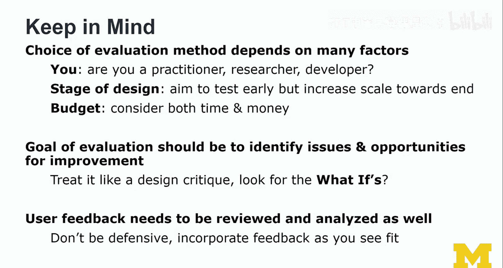

# 扩展现实（XR）评估：第40讲：用户研究设计 🧪

在本节课中，我们将学习如何为XR体验设计和执行用户研究或可用性测试。我们将探讨研究者和实践者在评估视角上的差异，并详细介绍任务设计、度量指标选择以及数据分析等核心环节。课程最后，我们将介绍一个用于混合现实分析的实用工具包。

---

## 课程概述

这是关于评估XR体验讲座的最后一部分。本节内容将保持较强的实践性。我们将共同设计一个用户研究或可用性测试，简要讨论研究者和实践者视角的差异，并深入探讨任务设计、度量指标，最后再次介绍一个混合现实分析工具包。该工具包基于一篇研究如何评估XR界面的论文，建议大家课后阅读。

## 研究与实践视角的差异

在深入设计细节之前，我们首先需要区分“可用性测试”和“用户研究”这两个常被混用的术语。在本课程中，我们对其理解如下：

*   **实践者视角（可用性测试）**：目标是改进产品、发现问题并快速优化用户界面。其理念源于Jakob Nielsen的启发式评估和“折扣可用性”方法，旨在让可用性评估变得廉价高效。通常，**5名参与者**就能发现大部分严重问题。
*   **研究者视角（用户研究）**：目标是指导未来设计，验证假设，并为设计改进的主张提供支持。这需要**更多的参与者**以确保统计效力，并采用严谨的研究设计（如组内/组间设计、任务顺序随机化与平衡），以使结论更具普适性。

对于本课程的项目而言，采用实践者视角是完全合适的。我们的主要目标是获得反馈。即使只向一位朋友或家人展示你的作品，也可能发现三分之一的问题。但请注意，如果测试者是首次体验XR或你的界面，其反馈可能会被新奇效应干扰。因此，**最好选择有XR经验的用户进行测试**。

## 如何准备可用性测试或用户研究

无论是进行可用性测试还是用户研究，准备工作都遵循相似的步骤。以下是关键环节：

1.  **选择场景**：向测试者口头描述测试场景（作为测试脚本的一部分），或结合物理对象与虚拟对象进行演示。利用XR技术，我们可以将实验室转变为任何环境。
2.  **确定任务集**：围绕一系列定义明确、描述清晰的任务来构建测试。需要考虑任务的停止标准、正确路径以及可能遇到的问题。
3.  **执行预测试**：在正式测试前，对初步设计进行走查测试，这被称为“试点测试”。
4.  **修订研究计划**：根据预测试结果修订计划，但应保持指令的简洁。**避免通过增加复杂指令来“修复”测试设计**。
5.  **运行正式测试**：准备所有材料，包括用于记录观察笔记和用户反馈的表格。虽然可以使用在线表单，但在XR测试中，让用户摘下头显，在纸上反思并填写反馈，通常效果更好。

## 设计优秀的任务

任务是可用性测试或用户研究的核心单元。一个设计良好的任务应具备以下特点：

*   **目标相关**：任务应基于对你和用户都重要的目标，关乎产品或研究的成功。
*   **范围适中**：任务既不能太宽泛，也不能太狭窄；既不能太短，也不能太长。
*   **可解决且有明确终点**：任务应是可完成的，并且用户能够清晰识别并到达任务的终点。
*   **寻求可操作的反馈**：任务应引导用户实际操作界面，而不仅仅是表达观点，从而获得关于体验过程的具体反馈。

## 避免设计糟糕的任务

同时，我们也要警惕一些常见的任务设计陷阱：

*   **没有真实任务**：目标不明确，完成方式未指定。
*   **旨在确认而非测试**：任务只测试你认为“完美”的设计部分，而不是你尚不确定的部分。
*   **过于模糊、微小或简单**：只涉及琐碎的交互，无法提供有价值的见解。
*   **使用界面标签直述步骤**：例如，直接说“打开设置屏幕，进入沉浸感标签页，将等级设为2”，这等于告诉了用户操作方法。更好的方式是给出目标，如“请降低沉浸感等级”。

## 选择度量指标

在XR评估中，我们可以收集多种度量指标。以下是一个相对完整的概览：

*   **设备相关指标**：如跟踪精度、定位、帧率、视场角等，这些会直接影响用户体验。
*   **用户相关指标**：如人口统计学信息（性别、年龄）、XR使用经验等。
*   **时间相关指标**：如任务完成时间、学习曲线时间等。
*   **计数相关指标**：如错误次数、修正步骤数、重复尝试次数等。
*   **交互相关指标**：如手势使用情况、语音命令调用、对不同交互方式的偏好等。
*   **主观评分**：通过后续讨论或问卷收集的用户评分和书面/口头反馈。

## 数据分析与伦理考量

在XR领域，数据分析仍面临许多未知。例如，在我们之前提到的混合现实分析工具包中，我们将各种事件绘制在时间线上，并支持按时间、类型、位置进行筛选和查询，以理解用户行为。

进行数据收集时，请牢记以下两点：

1.  **最小化“仪器化”**：尽量精简附加在用户身上或环境中的传感器和设备，避免给用户带来额外负担和压力。
2.  **伦理与责任**：认真思考所收集数据的用途、必要性以及收集行为是否合乎伦理。特别是涉及沉浸感、存在感研究或使用欺骗手段时，可能需要进行用户事后说明，甚至注册研究方案。

## 课程总结

最后，请记住，评估方法的选择取决于多种因素：

*   **你的角色**：是实践者、研究者还是开发者？
*   **设计阶段**：应尽早开始测试，并在项目后期增加测试的规模和频率。
*   **预算**：测试需要时间和金钱，但后期修复未及早发现的问题可能成本更高。
*   **评估目标**：核心是发现问题和改进机会，征求用户反馈。

对待用户反馈应像对待设计评审一样，寻找那些“如果……会怎样”的改进建议。同时，你需要对反馈进行审阅和分析：

*   如果某个问题被反复提及，它很可能是一个需要优先解决的真问题。
*   如果某个建议只有一人提出，则需要权衡其重要性。

**保持开放心态，积极接纳反馈，但最终你仍是设计师，需要基于专业判断做出决策。**