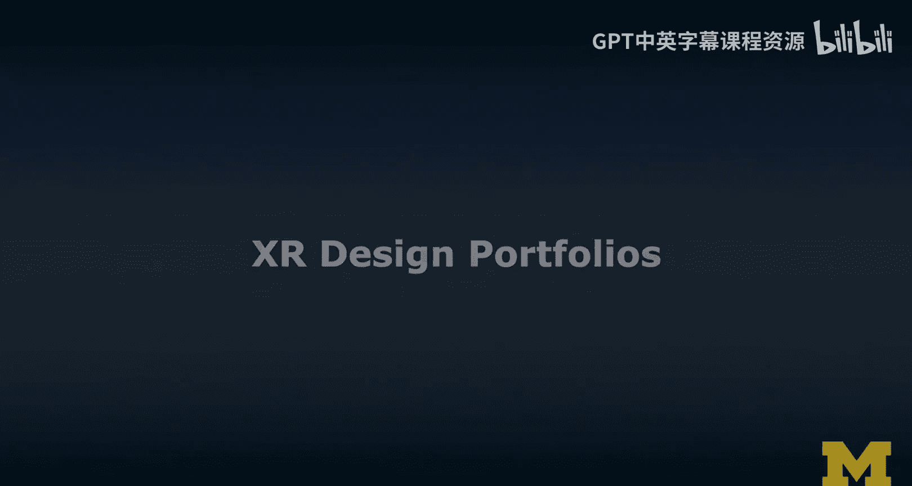
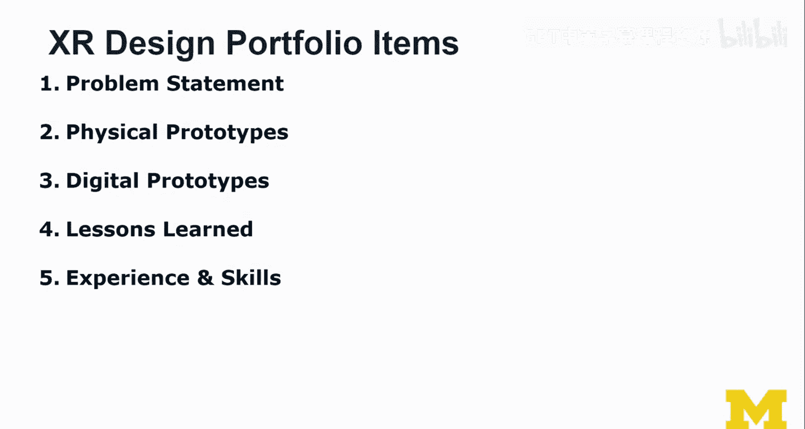
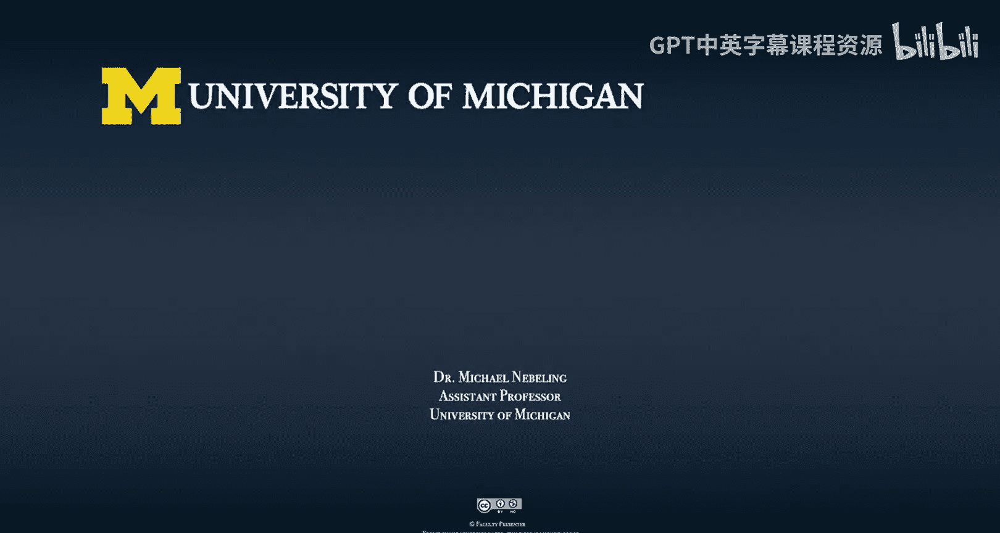

# 密歇根大学《面向所有人的扩展现实（介绍⧸设计⧸开发）｜Extended Reality for Everybody Specialization》中英字幕 p78 41_XR设计作品集构建第一部分.zh_en -BV1jM4m1k73q_p78-

In this video we're going to talk about creating your XR design portfolio now if you've taken the course and especially worked on some of the honest content。

 you've actually more or less completed a project step by step by following all the assignments。

Now the cool thing about that is that this is really an important byproduct of this course I mean。

 obviously this project helps you learn about the methods and tools because you practice them but also it might actually be something cool that you can add to your CV and the question is what's the best way to build this portfolio and Xr design portfolio and so this is what this video is about I want to give you a few tips obviously I've worked with a lot of students and in my courses I usually actually make it an assignment and exercise to build out that portfolio and I think it's always a good idea after every project to go through some of these steps and really properly documented now the one thing I want to say before we get started it is very important that even throughout the project you do a really really good job documenting everything and taking pictures and kind of like writing already some of these materials that I'll tell you about this should not happen at。

And because at the end， it's often too late， often you don't have access to all the prototypes anymore and you'll be very sad when something is missing。

 And so really， with this view towards building a portfolio。

 keep this always in mind even as you're working on your projects。 But now let's get started。

So an X design portfolio starts from the problem。We talked a lot about finding good problems。

 ideation and problem framing and scoping， which are really， really important things to do。

 Otherwise we're taking on something too big， too challenging or。

Actually not clear enough as a problem， so you want to be very clear about the problem。

So then we actually need to describe our method or methods that we use throughout。

Most of you will probably have followed the methods that I taught in this course here。

 and so this is a more traditional interaction design method but applied or adapted for XR。

And then also you should discuss your results you show off what you've done and you document the design evolution。

 so not just the final thing， but also the intermediary steps， your design concept。

 initially your personas， storyboards， all those are design artifacts， so not just the prototypes。

 not just the final prototype， really， really important to keep in mind。

And now it's very important to connect these three things with a story。

That story has to be clear from the beginning to the end。

 there has to be a red thread through your design portfolio Now that story is easier to do if it's just for one project and it's harder to tell if you're trying to describe multiple projects you've worked on as part of your portfolio Now this is just something that I can tell you based on the experience of working with students now I did not have to apply for a lot of jobs in the X industry I'm still a professor here at the University of Michigan but I do work with a lot of people that want to recruit in fact。

 several of my students have now land a job and that makes me really proud of them obviously that's really cool and I think it is important that you take these application processes really。

 really seriously and that you try to do the best job you can when putting together your portfolio So what are the key components these are the five key components。

A problem statement。This has to be concise， it has to be clear， it has to feel important。

 I'll tell you more about it。Physical prototypes， you should really include those physical prototypes because that's what you have done essentially as part of your project。

 physical prototypes are really cool because they think without technological constraints。

 this is where you can demonstrate that you can think outside the box。

 which is really really important， be creative。And then digital prototypes are much more about showing that you master these technologies。

 that you can use the digital prototyping tools or tools like WebExR， and then maybe aframe。

And unity and unreal。 but this is really what you want to demonstrate here and then every project and a portfolio really has to translate to some lessons learned and some experience and skills gained and I would spell those out really it's important to say explicitly what you have learned both about the problem and then the prototypes that you have created and the project and like you obviously as a designer how you have grown that is something you should really。

 really tell in this last part So I'll go over each of these parts now。

 and you know provide more detail for each of them。😊，So in the problem statement。

I think it's very important that you say it's a significant。

Design problem so when it comes to the problem statement。

 it's very important that you have a design problem that you're talking about。

 not an information problem， so the problem shouldn't be like what's the best way to find and compile that information the problem needs to be a significant design problem。

 what's the best way to design this interaction okay so I'll just say it like that and if you run into this issue of not knowing what kind of information needs to go into your interface。

Then you're not working on a design problem， you're working on an information problem。

 and that kind of information dashboard problem is not always a good problem to talk about in these kinds of design portfolios。

So you really need to be clear about the strings of XR and X here is really the placeholder because you need to be more specific。

 so why did you use AR or why did you use VR， what did you learn about AR and VR for this problem why do you think it is a good solution what makes you choose AR or VR for this solution and for problems where both an AR of VR solution seems feasible and you probably just did one of them you should really explain why you chose the AR of VR version of it？

Maybe a lot of things were already explored in VR， and you just wanted to see how much is possible in AR。

 or maybe you have a different reason， but it's important that you actually state it。

Next when it comes to the physical prototypes， it's very important that you highlight the advanced use of paper prototyping a lot of people want to see that you think outside the box。

 they want to look at these physical prototypes， they want to get a sense for a larger design concept that raises all kinds of interesting issues in digital prototyping。

 we usually make a lot of compromises because of the technologies and other kinds of concerns like budget time and money。

But when it comes to physical prototyping， you can do whatever。

 this is really the place where you can live out your creativity and you should show it。😊。

And I want to emphasize here that from the physical prototypes it should be clear that you are designing for an AR of your environment。

 I actually want to see that now often this is accomplished to some kind of color coding where I can see the physical vote。

 mostly black and then the augmented boat， some kind of blue green or red or something so this is often done to tell the story already in the storyboards and then obviously also in the physical prototypes again as a reminder when I say storyboards。

 I mean the wireframes that actually form the foundation of what becomes a paper prototype or a physical prototype later I' when I say physical prototype I often think of this idea of bringing in additional media like transparency for AR and then clay for 3D modeling and those kinds of things。

And don't be afraid of just doing these methods that I teach here and just doing them well。

 that is already a really good accomplishment not everybody uses the methods here。

 and so I think this already should give you a little bit of an edge when it comes to portfolios。

Be clear about AR VR prototyping differences。 So that's something that I think we learn more the more prototypes we do。

 but some things are just easier to prototype for VR and some things are easier to prototype for AR so for example。

 because VR usually requires an entire environment unless you are in an environment that is close to it。

 it's often a little harder and the same is actually true with AR but sometimes you can simulate it better and AR maybe the actual 360 or the Skybox around the user doesn't matter as much and's more like how the interactions relate to the physical world and then AR prototyping AR physically actually can become easier。

 and then when you move to digital， actually prototyping AR is harder。

 I find those differences is very interesting。 Now this is not always true for every project that I've worked on and it may also be different for different kinds of tools that they're using。

But this is more or less a takeaway from my past few years of prototyping AR and VR experiences。

Next digital prototypes so let's talk about digital prototypes when talking about digital prototypes it's often hard to know how to get started so often we tell this story from the physical prototypes and how our designs evolved into the digital prototypes and then we kind of like get lost sometimes in some of the details we don't really do a good job explaining the strengths and the weaknesses of our digital prototypes。

😊，So the best way I think to structure presentation of a digital prototype is to just break it down in terms of the key interactions that you've prototyped。

 So be clear about the interactions you chose to prototype there might be many more things but you chose to prototype those three key interactions。

 For example， everybody knows there's a login screen and you did not prototype the login screen first of all。

 because Michael would yell at you because that's what you really don't do because we prototype the things we don't know so much about。

 you prototype the unknowns so that we learn more about it。

 That's what I told you and that's this message message that you should carry on and tell the other person as well。

Explain why you chose each tool and what for。That's really important So in digital prototyping there's a lot of tools involved usually not just unity or not just like one type of tools it's often some kind of patchwork process between these tools。

 some kind of workflow that is a little messy but that's just how it is and and so it's important to demonstrate that you know the tools and that you understand their role and their relevance in the larger process and that's what you should talk about。

😊，Obviously， there's often an opportunity to connect with somebody who has experience sharing the same pain points with an existing tool。

 so that could be a good opportunity as well to share some of these experiences。It's also very。

 very important to talk about the limitations of the tools and how you dealt with them。

 so every tool has a seating， we talked about that。😊，And so it's important if you felt that seating。

 then it's important there often very creative solutions around it。

 and I would stress and emphasize those when it comes to emphasizing your skills with the tools。

 I think that's a really a good approach。So now we have talked about the problem。

 we have explored the problem more through physical prototyping and then we are nearing our solution with a digital prototype after the digital prototype could be an actual development with some AR devices。

 platforms and tools out there， but I'll just leave it here because。😊。

At this point in the course you would have concluded the course and so you should talk about your lessons learned and I think just from all that knowledge that you've gathered by building on your prototypes and doing the ideation and the problem framing。

 you've learned a lot and there's a lot to talk about so you can now already talk about the lessons learned。

For example， what was hard， easy or surprising to you I would stress those things。

Especially the surprising part。But make sure that the surprising part to you is not straightforward to anybody else。

So for example， that prototyping VR or AR is hard with paper and that this is surprising to you。

 okay that's fine， it' the first time you do it maybe that's fine。

 but there should be something more specific to your project that you found surprising or hard to do if something was easy I wouldn't emphasize it as much。

 it's just much more interesting to talk about the challenges。And again， something surprising。

 if it's truly surprising， can actually be a really。

 really cool part of the story to tell in your portfolio。😊。

You should really also talk about what worked well and didn't work well in your team assuming that you've worked in a team。

 I think talking about those experiences， working collaboratively on projects are very interesting a lot of students come to my office hours to talk about issues and challenges they face with the team and I usually encourage them and tell them you know what this is good that this happened because now you have something to talk about an interview because you need to get out of this you need to actually work with your team and so then you have a story to tell and that's what you should focus on so all these challenges that you face throughout the project the really really important things to talk about so keep that in mind。

😊，Finally， this is something that an interviewer or professor usually ask at the end of a master thesis or Bchelor thesis or some kind of research project。

 so if you could do it all over again， what would you do differently？😊，And。

And that's an interesting question。Because often you know better later。

 And so in retrospect or in hindsight， maybe you could have done things differently。

 And so it's very interesting to consider that。 And at least have this。Ppped。

 even if you don't make it part of your portfolio， it might still be a question that comes up in an interview。

 so think about it。Finally， we're talking about the experience and skills。 So the experience here。

 I mean your experience， how you have gained more experience from doing this project。😊。

And you should emphasize again any kind of advanced usage of techniques。

 I encourage you to even talk about just the physical prototyping techniques that we've learned in the course here because I do think they are actually still innovative。

 they are not standard， they are not straightforward and they are still improving and evolving。

 so yes。😊，Describe what you've learned from practicing these methods and applying these techniques。

Also， what I often find very interesting is when a student that has previously done projects in interaction design or graphic design and they have very sophisticated skills and really popular tools out there like Photoshop。

 sketch or envision and Figma and XD and all these prototyping tools out there。

 if they still exist by the time of this recording。

 well these are popular prototyping tools and they are not actually designed for AR or V are at least not at this stage。

 so if you can demonstrate how you have used those tools to support your innovative prototyping。

 I think that is really cool So for example， when it comes to 360 templates and 360 paper prototyping theres also there is the grid。

 the VR grid and there is actually there are articles that tell you how to use Photoshop。

 and so I think that's a really good way to demonstrate how you transition and how you transform some of these tools。

 how you adapt your own。😊，Knowledge and your own methods to X R。

 So this ability to transform your own way of working， I think that is super powerful。

 if you can demonstrate that。And finally， when it comes to AR of VR specific tools。

 so I mean both interaction design tools like pro toIO that are starting to incorporate some support for ARVR。

 and then more AR focused tools like Facebook's， Spark AR Studio or Snapchas， lens Studio。

 and then obviously really like broader platforms like WebExR， unity and even unreal。

 so if you've used any of these tools as part of your projects you should really。

 really emphasize what kinds of things you've learned with these tools and how you've grown your skills in these tools。

 very important。These are the items that go into the portfolio And in the next video。

 I'm going to tell you more about how I would actually tell the story。

 So these are the main ingredients that go into a portfolio， but not necessarily in this order。 Also。

 when you do multiple projects， you don't actually have to do it in the order in which you have done the projects。

 Now you should choose the order that best fits the story。

 And so we're going to talk a little bit about how to present a portfolio。

 how to present the project in the next video。😊。

