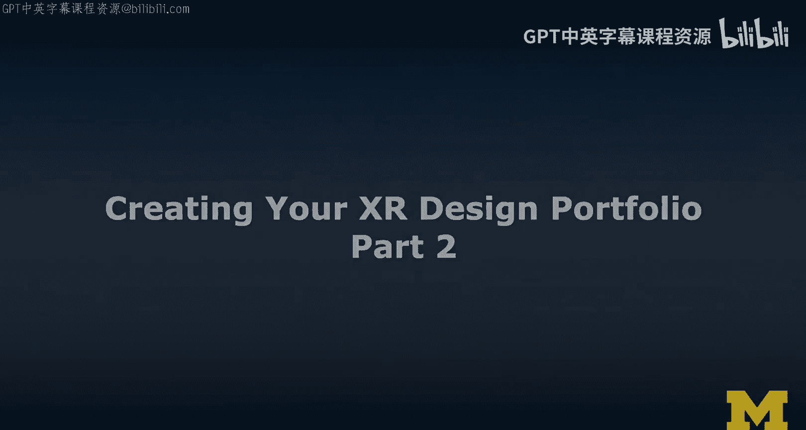
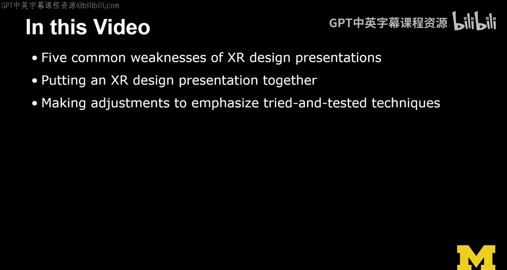
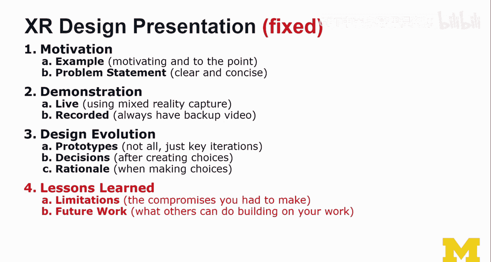
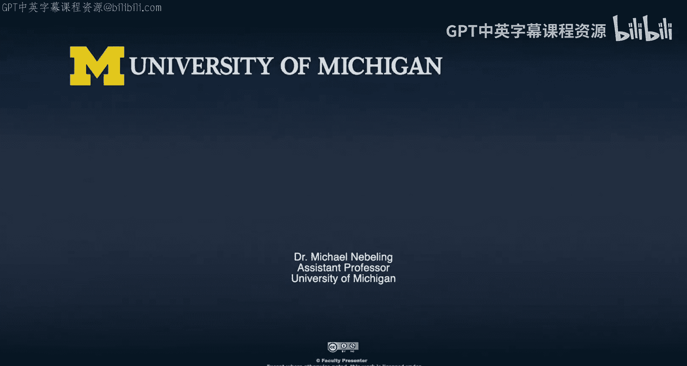

# 密歇根大学《面向所有人的扩展现实（介绍⧸设计⧸开发）｜Extended Reality for Everybody Specialization》中英字幕 p79 42_XR设计作品集构建第二部分.zh_en -BV1jM4m1k73q_p79-

So in this video we're going to talk about five common weaknesses of Ex design presentations Now as a professor I see a lot of presentations and here are a few tips and things that I think we should change and improve and then we're going to go through that effort together we're going to put together an Ex design presentation first we're going to use a normal structure maybe the one that immediately comes to mind and then we're going to make adjustments to emphasize try and test the techniques and this is really to emphasize my approach you don't have to do it exactly like me but I have had some good success in terms of presentations and coaching students that way I think their presentations were very well received and I was very proud of them so that's at least something。

😊。

In this video， we're going to first talk about the trouble with XR design presentations。Now。

 as I said， I see a lot of presentations all the time。

 obviously as a researcher and as an instructor， we do a lot of XR projects。

 I participate in a lot of research and I see a lot of presentations and new projects and you know please invest into this idea kind of thing。

And so yeah， I feel like there are these five common things that I always find not annoying but like so repetitive。

 I don't know who teaches it to do it this way it is it our intuition that tells us to do it this way Well we'll figured it out and I make a few adjustments here and there and let's see。

 I encourage you to incorporate those into your own practice。😊，And try it out。

 you know it could be a transition from the kinds of things that you're used to to a little bit a little bit different。

 And so let's look at it together。 So here we go。 Allright。

 so the trouble with extra design presentations on the left。

 I'll start out with the issues that I see often the slides are designed to support the presenter which makes sense right。

 you feel like I need to remember all those things So you you create slides to support you as a presenter Now this is both you presenting a design project。

 but also you presenting a research project。 I've seen this a lot。

 and all the time the slides are well designed to support the presenter to help them remember。

 but not the audience and so I'm going to talk about that in a second。😊，Not really framing the work。

 You're not really telling me what the problem is。 I really need to know what the problem is。

 I thought we talked about ideation and problem framing。

 So really motivate the work and frame it and scope it properly and tell me what it is about。

 a very concise problem statement at the beginning。Demo last， yeah， a lot of these presentations。

 they come I mean， if they're well done， they have a really nice story and they go on forever and they prepare us to finally in the last slide before we wrap up。

 we finally get to see the work。😊，The demo last approach。Very unfortunate。

 but so commonly done so maybe we can do it differently。When we talk about implementation。

 we focus on the technical solutions like oh， we used Webex R and aframe。

 and I used this in that package and unity。 And that was really what solved it。 fine。

 but solved what， What is the problem， What were the challenges And now it's starting to make sense。

And then there is this section usually in presentations， which is called future work。

 And when I see those presentations， they often read like future things I have to fix。

 So future things I didn't get to implement future things I didn't get to do future things I still have to do implement design whatnot。

 but that's not future work。 it's not about your future work。 So here are my suggestions。

 Okay first of all， we do the slides， and we design them to support the presentation。

 especially the audience， not just the presenter。 make it visual， not just bullet points。 I mean。

 this is a really bad slide as an example， but you know I need to get across the message here。😊。

And then not really framing the work， well， how about st the problem using an example and choosing an example that a lot of people can relate to。

 something simple， not too complex， and it'll be crystal clear。😊，Instead of demo last。

 try the demo first， really， like after a little bit of problem description， here is our demo。

 and then I'll tell you how we did it。 This is a really refreshing way to actually approach a design presentation。

 so don't leave the demo until the end。 Don't make me wait for it。😊。

Implementation focused on design challenges， compromises。

 I think is a much better way to do it than here is the few technologies we chose。

 and we don't tell you why we don't tell you about the challenges。

 We don't tell you how we had to make those compromises。

 So structure your implementation around that， not just like the buzzwords and all the tech。

 but really why， why did you implement those kinds of things the way you did。Finally。

 instead of future work， Aka things I have to do things I have to fix。

 how about thinking about it this way， future work as in like future research and design that others could do building on this knowledge。

 So you're telling others how to take this work further that is really important It it quite a difference。

 And so you should you should think about it this way。

 So this was really important to me and now you're going to make a little bit more actionable by actually looking at how to well fix the standard presentation format that I always get to see as the first draft。

😊，And so here we go。 Xr design presentation。 Okay， we have an intro。

 we talk about our physical prototypes， digital prototypes， maybe we do a demo almost last。

 as I said right， and then we summarize we provide a conclusion or something like that。😊，Yeah。

 pretty common。 pretty standard。 Okay， so what goes into the introduction。 Yeah。

 how about you make it in motivation， Okay， so you make it a motivation and you using an example。

 and that example is designed to motivate the problem and actually it needs to be to the point like it needs to be very clear。

 you need to prep the problem statement。 The problem statement needs to be clear and concise。

 and you might even write it out， our problem is and then text something short。

 not really long not the norm Ipsom learn， but a short concise statement， that would be great。

 So instead of the physical prototypes， digital prototypes， and then the demonstration。

 we are going to do the demonstration next right after the motivation。

 I've just motivated the problem。 and here is what we have done And now what would be super cool is if you gave a live demo run that thing maybe using mixed reality capture so that other people can see better what's going on in the will in the。

😊，Vrtual world around you as you're like stepping into this virtual world。

If you don't know exactly what mixed reality capture as well very briefly it's like basically a view on you from the outside。

 but we can see how the virtual reality or augmented reality content actually relates to you。

 we basically see it from the perspective of the camera where we see both you and the virtual content around you very cool way to capture this kind of things and we have done this in the what is XR lecture in the very first course in the very first week。

😊，And I've used these techniques throughout the MOC。

 and so maybe you thought this was actually pretty cool， turns out it's not too hard to do。Okay。

 your backup is a recorded presentation。 And you should always have that backup。 It's very important。

 have a backup。 Okay， and have it recorded。 So on the day when usually everything goes wrong on the day of the demonstration。

 and you're trying to do this live demo is something goes wrong。 if you' like anything like me。

 you probably get a little nervous and maybe even angry at yourself and that's not good。

 So you have to have that knowledge， that comfort that you have this backup video。

 this backup recording and then you just use it to switch it and you just use it and you switch to it and you don't apologize too often。

 this is more like a note to self because I keep apologizing all the time。

 But it's not a good use of your time。 Okay， so instead of physical prototypes and virtual prototypes。

 you structure this around design evolution because that's why we did those prototypes。

 Okay and then you talk about the prototypes， but only you select few， just a key iterations。

 the most important ones。 not like。What I see lot in presentations is like people are trying to tell me how much work they did。

 So they're showing me all the prototypes they've done and it's definitely impressive。 It's cool。

 all the sketches and blah， but it's really difficult to follow and actually extract really how did this thing progress。

 How did the design evolve。 And so it's very important to structure your presentation around the select few prototypes and then really spell out the decisions So the creating so you know you do the prototypes to create choices And then you make choices。

 And as you're making those choices， you need to provide a good design rationale for those choices and those are the three key things that I want to see the prototypes。

 the decisions。😊，And the rationale， very important。And now we have done motivation， demonstration。

 design， evolution， and then we're going to do the summary。

 And now onto the last part instead of summary， focus on the lessons learned。

 really how you have grown， right， we've just discussed all the things that go into the design portfolio。

 And I said lessons learned and skills and those things are really important。

 You need to spell it out。 So this is where this goes。 lessons learned。

 and then the limitations So the compromises you had to make and basically the assumptions you decided to make and the limitations that result from this。

 And then comes the really key part。 future work。 And again。

 future work is not like things you have to do in the future。 No。

 what can others do building on the knowledge of your work。

 That is you're basically telling me what I can do with the knowledge。

 What could others do in the future or what might you do in the future， I mean， that's fine。

 But the most important thing is don't talk about all the little things you need to fix to make it better。

 That doesn't help anybody right。😊。

So you're so deep down in your project and I understand how this happens， you just finished it。

 you're excited to give this presentation， you didn't have enough time to actually zoom out。

 but as part of the presentation， that project presentation。

 you really have to zoom out and you have to tell us this bigger story。😊，And。

And then there might be a questions part in your presentation and the way you navigate the questions and how you're demonstrating this ability to go down into the detail。

 picking this design rationale， bringing it up maybe even questioning it itself considering the other idea that the person that critiqued you had and then not being too defensive but like embracing that idea and providing an opinion about that idea。

 maybe suggesting another issue， while that idea sounds really cool and I admit we haven't looked at it。

 there could be these other problems coming from this because in my experience。

 what I've learned from this project。😊，We had this problem and sorry， I forgot to tell you this。

 No you don't do this sorry。 we don't apologize。 we don't do， we don't we don't apologize。

 okay now we should have all the things we need to do really cool design and then also tell the story about those designs Okay so good luck if you're using the materials from this course。

 especially if you're doing the honest track stuff。

 So I think there should be a lot of little things that you can add to your portfolio and now combined with this lecture。

 you also can use it as a guideline or a set of guidelines to give a nice little presentation about it。

And let me know how it goes， so I'm always eager to hear how it's going with my students。

