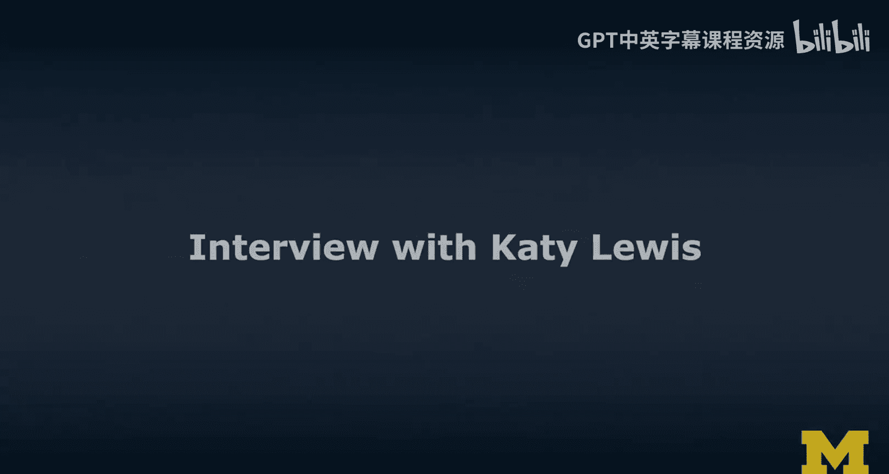
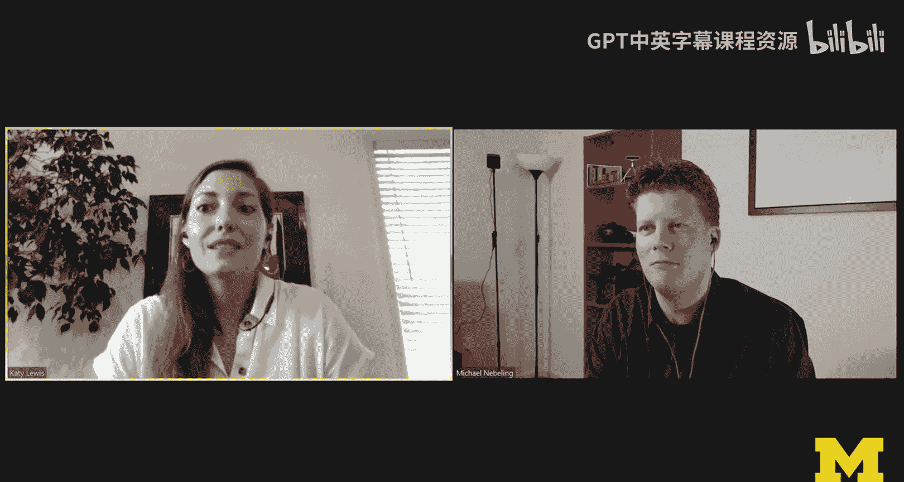
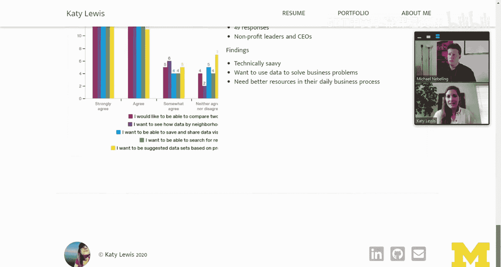
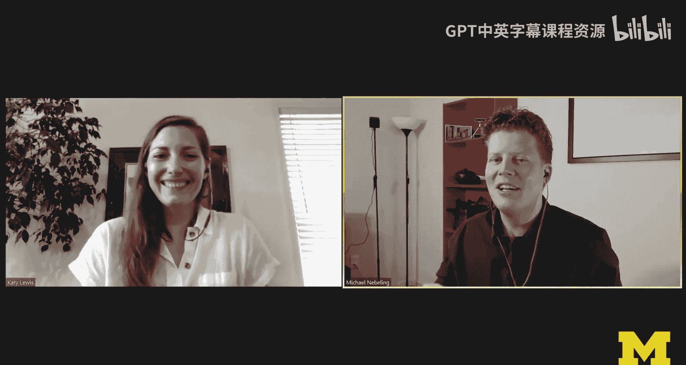
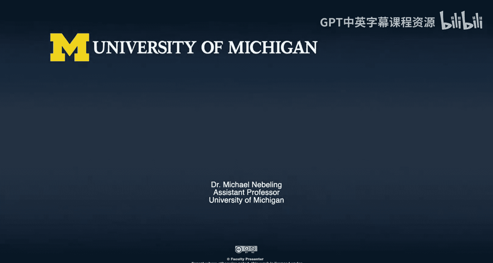
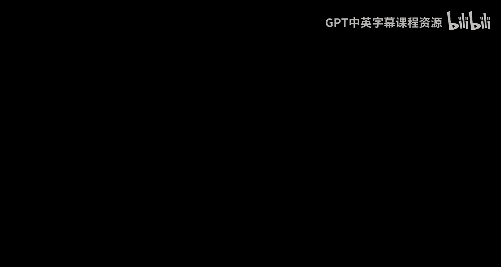

# 扩展现实设计：第43章：设计作品集访谈与经验分享

在本节课中，我们将通过密歇根大学Michael Nebeling教授与校友Katy Lewis的访谈，学习如何构建一个出色的设计作品集，并了解如何将学术经验成功转化为职场优势。Katy将分享她作为设计师的独特背景、作品集构建策略以及求职面试经验。

## 访谈背景介绍

Michael教授邀请了他实验室的前成员Katy Lewis进行对话。Katy曾与Michael共事两年，是一名优秀的学生，现已毕业并在IBM担任用户体验设计师。本次访谈将聚焦于设计作品集以及在扩展现实领域工作的经验。

## Katy的背景与职业路径

上一节我们介绍了访谈的背景，本节中我们来看看Katy独特的职业发展路径。她的背景并非传统的计算机科学路线。

Katy拥有美术学士学位，主修绘画和版画。毕业后，她以纯艺术家的身份开始职业生涯，并逐渐转向数字创作领域，涉及界面和网站设计。在这个过程中，她偶然发现了人机交互领域，并爱上了运用心理学通过技术创造有趣体验的理念。尽管已拥有十年实践经验，她仍决定重返研究生院，系统学习人机交互的原理，以夯实理论基础。

在密歇根大学期间，Katy与Michael教授合作完成了多个研究项目和一篇硕士论文，并选修了以开发为导向的课程。她将自己定义为一名**设计师**，但认为**开发技能**对于构思概念和创建功能性原型来展示想法非常有帮助。她形容自己是“一个会使用所有能接触到的工具的设计师”。

## 作品集的设计策略与项目选择

了解了Katy的背景后，我们来看看她如何构建自己的作品集。作品集是设计师展示技能和经验的关键工具。

Katy在构建作品集时，主要目标是展示她在三个核心领域的技能：**扩展现实**、**用户体验设计**和**开发**。她特意选择了能体现这些不同学科能力的项目。

以下是Katy选择项目时的核心考量：

1.  **聚焦目标领域**：在求职期间，她希望进入XR领域工作，因此作品集重点展示了她在AR和VR方面的构思经验。
2.  **展示核心技能**：她同时希望展示扎实的UX设计技能，并说明如何将这些技能转化应用到XR空间。
3.  **代表性**：她主要选取了研究生期间的项目，因为这些项目所使用的研究方法、设计语言和开发能力与求职市场的标准更为契合，能更好地“讲述故事”。

## 深度解析：AR厨房展厅项目

在众多项目中，Katy重点介绍了她的“AR厨房展厅”项目。这个项目完美地体现了从构思到原型开发的完整设计流程。

该项目源于一家厨房制造商的需求，他们希望创建一个利用AR和VR技术的展厅体验。Katy的团队针对这个需求空间构思了多个概念。

以下是该项目的关键步骤：

1.  **初期构思与草图**：团队从大量草图开始，探索各种可能性。
2.  **纸质原型与快速迭代**：他们利用纸板等材料在实验室模拟厨房展厅，并运用纸质原型技能快速迭代了大量想法，以确定理想的交互界面。
3.  **数字原型开发**：团队最终确定了方向：为展厅主持人开发一个控制器，用于为客户操作和定制厨房橱柜的投影。他们为此开发了四个不同的原型：
    *   **VR版本**：提供橱柜的360度视图。
    *   **AR版本**：在真实空间中展示橱柜。
    *   **投影AR体验**：探索投影式增强现实。
    *   **定制显示原型**：一个实验性的全息显示概念。

在作品集中，Katy通过醒目的截图、照片和简洁的文字描述了项目背景、团队角色、所用工具以及获得的技能。这个项目综合展示了**创造性思维**、**从低保真到高保真的原型制作**、**开发能力**以及向高层利益相关者展示成果的经验，因此在面试中经常被提及。

## 另一个案例：Together Chicago 地图界面项目

除了XR项目，展示扎实的传统UX技能也同样重要。Katy的作品集中包含了“Together Chicago”项目。

这是一个与密歇根大学工程学院团队合作的传统用户体验研究与开发项目。非营利组织“Together Chicago”希望开发一个地图界面，帮助连接芝加哥居民与各类非营利资源。

以下是该项目的工作流程：

1.  **从低保真开始**：团队从低保真原型入手，进行了多轮设计。
2.  **迭代与测试**：他们开发了不同保真度的原型，并持续进行用户测试，收集了大量数据。
3.  **基于反馈优化**：团队根据测试结果和用户反馈，对界面进行反复迭代和改进。

通过这个项目，Katy不仅展示了开发能力，更重要的是体现了在已开发界面上进行**迭代、测试和优化**的核心用户体验研究能力。

## 作品集在求职面试中的作用

拥有一个结构清晰的作品集后，如何将其有效用于求职面试呢？Katy分享了她的经验。

她认为，作品集是个人故事的视觉化呈现。精心准备作品集的过程，能帮助自己梳理和定义这些“故事”。当进入面试环节时，就能更从容、深入地讨论项目细节，包括成功之处和遇到的挑战。作品集让面试官有一个直观的参考，也让自己在面试压力下能更流畅地表达。

## 从学校到职场：XR技能的持续发展

成功入职后，如何保持并发展对XR的兴趣呢？Katy在IBM的实践提供了一个很好的范例。

虽然她目前的UX设计师职位并非专门从事XR工作，但她通过共同创立“IBM Reality Lab”找到了平衡点。这是一个内部的兴趣小组，类似于俱乐部，成员们定期交流XR话题、进行开发演示。通过这种方式，她不仅在工作之余延续了热情，还为自己创造了参与公司内其他XR项目的机会。

## 总结与给学习者的建议

本节课中，我们一起学习了Katy Lewis关于构建设计作品集和职业发展的宝贵经验。

回顾整个访谈，Katy的作品集策略核心在于：**有目的地选择能讲述完整故事、展示多元技能的项目**，并注重视觉化呈现。她的经历表明，坚实的UX基础与前沿的XR探索可以相辅相成。

最后，Katy给所有学习者的建议是：充分利用当前丰富的在线资源（例如本课程），尽可能多地学习。**自主学习新技能的能力**对于任何雇主来说都是极具吸引力的特质。积极探索并深入钻研你感兴趣的新技术，这是迈向成功的第一步。

---
**内容来源**：密歇根大学《面向所有人的扩展现实》专项课程，访谈章节：Katy Lewis。