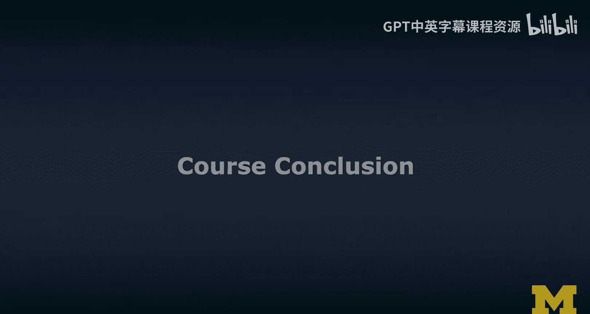
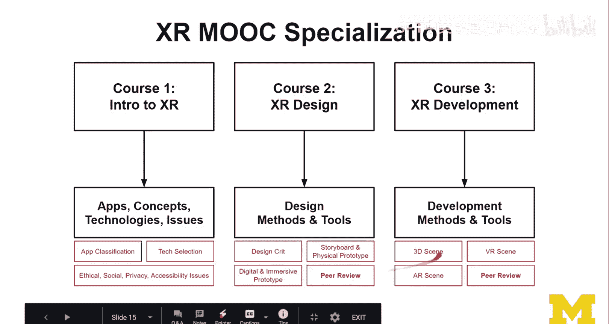
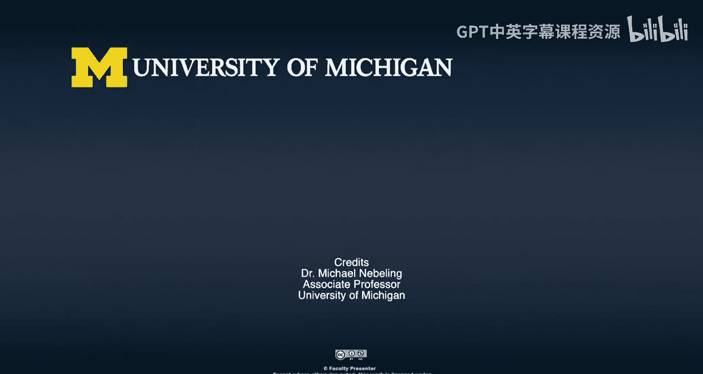

# 密歇根大学《面向所有人的扩展现实（介绍⧸设计⧸开发）｜Extended Reality for Everybody Specialization》中英字幕 p81 44_课程总结.zh_en -BV1jM4m1k73q_p81-

Congratulations， you've reached the end of the course。

 the second course as part of the XMOC the course focused on design and well I hope you've enjoyed it。

 I feel like we've covered a lot of ground and I hope you feel like you've learned something。😊。

So let's review a little bit of what this course was about and what should be the main takeaways。

So well we started out with this overview and you have probably finished the four quizzes to assess your learning。

 the first quiz focused on some of the doing XR involves and how to get started and Excel process questions so I hope you finished some of the quizzes and learned a lot through doing the quizzes as well but in terms of topics we've covered what doing XR involves how to get started and finding your X process and then we've。

coverovered quite a bit on design thinking， so really starting out with the original method and then adapting it to XR and then thinking about all the issues around design ethics。

 design guidelines that we did design critiques。And we also talked about design jams as a way of collaboratively solving problems through participatory or code design with various stakeholders。

And so that's like here， and that was only the first half of the course and then we focused the second half of the course on physical and digital prototyping and so we started with storyboarding first then created paper。

 then physical pros， and we went into digital prototyping tools for AR and forVR and also talked about immersive prototyping actually using AI and VR for prototyping。

So。Quieite a lot of stuff and so with those methods and tools in your toolbox。

You should feel equipped for X design we haven't talked so much about the actual development or programming with these technologies but we have really well set our minds so that we can actually think about designing and actually doing the heavy lifting in terms of prototyping already testing with users to some extent and then prototyping both physically and digitally and so that is really an important part of the process that is not the entire X process we obviously still need to implement things and that's where the other courses connect to this course but before I get to that let's quickly review obviously that was the honests track maybe you chose it and that means you have completed all these。

Exercises here and these are important assignments。From a design critique。

 looking at both the guidelines and the ethics of XR， and then storyboarding， your paper prototype。

 your digital prototype， and then also if you had the opportunity to do an immersive prototype，Again。

 as a reminder， immersive prototype means you're using actually AR and VR technologies and why you're designing and so it's concurrent design and testing as opposed to what happens a lot in development is like your programming against these technologies but on your computer usually desktop PC and then you deploy and I'll also tell you how to rapidly preview things。

 how to do quick deploys and how to even avoid this by building on web technologies in some of the other courses as part of the XMOC。

So let us review a little bit of what I think should be the key takeaways from this course。

So if you remember I started out with making an analogy to filmmaking。

 talked about these various roles here on the left， director of photography。

 made the point is actually the person in charge of the camera as the XI user talked about various aspects of design and who are the people involved and then went into some of the more difficult topics where I think when it comes to creating new kinds of interactions we still need to rely on developers and people who are okay with programming because what you can do in existing tools is pretty limited。

In existing prototyping tool I mean。Because what you can do in existing prototyping tools is so far pretty limited。

We talked about these different paths to being an Excel creator。

 basically depending on your background， whether you are into web game or mobile development。

 you should have an easier or more direct path and then if you are on the mobile development side you can also continue developing against and if you have a mobile development background。

 you can continue developing natively against the。Android and iOS， SDKs。

 but then also pick up specific AR versions， AR Ki and A core for Apple and Google， so for Apple。

 for iOS and Android。Can develop for AirK and Air core so for iOS and Android。

 and then can also develop natively against some of the virtual reality toolkits。

And then we also have some kind of cross platform approach through Unity Unreal。

 we talked about that， which I think speaks relatively nicely to game developers and then also mobile developers who are used to doing cross platform development through phone Gap and things like that。

And then the web and the role of the web， which I think is going to be even more in the next few years。

 but for now we have a basic stack and set of things we can do in browsers and we are relatively well equipped on the VR side and we are getting better on the AR side as well。

And then I talked a lot about process。Need finding， brainstorming， storyboarding and prototyping。

 and then we talked about development and testing， but we didn't cover that much in this course。

 but of it's still part of the overall process and together with deployment and analytics that's something that well expand more in the third course as part of the XMOC。

So the process was really actually one of the most important things for me to take away from this course。

 we obviously we were looking a lot into different kinds of methods for design and then also tools。

But what is important is that you put the picture together the puzzle pieces fit into a larger process Now that process is relatively standard。

 it's just an expansion from interaction design so it's standard if it used to user experience interaction design but some of the methods actually need to change and adapt which has to do with the fact that traditional need findinging methods for example。

 don't really work because we don't actually have a lot of XR users at this state and we don't have a lot of problems directly in XR we are more like figuring out which of these problems that we know from the world could actually benefit from the solution in XR and that requires a slightly different approach and so we talked a lot about that。

We also spend time covering design thinking so going through the six step method， empathize。

 define IDA prototype test and implement， so we covered all that and again I highlighted some of the things if you remember from this lecture that we cannot directly expect and translate so because XR is different we to think about。

XR and design thinking for XR also a little bit differently。

We talked about ethics which I think was very， very important and I tried to share a few techniques here and an approach a design ethics review of XR applications。

 we did this in a scenariobased way， we looked at issues such as the context and situation。

 the sensory information and data that is being collected and processed。

 actually then the processing pipeline which I think is really important to consider。

 and then also once you have collected the data， how do you communicate first of all and get the informed consent but then also how do you maintain and even future use of this data as a very。

 very important topic so we talked about all these kinds of ethical considerations。

The one thing I want to say here is that this ethics topic is still evolving。

 it's very important and not enough people actually embrace it in their approach and so for me it was very important that we get this right into the design course that we don't have it like a future issue or some I don't know issue afterthought now it has to be incorporated somehow now when you teach this stuff it's difficult to do both the ethical staff and the guidelines and then learning about the methods in the tools and you know elevating the ethics and the ethic standards but I hope that having a dedicated lecture relatively early in this course。

 raised at least your awareness and encourage you to think about this more and while we will see what happens in the projects I'll keep monitoring keep taking a look I'm curious what kinds of projects you are designing as part of the honest track to which extent we raise interesting ethical issue。

We are in this together， we are figuring this out together so even if we make a mistake well we can still learn from it so that is really really important。

 and then I covered another important topic to me， which is ideation because XR is really the space where we seem to be trying out a lot of things and not always in a very progressive way So I try to cover seven techniques to help you innovate I talked about I drew parallels from research I talked about for example。

 that everything has to start from an idea and that even the prototyping out of that idea that helps you better understand the problem normally probably you think about prototyping as learning more about the solution but that's only partially true it's true but really prototyping to better understand the problem because you can try out these pros with users and obviously this is already you already starting in the design process so we looked at all these seven techniques ideate implement inspect iterate a design cycle you know only kill app problem and you know novelty。

Versus creativity， they're not the same and I talked about this quite a bit。

 the problem promise premise approach， emphasizing obviously the promise of Xile technologies and then also the assumptions that making。

😊，One that is more inspired from research， but I think it helps this idea of writing the intro first。

Like before you write the rest of the paper， before you do the rest of your project。

 figure out what this project is about， what your contribution is and that way you get to motivate the problem better and understand the problem better as well we did talk about the idea hexagon that's really something from Rammish Reska that came out of one of his talks。

And I really like it and I wanted to cover it here because I do think it's a cool idea to think about how to take existing ideas further as I said everything starts from an idea and then we talked a little bit more about some of the more interaction design oriented object control design matrix。

 this idea of rapidly brainstorming different kinds of ideas around objects and how to control them we did the snow boots example or the ice scrapper that can be shaken example for example so here we had really from the obscure to the really futuristic kinds of ideas that can come out that way and I think it's an interesting way to innovate。

And finally we also talked about threshold and seating and tool design because a lot of us are thinking about creating tools in the X space and so I think it helps actually to have some metrics。

 you know talking about the threshold， the barrier to entry and then the ceiling。

 what you can accomplish with that tool which I think you really want to set these nicely and not everything should be like unity or unreal。

 which actually both have relatively high barriers to entry。

 which will haven't explored so much in this course。

 but that's what the third course focused on development is really dedicated to so you'll feel the pain that's what I usually see。

All right， and throughout this course， I heavily emphasized storyboarding and prototyping。

 so a lot of storyboarding and wire framing， physical prototypes， and digital prototypes。

And then I drew out these different quadrants and how do we actually increase the fidelity so increasing fidelity and which of these methods are easy and which of these methods are hard and this for storyboarding but I talked about traditional paper based storyboards。

 360 storyboards， a 360 photo story and then also 3D storyboarding still which is mesive prototyping essentially。

 but youre doing it for this purpose of storyboarding and I think it is one of my favorite new techniques that I definitely want to increase the usage。

And that's one of my new favorite techniques that I definitely want to get better at myself。

I talkedalked about physical prototyping， we can still start from paper。

 but then how we incorporate other media like clay。

 like Plato for 3D modeling and we become more physical and build diorama to actually you create these scenes that you have in mind。

 not just envision them but actually prototype them out physically。

 and we also talked about a specific set of techniques is developed in my research but also a lot of practitioners are looking at this。

 which is 360 paper prototyping。And then we went into digital prototyping and here I talked about the different techniques distinguished between digital and immersive authoring。

 digital authoring usually happening on a desktop computer it's like desktop publishing。

 and then immersive authoring usually happens in AR or VR。

 so basically on a tablet or on a phone for AR and then usually in a headset for VR and then also specific versions of mixed reality also on a headset。

We then also talked about some of the higher fidelity harder to do， but really good approaches。

 web based development， cross platform development and native development。

These approaches do however require programming skills and we will focus and as I said。

 the third course will be dedicated to taking the digital prototyping ideas further and really learning more about development using these three approaches。

So I think throughout the course I wanted to make it clear how important prototyping really is it does help us ask a lot of questions and find some answers and in the process of finding some answers。

 we even create things like we establish requirements for sensing。

 tracking for displays and we produce assets even though they might not be the final assets they might already be early placeholders early props that we might use later in our prototypes and refine throughout and we learn about user needs and skills which is really really important because we can test these prototypes already and that's really also the last topic that I covered which was designing usability tests or user study so we talked a lot about evaluation we talked about what goes into designing these kinds of things and preparing things in terms of goals。

 what are the goals of your evaluation kinds of tasks。

 who do recruit how do you recruit what kinds of devices do you want to use any kind of metrics and。

How do you actually do the analysis So definitely quite a lot of stuff。

 and I feel like you should be well prepared with this knowledge to approach your next Excel design project。

😊，Again， I hope you did participate in the Hos track and actually chose to do some of the exercises。

 I think you'll learn a lot there as well and what I do now in the last part is just telling you about some of the other courses and how this course relates to the other courses。

Here we go， we are in the ExileOC specialization， you have just finished the second course on Exile design。

And then in the first course， which you probably took already， but just a reminder。

 it's really an intro2 XR， so if you had some issues with some of the terminology in this course。

 then the first course really sets all these basics and fundamentals， we talk about applications。

 concepts， technologies， really how ARVR works behind the scenes。

 what does it actually make a virtual reality and how does this really work and then also the issues。

And they are also honest track exercises and a lot of content。

 so for example you do class applications along the reality virtual realityality continuum。

 so basically figuring out whether an app is AR VR。

 MR or XR and you should choose the most specific class。

And then we did or you would do an exercise on technology selection。

 which I think is really cool going through some kind of XR decision tree that I have a basically this XR decision tree is a mental model of all the kinds of XR options you have when it comes to technologies devices and platforms and then we also talk in depth about the issues。

 the ethical， social， privacy security， accessibility and equity issues so lots of issues to talk about and there are also exercise is focused on that because it's important that you experience these things for yourself。

Now if you have just finished the second course again。

 congratulations and then the third course would focus on development。

 so there you would learn more about development methods and tools。

 you would actually create your first 3D scenes， so taking something existing from a book or a movie。

 recreating it in 3D in that way learning about 3D。

 making that jump from 2D to 3D really really important。

 and then we are expanding our knowledge into the VR space so we're learning how to create virtual reality scenes。

 basically the environmental design but also things like physics and then obviously in interactions。

And then we talk about AR， both MAA based and MAA S AR and how to design for both。

And in each of these two last courses， there will be a project throughout going through these stages。

And then they will end with a peer review in each of these courses。

And I think this peer review is really， really cool。

 really important you get to hear from other learners what they think obviously I also chime in and give you some feedback and we do have some ideas in the future for actually coming together in some kind of exhibition there might still be something that we will add to this course and also to some of the other courses now this is a topic that I am very active in terms of research and also teaching so you can expect updates to this course it's always something going on and I will keep refining and revising some of the contents over the next few years and I hope we'll learn and continue to learn together more about XR so thanks for taking this course again I invite you to look at the other courses it would be great to see you again but otherwise well good luck with wherever you are and I wish you the best of luck。

