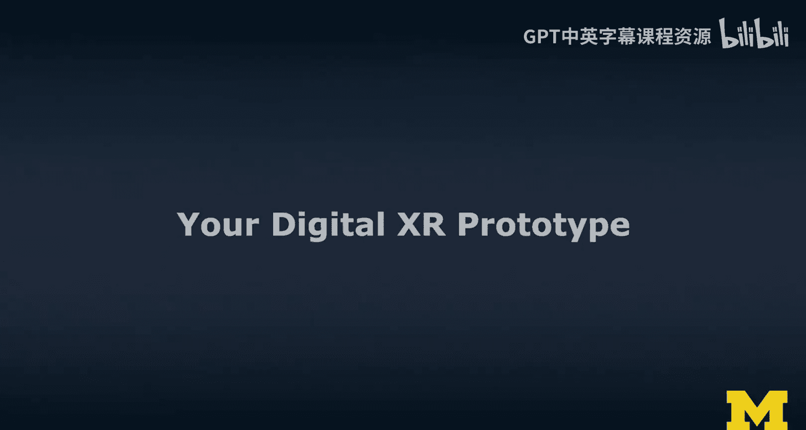
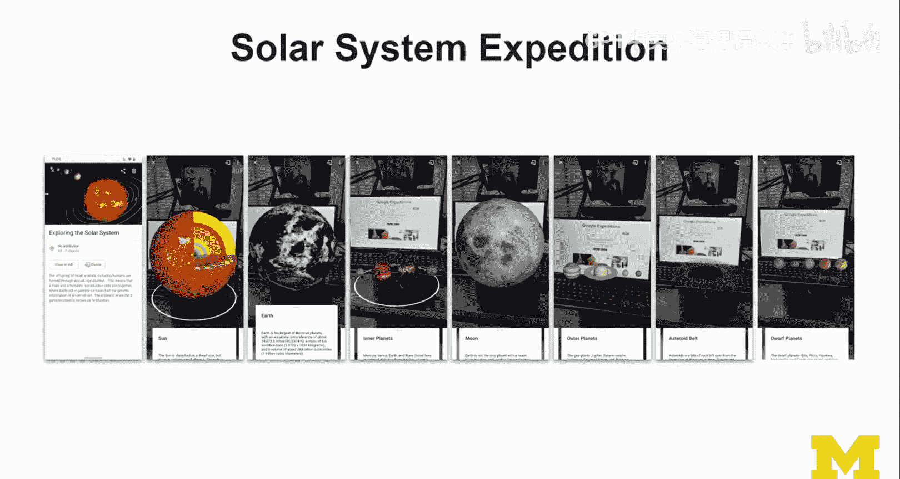
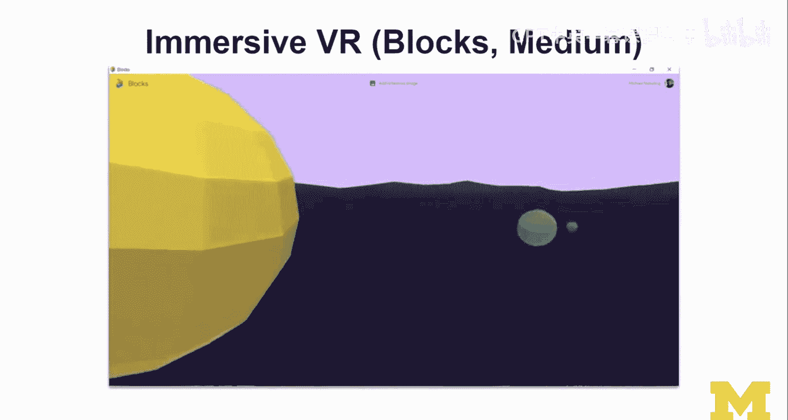
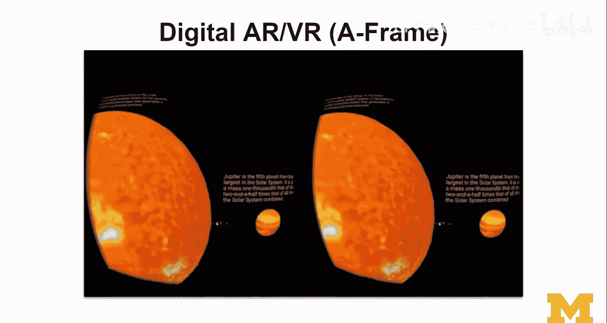
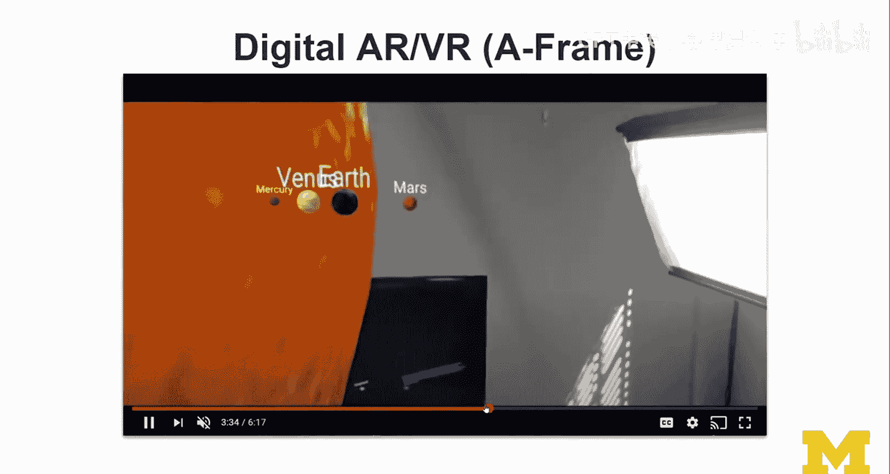
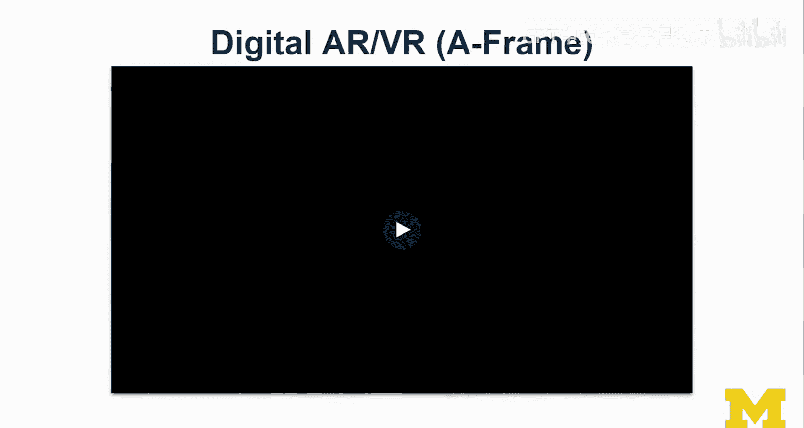
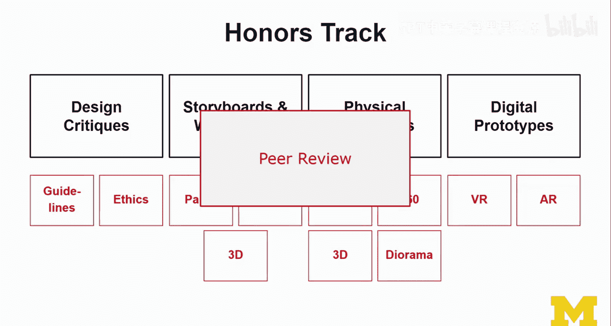

# 密歇根大学《面向所有人的扩展现实（介绍⧸设计⧸开发）｜Extended Reality for Everybody Specialization》中英字幕 p82 45_XR数字原型实践.zh_en -BV1jM4m1k73q_p82-

Welcome back to the honest track So you are now actually towards the end。

 congratulations for making it that far。 and I hope you've been working on these exercises and not just like looking at ahead and you really want to see what's happening in digital prototyping well I understand digital prototyping is also very。

 very exciting it can be challenging， This is really the part where it becomes tricky It depends on a lot of factors like what kind of equipment do you have available is for example。

 if you have a smartphone is it compatible， can you do AR with it do you have any kind of VR equipment And so I will treat this exercise's just do it broadly as long as we somehow move digitally ideally this would work your prototype would work on an AR or VR device something that you would call Xr device that would be perfect so that's where we want。

😊，to and why are we doing this Well， we are finishing up。

 We are like on track to this minimum viable product。

 the MVP our final prototype It's like with everything in life there's a deadline and then you know you have to be done and obviously you could iterate and go crazy and expand the main point here is to really just learn about the methods playing around with some of the tools along the way what comes out at the end。

 well， if you follow the methods， it can't be that bad and one thing I feel I should emphasize at this stages we are entering the final stages of the honest track and the project that we are developing as part of the honest track and there will be a peer review so you will you will get to review other people's projects you've already been looking at some of them as part of the activities along the way if you're looking at various examples in the galleries。

 but now we actually formally，😊，Going to review each other's prototypes。

 but now that's after now we're going to do the digital prototype。

 but keep that in mind as we kind of like get ready for this final stage of the honest track。😊。

So in this exercise， the task is to create a digital prototype of an expeditions like Xr app okay so you know the rules I'm gonna to repeat it。

 we're still keeping with that app and you know usually in the residential program there are questions like can I change my project can I work on a different kind of well solution or problem even and I normally say depending on where we are in the project it's not a good idea so when it comes to the digital prototype it is not a good idea to now kind of change it given the progress that you've made regarding storyboarding wireraming physical prototyping so I feel like well why not just you know make it through maybe you come up with something cool here and you like your idea again again as part of this of course the whole idea is to just have one new idea we' got to mostly focus on what's existing。

 It helps us also do a digital prototype like kind of like recreating more。😊。

Or less that expeditions like XR App that we're using that we're modeling our work after。

You goal is to prototype one of the key interactions of that existing app in a。

 and I'm not gonna be very flexible here。3，603D AR Vr digital tool。

 So it's a couple of key things here。 It should be digital。 Okay， we we moving away from paper。 Yeah。

 finally getting there。 and we are going to use tools there are tools focused on 360 prototyping。

 or you could even just do photoshop with the 360 template， that would be acceptable。

 there are 3D modeling and authoring tools。 and you would be digital。

 But I think so don't do the just 3D modeling。 But if you。

 if that's what you want to learn and like you want to you want to use a tool like model viewer or sketch fab that actually bring things into A R VR that is also kind of still playing by the rules。

 It's okay。 I'll show you what I had in mind。 I was working with a frame， actually。😊。

So that required a little bit of development， but I was also playing around with immersive authoring tools for VR and for AR。

 So I'll show you what I' have done。😊，In the second step， you should really sketch。

 sculpt or model whatever the language is of the tool that you're using is a digital tool now。

 two to three main characters， so this will bring us closer to the story to a digital version of the story。

In step 3， I want you to think about that environment that we are actually designing for and to which extent should that environment that physical environment should that be represented in our digital prototype。

 So I'll say make a virtual copy of the target physical environment。 Really capture the context。

 So't just like sketch into like thin air and just focus on the virtual content。 No。

 make it clear even from a digital prototype， What kind of experience is this supposed to be So in my AR prototypes that I'm doing in Vr I actually sketch out the table to define the scale of my AR experience So then the next step is to actually record a video and nar the interactions。

 So I want you to as much as possible record your prototype and different tools have different means to do that。

 A screenshot is usually not sufficient since we are focused on interactions。 A video would be good。

 Maybe you can learn how to do screen capture。😊，On whatever type of operating system and computer you're using or you're getting one for your mobile phone。

 So I've used a number of different tools throughout this MOO and yeah。

 I'm not here to make really the recommendations that's something we can figure out in the forum but anyway。

 the goal is to record a video and na the interactions within that digital or immersive tool In fact。

 optionally I would like you to try out a different digital or immersive authoring tool I make this optional just for workload reasons but I do think actually you should you should really try out a few different digital tools。

 So rather go deep in one and like go crazy I'd rather have you try out two to three quickly and then choose the one that you like and then in this fifth step。

 maybe come back to one of the other ones that you had previously Well not discarded but like not focused on So what do we have at the end of this。

😊，We should have a lot， so we actually then have a final prototype that is an MVP a minimum viable product if you do it right so it's as close as possible to the real thing we might even be able to test it with users in a VR or AR headset so that could be interesting。

😊，You went broad， so you really have this understanding of the environment。

 3D characters of the interactions。 you prototype them multiple times in different fataldities。 Now。

 this is the last time you prototype them now using digital tools and you went deep so you at this stage you will actually find out about ARVR specific requirements and development needs So that is actually quite important。

 So these digital prototypes can really be function if they had done well。

 function as a specification that you can give to a developer an ARV developer or if you have obviously the skills or if you want to develop the skills。

 or I'll invite you to take the development oriented XIO course but yeah。

 so this that could be a handoff and if you don't do it yourself。

 they could be this handoff and a digital prototype might actually very well provide this template for the developers。

😊，So I'm still doing this solar system。 I never got bored。

 I've actually been playing around quite a bit。 It's been fun。 So this is a little bit of， you know。

 going back in time when I started out doing the design critique。

 you probably did a different expedition or expedition like app。 anyway， let's stick with mine。

 So I the prototype， various prototypes from before。

 So various physical prototypes at a paper prototype。😊。

That I was then playing around with， I created the 3D models along the way using Plato or some kind of clay。

And I played around with them。 So that was really important。

 So playing with these 3D models in the physical world。

 but then also capturing it a little bit digitally and getting some kind of sense for how this might feel in an A of VR experience。

 So that was cool。 And then I did this diorama and I was actually playing around with more of these objects and composing them together and even using AR captures with my little AR camera and then bringing in even still some of the physical objects So really flexible use of both physical captured virtually materials and then bringing back in physical。

 So yes， just advertising again for the physical prototyping parts。

 but now we are doing digital prototyping。 I don't know。 always get excited when I see physical pros。

 But I'm also going to get excited about the digital prototypes。 if they are done well。 Now。

 the problem is you could actually spend a lot of time and it doesn't look like anything in the end。

 So that is something。😊，That we should all be aware of so especially when you look at others each other's solutions don't judge just because it doesn't feel like wow。

 you didn't do a lot or something。 No， maybe we struggled， maybe we had technical issues。

 maybe we just couldn't commit the time。 Maybe we just wanted to learn superficially about this process without going too deep like we wanted to have this overview and that's totally fine as well。

 So we're going to do digital authoring。We may do immersive authoring so digital as I explained in the lecture is really more like with 3D tools on a desktop and then you do previews deploy a device or you somehow stream to a device immersive authoring means you're actually doing it directly on the AR or VR device so I want you if possible if at all possible to try this out。

And then we can actually think about some of these platforms and approaches that are more development oriented。

 And we can also think of some of their tools for digital prototyping。 So aframe has an inspector。

 and I'm pretty fast with HTML CSsS and ja。 So I think of aframe， A A prototyping tool。

 Not everybody may agree。 and that's fine。 But unity that I put here on a cross platform or unreal。

 these are some of the examples I'll spend more time on later。😊，These are acceptable。

 actually relatively high fidelity， even complex AR VR platforms if you will。

 I mean they have support for them they are traditionally game engines actually and in any case what I'm aiming for is like we're picking something that maybe not as heavy as unity and unrealreal because in the third course focused on development you can spend more time in these tools so try so here is me playing around with immersive AR on the iPad and I was using Adobe Aero。

 which I'm not sure whether it's free or not I have an education license and I can just play with it。

It was a little limited in terms of how I could represent my planet。

 So I had just had to choose from these predefin 3D objects。 And that's a limitation of the tools。

 So just just admit not admit it， but just mention it if somebody is like hey。

 you didn't do a proper sun， Earth or moon。 Well， this is what I had to work with。

 also working with these more abstract representations is fine as long as it helps you learn something about。

 for example， the composition the scale of the experience。

 or just like this mere fact of being in AR and doing an immersive authoring session is is just cool。

 And the main thing is I wanted to try it out。 and well。

 So I'm doing it with arrow here and then later in the video that I'm going to share with you also play with3Lt composer。

😊，And so reality composer， obviously Apple on the iPad。

 at least I could put in a few primitive shapes in there and it's just good enough for planets。

 I really like that I chose the solar system and nothing more complicated。

 This was hard enough so don't make it too difficult on yourselves。

 you just want to learn about the methods and the tools and you can work on the complicated project that you've always wanted to solve and do you can do that later it doesn't have to be in this course。

 go through this course， take everything with you along the way。

 you know build your toolbox and then apply to your own project。

 And if you do please let me know it would be cool if any of this was helpful in whatever you wanted to do that would be that would make me proud in any case。

😊，I was then also playing around with the Imersive we are authoring tool here， I'm using blocks。

And you know， funny enough。Because I'm doing a solar system and most tools actually have these relatively basic shapes in there。

 you just can play around here I have color so that was cool and later in the video I'm going to go a little bit forward I'm grabbing the objects and playing around with them。

😊，And trying other different compositions。And I hope I'm just taking the moon。

 maybe you missed that part。 I like my little hand there。 It's really quite cute。

AndZooming in and zooming out。 Okay， I'll show all that obviously， but here maybe。Yeah。

 this is the part that I wanted you to see and you check out the video later in more depth if you want。

 but this is why it's cool because now in immersive authoring I can actually play around using my tiny little block hand there。

 can't get over it and you know， do it experiment and play and that。😊，Hey， well。

 you can't say that this is a final experience， okay， so I'm just doing immersive authoring。😊。

Itll get a little better。 I'll I'll， I'll， I'll increase the fidelity by one more bit。

 Whatever the unit is。 And here is our one more bit。 So I'm showing you。

 and I'm gonna share this whole video with you as well。 proudly present to you our a frame based。

 So Web X are based。😊，Solar system Now this is something that I've started and then I had a few students also contribute to it。

 it's also the kind of exercise and example code I will share with you and it's also something that I share with from our residential learners and it's you know it's not too complicated a few spheres in there they all textured nicely so we got the right NAA pictures public domain and of the planets and then we added a little bit of interactions here and you some text。

Text doesn't work so well in AR or VR， but whatever you know we're trying that out that this is not supposed to be the final design。

 this is where you feel like okay if I write a lot of text above the planets。

 that may not be the best experience。😊，And and that's that's what this is for。 So that's okay。

 I'm gonna to jump ahead because I also later run it in AR oops。

 that was like right in there and it is directly here in the studio。 and I was just like， you know。

Also talking a little bit about the tracking and how the tracking doesn't work so well sometimes but。

This was pretty cool。And yeah， so if you feel like it at the end， I'll also show cardboard。

 it feels like a step back。 but this is my target device if you want。

 So I didn't do too much for the Oculus Rift。 I mean。

 teleporting in space seems like an interesting concept。😊。

We are teleporting I know that in Star Trek they have so I know about Star Trek don't worry I know that they have beaming there。

 but no teleporting in space just doesn't feel right。

 but I wanted to think about different locomotion techniques again this is just our digital prototype So again when it comes to digital prototype and keep in mind we can also create multiple versions of our digital prototypes。

 you don't have to cover everything that you had in mind。 I want you to be selective。

 I said one key interaction and yeah it should be important to your project not just the login or whatever no something key and you can do it in two versions and maybe add more to it。

 you don't have to go all the way。 I mean ideally we would get there at the end we would actually have our MVP but that doesn't have to be the scope of how you go through this exercise you can work with one tool and if it's too limited or you feel like you want to add a second tool you don't have to prototype the same thing with both tool。

😊。

I'll talk about prototyping strategies just as a reminder in a second but you could also just fit in another tool because it allows you to just create that 3D model that you need and then you can import it into that other authoring tool and so that would be cool too so here are the digital prototyping strategies I talked about in the lecture so you can do parallel prototyping that especially when you work in teams is very effective but even just you prototyping the same feature with different tools so if youre like don't know which tools to use yet you could choose a very simple feature or a particularly hard one and prototy is just a little with a few different tools。

😊，You could prototype different features with the same tool so that's iterative prototyping because ultimately you create this entire set of features in one tool and that may actually then be your prototype you could do the divide and conquer and actually prototype different features in different tools Now now for this activity I would recommend strategy one or two probably go with just iterative and just use one tool but then in an optional fifth step I want you to try out a different tool you don't have to you know prototype the same thing again so it could be that you parallel prototype or it could be that you divide and conquer at that stage if you make it to that fifth step in the current task。

So what that would mean is if you have followed through in the honest track。

 you have done your design critique， your storyboarding， physical prototypes。

 and now actually a digital prototype with an immersive tool。With a digital or an immersive tool。

 And so that means you have some subset of all of these deliverables。

And I say deliverables because at the end of this， we will actually do a peer review。

 And that is something where both you will actually get feedback。

 but also provide feedback to others and。

So this peer review activity requires a little bit more explanation and so I have more information actually in depth in writing for you don't worry so much about the grading we still here to learn but we do need to establish some basic rules so that we treat each other fairly and with respect which is really important to me so I'll talk about that just getting ready for that part as you can tell No at this stage don't think too much about the peer review I just wanted to mention it I didn't want to bother you before but you saw it in the syllabus it was mentioned but it's not the main thing we don't do this to be graded we do this to learn and so in this last step in the honest track the digital prototype I think you'll learn a lot don't don't just keep these other steps very short and then spend like forever on the digital prototypes or spend too much time and running out of。

😊，Energy on these low fidelity ones and then don't do anything almost no all of these are important。

 None of these replace each other。 They' are all here to learn I wouldn't skip too many of these steps I wouldn't do every single type of storyboard or type of physical prototype or you know using all kinds of tools when it comes to the digital prototype I wouldn't do that in a project I usually have at this stage I have developed an intuition which which tool to use or I'm just stuck and do everything with a frame or unity just because I feel like I'm fast which is not always true Okay so don't get me wrong there。

😊，But so the point of this was that we are developing this picture book style。😊，You know。

 approach to XR prototyping doing it by the book is spine first。 And then later you can cut corners。

 but don't cut corners and not understand the whole thing that would be a bit you know。

 wouldn't wouldn't provide the right foundation。 So that's why we're doing it this way。

 And I hope you will have some fun in this final week of our editor prototyping activities。

 And I'm looking forward to seeing a lot of the prototypes coming together from this course。

 and I'll see you again for the peer review。😊。

