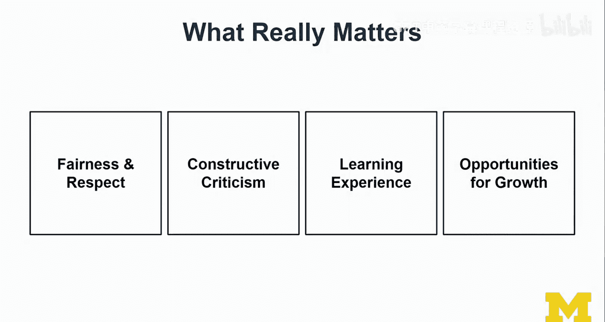
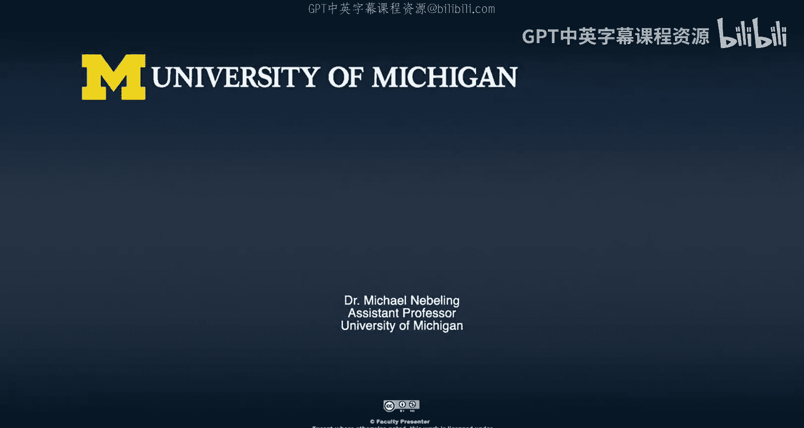

# 密歇根大学《面向所有人的扩展现实（介绍⧸设计⧸开发）｜Extended Reality for Everybody Specialization》中英字幕 p83 46_XR原型同行评审.zh_en -BV1jM4m1k73q_p83-

Well， you made it。 I mean， almost there， right。 So we've done a lot of prototyping now。

 this honest track was really focused on storyboarding and prototyping。

 Not so much the brainstorming and you know， creating something really novel and you know。

 interesting was not the main goal here。 And that should also not be like the thing that you're looking for when you're doing a review of each other's work。

 No， there were a number of methods and tools that I try to convey。

 and I wanted you to try them out for yourselves。 And so that's what we're going to review now。

 We're going to review how well we have done in that regard。 don't think of it。

 these expedition apps， whatever the experience was that was created。 Like don't think of it。

 I would never use this or this is weird。 That's not the goal here。 and this is a byproduct。

 this course， we're learning about the methods and tools。😊。

We're doing a project with the goal of learning about the methods and tools if you want to do this more professionally then with the results then really matter yeah then that's a different story and I know students are always shocked when I say this right I don't care about the results I mean the results for me is like seeing how you exercise the methods or tools we don't even do usability testing so how am I supposed to know whether your design makes sense or not no so that's not the right bar so the whole point of this video is to establish that bar for how we should do that peer review have a few thoughts about it I keep it rather high level here and motivational hopefully and not so much like this is not like grading like you get so so much if you do that and that no that's not that important to me I want to establish the right attitude towards this peer review。

😊，It's the whole point， all I'm trying to do here。Don't judge the messenger Okay here we go so you have done the honest track congratulations you've done design critiques guidelines and ethics is what you actually took into account you have done storyboarding and wire framing so perhaps some combination of paper 3603D storyboarding you have done paper prototypes a combination of or some variant maybe of 3603D or anti diorama。

😊，And you have done your digital prototype and maybe tried out immersive authoring for VR and AR。

 and then your final prototype should be for VR or AR。So if you have done some of this。

 then you're ready， you're like in the right at the end of the track at this stage。

 you should really I mean congratulations so when I was doing the exercises for you just like to try it out what I'm actually asking of you I felt really good at the end I mean it didn't look like it didn't turn out really the way I wanted it。

 but I thought， hey this might be good so good enough so that you can learn something from it you probably disappointed that Michael doesn't sketch very well or I don't know maybe I messed up some other things。

 for example， I know I didn't like take all the features I had in the storyboarding stage I didn't take them through to the end。

 but that's fine I don't have to do everything I mean along the way we generate ideas and some of them we follow through in others we just like this card and that's why we do prototyping right we don't have to implement everything try it out and then realize hey this doesn't make sense No we can be。

😊，Co effective and fast。Okay， so it was important because I'm building this right attitude towards how we should approach this peer review。

So we're going to go in。And now we're going to talk about peer review。

 so this is just like any other task that you had in this course， so it comes with the description。

 your XR prototype peer review task is to review XR prototypes submitted for peer review。😊。

So you may have looked and peeked into some of the galleries and I asked you to submit your work along the way to get feedback。

 but this now is a separate activity， this is an exercise focused on peer review and there's actually quite a few things you have to submit。

😊，And so let's look at it from the perspective of you reviewing somebody's work。

 this is not the video that tells you how to submit your work okay， so we are focusing on that。😊。

So you look at the submitted materials and actually you should look at everything just like a reviewer should look at the entire paper。

😊，Not just the abstract and then make up their mind you should look at the descriptions。

 the images and the videos so that should roughly cover what your fellow learners are submitting to you and they probably put they probably put in some effort and spend some time on writing all this and capturing the screenshots and creating the videos and maybe even narrating the videos and and if the videos or if some of these materials are missing。

 don't d them for that， I mean just look at what you have。

 what they have submitted and what you can work with。😊，嗯。I think in the first step。

 you should learn about their process like your fellow learner's design process and their design rational。

 you should build empathy towards them。 It's really important。

 Don't judge like we're not looking at this to teach each other how to be better。 No。

 we're learning from each other。 That's really important you then start writing your review。

 you prepare that and I want you to approach this using the I like。

 I wish what if template just like we do any critique and you can focus that part of your review using that template on the new feature that was developed by your colleague。

 your you know fellow learner。😊，You should share with your peer what you learned for your own work。

 I think that would be a really like really nice pay it back in a nice way that not negatively like if somebody provides a harsh review。

 that's something we can talk about。 okay， so that's not that's not the that's not what I'm aiming for here。

 I want constructive criticism。 Yes， but no XR like。😊，Okay so let's just face it。

 Nobody really knows what is good XR design， we are all in this together。

 we all trying it out together and well I have a little bit of I can you I have a sense of how much time went into a prototype but I mean this is online learning or like if you're in a residential class with me then I mean if you are using a lot of these materials here you're doing this in your own time and this is not a job and understand that and you as a reviewer also need to understand that if you were particularly excited about this course super cool doesn't mean that the other person whose work you are reviewing was as excited or should be as excited I mean everybody should be excited but that's a different story。

😊，Review 2 to3 prototypes submitted for review。 These numbers just do more than one。

 We may start out initially with one， but ideally， I want you to get a sense of a few different。

 well， learners strategies and how they approached it。 And so I would like you to see more than one。

 But as we are starting this moO as we're rolling it out。

Maybe we don't have that many things to review yet。 so this number might adapt a little bit as well。

 but you also don't have to overdo it like I mean looking at five different ones that's a lot of work already。

 So in terms of expected results， I would say you will get a better overview of the possible designs of other expedition like XR apps。

So the next thing that you may realize by looking at a few of these different submissions some commonalities and differences in features that were refined and added。

 So maybe there's really something wrong with a lot of the expedition apps out there and that could be interesting and if five people have the same idea that's also fine like if it's the same new idea it's fine that don't judge if that new idea just comes from a different kind of app that's also fine because we we're cool with that。

 we just want to learn about how to approach this X design process and trying out these kinds of techniques and that's where I think the real value kicks in you see how other people's get how other people prototype maybe they even use a slightly different method from what I taught here maybe it's a cool one and I should know about it maybe we'll find that out together in as we're going through that MOO and that's fine I mean I don't think。

that my methods and tools are exhaustive， but theyre quite a good overview and a good starting point and I would say now we're going to establish what to look for and I wrote this down with the mindset of trying to guide you through this process have a few important notes here and so let's look at this together。

😊，So this is important so the type of expedition is important and I don't mean really like whether whether it's a museum or a hospital or whatever。

 I mean there are expeditions where can learn about human anatomy okay it doesn't have to be exactly like going to a specific place but what is important is whether it's designed for AR or VR and understanding a little bit more about the context I think it's important。

 so especially where the expedition was tried or not tried by your peer the nottri part is interesting。

 I mean mostly from a kind of did it make sense or did we overlook something and then I mean you can always offer opportunities and suggestions for like what could be tried。

 but I mean the fact that somebody hasn't tried something very specifically should not be the main issue。

😊，So then you look at all the materials I said this already， so the written text， the screenshots。

 the videos like you should look at it， not just rush over it。

 I mean theres something valuable in there， I'm sure you can learn something from how other people write about it。

 how they present their work， I think if you look at it at this meta level。

 I think there is a lot of learning that is going to happen in this activity。😊。

You should look at the stage and the type of the prototypes I'm saying this mostly so that you understand where they fit in how they fit into the picture。

 you shouldn't comment on effort or quality I mean if you feel like somebody didn't spend a lot of time on it they probably know so you don't have to point it out and if you feel like it doesn't meet whatever bar you have for quality and that's fine this is not a competition here so I would just like not comment on effort or quality if you find something super cool you feel like how that must have been a lot of work in the positive way I'm okay with it in the negative way please don't comment on it。

😊，So if none of us really comment on effort or quality， then that's fine because that's what I said。

 but again feel encouraged to leave a positive note Now if you don't receive a positive note and you feel like you've spent a lot of time and effort。

 then remember the guidelines were that you shouldn't comment on this so if you haven't received a comment on your work。

 don't be too sad about that。How the methods and tools were used。

 this is really like look at don't look at it from a right or wrong perspective。

 more like what you can learn from how other people used this method and where they used it and how they used it。

😊，Same for tools。 And I think here you could confirm the tool selection if you feel like， yeah。

 you use the right tool， I think it's cool， or you could suggest alternative tools。

 Sometimes people have very strong opinions about tools。😊。

They feel like they really need to tell the other person that is much better tool。

 and there's so many tools out there。😊，You know， that doesn't matter， I mean， if you feel like， okay。

 hey， try this other tool， I think it it could make things easier for you because I read you struggled with this feature and I know that that tool has that feature。

😊，That would be helpful both for you to demonstrate that you have that overview of the tool landscape and then also for the receiving learner and so that would actually be nice。

 but I'm just afraid that you judge each other's tool selections and that is not the key point here okay。

😊，I want to be I want you to look for explicitly stated or implicit open questions about the design。

 I mean maybe your fellow learner wrote about how they were struggling to find a good answer for one of the questions they had and maybe you have a suggestion there if so unsoliciitted feedback yeah so I wanted to be careful with implicit open questions but if you feel like you have something to share here and it would be helpful and if you phrase it in a nice way that would be exciting。

😊，Finally and this is the last thing， not the first thing this is really important。

 I didn't start with like how cool the features， the new feature that everybody implement。

 that new feature was just there so that we can try out something that goes beyond the existing app。

 but a lot of this was just using the methods and tools to learn about to actually just like sketch out the flow of an app that you haven't created and that is one of the main things because we wanted to learn about the methods and tools not to spend forever coming up with novel and creative and significant new features。

😊，And I wanted to look more at how the feature was implemented。😊。

I don't want you to judge whether that feature is like nobody would ever use that we don't know right。

 no user testing could be super cool I mean you can say if you think it's cool you should say that you could say that let's say but I wanted to focus on how the feature was implemented so which methods and tools were used was this feature consistently in the scope was the paper prototype really targeting that feature was the 360 paper prototype a good choice to learn about that feature that is something that you and the person that's submitted the reviews。

 that's something that you sorry the project or the prototypes for review that's something that you could discuss and figure out together as well。

😊，So what really matters， and I'm going to sum this up here。

 what really matters to me is that we treat each other with fairness and respect that。I mean。

 that's a given， okay， so it's really important to me I don't want you to upset each other so okay？

Be good then we want to have constructive criticism I mean we want to learn criticism so that we can learn criticism writing criticism so that we can learn how to offer criticism I like I wish what if method for example and then the other learner should feel like oh I've learned something from that critique I may not especially like it。

 I mean I don't like it when I'm being critiqued but on the next day I usually think about it and and then I realize oh there is something important for me to learn here that leads me to stating that this is overall a learning experience if you're somebody who already has significant experience prototyping with ARVR that's super cool and you can share some of that experience definitely。

😊，But I mean， the majority of us are really still learning about these things and finally。

 we are looking for opportunities for growth。😊。

That's why we're doing this。 even this peer review opportunities for growth both I think like one of the things that Michael as a professor had to learn and really still has to learn is you know。

 being German I can be very direct and the feedback is often to the point sometimes at like the language but its it's so direct sometimes that it can feel like super negative or aggressive so we need to work on the tone and。

😊，That's something that I can always improve， for example and obviously then the domain specific knowledge so learning about a specific field and how that translates to AIE。

 that's something that I feel like I can always learn more but think about this for yourself like what you feel are the things you learn from well looking at each other's work and then you know talking about each other's work in these forums I really hope that together we're producing something that is really cool we're producing knowledge here together since you know the people out there don't give us the guidelines we just help each other and maybe collectively create good guidelines for design we also think about the ethics really。

 really important so don't forget about some of the key lectures throughout the course ethics and really。

 really important to me so I do want us to think about the design and really the。😊。

Typing methods and having some fun in these tools。But let's not forget about the impact on our users should our prototypes ever make it to them yeah so final word。

 yes we didn't do user testing and I thought a lot about how we might do this with these projects and it shouldn't stop you from like giving your prototypes to friends or family around you。

 it's just not really an official thing they've been doing here as part of the curriculum in this XMOC。

😊，诶。I would encourage you to do that though， I think it could be cool and again maybe that other person doesn't really know yet how to provide that feedback so you can hold a similar lecture like you know here are all the rules。

 things you can say things you're not allowed to say no so this is a framework for us to really approach this peer review together I'm looking forward to it I'm excited to hear you are what you have to say about each other's work and where you have learned things and where you have identified opportunities for growth so if this is the last course and well that that you're ever going to take with me really hope that you've learned something especially from this honest track there are other courses you can go into development or you can deepen some of your design thinking and even beyond design thinking。

 some of the issues so in course one we talk a lot。😊，About this， but anyway， I'll stop here。

 So congratulations， you're almost done with the honest track。 That's super cool。😊。

