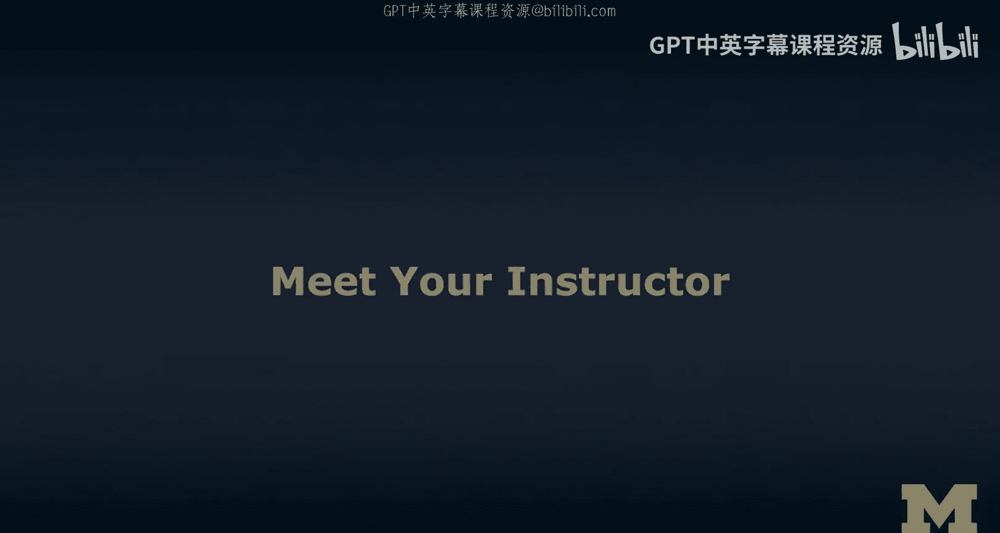
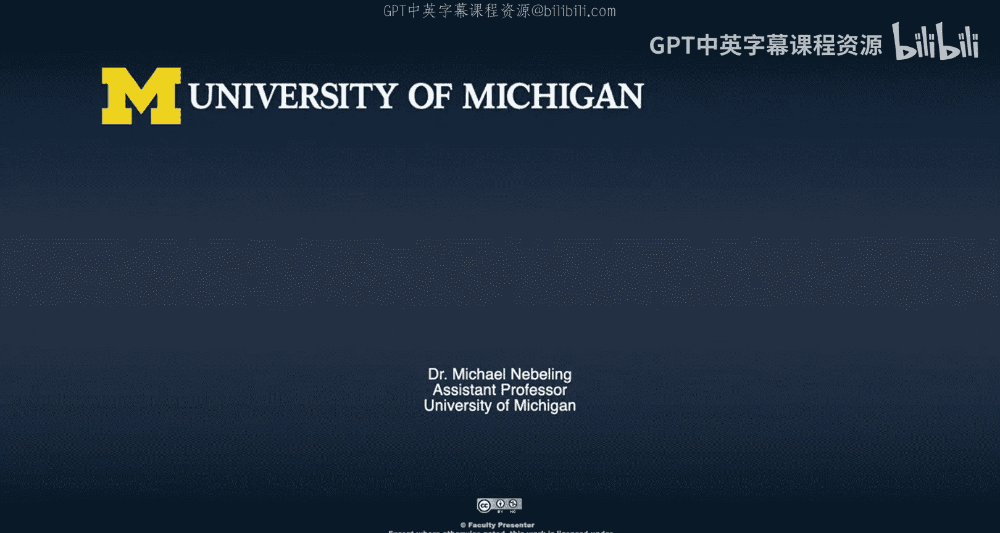

# 面向所有人的扩展现实：0：认识你的导师 👨‍🏫

在本节课中，我们将认识本专项课程的导师，了解他的背景、教学理念以及对扩展现实（XR）领域的热情。这有助于我们理解课程内容的来源和视角。

大家好，我是Mike Ebelling，我是你们的导师。我是密歇根大学的一名教授，更准确地说是一名助理教授，我在信息学院工作。

在我们正式开始这个XR专项课程之前，我认为我应该介绍一下自己，并告诉你们一些关于我的事情。我在这个领域工作了大约五年。我一直在人机交互领域进行相关研究。同时，我在密歇根大学的在校项目中已经教授了三年课程，包括两门AR/VR课程：一门侧重于设计，另一门侧重于开发。

这门课程在多个方面是我几年前与几位同事共同开设的“Teachout”课程的升级版。那个课程是密歇根大学的“增强现实、虚拟现实和混合现实”短期课程。也许你们在那里见过我。很高兴在那个MOOC中遇到一些学习者，你们中的许多人实际上表示希望学习更多关于设计和开发的内容。我们听到了你们的声音，并在这两个领域都增加了大量内容。

我关心XR技术。对我来说，我们所有人都理解这些技术非常重要。它们正在融入我们的日常生活，它们已经存在，并且不会消失。我们仍然可以影响如何塑造这些技术，从而更好地控制它们如何融入我们的日常生活。

无论如何，现在是我回馈和传递知识的时候了。我希望你们今天在这里学到的东西，是我自己必须学习的，不仅仅是今天，而是在接下来的几周里。这个过程不会那么快。我希望你们分享这些知识，并邀请其他人也来了解这些内容。

不是每个人都关心开发，也许我们中的一些人关心设计，希望关心的人更多。然后，我们中的许多人应该真正关心这个领域和这些技术的发展方向。我们应该就此进行一些批判性的讨论。

感谢你们让我认识你们，并加入我传播XR知识的努力。我真的很期待在课程中见到你们，希望我们能相互交流，也许有一天甚至能亲自见面，那将非常令人兴奋。欢迎来到XR专项课程。

---

**本节课总结**

在本节课中，我们一起认识了本专项课程的导师Mike Ebelling教授。我们了解到他作为密歇根大学研究者和教育者的背景，他开设XR课程的经历，以及他希望通过本课程分享知识、引导大家思考XR技术未来的热情。这为我们后续的学习奠定了良好的基础。