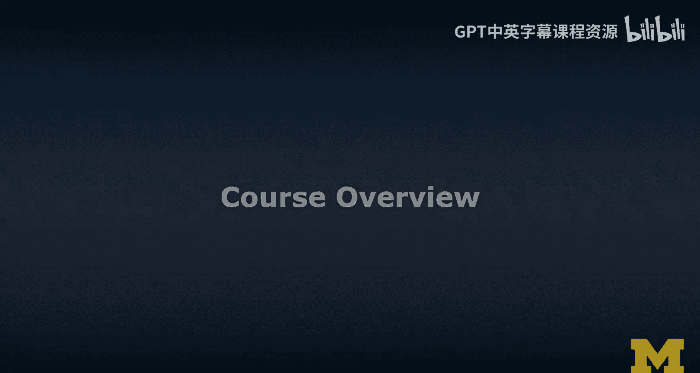
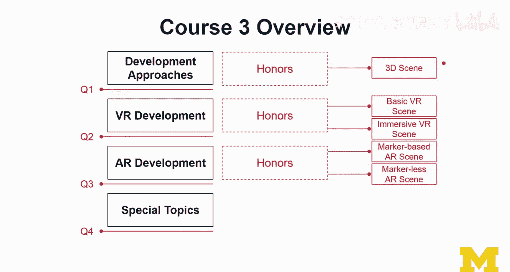
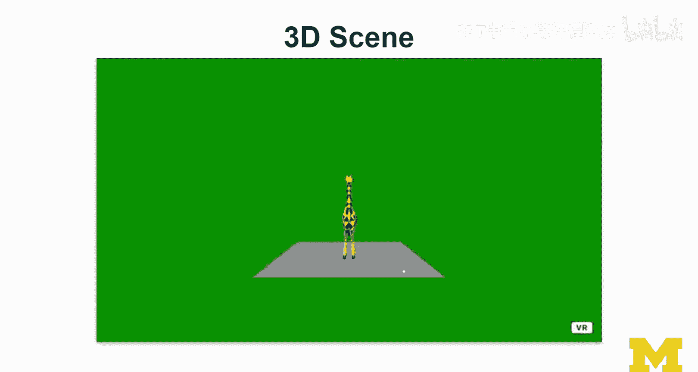
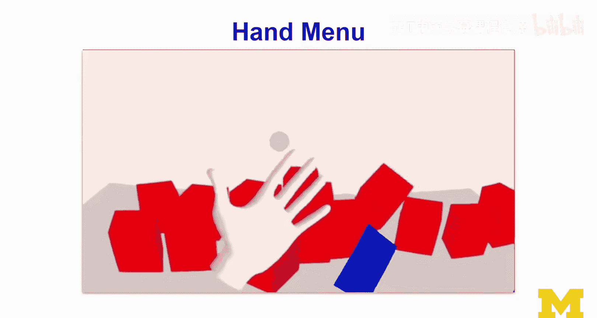
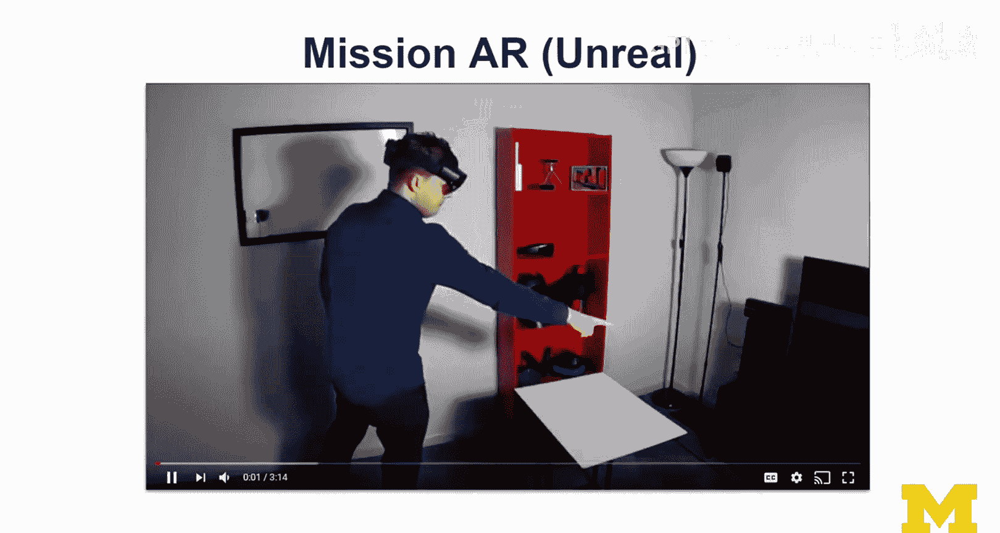
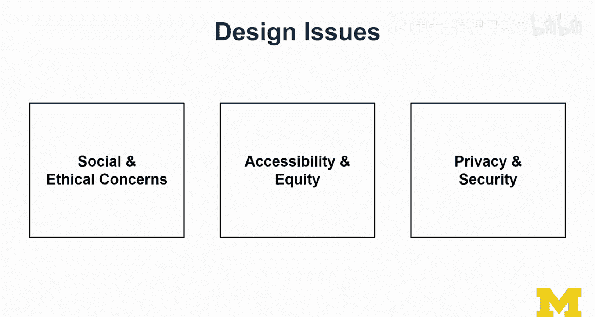
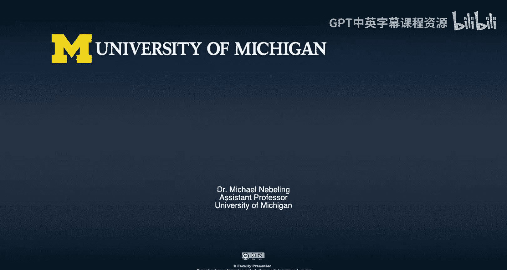

# 扩展现实开发：课程概述

在本课程中，我们将学习如何为增强现实（AR）、虚拟现实（VR）和混合现实（MR）开发应用程序。我们将使用 WebXR、Unity 和 Unreal 等工具，从技术角度深入探索这些激动人心的新技术。

本课程是“面向所有人的扩展现实”专项课程的一部分，是其中的第三门课。它假设你已经通过第一门课程，掌握了VR和AR的基本概念、技术以及关键问题。在本课程中，我们将专注于学习开发应用程序的原则和主要组成部分。

## 🗺️ 课程结构与主要内容

本课程分为四个主要模块。

首先，我们将探讨不同的开发方法，了解成为XR内容创作者的可能路径，并对WebXR、Unity和Unreal进行介绍和概述。我们还将学习从2D到3D的思维转换，为后续内容打下基础。

上一节我们介绍了课程的整体结构，本节中我们来看看VR开发部分的具体内容。

在VR开发模块，我们将从设计开始学习。以下是本模块的核心内容：
*   **导航与菜单**：学习如何在VR环境中设计导航系统和用户界面菜单。
*   **对象选择与操作**：掌握在VR中如何让用户选择并操控虚拟物体。
*   **体验创建**：学习创建基础的VR体验，以及需要更多技术和努力的沉浸式VR体验。

接下来，我们将进入AR开发的学习。

在AR开发模块，我们将重点研究两种主要方法。以下是两种核心的AR实现方式：
*   **基于标记的AR**：使用如Vuforia、ARToolkit和AR.js（WebXR的一部分）等流行标记库。
*   **无标记AR**：不依赖特定图像标记的AR体验实现。

最后，课程将涵盖一些高级专题。

在专题模块，我们将接触更前沿的技术。以下是本模块将探讨的几个方向：
*   **高级技术**：如程序化生成，用于创建更开放的VR应用。
*   **XR研究**：探讨XR领域的研究话题与所需技能。
*   **课程制作揭秘**：展示本慕课制作中使用的一些技术，以帮助远程学习者更好地理解这些技术。

## 🎯 学习评估与实践项目

为了评估学习成果，每个主要模块结束后都设有测验，帮助你确保学习进度。

课程包含丰富的实践内容，特别是在“荣誉课程”路径中，有一系列练习帮助你系统性地学习开发3D、VR和AR场景。贯穿课程有一个主要案例研究，专注于虚拟现实设计。

该项目最初模仿底特律动物园，由我的学生Kara Daily进一步开发，成为一个包含夜间狩猎、宠物喂养区等元素的VR场景。在荣誉课程中，你将创建自己的3D场景，并进一步将其发展为VR场景。我们将学习如何处理VR中的交互与导航，并学习如何将VR场景转化为AR体验。例如，你可以将一个等比例的长颈鹿模型通过无标记AR的方式带入你的客厅，我们也会展示其基于标记的版本。通过对比，你将理解基于标记和无标记AR在追踪、设计和交互方面的差异。

## 🔧 技术栈与开发工具

考虑到学生可能有不同的背景，本课程力求让内容更具可及性。

对于不同背景的学习者，课程提供了相应的技术路径。以下是课程涵盖的主要工具和平台：
*   **Web开发者**：课程包含大量WebXR空间的示例。
*   **游戏开发者**：熟悉Unity和Unreal将是很好的选择。
*   **移动应用开发者**：课程将探讨如何将现有知识迁移到XR开发。

本课程主要覆盖WebXR、Unity和Unreal。对于每个平台，我们都会讨论流行的开发框架，例如A-Frame、AR.js、SteamVR、MRTK、AR Foundation和XR Interaction Toolkit。我们也将学习流行的AR和VR设备，并学习如何评估这些技术，以及如何将工具包映射到具体的平台和设备上。

## 📐 核心3D开发概念

在第一模块，我们将花相当多的时间完成从2D到3D的思维跳跃。

我们将学习坐标系、渲染原理、透视相机、光照的必要性以及三维空间（X, Y, Z）等概念。我们将以与工具无关的方式学习物体变换等所有核心概念和原理，然后你将有机会在你选择的工具中实践。我们将学习透视相机的工作原理，了解3D场景如何渲染，以及这些知识如何应用于VR和AR。

## 🕹️ VR与AR关键技术点

在VR部分，我们将从关键技术开始。

我们将学习**射线投射**和**命中检测**，这是确定用户指向位置、实现物体选择和操控的基础。我们将学习不同类型的菜单设计，例如在Oculus Quest浏览器中用WebXR实现的“手部菜单”。我们还将简要了解视频透视以及正在成为VR设备标准功能的手部追踪。

在AR部分，我们主要关注手持设备AR，但也会学习头戴式AR及其带来的额外能力，例如微软HoloLens 2。我们将学习空间网格的实时识别，及其在遮挡和物理模拟中的应用，例如让虚拟立方体真实地落在桌面上。

设备方面，虽然无法覆盖所有设备，但我们会以HoloLens 2和Oculus Rift S为主要演示设备。同时，我们也会大量使用Cardboard，它只需要一部手机，经过改装后也能用于AR体验。我们还有关于AR的完整案例研究，例如由学生Shawn贡献的“开普勒行星运动定律”示例，它巧妙地利用了纸质标记。

## 🧠 深入原理与前沿话题

本课程有时会深入底层原理，以理解技术背后的工作机制。

例如，我们将剖析基于标记的追踪是如何工作的，并讲解其处理流程。我们也会学习最新的工具包，如Unity中的AR Foundation，了解无标记AR如何感知环境。我们将探讨AR技术的可供性、与真实环境融合的挑战（如遮挡渲染），以及最新的场景理解功能，这些功能允许设备理解其所见的内容，从而实现更真实的交互。

课程最后，我将展示一个很酷的AR体验——为HoloLens 2开发的Unreal项目“Mission AR”，它展示了AR也能达到很高的沉浸感。

## 🔬 XR研究与重要议题

最后，我将探讨XR研究。

我将探索一些我认为未来几年从人机交互角度看会很有趣的热门话题。我会讨论学生参与XR研究所需的技能，包括用户体验设计、人机交互研究技能、AR/VR技术技能和编程能力，以及进行研究的能力。由于XR技术的前沿性，采用研究性的方法来对待整个XR领域是一个非常有效的途径。我们还将讨论在XR研究中提出好问题与坏问题的标准。

贯穿本课程及我的所有慕课，我们将强调一些至关重要但常被忽视的设计议题。

以下是几个关键的社会与伦理关切点：
*   **社会与伦理问题**：随着这些技术日益主流化并渗透日常生活，其社会影响和伦理考量至关重要。
*   **可及性与公平性**：这是一个重大问题。在本课程中，你可能因为无法获取HoloLens 2、ARKit/ARCore设备或VR头显等实际原因而有所体会。目前，可及性问题尚未得到很好解决。
*   **隐私与安全**：当设备能够感知我们及周围环境的一切时，隐私和安全问题便不容忽视。虽然本课程重点在于技术实现，但思考这些议题同样重要。

## 📚 总结与展望

本节课中，我们一起学习了“扩展现实开发”课程的总体概述、结构、技术栈、核心概念以及所涵盖的关键技术与伦理议题。

本课程的核心是动手实践，专注于技术实现，让你能真正“弄脏双手”去开发XR应用。然而，技术实现只是起点。虽然本课程范围在于此，但强烈建议你通过学习专项课程中的其他课程，来完善你的知识体系，它们专注于设计思维、设计实践以及诸多重要议题的深入探讨。

现在，让我们正式开始这段有趣的XR开发学习之旅吧。