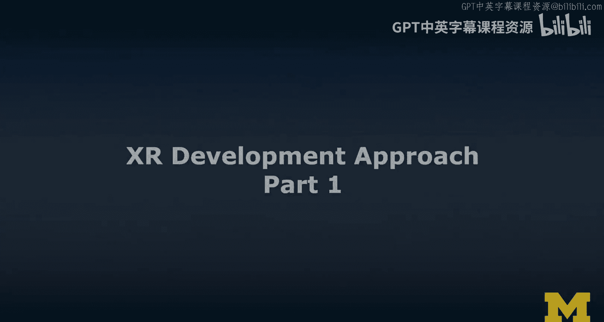
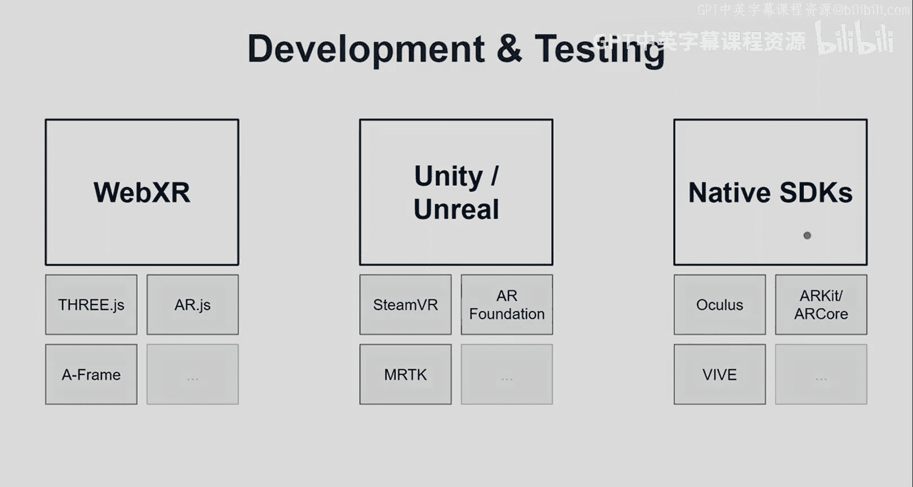
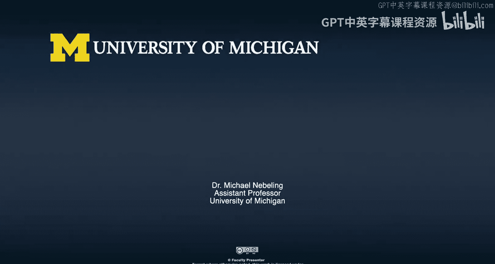

# XR开发方法：第1部分：开发流程与工具概述 🚀

在本节课中，我们将探讨XR开发的基础，包括开发流程、核心方法以及三种主要的开发工具。我们将从宏观的“X流程”入手，了解从构思到部署的完整周期，并重点介绍开发阶段应遵循的原则。最后，我们将概览WebXR、Unity和Unreal这三种主流开发平台。

## 开发流程：X流程回顾

上一节我们介绍了课程的整体目标。本节中，我们来看看XR项目从构思到上线的完整流程，即“X流程”。这个流程不仅适用于开发，也贯穿了设计和测试。

在专注于设计的第二门课程中，我们深入探讨了需求发现和头脑风暴，这是X流程的首要步骤。我们也重点强调了故事板和原型设计。

现在，在这第三门课程中，作为XMOOC的一部分，我们的重点是**开发和测试**。这是本课程的核心目标，因此内容将更具技术性。

作为X流程的一部分，当开发完成后，我们需要弄清楚如何将产品交付给用户，这个阶段可称为**部署**。你可能会认为到此就结束了，但实际上，许多工作才刚刚开始，其形式是**数据分析**。你需要了解你的产品是否真正符合用户需求。

请注意，数据分析并非你第一次进行用户测试。事实上，我们**在整个流程的每一步都应尽可能让用户参与**，包括早期的纸质原型测试，以及开发和测试阶段。

数据分析部分，我将在本课程末尾，作为一些更高级技术的一部分进行讨论。但就本课程而言，我们的核心焦点就是**开发和测试**。

## 开发前的准备工作

在深入开发之前，你需要完成一些关键的准备工作。以下是开发前应完成的事项列表：

*   **制定项目计划**：你需要有一个清晰的计划。
*   **明确开发方法**：定义你的开发路径，本讲座将详细讨论开发方法。
*   **设定里程碑**：定义项目的重要节点。
*   **分配角色**：通常一个XR项目需要多人协作。如果只有你一人，也完全可行，但需要妥善规划。
*   **完成草图绘制**：包括高保真和详细的草图，以完善你的想法。
*   **明确用户角色**：清楚我们为谁设计，以及不为谁设计。
*   **创建用户故事地图**：在更偏向用户体验和交互设计的过程中，我们通过故事地图来识别想要支持的**用户目标与任务**。这比单纯思考“要开发什么功能”更能指导开发。用户的目标和任务会决定需要哪些功能。
*   **进行原型设计**：通常进行多轮，包括实体原型和数字原型。这在第二门课程是重点，本课程会有所回顾但不会深入。

我坚信，在开始任何重大开发之前，亲手进行这些“快速而粗糙”的实体和数字原型设计至关重要。它们有助于探索交互方式、获取早期用户反馈，并帮助你思考AR/VR是否是必要的解决方案，从而避免过早地锁定技术路线。

同时，如果XR确实是正确的方向，这些原型也能帮助你明确技术需求。

## 从低保真到高保真的开发阶段

我们应该理解，开发也应遵循从低保真到高保真的渐进过程。

我们会先使用占位内容进行开发。你可以使用额外工具，并利用**3D基本几何体**（如球体、立方体、圆柱体）来搭建场景。

然后，通常会引入精美的3D模型来打磨内容。最后，我们才增加对**隐式交互**和**显式交互**的支持。

我之前介绍过这些术语。**隐式交互**主要是基于摄像头的，例如在3自由度头显（如Cardboard）中环顾四周。用户注视某物或聚焦于某物，我称之为**显式交互**。

这里有一个例子：假设用户注视这个物体并停留，我们称之为“聚焦”，这实际上会触发一个点击事件，从而改变3D模型的外观或对其进行操作。

我建议你从低保真开始，用占位内容规划场景，然后引入更精美的3D模型和所需内容（包括音频等）。只有在此之后，我们才真正开始实现交互。

虽然我在这里的描述听起来是顺序进行的，但实际上很多过程是**迭代式**的，即“开发与测试”循环进行。

## 三大开发平台概览

以下是三种主要的XR开发途径：

*   **WebXR**：有时特指即将推出的WebXR标准规范，有时也泛指在网页上实现AR/VR。在本课程中，我将使用**A-Frame**作为进行WebXR开发的主要工具。
*   **Unity**：许多XR开发者推崇的工具。它可以用于：
    *   **SteamVR**：跨平台VR开发，支持Oculus、Vive、Valve Index等多种头显。
    *   **AR Foundation**：一个建立在ARKit和ARCore之上的跨平台AR开发框架。
    *   **MRTK**：混合现实工具包，我非常喜欢用它来进行移动端AR和HoloLens开发。
*   **Unreal**：由Epic Games开发，是许多大型游戏背后的强大工具。在本课程中我们也会涉及。

我的大部分经验集中在Unity和A-Frame上，但我也一直在学习，这也是本课程的意义所在——我们将共同学习更多XR开发知识。

每种平台都配有特定的测试工具。例如，A-Frame有检查器，Unity和Unreal拥有控制台和大量通知及附加工具。如果你选择原生开发路线（如使用Android Studio或Xcode进行AR开发），那里也有大量的开发工具支持。

## 总结

本节课中，我们一起学习了XR开发的全流程（X流程），明确了开发前需完成的准备工作，理解了从低保真原型到高保真交互的渐进开发阶段，并概览了WebXR（以A-Frame为代表）、Unity和Unreal这三大主流开发平台及其特点。记住，成功的开发始于周密的计划、快速的原型验证和迭代式的“开发-测试”循环。