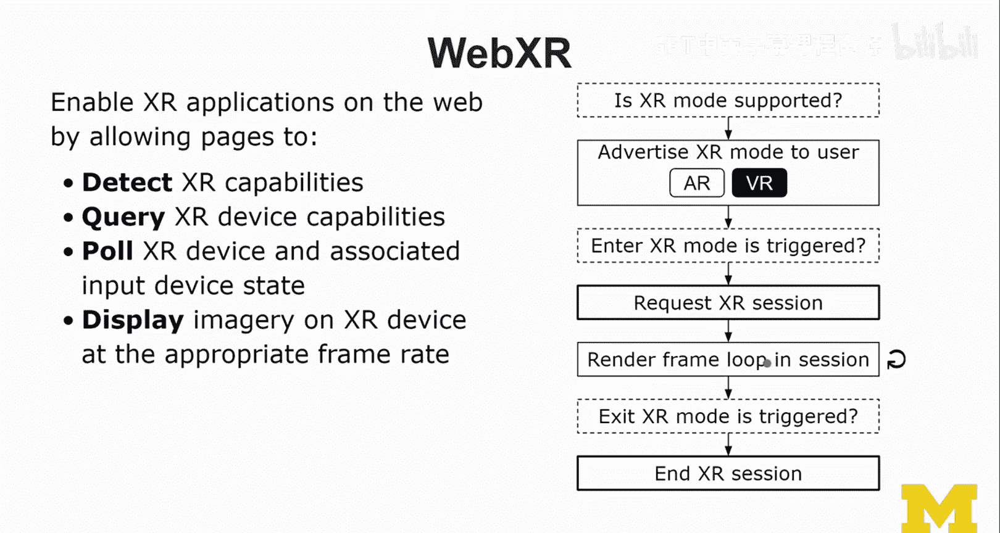

# 密歇根大学《面向所有人的扩展现实（介绍⧸设计⧸开发）｜Extended Reality for Everybody Specialization》中英字幕 p87 3_XR开发方法第二部分.zh_en -BV1jM4m1k73q_p87-

What we're gonna do here is I'm going to show you the paths to being an X creator。

So we have the three main approaches down there， web based， cross platform and then native。

And so if you have a web dev background。 well guess in a second， you probably guess it right。 Yes。

 this is the right path。re onto something。 And I'm gonna show you if you have a game development background or a mobile development background the ideal path or the easiest the path of least resistance will be actually always going down straight。

 So I've sketched this out here as easy and hard。 So I think of Web devev picking up if you know HTMLlCs as a jascript picking up。

 for example， aframe that's going be doable picking up 3JS you really have to be good in jascript。

 I would just say that an A and JS is really super simple。

 if your game developer then this path is probably a good one you might already be very experienced with unity and Unre。

 and then all you have to learn is these Xr tools down there。

 What I don't show you is XR interaction toolkit as part of unity as well It' kind of like a steam view。

It is more of a recent thing and I show you some demos of it and then mobile development so here you're going you can actually do both I mean if youre a mobile developer then wow you can probably do the native SDKs because you just just you're used to this and Android Studio is no problem for you or Xcode and you understand all that。

So Archs and vive。😊，You would probably still go through unity， to be honest。In any case。

 as a mobile devaf background person， you shouldn't have any problems picking up either way。

 I would like to see you go this route because it'll introduce you to a lot of really healthy ecosystem around XR。

 I've already talked quite a bit about Web XR unity and unreal and the differences between each of them maybe unity is still very dominant in the not only in the game market but also in in the XR space Now Web XR an Unal also really。

 really actually great tools and obviously the web is evolving it's kind of like this native versus mobile war where the question was should I do a native so an Android or I app on my mobile phone or should I use web technologies to create an application。

A mobile application on the web。 and we have seen various different kinds of tools。

 and so I would say with Web XR， it's the same it's gonna to be the same thing。

 we will see lots of actually approaches and lots of solutions going through the web and that will push both the browser support and then also what we can actually do anyway unreal is really the beautiful kind of approach to XR a little bit behind at this stage behind unity but I mean these are great people we work with them。

 they're really onto something I think this will be。Quite a match between the two。

 So let me go back a little and compare the web versus a frame。 So when you think of web development。

 Okay， so you use HTML to define the structure and content， right。

 the organization of the page content and the hierarchy。 So it's it's a dumb tree。

 but not only because we can also obviously control the presentation through CSS cascading style sheets。

And they define the page content presentation。And behavior we usually do in JavaScript。

 So how does a frame now compare to all this， How does this change？ So first of all。

 I would say with a frame， we're talking about entities， components and systems。

 and then also scripts。So ECS entity component system is really an interesting approach to developing applications。

 it's very data driven。And so what that means is you define the structure。

 we call this the scene graph or in unity it's called the hierarchy。 we define that in entities。

 and then each of these entities like a box sphere。

 like all the primitive you have in a scene and maybe a plane that they stand on or some kind of environment and then maybe some light and there may some camera。

 these would all be entities， but they are all entities with different kinds of behavior and also content and presentation。

 actually they have a variety of different components usually associated with them and they define the 3D scene content and presentation。

 they also define the type of the entity really a lot more and basically their functionality。

And behind these entities and components is usually some kinds of scripts functionality that is triggered。

 they specify the interactive behavior so for example。

 their particle systems and physics systems are like entire systems that you can load on top of an aframe or 3GS seen。

 for example。So I also just said a frame 3 J S and Webex R and so many terms。

 So let me visualize this here。 So down here， we have the web layer， okay。

And next I'm going to show you Web WebExR sit， so WebExR is kind of like a JavaScript extension of the navigator object in the browser。

 and that gives us access to a variety of things including， for example。

 requesting the start of an XR session。And then aframe is up there。

 so aframe is really like instead of div what not an HTML， you would still write HTML tags。

 actually you have HTML tags Aframe introduces a number of new tags we call this markup tags。

So a entity is kind of like the most generic kind of tag type， it's kind of like a div in HTML。

 but you have also more specific shortcuts if you will， so you could write a box。

 A sphere or a cylinder and these give you then entities with specific geometry and X material as well。

So Web GL is actually the Web extension for rendering graphics， including 3D graphics on the web。

 And so an aframe scene actually includes a canvas in that canvas is a 3D context。

 and that is actually rendered and manipulated through Web GL functions。

And3 JS because nobody really wants to do this with ja themselves。

 3JS is really one of the most popular widespread libraries out there in the web that is a 3D graphics library and it's ja So really it is JS is just a ja layer and now aframe actually comes in and provides a declarative webbased framework So WebexR is then a standard that is currently being developed that enables X applications of the web by allowing pages a web pages really that's what they are HTMLl documents to call ja functions to detect XR capabilities to query XR device capabilities to pull XR device and associated input device state So really figuring out what's going on do we have a 3 degrees of freedom or 6 degrees of freedom headset。

 what's the motion controller do we actually have a motion controller is ARO VR supported。

 So that would be more like in the query part and then。Display imagery， and I mean。

 both like visual and audio on XR devices at the appropriate frame rate。

And the workflow is usually well asking at the beginning when the document loads is XR mode supported and then we can which depending on which modes are supported might be just VR or just AR and usually you see VR and then you also on AR capable devices so there are those that support A kit and AR core you would see this button so then when the user decides to click one of these so enter X mode。

 this needs to be a user function， the user explicitly needs to trigger this event。

 you request a session with that specific mode you actually have much more fine grains。

 so different types of modes so is it AR is it C through or is it some kind of magic window style so there are different kinds of things you can request this and then establishes this render loops so it's rendering rendering rendering rendering all the time like all the cool stuff that we see in AR and VR。

Until the user decides to exit and then we the exit session。

