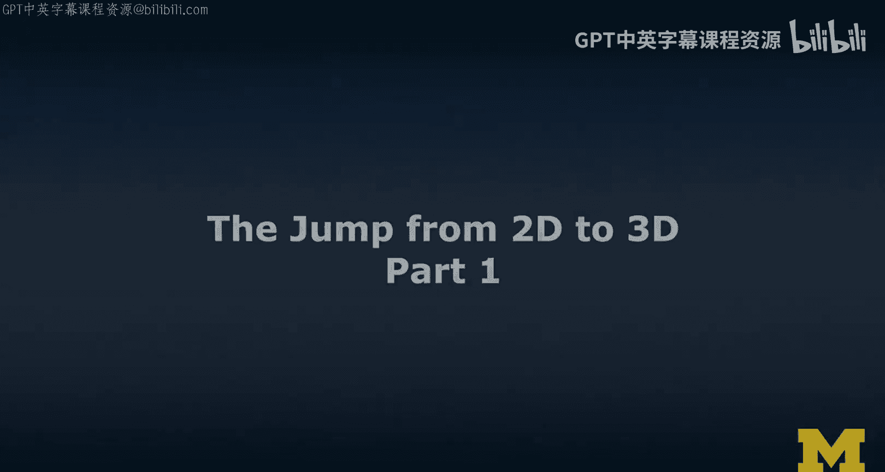
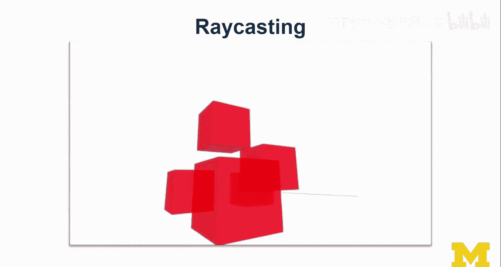
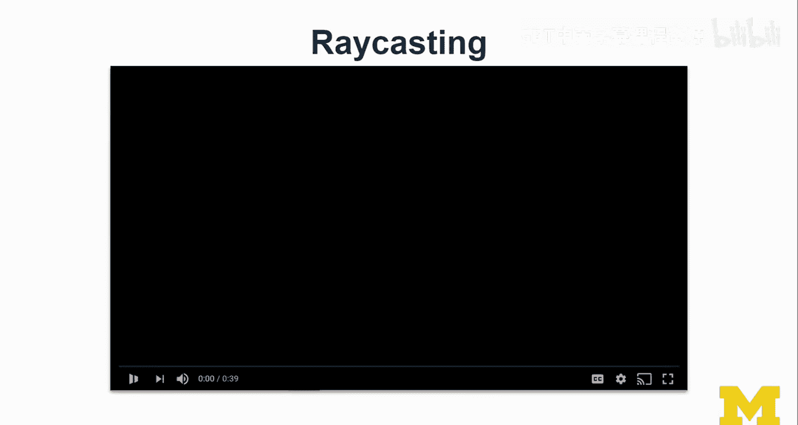
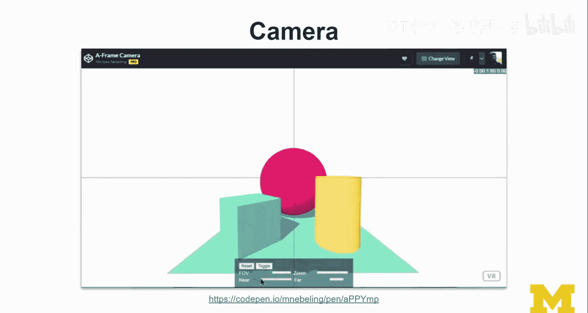

# 密歇根大学《面向所有人的扩展现实（介绍⧸设计⧸开发）｜Extended Reality for Everybody Specialization》中英字幕 p90 6_从2D到3D的跨越第一部分.zh_en -BV1jM4m1k73q_p90-

In this lecture， we're going to learn more about 3D。 In fact。

 we're going to make the jump from 2D to 3D。 I assume you may have some experience developing web or mobile applications。

But even if you don't， the 3D world is quite different。

 so it's quite challenging and want us to spend a little bit of time getting more familiar with how things work in 3D。

 how we should think about design and layout and also how we should think about interactions and this is really a foundation for what is to come in the following weeks。

 we built on top of this 3D programming and knowledge so that we can actually then do things in virtual reality and in augmented reality。

 which are， of course， inherently 3D。 if you think back to course 2。

 if you have taken this course in course2， I talked a lot about what it takes to create AR VR experiences and prototyping and I talk about really starting on paper and going through various levels of fidelity up to really up to AR and if you want to get。

Here to 3D， it is quite a jump， okay。So obviously along the way。

 we could prototype using these other media including 360 and show examples of this throughout this lecture and also in other portions of the MOC but really what we want to focus on in this lecture is making this jump to 3D。

 So if you're familiar with how coordinate systems work。

 they done in the top left corner of the screen usually so up there but I'm just going to put this down here and so this is the X this is the Y and so if you wanted to position a box like this here。

 let's say this is a divff in HTMLl di and you want to do in CSS you set the left to this difference and the top to this difference in pixels or whatever unit you want。

And in 3D， well， a 3D coordinate system，0，0，0 is here。 Now in AR， the 0，0。

0 is depending on what kind of AR you're using。 So if it's a marker based AR。

 then it would be directly in the marker。 The coordinate system is often relative to the marker and。

If you are using Mac S AR， is' usually the location where you started。

 that's the world origins where you started the app usually。And but in just 3D， so this would be 0，0。

0。 And then if you wanted to put a box around the 00，0。 this is how it would happen。

 It has a certain scale。 the same scale as this box actually， But a number of things just happened。

 I'm gonna bring it back one more time。 So first， just putting the object adding light。

 And then it actually is shaded。 And that is how things work in 3D。

 you actually do need ambient light without the light。 you see nothing。

 And that is something to pay attention to。 And then obviously now we have a 3D geometric shape here。

 we're gonna learn about。2D versus 3D objects。 So here you see various primitive shapes。 so a well。

 kind of like the 2D versions of the ones that I'm drawing over here， right。

 we have a cube here is sphere here in a cylinder。 So the basic geometric shapes that we have。😊。

And then we need to learn a little bit about obviously layout。

 So we know how layout works probably in 2D。 We have a position X and Y coordinate。 We have a size。

 So within height。 we do have a little bit of depth。

 but it's usually just in a distant H on CsS it's the Z index。

 So that determines which object is rendered in front of which other object and we can use rotation as a transform to really well rotate the object。

 then when it comes to design， I'd say we can obviously have lots of CsS properties down here the important ones I would say our display。

 So whether something is visible and then could be in line or block and or not visible。

 we can control transparency So using opacities setting into one would make it fully visible and then have color and an image。

 So while does this work in 3D Well we have x Y and Z。

 So that means we have width height and depth we can have。

that's something I wouldn't usually play with too much。

 we have a Z and the Z really is what translate to the Z index the best。We have rotation。 the X。

 Y and Z can be in degrees or radiance， but this is something well learn in a bit。

 and then on the material side， obviously we have visible through false we can render things as a wireframe so whether we want to actually really render a texture or just the wireframe is something we can we can control for we can control for opacity。

 we can apply a color or a texture and then one thing that's interesting we can per default render the front So this is like would be render like this。

 if you render the backside， you can actually look into this inside this cube even though when you're outside if you do double you can be outside the cube and you see it like this front rendering and then if you somehow clip into this cube if you going into this cube it would render the backside。

 so that's something per default for performance reasons we really choose front。

 I want to talk a little bit about transforms this is a little bit of a。

Shehe sheet here is something to keep in mind so've already established the 2D and the 3D coordinate system okay so we have x。

 Y and Z here so if we already talked about how to translate objects rotation right now it's at zero degrees rotation in scales a little bit wider than it is high if I wanted to rotate this then I would do this with rotation。

 for example， 45 degrees would rotate this rectangle like that。And if I wanted to rotate this object。

 for example， around the y axis， that would be rotating around the Y axis。

 we actually have obviously X， Y， Z around which we can rotate。And so that's something to learn。

 right， if you want to rotate around the x axiss， so this way。

So this is a right handeded coordinateed system in our example。

 so this is the thumb is the X axis so rotating around the x would bring it to you Okay so I'm going to show you this in a separate slide but this is something we just have to spend some time on and get it into your heads and rotation around the Z is actually the same I mean if you do minus-45 it's the same as doing the rotation here so it would rotate this way。

And that's something to keep in mind and to learn and this is the well。

 this is the holy grarail when it comes to coordinate systems and left-hand coordinate system。

 so this hand and that's what we use in unity and the righthand coordinate system that's what we use in aframe and the biggest difference that you see is obviously where the Z。

 whether the Z actually increases or decreases that is really that really makes a difference so in aframe。

 for example， when you move your head forward， youre actually decreasing the Z and immunity is the other way around。

😊，Confusing， but you， you figured out。 Let's talk about interactions。

 I think interactions are pretty cool。 And well key to immersion in V R and in A。

 they also work differently。 And that's something。 well。

 let's just establish the basics here for 3D And before we do 3D， let's look at 2D。

 So clicking in 2D。 obviously， if you wanted to click this object， you would go there。

 that means you do mouse enter and mouse leave。 So mouse enter， you click， which is mouse down。

 click mouse up bam。 And then actually get this event。😊。

So I get a mouse up event and I have that location actually it's like kind of like in there and this is an event that's what it would look like in HTML and JavaScript and here so you have the cursor on this screen and I'm using an illustration here from David Lyons。

 which I really like that illustration and you're shooting from that cursor position array into the scene bam and then you see which of these objects are intersected and so you cast array from the mouse into the scene and return all the intersected elements。

 those are the ones that you would be clicking in 3D。 So for example。

 when you define a arraycast and aframe it usually wants you to to say which objects it should be looking for and then it will do the collision detection on those。

And yeah you can handle actually mouse up events and they will be handled if you do in in aframe。

 if you set the ray origin to the mouse， So let me illustrate this to you using my own example here that I've implemented in aframe。

 It's a ray casting。 So in this first version you see a ray coming out from the right location and as I adjust the orientation of that ray I begin to hit other elements and I change the visual appearance I'll reduce the opacity of the elements that I'm hitting。

So this is key。 This is something that we actually learn more about in virtual reality。

 So here I'll show you maybe it starting to make more sense。 This is the first person view。

 this is me with the VR controller pointing at these different virtual objects and this is what it would look like if you were standing near me and this is essentially the Raycastster coming out of my virtual reality controller and so we've done obviously we've learned about 2D3D objects we've learned about transforms we've just learned about interactions and Ray casting and finally to actually see anything in the scene we need a camera。

😊。

So here's our camera， it's a perspective camera， this is the view of Fum。

And we have a near plane and a far plane。 and these are clipping planes。

 So everything here would be clipped and everything beyond beyond the fire plane would never be visible unless you move the camera and you're moving the near and the far plane and theyre shifting it in front of you。

So that means at some stage when you're hitting these objects。

 you would start to cr them and before I show you an example of this， this is the field of view okay。

 keep that in mind field of view and obviously this if you don't change your X， Y Z。

 you're just changing your zoom。Then you're zooming into the scene and zooming into the scene means actually having a smaller field of view because you get to see less you see。

 you see things closer， but you see less at once。 That's just how things are。

 So let me show you an example of this based on my little camera here that I have。

 I've actually set it up in a way so that you see a little bit of visual helper actually of that camera。

 I can jump into that camera。😊，This is the actual camera。

 this is like how when I'm looking at my aframe scene， my hello web VR scene。

 these are my coordinates up there and when I toggle so I switch into this other scene I can see from the outside what we're actually doing to the camera So now we're going adjust the field of view really that that actually impacts everything。

 it makes the near the dimensions of the near and fire plane changes that doesn't change the。

Actual near and file plane。 So far， really， if you have a smaller f that feels like a larger zoom factor。

 So this is an interesting relationship between Zoom and F that you can see here。 So for example。

 in the Hollen。1， you have a 35 degrees zoom。 So it's like kind of like this。

 And in a virtual reality headset， you see more at once。 This is 120 degrees roughly。

 So this is really this was a little bit more than what it would look like on a Vr headset。

 Now then near and Fire plane， these are pretty important。

 they are used for optimization and clipping。 So basically we don't have to render what's outside the fire plane。

 So we only render until then。 and we only render what is behind the near plane。

 Nothing that is in front of the neo plane from the camera will not be visible。

 So what I'm showing here is obviously adjusting the near plane。😊。

And when you're gonna jump into the camera in a second。

 you will see how that actually clips the scene and here you can see how that actually then works for that scene。

 so when you're wearing a holen， the default is to have it at 85 centimeters。

 so the clipping plane is actually quite far away， you can get it as low as 30 centimeters。

