# 密歇根大学《面向所有人的扩展现实（介绍⧸设计⧸开发）｜Extended Reality for Everybody Specialization》中英字幕 p94 10_Unreal引擎基础入门.zh_en -BV1jM4m1k73q_p94-

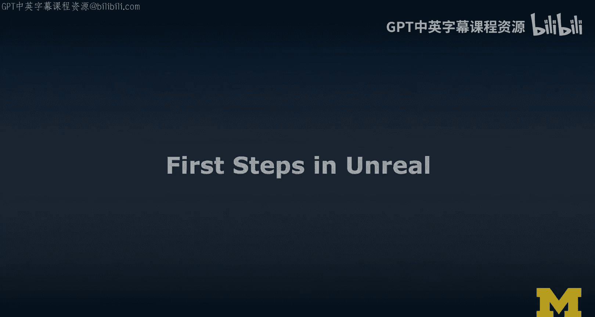

In this video， I'm going to provide some first steps in Unal Engine。

 I'm going to provide this overview。 I need to say a few things first。

 though for the first thing I'm gonna to say is I am not super great and unreal Engine yet。

 most of my projects that I've done in the past。 They were in Web X and in unity。

 So I'm quite fit with those two unreal Engine。 We just had a learning group this summer also in my lab and I'm beginning to learn more and more。

 So then unity skills translate relatively quickly to unreal Engine renamed a few things。😊。

You will notice that obviously with under Engine things look amazing An advantage that you will notice right away when I give you the VR demo is there's a VR button and you just press it and it works I just use I'm going use the Ochis come on Ochius。

 where is it here we go I'm going to use the Ochis riftas is connected to my computer press the VR button and a preview any 3DC and that's really cool that's gonna give you an edge potentially and if you're doing the honest track and one of the tasks I'll ask you next week actually you do the 3DC in this week if you want to do that and then next week I'm going to ask you to turn it into a VrC and you're like okay Michael is it really that I I just press that button there no you should also adapt a little bit for VR scale and maybe some of the proportions and camera angle perspective and think about ways of making it more immersive obviously but so anyway I'm gonna to give you this overview here one thing I want to also say just like。

If if this is your VR headset don't do Unre engine and there's no need and don't do unity I think if you're aiming for cardboard my personal recommendation to use just go WebEx R so follow my first steps in WebEx R and even though I show it in the Rift S there。

 I think it is actually relatively straightforward with cardboard I have more examples in my basic VR experience lecture so you can also refer to that。

嗯。So in this one， we're gonna do we're gonna go into the Archs Rift S using VR。

 And the cool thing about Unre Engine is not only is there Vr button no， the engine， actually。

 the editor really is available in VR。 can you can actually configure things in V。

 You can do immersive authoring。 So I'm gonna show you how I start moving things in VR and I mean。

 the session where I to continue longer。 I'm using the starter assets there。 if I were to do more。

 I could actually seamlessly switch between the editor and the Vr preview in which I can do immersive authoring。

 Now I think that is really， really powerful and really cool。 So something for you to。

 to explore a little bit。 maybe that's what I would encourage。 I'm also gonna show you A。

 So I'm gonna run an AR project that they have again。

 same tedious thing connect yourphone via USB make sure that you kind of like connect there。

 I was struggling a little bit。😊，I'm not going to show you all that。

 It was a little embarrassing and it may change， It may not be relevant。 maybe things will be easier。

 so I figured it out in the end， I' got it to deploy and I'm going to show you how you can drop a few well primitives in this studio here and it's actually not a bad。

 not a bad example。 So I'm going to show you that in AR Macca less AR using my AR core phones or on Android they have plugins for AR kit。

 so you just need to enable the right things when you're going to develop for AR with unreal it's possible。

😊，OneThis is like a teaser， can that make an advertisement？So later in week 3。

 when we really spent more time on on AR， I'm going show you the mission AR Unal Engine project。

 So that's gonna to run on the Hollens， too。 That is really cool。

 So when we're talking about like you're going all in。 So you're doing unreal engine。

 you have like a Hollens or a magic leap， which I don't have， but。😊。

AHolands tool and you have Android engine， so then you just download the 13 gigabys of mission AR and get it。

😊，Get it to deploy on the device。 And， and it's gonna be a cool experience。

 I'm gonna show you that I can't wait to to show you that。 But don't jump there now。

 follow this video。 these are your first steps。 So if you feel like you want to work on my exercises as part of the honest track and you w to choose Unal engine。

😊，This will help you。 This video。 It would be too complicated if I afford the when I in when I go through the honest track to show you like。

 you can do this in Webex or unity or an unrealre whatever ever want want to do it。

 I will let the video take forever。 So this is your reference video。 And so， well。😊。

We're doing okay with time。 So let's get started。 I'm going to go into the anri engine。

 which is probably going load a little bit。 And then I'm going show you how we can use the rift S for VR。

 And then after that， I'm going to do the AR version the project that they have。 there。

 It's pretty cool。😊，Welcome to Unreal Engine。 I am showing the editor here。

 I created a new scene with these data content， so it comes with a couple of things。

Quite a few things to be honest， so then it also gives you a well scene， which they call map。

And we have a couple of well， what you would call unity game objects are actors here so these are in what is unity the hierarchy it's called the word outlineer here on the rise we have the chair and the other chair。

 we have a bit of the floor and we have the table there。

 and then we have the tools the the typical gizmos and the tools。

 the shortcuts work that we are used to from Unal sorry from unity and so all that's kind of cool。

 Allright， I'm going bring in a cube just to show you a little bit of how this would work。

 So we're gonna bring it in， we're gonna rotate it like to 30 degrees or something and we're gonna scale it down a little bit just so that we are kind of like happy。

And then I'm gonna， well， let's just change the material。 Let's do a brick。Kind of material。

 That's kind of cool。 And now I want to show you something that I find even cooler。

 And that is that we can actually go into a VR mode。

 You maybe use you were eyeing this the whole time。 I am going to click it。 Here we go。

 We are now in VR。 We are actually at the kind of like interesting location。😊。

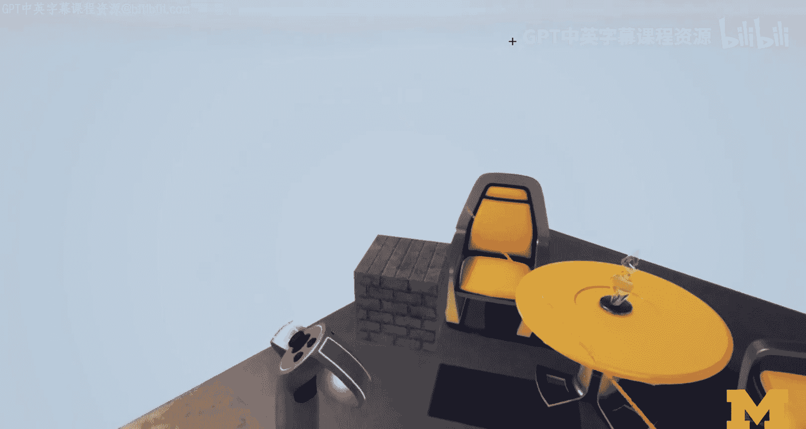

So I have a little bit of manipulation tools， in fact I actually have more than a little bit of manipulation tools what I'm doing right now is bringing up the scene。

😊，And now I'm actually going to edit things a little bit further and so I can change the scale if I wanted to so I can just scale the whole thing just with a controller in VR I could also scale any little things what I want to accomplish is I actually want to get it on top of the table so I'm going bring up the menu here。

And oops。And。And then we are going go into tools。 And one thing I wanted to show you is。A flashlight。

Which is pretty cool as a tool， like in a dark scene， you imagine working in VR in a dark scene。

And then we're just gonna disable this。 and we are going into the。Gizmo is actually。

 That's what I want。 I want to rotate。 I'm going click this object。 Actually。

 I didn't want to rotate。 But okay， here we rotate a little bit。 And you know what。

 we're gonna make it more like the di。And now we're going to translate it。

And so I don't use this too often on scale。This is transators down there。They not pick it okay。

 and we're going to actually bring it right in front of us and move back a little bit。

 but I can also move the scene。So it's kind of comfy and that's actually what I wanted to show you I mean there's a lot more that you could do and we could actually like really edit this object and。

😊，I'm just going to actually show you what happens。嗯。You can。Bring in。Different kinds of menus。

Stack an object to view the details。

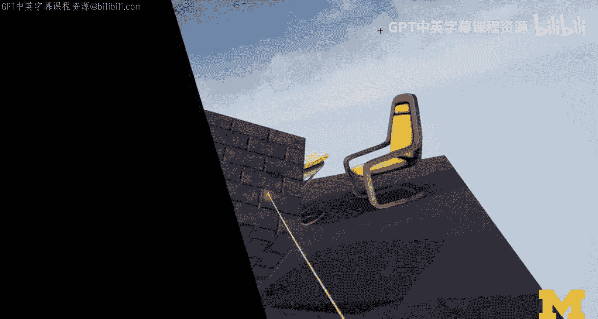

And then you have all the editor things here about that object in in the view。

And you can pick a different object and you kind of like have the inspector here。

 which is pretty cool。So I'm not going to leave VR。

 I think I wouldn't actually really go through all。

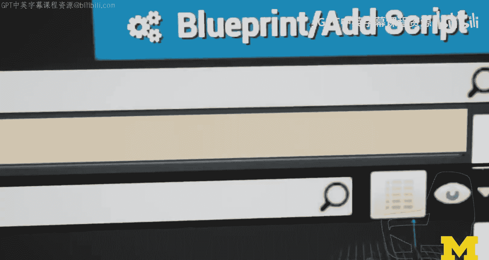

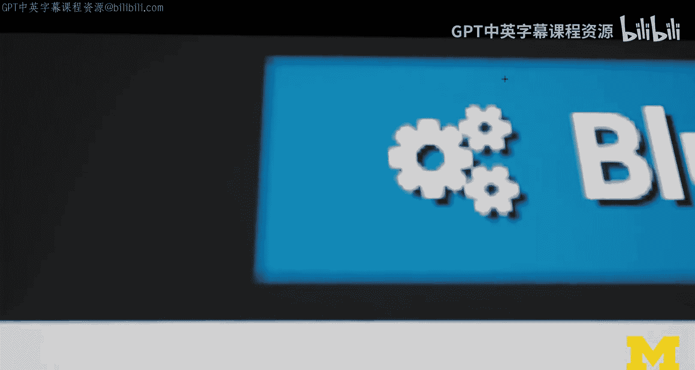

Through all these things。 But here is our new scene。 through all these things in VR。

 But here's our scene that maybe we've edited it。 And now， if I didn't like anything。

 I could just like undo。A lot of the things that I did。Just restore the original content。

 And so whether or not you， you edit it in VR or just in the desktop doesn't make a difference。

 In fact， there's a seamless bend between digital and immersive authoring and under Engine。

 which I think is in Upl。And it gives you rapid preview。

 So that's actually very good for prototyping。 So that was using Unre Engine with Rift S。

 And that's pretty cool。 Now I'm going show you as I said， an AR experience。

 So using AR core Mac AR with the unreal engine and to make it clear。

 I'm actually going start from the experience。 So we're running it on the phone first。

 and then I'll walk you through how that experience was created。

 and I'm keeping it at rather high level。 and it's intuitively explained。

 this is not really like a step by step that demo is going take for something it's not gonna be too detailed。

 but it's the first steps。 and if you are committed to learning more about unrealre Engine really check out a lot of their content they have lots of good documentation。

 So let's just focus， let me give you this demo and let's see whether you think unrealre Engine could be something for you to explore this course。

 and。There we are。And now I can like tap and it'll place objects or a randomly chosen geometric shape。

Put that in the room。 It also works like。Placing it， it does some basic。

Plane detection when it actually detects a plane。It'll work。 This one is funny。

 so I'll show the de bag and what we can do here is show the planes。

It's not as fancy a rendering as we have seen in some of the other software。But。It kind of works。

 Traing is obviously， well， this seems a bit。Of。But overall， it's kind of okay。

And this one is quite cute， unclear where it landed。 then a couple of other things we can do。

 One thing that I show is the origin。 this is where we were as you were starting the app initially。

 so we were really facing like this way。This is like almost our exact location when we launch the app。

And so we can see this。We can hide the debug。 and that's all we can do in this app。

 but it's a good starter project。 And now let's expect this a little bit how this is actually done in Unre Engine。

All right， here we have the mobile AR project in Unity， it's actually empty the way it looks。

 it's empty。So it's not empty。 it has， well， this map， which is empty。

It has a little bit of configuration stuff， which is not so interesting。

 it has blueprints that really give us information So one thing you will see is when you actually launch this。

 it'll show you not much but this menu first where you can press the start AR button and then once it launches the scene it'll put the scene in there and then you will have this menu here which you can show in how depending on whether you click this or not。

 so that's like that。

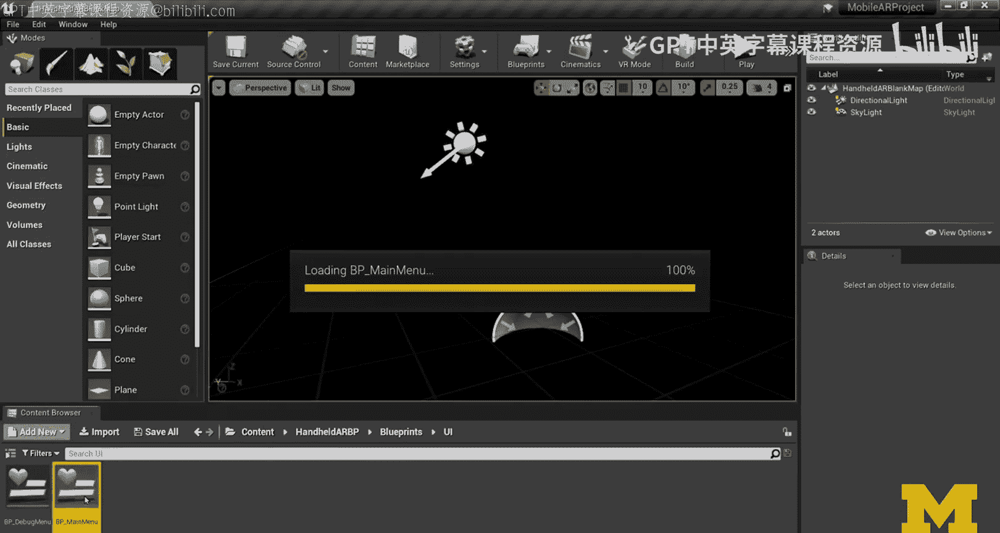

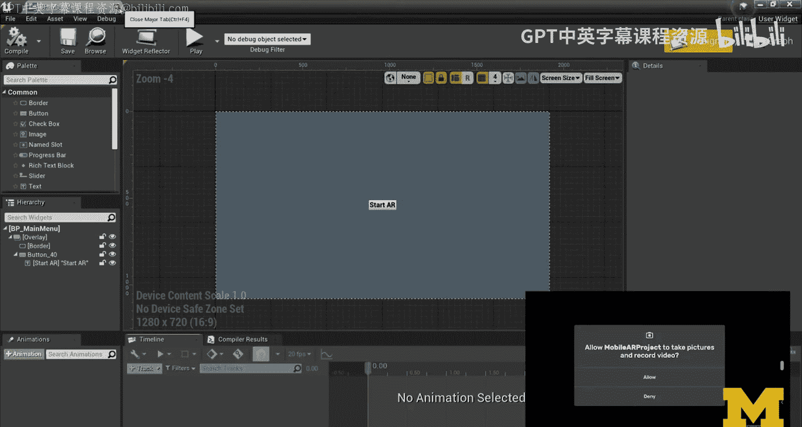

And。The other thing that we can look at is actually in the placeable。

 so this is when you actually you will see in a second when you spawn your objects。

 itll this is a blueprint so。And this one will basically create a new mesh at the determined location。

 And we are going to use a different blueprint to determine that location。

 And that is actually in the game framework when we do。

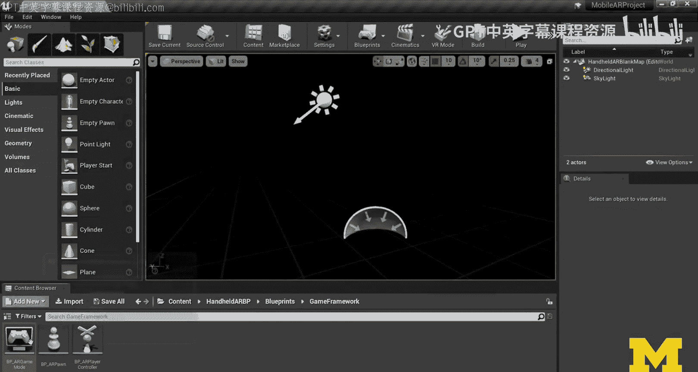

The well， not it's not in here that's just set up the basics。

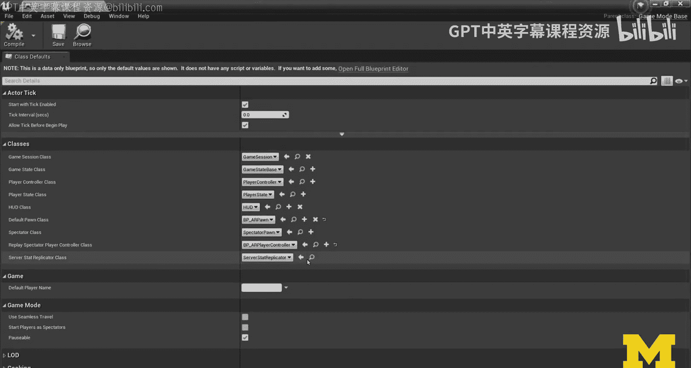

When we do any kind of like。Object spawning here， so you have a world hit test function。

 so basically when the user touches the screen， we are converting from the screen to world。

 we're figuring out through some kind of like pipeline where that 2D coordinate。

 actually what that translates to in the 3D scene， we're going to spawn a new object add that location and this is going to be our object that we are then going to spawn and that creates that what they call pin this example。

And so last thing I wanted to show is actually， so there's after a bit of setup。

 there is seamless integration。In Unreal， so I've now connected my mobile， my phone。

 my Air core enabled Pixel 3， I press this。 And what it'll do is launch a process to actually deploy things to the phone。

And this is gonna take a while， but it's building the executable。 It's packaging it up for Android。

 And then it's actually gonna launch it on my phone。

 But I've walked you through the basics of the project。

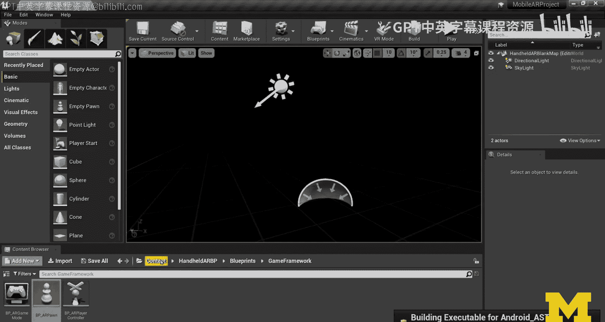

There is one last thing which is this AR configuration， which is this session in AR Foundation。

 for example， in Unity， so that sets up some of the basic elements for the AR settings and now it's actually deploying it to my phone which means like very soon we can actually launch it。

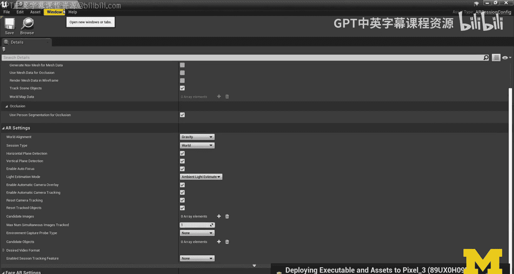

That basically is my overview of what the project looks like in Un。

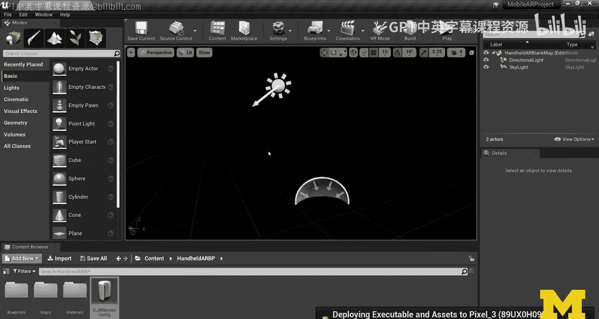

