# 密歇根大学《面向所有人的扩展现实（介绍⧸设计⧸开发）｜Extended Reality for Everybody Specialization》中英字幕 p97 13_AR-VR框架应用答疑会.zh_en -BV1jM4m1k73q_p97-

。

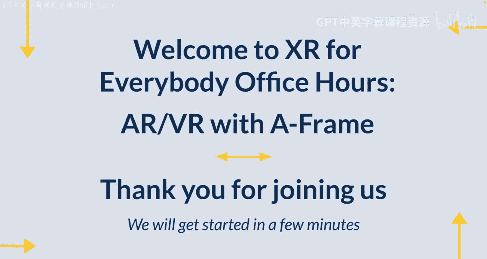

So hello， everybody。I was just trying to fix my Br aheadhead， just like it is usual for office hours。

 things break， but I wanted to welcome everybody and well thanks for coming。😊。

So I've prepared a few things I wanted to get through。

 but also just wanted to welcome everybody and I'll start sharing my screen here。

And so this is the office hours， it's one of three that I've planned for at least this semester。

 so I still operate in terms of semesters and I know that Don Cosera things are more fluid than that。

 but so currently I am in the winter semester and it is pretty cold in Michigan。

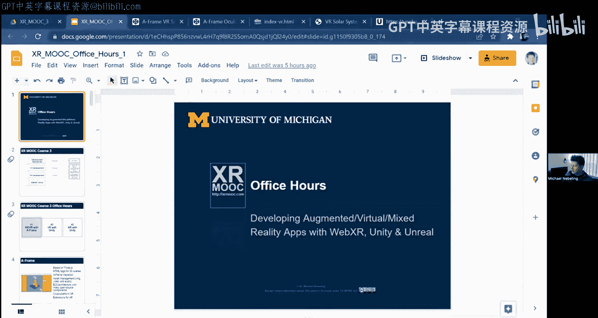

So this is the office hours that I wanted to hold and I wanted to specifically target the third course of the XMOC specialization if you are enrolled in that or thinking about enrolling in that specialization it consists of three courses。

 the first focus focused on issues and trends and also strategy and is really like a broad overview of the concepts and technologies。

 the second one is really focused on design design thinking prototyping both with physical materials and digital prototyping and the third course is this one this is the third course that I wanted to focus on it is focused on development it is the course that on the writing side is a little bit lower than the others。

 I think is primarily because even though my philosophy and my warnings are this is not a course about unity a lot of students still come in with the expectation that IT。

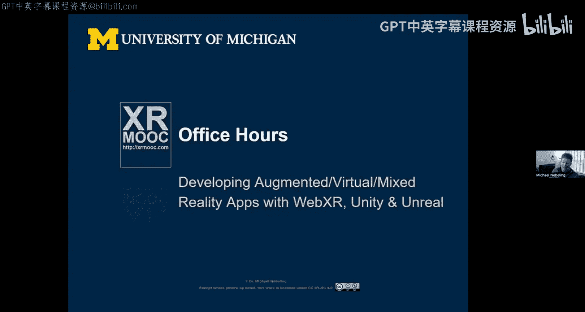

You how to work with unity， whereas my philosophy about this course is that I teach you how to approach extra development in a variety of platforms。

 including Unity。And then also including anory Engine and Web Xr。

There's a lot of stuff that I put into this course and I'm thinking about building out new materials for this course it's a little bit of a known issue I would say I would like to offer more hands on guidance so the way I've structured today's office hours is I'll just go through a few of the things focused on this third course specifically the assignments that we have here on the right so how to build your 3D scene and this office hour today is focused on aframe so WebExR is one of the one of the three paths we well I support in this specialization and then there will be two more office hours focused on unity we actually both will be focused on unity one I will dedicate to just virtual reality with unity and that's in about two weeks I think it's on a different day it's a Monday and then there we have one on AR with unity。

And so I wanted to separate those out， so today I have a lot of stuff I wanted to show doing AR VR with Aframe。

So coming back to this MO for a second so there is a series of assignments and if you haven't taken this course yet so I'll walk you quickly through it。

 it is like the other courses built over four weeks and the first one is an introduction but we get started right away we making the jump to 3D design and development which is targeted people that have previously developed maybe web interfaces or mobile applications and now want to learn how to pick up some of the new tools。

I WebExR so aframe is what I choose there we could go deeper into3 JS but with my students I usually they come from a broader variety of backgrounds。

 not just computer graphics and so we're using aframe and I'll tell you a little bit more about aframe in this office hour as well。

And then yeah you would build out essentially two projects and it becomes a little bit more immersive your VR scene starts out with a basic VR experience and then becomes more immersive and in the AR portion which is the each of these modules here on the left is essentially designed to be completed in one week so in the third week you would do an AR scene so many of you may be familiar with and maybe this is right where you are and so thanks for coming if you're interested in some of the other office hours so today you can also ask questions about unity or Androidre Engine but I will focus on aframe for the next 30 minutes I' would say。

And I'll just what I had in mind is I'll show a little bit how to approach this assignment。

And then we have also definitely time for questionss the that's the whole point I think questions will be primarily through the jet。

And。But feel free to yeah， I mean I think Trevor this is primarily for the chat right this is a webinar so you may not be able to show your camera。

So we'll do it through the chat and then I also receive some questions from the attendees who signed up and there were about 40 we have five years that's yeah I also'll send up for things all right so we'll look at aframe so aframe is one of the tools we I recommend using throughout this course and if you have a mobile webbased background so if we open aframe。

 O which is which you could do as well here I'll just actually share I'll share a few things with you first of all I share this link so you can click it and can open it on your computer and then aframe if you haven't seen it so this is this is aframe sos one of their examples deite example if you click into the scene and drag your mouse with a left mouse。

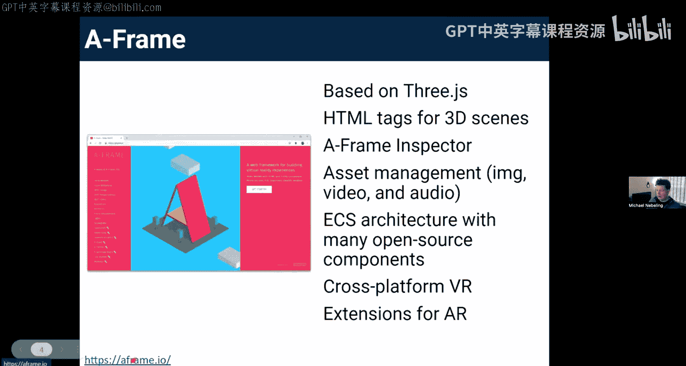

You can you can basically adjust a camera perspective and WASD is like walking or flying around actually here you just walk around。

 it's not flying around but it feels like flying around but the Y X never changes so you can you can walk around and then one thing they have in this example which I think is very interesting is this button called the visual Inor。

And I'll just go full screen here for a second， so in this visual inspector。

 this visual inspector is something that I think we will be using if you work on some of these assignments in a lot more details so here in here you can actually it's not read an editor in that sense。

 I mean you can make changes to the scene right now just using simple transform tools here X Y transformation and we could rotate this box also a little bit more or less if you wanted to and then you can go back to the scene and can actually see these changes。

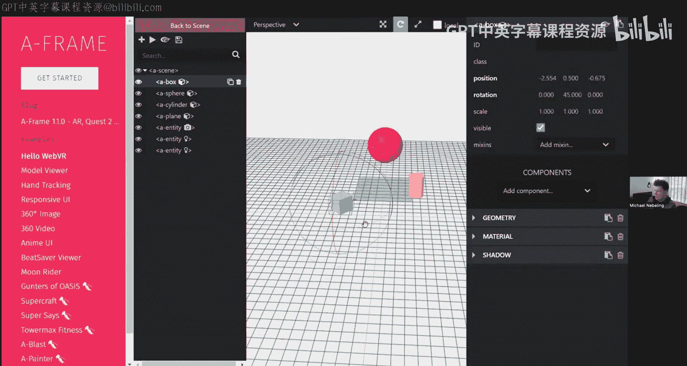

So， but next time you load the scene it's not saved or anything。

 it's not an editor in the sense that you may be used to from unity。

And so it's a little bit more tedious there' another thing which I think is very important when we work on assignments is opening the console here so this can be done in various different ways I would recommend using the Chrome browser it actually has the best support right now。

I used to recommend Firefox， but actually my example for today I just couldn't get to run with Firefox so this is aframe and at the end of this office I will share a link with a new collection of YouTube videos where I spend more time actually really explaining。

A lot of the different things for aframe and for unity so to provide more help as you work on these assignments and also this is recorded today and so we can release it to our learners so we can we can learn that way all right so I just showed you some of the key things which I think are very very important and i'm I did mention it in various places in the MOocC but cannot say it often enough so。

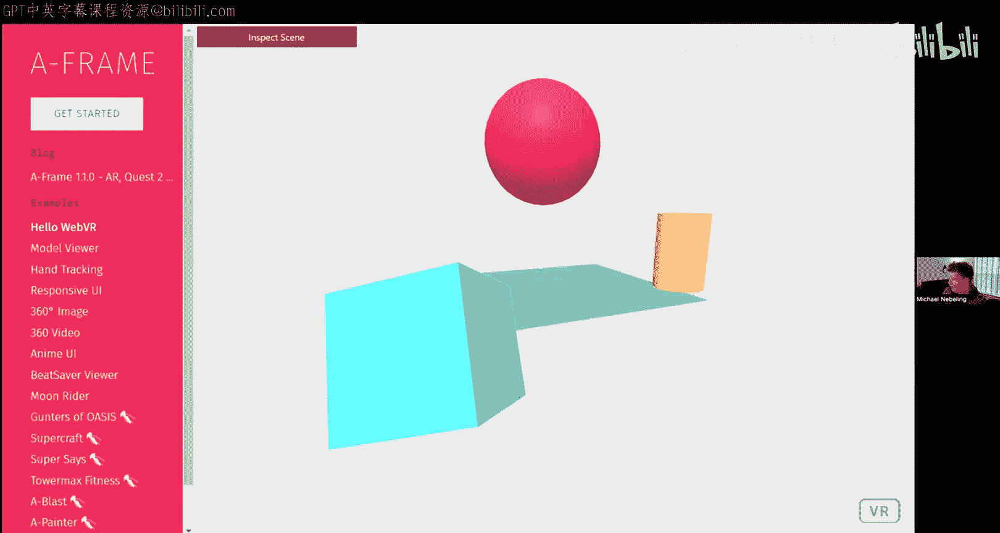

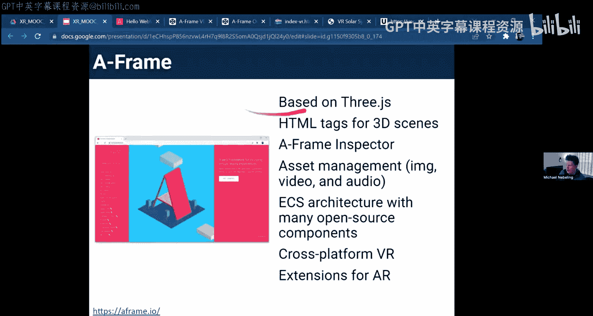

there is a keyboard shortcut， not every scene has this visual inspection button and this keyboard shortcut depends on your operating systems on Windows I press control Al I when I am in the scene so I have to be in the scene here and then I get this inspector loaded so this on Mac works with control option I。

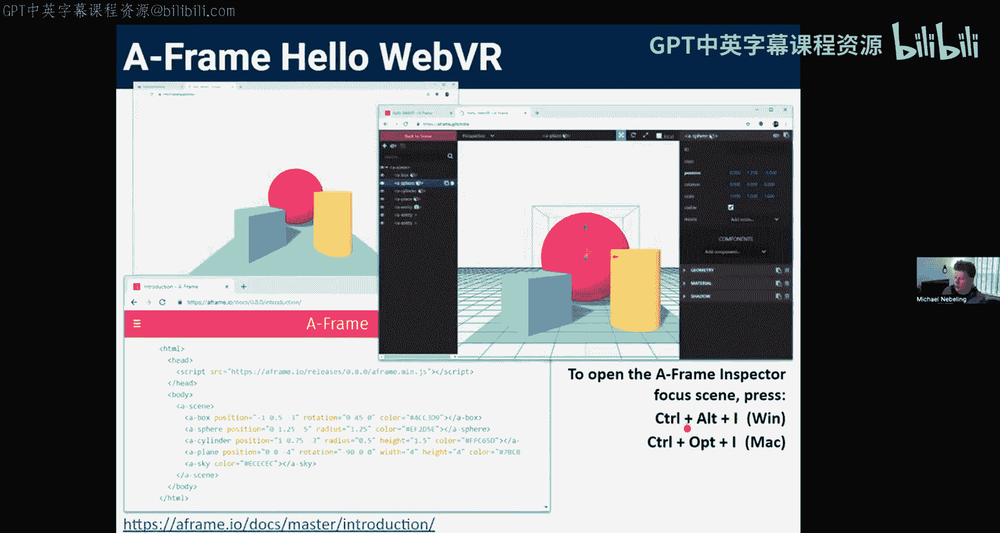

So that's how things work and so you can try that out anytime I can press controlI now and I get the inspector back and I can just go back to this。

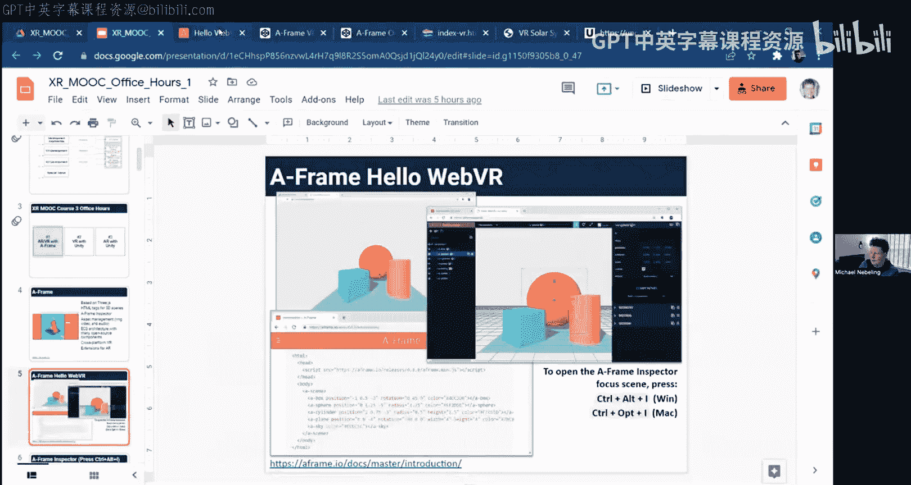

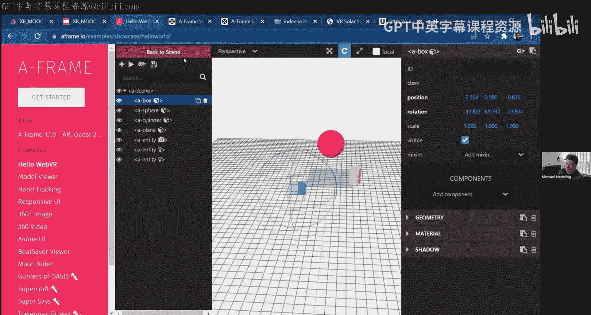

And this works on actually all aframe scenes。

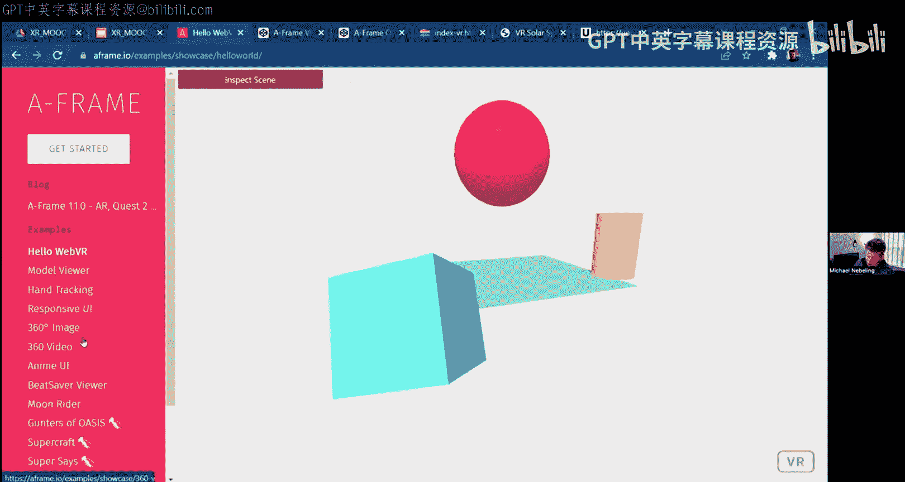

So if you'll find one that you'll think is very interesting this one has sound luckily I didn't share it was a very annoying sound。

 the sound is not shared but you heard it anyway through the microphone you can press controlI anytime and then inspect scenes and learn about how they were created and this one obviously is a good example because it has lots of interesting light sources and I mean I wouldn't call this a complex scene in the world of VR development but it is a more complex scene than most AM examples that you see。

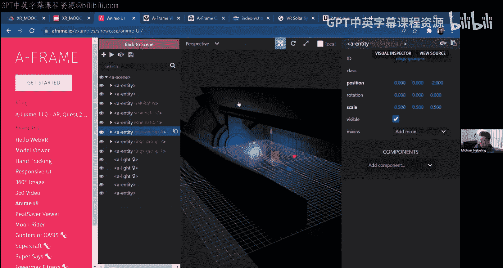

On the web so control I is one of the important things that I think my students always ask about and want to learn and want to be reminded of so I thought i'll do that so next we are gonna so this is a little bit of an overview of some of the things you can see in the inspector you obviously have the hierarchy similar to unity basically some of the components here including the default staff the transforms here and you have transformation tools which I used and they are up there on top and you can always see an entity that is kind of like selected and I think one of the other things that I thought I should show in office hours because。

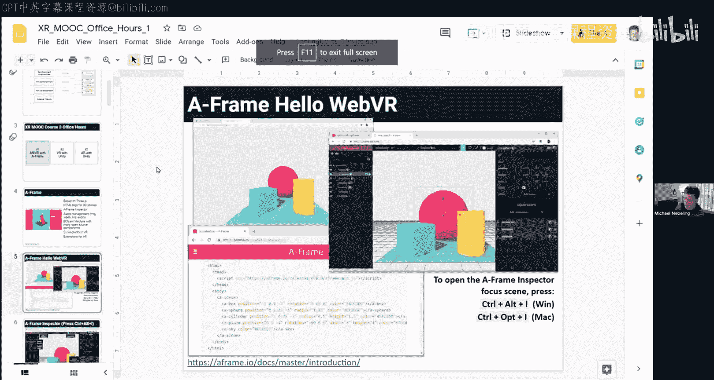

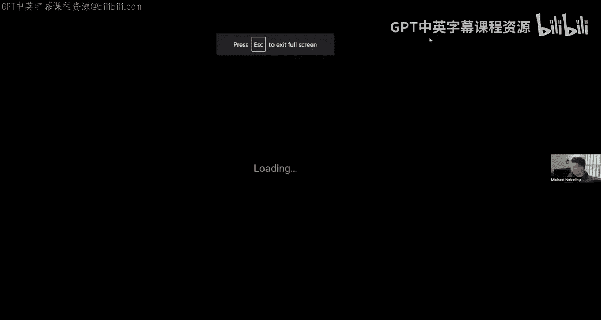

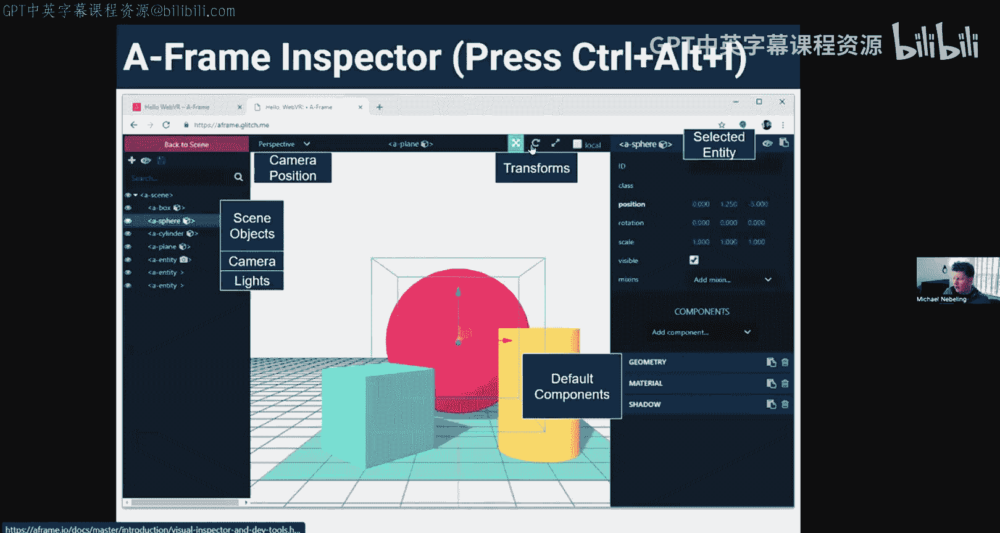

And then we actually speed up very quickly， but I show one more basic thing。

 which I think is also very important so I'm going back to aframe actually going here。

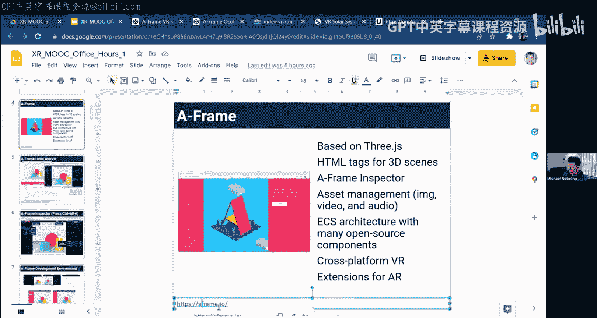

do just at the bottom of the screen。Sorry about that so aframe my own I wanted to show one more thing which is so let's say I have adjusted this this box like the way I really like it and like it a bit out and a little bit forward maybe so ZX is plus。

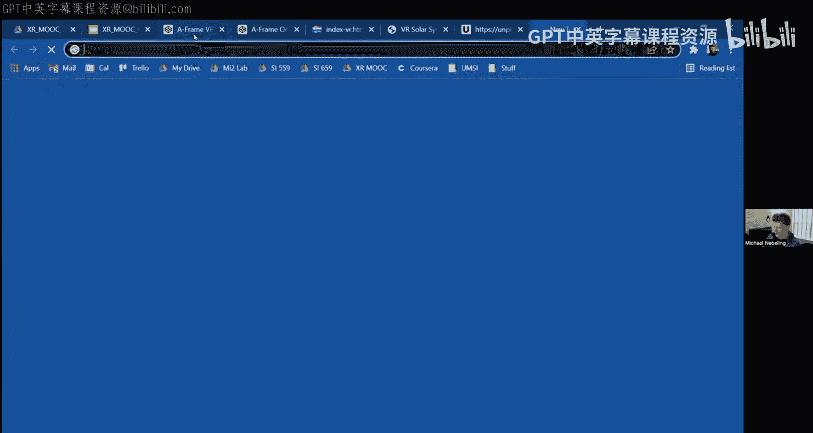

And I'm also going to do a little bit of rotation and let's say I've now finally figured out this is really this is really how I'd like it to look so you do not have to copy paste all these things out as I said it's not an editor but you can press this thing here and it would actually give you code so if I now open a notepad I will just get the entity and the transforms。

😊，And so this is actually pretty useful。😊，And what doesn't work so well。

 I mean technically this also works on the scene here so if I copy out the scene。

 I get all the stuff but the inspector and actually I can run this and actually as an AC not in an editor。

 so I just wanted to show you that the stuff comes out but it does insert stuff that you didn't actually specify before other box now because you didn't touch the material directly it just regenes an empty property but there's a lot of things that are being inserted by the inspector even if you really I was just focused on rotation and maybe a little bit of position。

Anyway， so this is useful stuff I thought I wanted to show that and I think it came a little short in the MOC because there's a lot of other stuff I talk about in the MOC all right so let us go to a template so the basic aframe template。

😊。

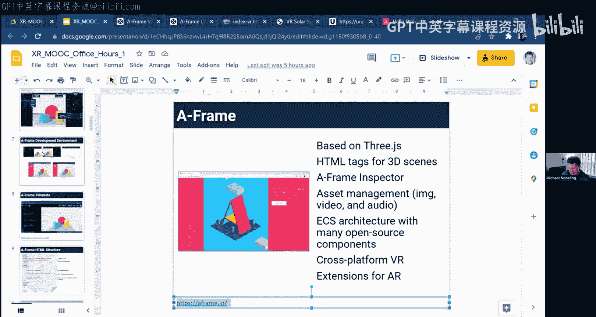

Looks like this is actually just the example that I showed you and I will share that one with you as well so this is here this is the template that I recommend using for a lot of the assignments and so you you can copy out now a lot of my stuff is on code pen and I'm increasingly moving to glitch I'm not a pro on code pen anymore stop paying for it glitch is actually one of the platforms that I would is actually the platform I would recommend for a lot of my aframe examples or for like for your aframe projects in this course easy to share easy to get feedback from learners easy to remix other people's stuff and can be the thing with aframe the thing with code pen is but you don't really see here a lot of people use code pen in the wrong way so they start by typing HTML body head whatnot but actually what is called HTML here is actually just supposed to be the body so I'll just actually write the AC and script includes are hidden so oftentimes we forget。

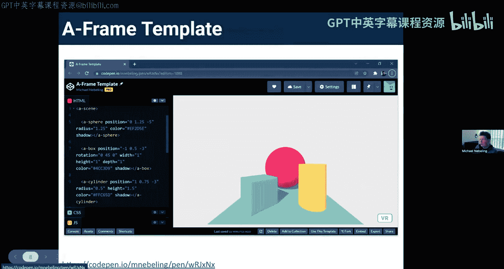

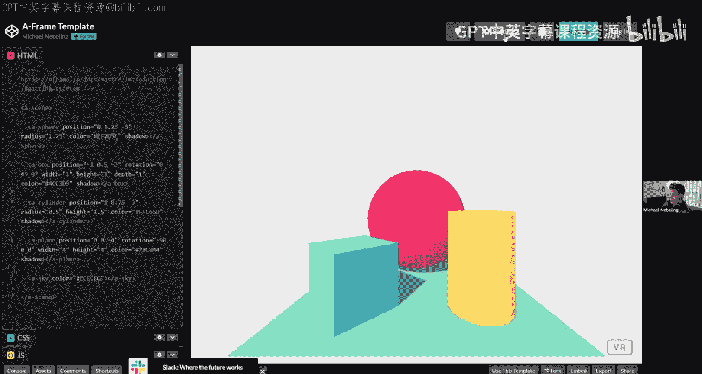

About that， but if you go to settings。And here is the stuff for the head。

 which is actually this is how aframe actually gets into the scene and for other examples there will be more includes here and so make sure that you check out the HTML stuff for the head for any of my examples if you wanted to copy paste them to glitch anyway other other than that a this is the same aframe scene it's pretty standard。

😊。

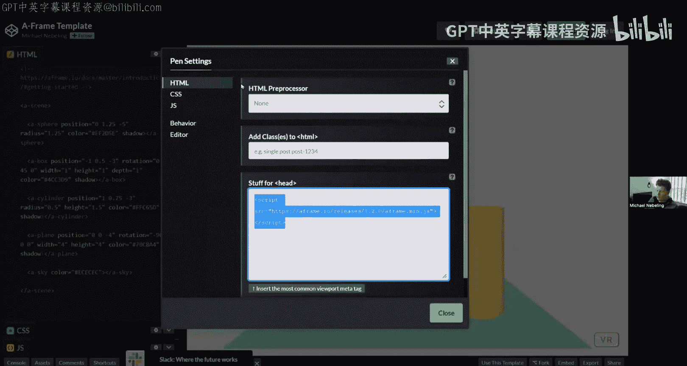

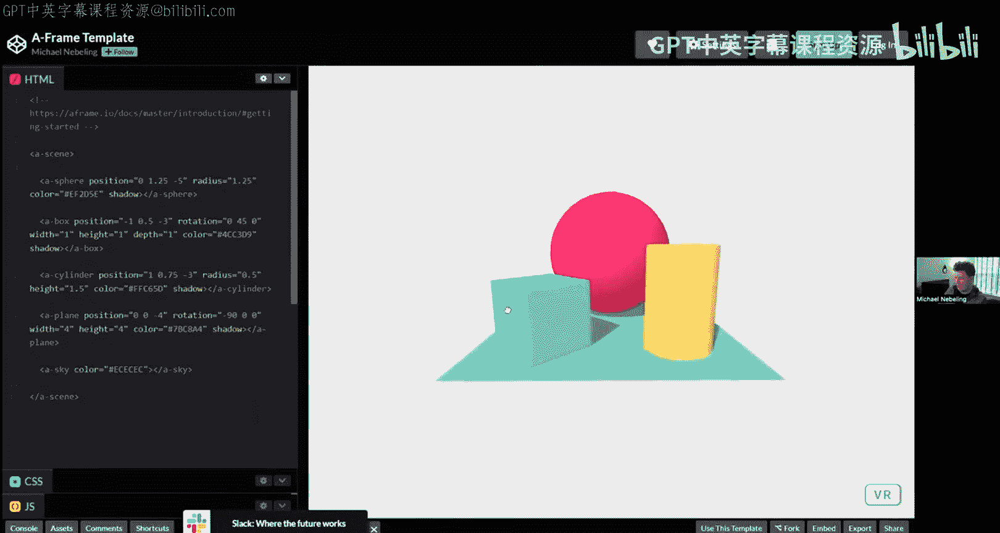

So not too much to learn about that one。So aframe。Is HTML based so we have pretty so we start by writing this AC。

 we need to include aframe first and then we may include any other JavaScript libraries to help us like teleport controls environment component all the kinds of things we need for our VR assignments for example。

 and in my code pen library I have basically a lot of components to help you get started and I'm also in the process of linking these things up a little bit better and releasing some additional content for the MOC for all three tools。

Today， again， as I said， for those that just came in， this is focused on Aframe today。

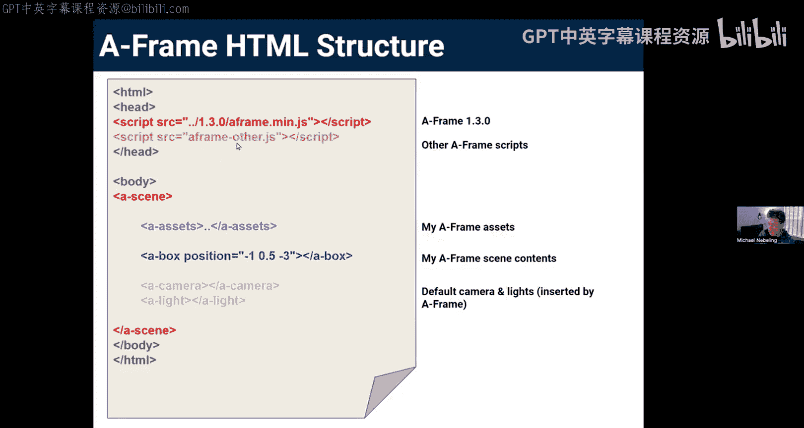

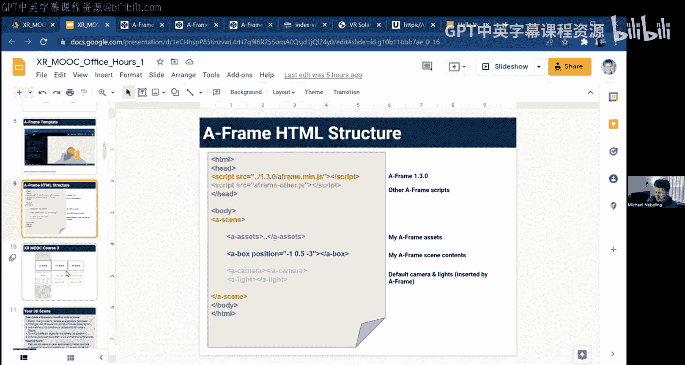

Okay， so the let's get started on the assignments， so I would just quickly want to show you how I would work on these assignments how I would want you to work on these assignments so in the third course we have three assignments we have a 3D scene we have a VR scene in week two and we have an A scene in week three。

And the 3D scene consists of a few different steps。

 you sketch out the thing that you want to accomplish first or you base it on example like a movie。

 a book， a photo， could be your own room， a lot of students always model their own room so that's really cool because you can compare and you can see how TDs it is and where you spend too much time to it but the clock in my room or not do I have to have the pointers or not yeah and it's a good assignment its a good exercise to get started with some of these tools so we do the 3D scene first。

😊，And then we'll learn more in the MOC we'll learn more about how to create actually VR content and AR content。

 but there is a lot of stuff， a lot of different options。

 so VR oftentimes people just show a 3D model and are're happy and that it's a basic VRC a more immersive one would allow you to I guess walk around。

 interact with objects and there is also then sound and good use of lighting and creates an atmosphere and just like feels like。

So the feeling of immersion is directly connected to the feeling of presence in some sense and if you feel immersed in the scene and if you feel like feelings of presence would be coming up if it's actually really well done if it's a realistic C or it feels like you're transported there anyway。

 so these are concepts that I talk about in the first course too much to expand on right now。

And AR in week three we'll learn about MAA based and MacA S AR so I have examples and what I do in the next few minutes I'll create a solar system I'm really into solar systems and I started this in the second course was if you saw me in the second course I did a couple of things in the second course。

😊。

And I want to do a solar system that is inspired maybe by NASA so NASA has this really cool。

 you can play with it， I'll copy the link for you， you can play with it。

 it's actually really quite cool so it's actually really also very complex to create something like this but here you have a solar system and you can for example click the sun and you get some information you can double click the sun and then it'll actually zoom into the sun and actually show you more information it's really the place you don't want to be even in the cold winter right now depending where you are obviously but you can also find Earth and you can fly you can basically fly to Earth I just went back to to the sun I just figure it out yesterday but no where my Earth here's Earth so we can also go to Earth and then from Earth we can also go to the moon and so obviously there example is really really advanced compared to what I'll show you。

😊。

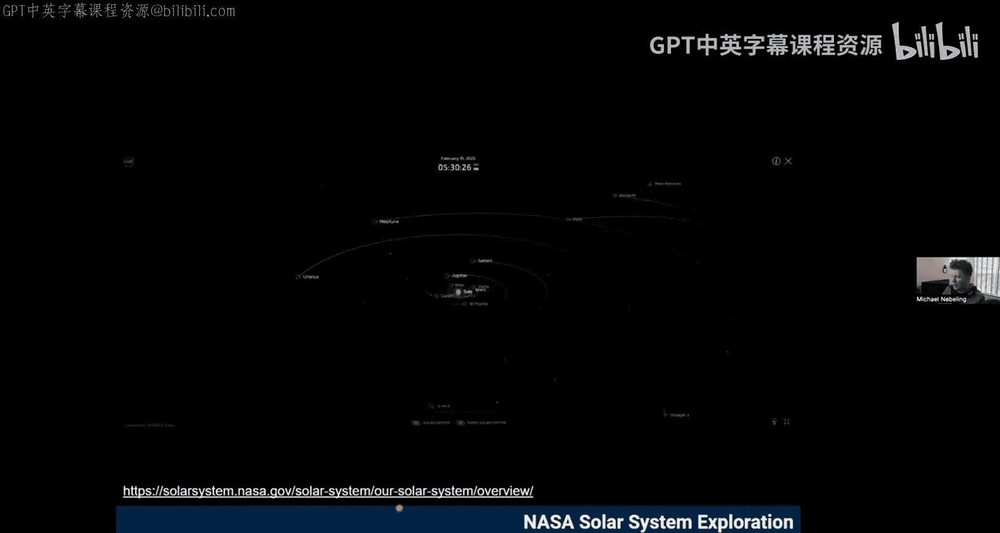

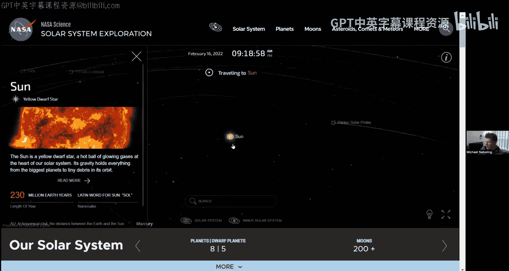

It is only a 3D scene so we wouldn't call this a virtual reality。

 it doesn't actually support tracking the user and there are three key characteristics for virtual reality displays and experiences that I would usually run through and the way interact with it is also through a mouse so it's not direct it's not natural。

 it's just indirect。

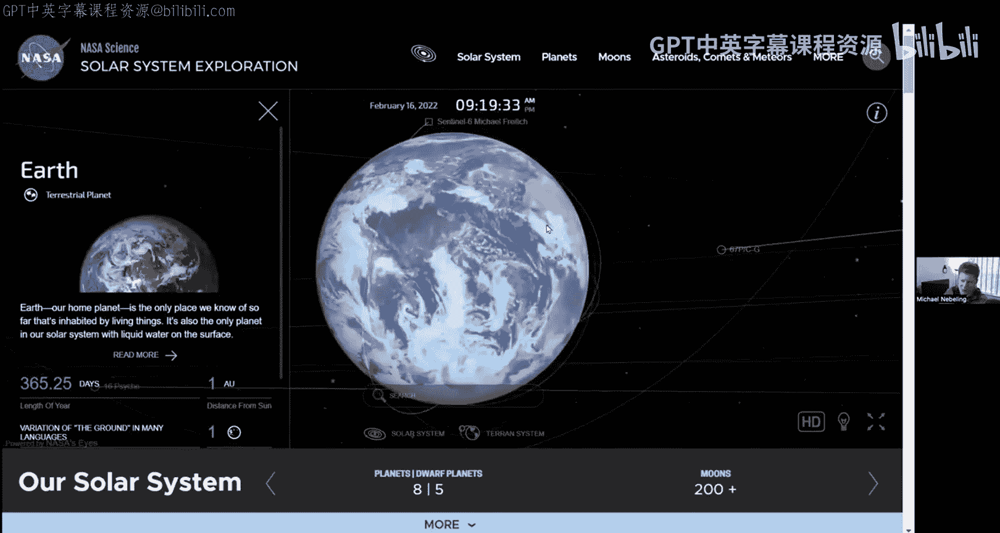

In any case， with aframe we can also create a 3D scene very quickly and then we can create a ERRC and an ARC and so I'm inspired by this and so I created this little mood board for myself which I essentially just screenshots。

 can go to the sun， look at it and can go to Earth and so that's what I wanted to create。😊。

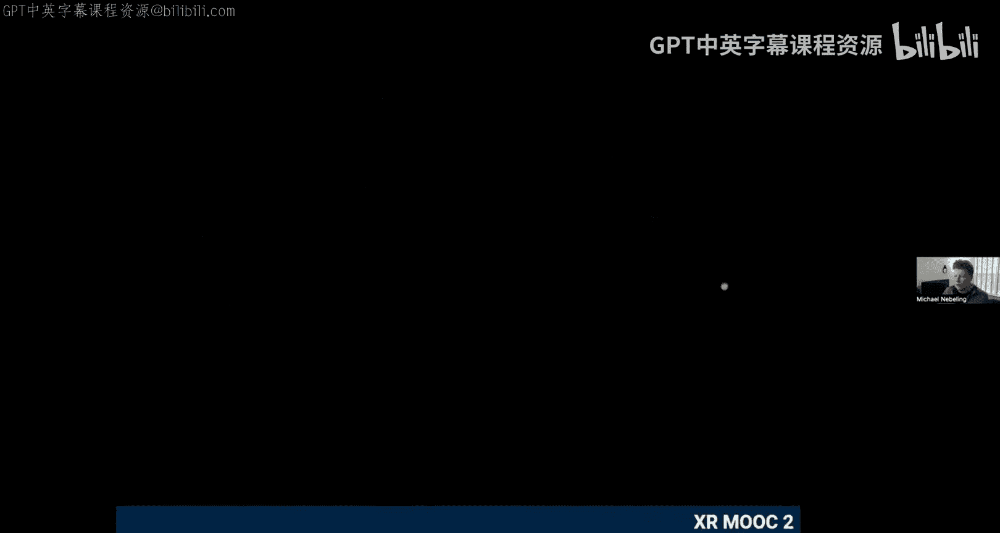

So then normally in a larger project like this， I will do a lot of steps before I do the things that I show now and this really the philosophy of the second course in the XMOC。

 which is really trying one of the things I try to teach is really how to think about the process and how to think about design even if we don't have a lot of industrial experience yet I mean they're obviously companies in this space。

 but they don't share the workflows really and if you get to work with some of them then you'll learn。

 but until then you can do the picture book style Michael approach。

 which is really sketching out existing experiences trying out some of the templates。

 I introduce in a second course， for example this 360 template where you can have rapid previews in a VR headset even in a Google cardboard or just 360 holding your phone in front of you so 360 like this。

 but here I just show one of the tools I created in research to actually go directly into A3。

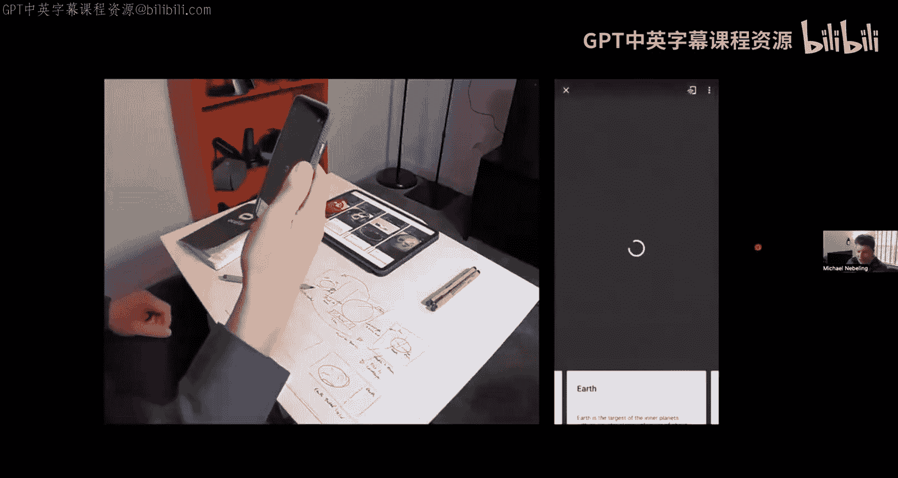

60。Preview some of the runs reached out it didn't work on an iOS I know。

I know that the Apple support and the ARVO at the moment is still limited。

 but hopefully it'll be better。

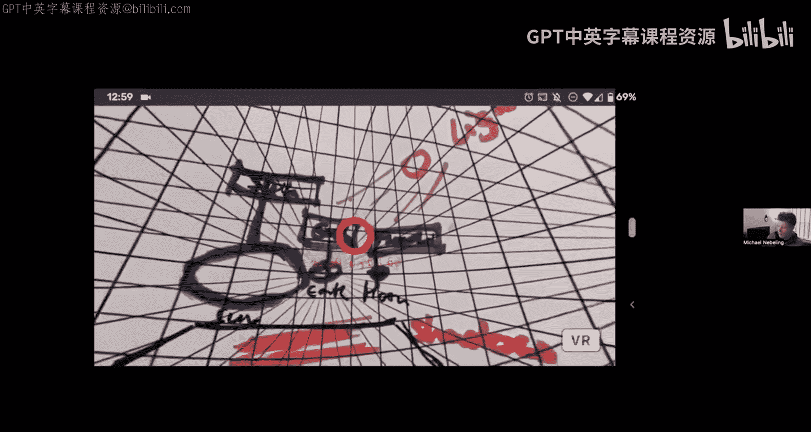

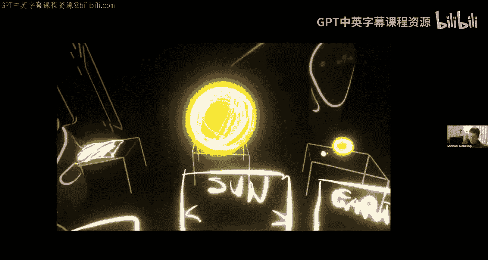

At some point so。

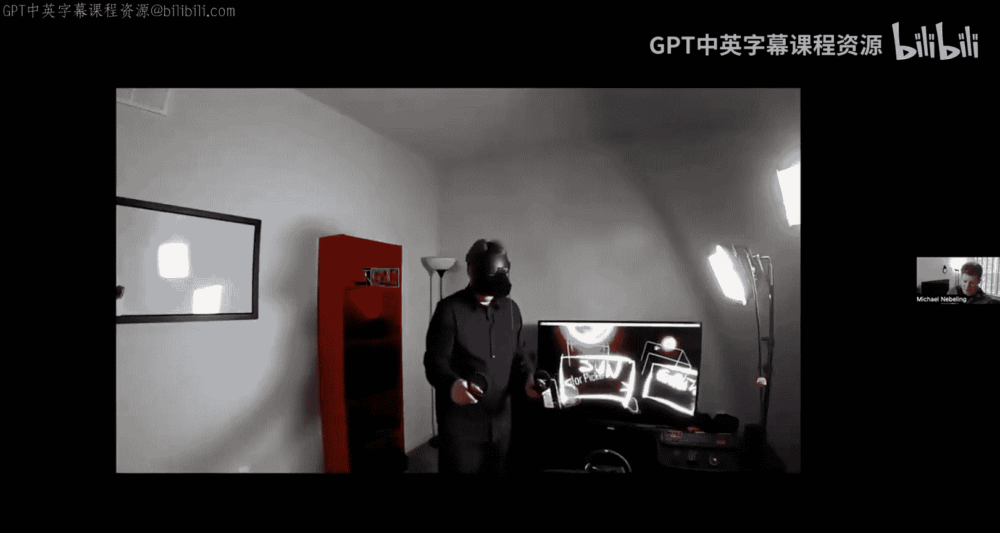

Did I not copy the link， I probably oh Trevor is just copy pasting the same thing，' okay cool。

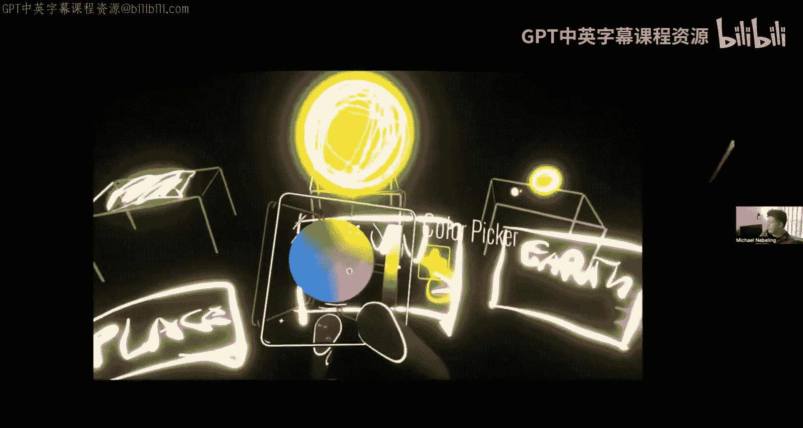

All right and then I would actually do kind of like immersive authoring and all these kinds of things that's the point of the second course here we want to be we want to be a little bit more advanced so and the assignment so the 3D assignment just like breaking it down in a few steps again one more time so the 3D assignment is creating a 3D scene in any of these tools so I will choose aframe today and then in future weeks and for my future office hours I will do something on unity and then maybe I'll do an office hour on on engine one day。

😊。

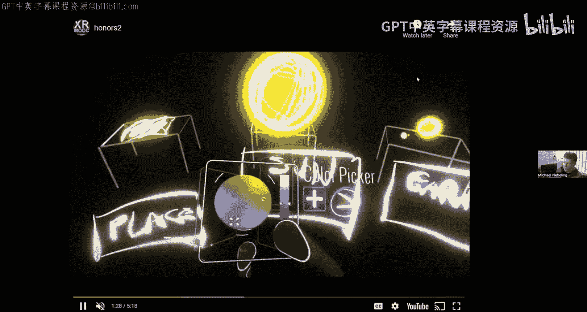

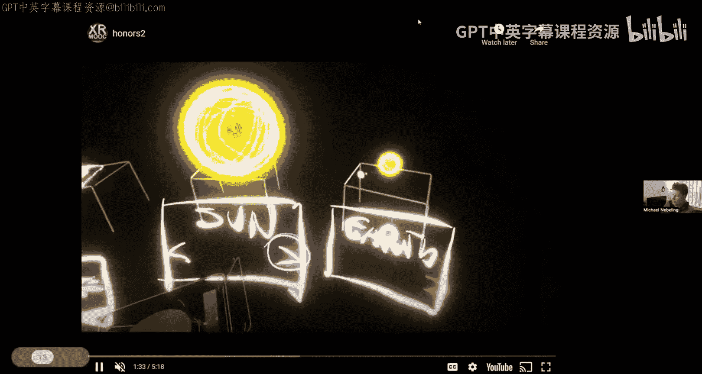

Okay so then there should be some kind of template or a sketch that's provided that I can share with other learners so they know what i'm going towards and can critique me on that and also it's my own goal so it's very important that we have a goal whenever we create something for learning。

Otherwise， I mean， you can't just say I learned JavaScript yesterday。

You need to tell me how you did it and what you did。

 what did you try to do and I'm pretty sure they you didn't look into promises yesterday unless you did something more advanced with JavaScriptscript so what did you actually learn when you said I learned JavaScript yesterday so you can say yesterday I created a 3D scene in aframe it was my first 3D scene and I had a few 3D primitives in there it's what I wanted to do and then I increased the fidelity a little bit by adding material to the primitives I'll show you that and then also have 3D models in there so I'll go very quickly through my approach then I tried out a few different camera angles I've played around with this a little bit so the things I show you I worked on for three hours yesterday so it's not I'm not able to reproduce the whole thing in 10 minutes here or 15 minutes for you and of these 3 hours I probably spent almost an hour finding good 3D models that are appropriate for licensing and showing here in theO sorry in this recording and actually that was very very tedious。

And at the end I ask you to add maybe animation slide and sound if you if you want to look into this。

 this would actually then start adding stuff on the more immersive side and so that would actually be very good so let's skip through this we just saw this so my sketch。

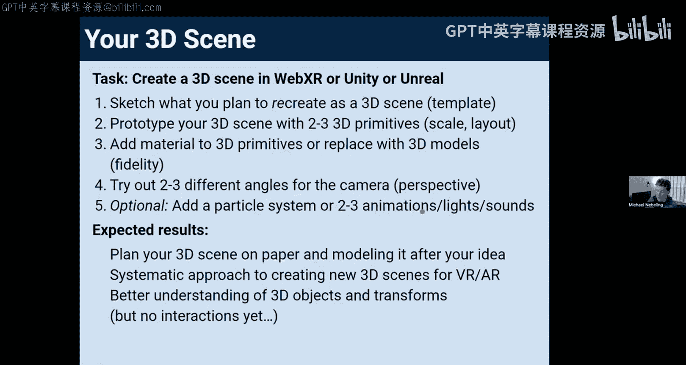

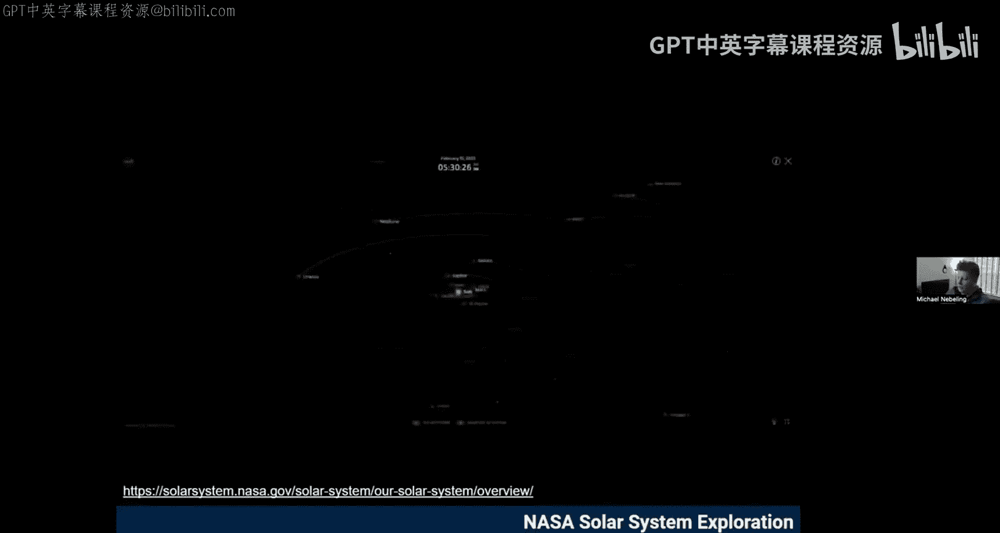

Is a concept， is's a design concept I developed in the second course going through all these prototyping stages that I showed in the video before where you could see me and try out all the different AIVR tools and scheduling and templates。

And so my design is based on an existing Google Expeditions experience。

 Google Expeditions unfortunately has been discontinued。

So but there are many solar systems that you can try out and so I wanted to like the user start maybe if it's an A scene then they kind of like scan and they place it somewhere or they put the marker somewhere so I was extra agnostic at this at this planning stage。

Really what is very important to me is the sun， maybe I'll show some data about the sun didn't actually prepare this and I want planets to orbit around the sun。

 so I'm not going to create a realistic like NASA style accurate kind of thing mine is a little fun and I want to be able to see sun Earth and the moon around。

The earth and I was exploring， for example， I would like to see the earth at day and at night。

And it is interesting then how do you do that， I mean normally you don't switch off the sun or something。

 it just really depends on the rotation and orientation towards the sun on which side of the earth we currently have night。

 but so my simulation is not actually a simulation is just it's just a little cute example。

 but anyway， I was going through this exercise。😊，So I started from my sketch， so this is my sketch。😊。

I am not sure whether I would be comfortable sharing this with other learners because I could have sketched a little more in fact this was actually one of the rapid sketches I did in the second course or maybe I could have annotated a little bit more but even by looking at it I mean you can already you can already see lot so that's gonna be a sun Earth moon okay I get it they're probably going be on a path so that's what Michael is going for okay so that's good enough and then I started creating my solar system and so now I'm going to share a link with you that hopefully everybody can see。

😊。

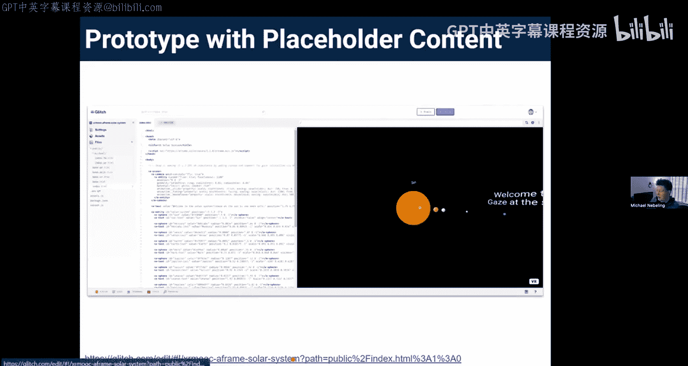

And。Because it is public， you may be able to actually。诶。Because it is public。

 you may be able to actually edit the code， so would appreciate if I didn't actually make a copy of this。

😊，So maybe we just watch for now， but anyway， so you can you can join in。😊。

And I'm probably just sending to panelists that's why travel is sending it to everybody Co。

 thanks Treor that's what I'm doing wrong Anyway， so in the future I will send my stuff directly to everyone and I'm sorry I didn't notice this before and I would use Zoom in webinar mode anyway here we go you're coming in slowly so I'm actually looking at one file here。

 which is I should be in my I want to go into my V2。😊，Hang on which which I was talking too much。

 Which one want to show you。 Okay， first I wanted to just like I had this at some stage in the course already showed that we're gonna do a preview here in and new window so you can see a little bit more。

 So this is my 3D scene as it is like plan out。 and I can look at all the planets here and they just have very basic color and somewhere here navigation is a little hard but somewhere here is Earth。

 I think Earth is a blue planet I could decrease the acceleration and stuff And then I can use the cursor that I have here and actually dwell on this object and then it says the sun as this and then I should be able to do the same maybe with Earth or with some other planets。

 but。😊。

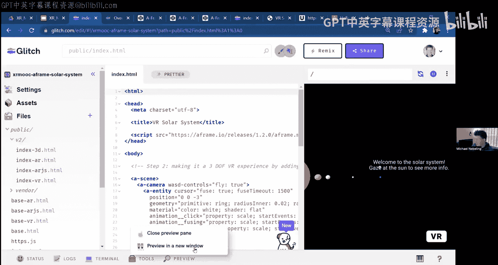

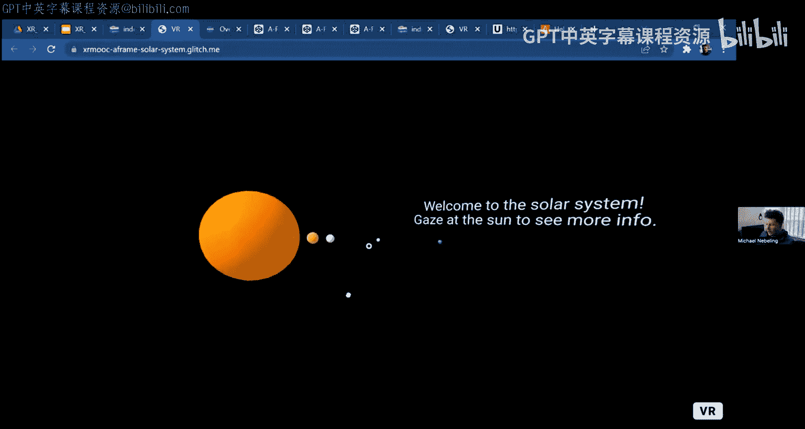

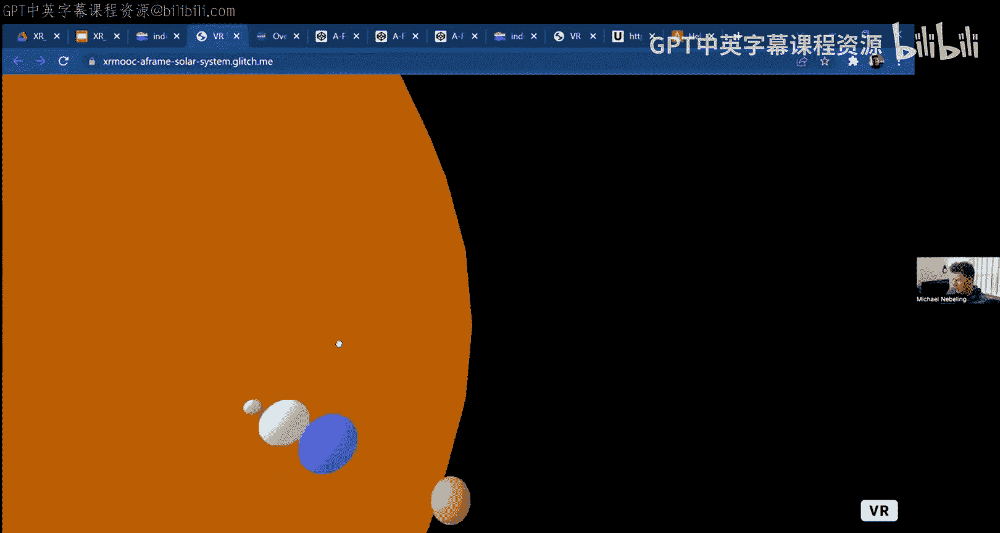

Anyway， so this is the thing that I created， but I want to take it further now so but this would be basically the scene with placeholders。

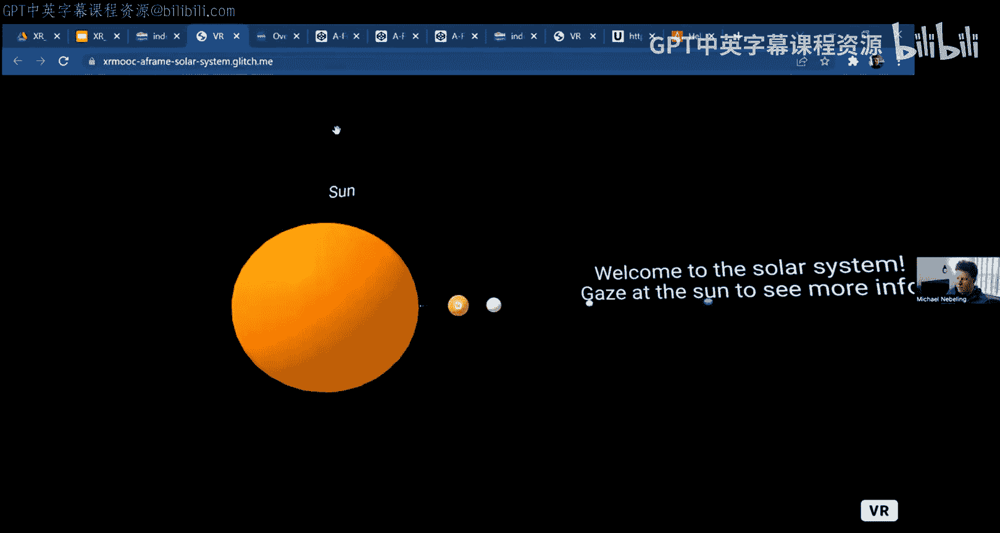

And actually for the next few moments， I want to just focus on a version toolth that I created。

 so I'm going to share this。

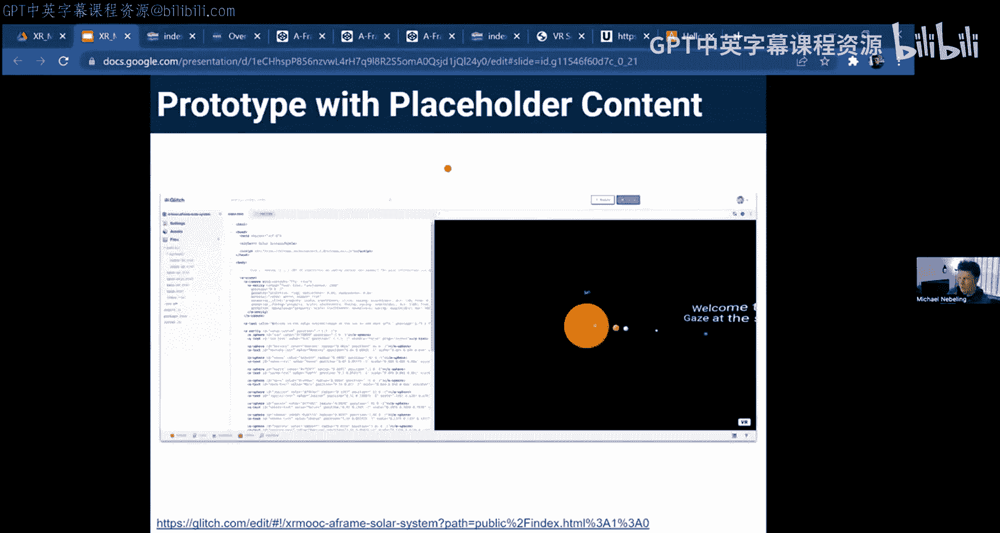

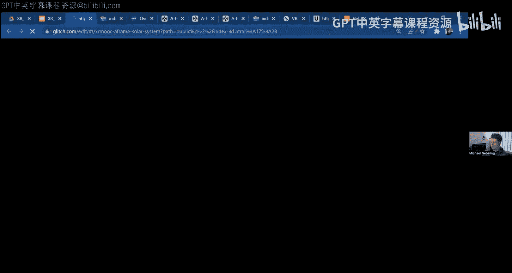

Link with you。Yep this should be the V2 all right this should go to everyone now so I'm actually going to look a focus at this one and just going to hide the files here and on the right I also need to enter V2 and then index and then 3D HTML is my example。

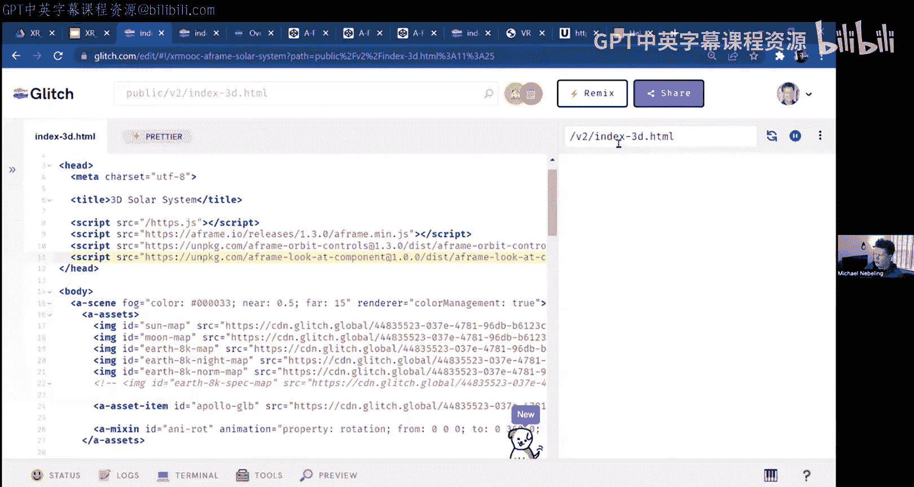

And so here you can see my solar system on the right so already well already did it right I did it last night as I said。

 but it's actually pretty cool I thought I'm just surprised that I cannot actually fly into the scene。

😊，嗯。Well， it should have a solar， let me just reload this with W AsD。

 I should be able to fly in there。

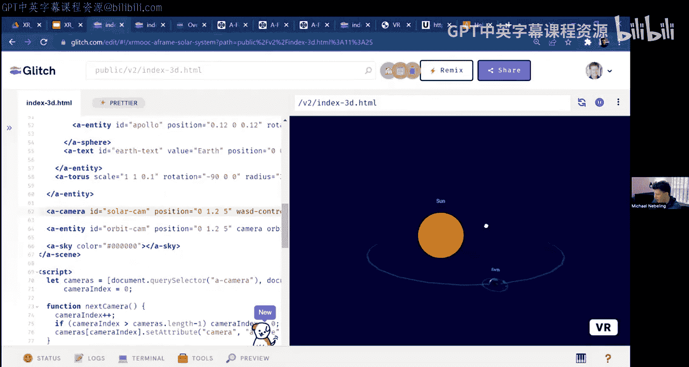

There's something wrong， one second。Faaiil to load。嗯。

Well this here but for some reason let me open this in a new window then I can hopefully okay so this is how it's supposed to work so I also if you don't want to look at the code the whole time I just want to play around with the scene a little bit this is the link to the scene as it is running in the browser so this is just by 3D scenes so what I have in here is like I have a sun here and I have Earth and earth is going around the sun and then I have I think at the end I actually have like a little Apollo 11 lunar module and then there should also be they should be on the way to the to the moon。

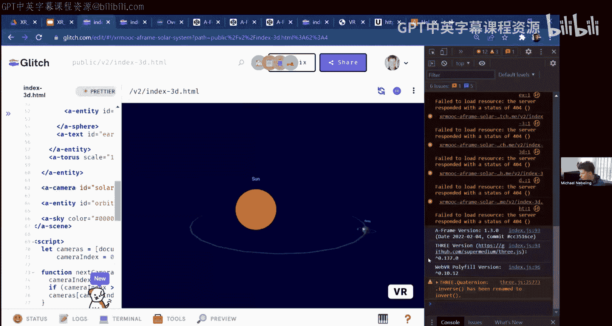

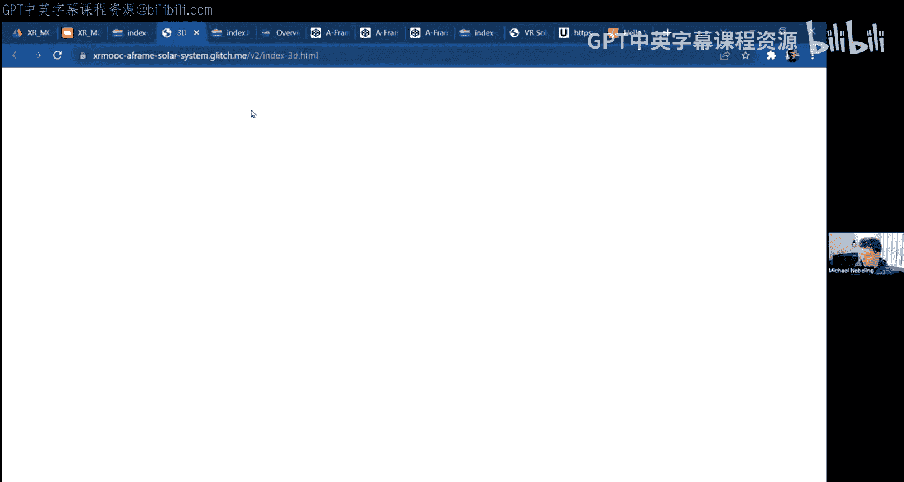

And it's like I mean it's rotating a little bit so it has some basic animations and then I have created some things I can press V to show or hide the path so V for visible I can do that and I can press N to make it day and night and。

😊，When I do that I swap out the textures and all these kinds of things so I actually change the way the world looks and so I'm basically kind of like maybe the guy on the moon who can switch or feellight somehow and I also then thought about so what I cannot do as well as NASA does it obviously their render that side of the earth like really an icy and really dark and that side of the earth and really like it would look like on daylight。

And but I am not NASA and I just did this very quickly and so anyway this is my prototype i'm pretty happy so what I do with it actually i'll just walk you very quickly through how I how I created this one so we're going to hide the inspector and。

😊。

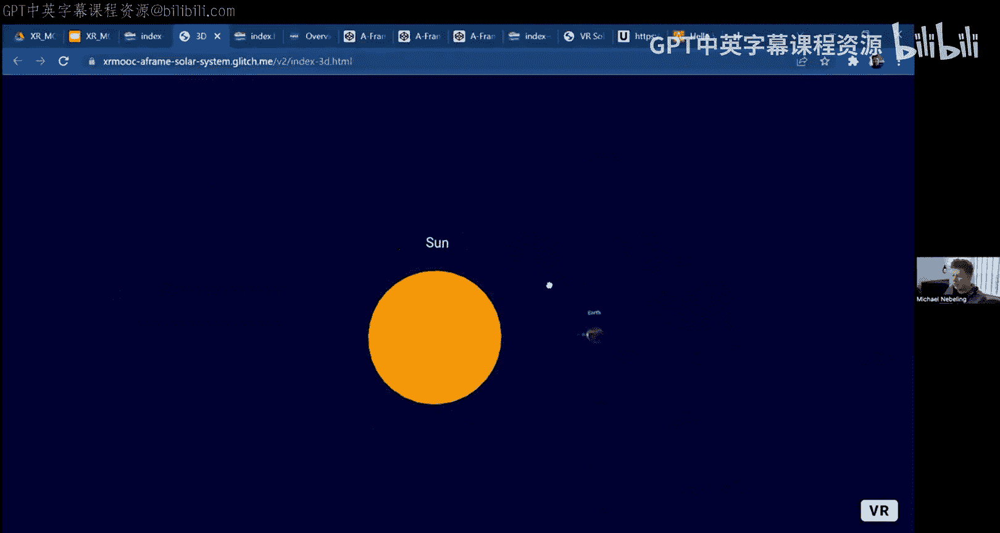

So。We have about 10 minutes so i'll be very quick I guess or maybe 15 minutes and then we should start thinking about your questions al right so I started it's the starting point that's shared with you I'm using aframe the latest version i'm very happy with aframe I haven't shown you one last thing in the scene that I also implemented but I'll get to it in a second。

Then I did spend quite a bit of time really like figuring out like what's the well the basic mechanics of having this thing the earth go around the sun is very quickly accomplished so let's just ignore the assets for a second let's just look at the solar system I added the light stuff also later initially I didn't actually have any light in there I just put a ball in there which was the sun and I didn't I didn't have any textures or animations so and all that was added but initially I just started out from the sun and the Earth and then the moon and I just placed them in the scene and then they were static and then I added all the stuff to to really work on the assignment so basically this is。

A solution now that includes lighting that includes animation and that includes materials。

And I got all the materials from NASA， so when you click assets， you will be able to see。

 for example， my dark booth that I got from a NASA related website is one of the NASA projects。

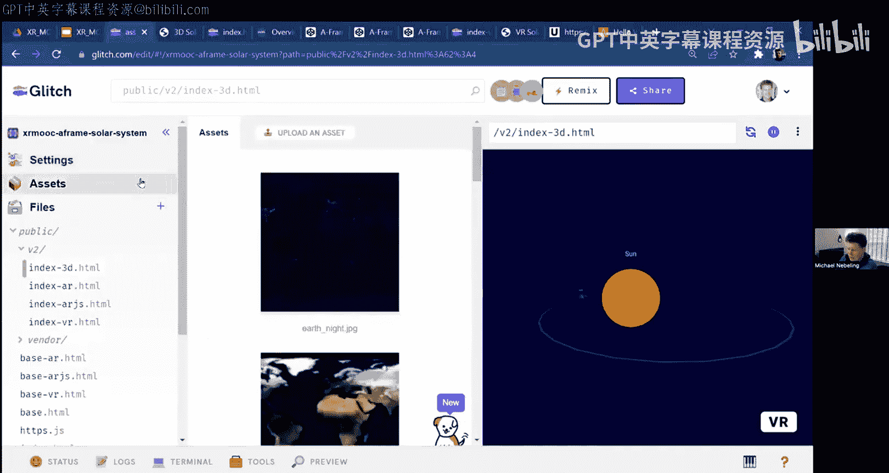


And then I had different versions of earth and I went for one that is called Earth 8K。


And I added also a normal map， a normal map， you can probably not see this very well here。

 but basically there is a little bit of information that adds a little bit of fake depth to this texture。

 this maps nicely together onto the 8K Earth， and so it makes Earth look a little fancy。


And i'm going to actually remove some of the lights i'm going I mean this 3DC looks pretty cool it looks like the way I want it but it's hard for us to inspect it so i'm going to change a few things it also came with a specula map but then I couldn't directly use it requires different shader Fong shader and that's not straightforward in aframe so I just ignore the speculula app I got the sun texture a moon texture and our Apollo guy the lunar model module。

And for the AR portion that I also want to show an ARGS version， I also use the hero marker。

 so these are the things I'm going to show。And I'm just going to go into the scene and just need to be careful and mindful of my time now what are the things I really want to show so I should not try to recreate the scene for you even though I think you would learn a lot。

 it would take longer than the time we have available。😊。

So I'll walk you through the things you can learn from this 3D scene so obviously i'm using fog in here so that's something we can disable then we'll start seeing immediately we'll start seeing a little bit more obviously it's still pretty dark in here I can also disable the default light。

And I have another light in here， which I think is embedded in the sun。

 it's a point light in the sun， this is the sunlight。And it's actually two lines。

 so I'm going to just disable these things。And I'm not sure whether it immediately updates for you and then otherwise the scene is still pretty dark because I actually have black background and that's something we could also easily change so if you wanted to change the sky a little bit so it's down here we can just like make it wide and then probably it'll look a little bit easier to the scene looks a little bit easier to inspect but anyway I'm going to undo all this because I did like the looks but these are some of the components so I have fogs lights。

And then animations in there， so this is what suffices all the requirements for the assignment。

And I can spend a little bit more time on。Answering specific aspects about this。

 Buts it's a pretty standard3D scene。 and it has only a few components in there。 So what did I do I。


Got all my assets in there。Right so this is the scene I wanted to grade I got all my assets in there I linked them up using so I put all my assets in the assets tag so the images I have to copy paste the。


When I upload an image like the Sun， so let's look at assets。

So let's say I've uploaded the sun texture， then I go in here when you upload into Gitch it just puts them on。

 it doesn't put them in a subdirecty or something that you may be thinking no it actually host them on a different web online store and so I do I copy paste the URL from here and then I go and find my my Sun texture I call it Sun map because technically it's a 360 picture it would be in my assets that I was hiding before so here in my assets。

Let me just。Make sure that they can see that now。So and then we have I copy paste that into SRC and then I have to add this cross origin or anonymous because actually this stuff is hosted elsewhere。

 if you don't do that， you sometimes have trouble with loading assets。


On glitch， so I did all that。And。Yeah， and then I linked the material to my object。

 so I gave the texture basically。SRC sunmap sets the texture of the sun so that's the first thing so actually this if you really do this and then the assignment asks you to look into three objects you will find a lot of different things you have to learn so the recommended format with aframe specifically is GTF if you work on this assignment in unity it would be FBX and then Unreeng again uses can also use these file formats but wouldn wouldn't recommend GTF with with Unreeng I don't think it's that popular and FBX as I said is the main thing for unity so it is very important to figure out like how to host this thing so the are tools for that when you download things so what you often do is like you go to a website like SkeFab and you try to find like a free Lunar model which is what I did yesterday took me more than half an hour actually took me probably an hour to be honest initially I wanted to have the space。

The International Space Station， but that just none of the models were smaller than 40 megabytes。

 so you have to actually also pay attention since its' web to the size。

So I then set it on this Lunar module here， which I can share with you as well。


And we should give credit to the person who created it。


This is1 billion LLC， it is actually non commercial usage so I pay attention to the license and then I downloaded this。

 I packed it， that's very important。


To because it came like with a bunch of files， but I package a GLTF as a GLB as an important step。

And I probably， I actually also have videos on that。

 like in more detail on my YouTube playlist that I'll share with you at the end。And then I host it。

 which is in this case I just drag and drop it into my glitch project and then I'll similar to the textures before I did link it as an asset item。

And I created an entity with the GLTF model that's all I did for the getting the little lunar module between like Earth and moon and I didn't get the dimensions right I think the lunar module would be too big。

Anyway， then a final thing that I did for the scene was playing around the assignment asked you to play around with different camera positions so I was looking at so far away。

 I had a camera position where it's focused on Earth and then I had one where it's actually the camera is attached to the moon and that's something you can actually run and can actually do in my scene so this is the link I shared had earlier and so in this first camera position I can just like freely positioned and like fly to everybody but then when I press the C key that's I've implemented it I can targetggle camera so now I'm actually a camera that is focused on Earth is's actually just coming going with the earth it's attached to the earth at a certain distance but I still have look controlled so I can still look around。


I have one that is attached to the moon so now you're like really next to the moon and you can see interesting just the world looks the the 3D perspective changes a lot but all I do is I just choose a different camera position and this one is attached to the moon I still give look control to the user and I show that in the code as well the last thing is I implemented in orbit controls but it doesn't actually always work as expected。

So I feel like I have to drag a lot with my middle mouse and zoom in and stuff。 So anyway。

 but the idea of this one was that I have better control over it just doesn't work so well with a mouse。

 I think it's better on a tablet。 So this last control this last camera is not so good。

 I like the first one where I can just like fly around in the scene。 So how did I do。

 How did I do this， So this is a little bit of code that I wrote a little bit of scripting at the end and so I find all the cameras in the scene that I have to。

 I actually specify them again， one is called a camera， one is called sun camera。

 moon camera and then orbit camera。 But the orbit camera as the one that I just didn't demonstrate very well just a second ago。

 And then I implement a function that when you press C。

 So the key press stuff is down here when you press C。 I'll go to the next camera。😊。


And I also have again， toggling paths and。


Yeah have all that in there so that is actually pretty cool so I have all these things in my assignment and you don't have to do this dynamic scripting you can just like choose to camera positions fly around in the scene take a screenshot share it with your learners you don't actually have to do it。

😊。


Programmatically。Obviously I had a lot of animation is the one thing I think I showed already when I press N you can switch a lot of things happen on I'm when I press N。

 I actually make the sun signatureper because it's like as if it's not there and I swap out the texture on the earth for like this night texture and I change the lighting in the scene show this one more time so if you find if if you look at this right now if I press N。


So this is I swap out the texture on earth， you can see how it's day and night and then。


I also change the light into a blue light so not accurate but I just thought this is a cool solution。

 so when I press n is my my target night function I do a lot of things and I thought this could be helpful for you to show how you can for example change the color of a light change the opacity of an object change。


Change the material like swapping out the texture and then I revert it when I press the N key again so you have some example code for that as well so obviously a lot you can do。

With JavaScript。😊，Okay so i'll show two more things and I created a virtual reality version of that and I am。


Thinking about the time， so I didn't add much more in terms of immersion because I put all this all my energy already in my 3DC that has lights has animation has a lot of immersion in some sense。

😊，So I added a camera rig to this scene that allows me to teleport and look at the world。

 I did not change the scale match， but I was considering making it larger and then I didn't add any other lights of sounds because I already did this for the 3D assignment but I would claim it if I had to be graded by Mike and all I would claim it this for this assignment。

And I have teleportation in there， so I have one example that is the one thing that I wanted to show you it is the VR version of this it actually looks almost the same it's just the position is a little bit different I have some cameras removed。


And I will try it， I had some issues with a headset before。

 so if it doesn't work I'll be sad but hopefully you won't be too sad。

 but on my computer if I press the VR key here it goes into my headset。


And。Which is currently still launching， so you have to do it one more time， it just actually died。

So it's loading here。And I will also make sure that you can see something as soon as I have it。

Cool so it is a little bit my headset is a little bit weird so at the moment it shows me this mouse cursor all the time this loading mouse cursor so I couldn't fix this in time but I I promise when I press this often enough。

😊。


It actually worked。And I have some kind of bag with my headset at the moment。

 but it just doesn't want to do it at the moment， so let me readload one more time。嗯。Yeah。

 I always get this error so there is。I worked on my other computer and heard have you had other people say this。

It just doesn't work work Okay， it is not as impressive， but I mean。

 then I can at least show you that I can very quickly go into VR here and actually see it when it's load when it's loading and I'm wondering whether I just need to give the browser more time but actually this is a pretty powerful computer so it shouldn't be。

😊。


The issue it just doesn't want to get away I may have to do some update to this headset so this is in some sense a is a little bit。


A nice VR version so I'll record this afterwards delivered in my YouTube playlist and I show you that this VR version also works and it's interesting you would be standing right in there and then I will also release a few more videos I just go with some of the additional materials I will release as part of my YouTube playlist to help you work on some of these assignments obviously i'm running out of time already and I want to answer some of your questions so。

😊。


For the VR project setup what I did was I used a VR template。

 the one that I have shared in as it looks like this one。

 this is a VR template and it has like controllers built in and actually when you run the scene on a good day it would allow you no phone screen doesn't work but it would allow you go directly into the headset like just like when I press the VR button here that's how it used to work on my computer just not to the office hours you get the controllers you can teleport around and I'll get my solar system also to work on this computer it's going be after office hours I'm afraid anyway the template is good because it gives you all these starting points allows you to tele theport around and then obviously the content is something you would swap out so I would recommend starting from the template and then some of the common controls that I put in there is super hands for hand。


ipulation。And that's something I also added to my VR version of my solar system in teleport controls and then I can run it in two modes。

 one is if you have a quest as an example， you can go to the Que in VR and go to the AS browser and load the URL that I shared with you earlier the same one。

 the index VR。Or like connected to the computer， I just used the Rift S。

 but I could connect the Que directly via USB and then use Oculus link and then would have it also connected as before in fact I have the quest here as a backup but I also didn't get it to work with the quest area Anyway。

 so a couple of things about the template。


That these slides I can also share with learners but basically this is the couple of key things that I added to my VRCs I gave it a camera rig so I can move around。

 I gave it left and right hand that I didn't use laser controllers I use hand controllers so you see hands instead of like lasers coming out of your controllers so see my I see virtual representations of hands it's not actually hand tracking as you have it on their quest too like with finger tracking it's actually just you still hold controllers but instead of the controllers you see hands you see big virtual hands。

And so this is the template， I have a separate template for the new hand tracking that just came out。

 maybe we have some questions about that。


And so Super hands is a component that I usually use and I cannot show right now what you can do with it in my solar system。

 but I will fix it and provide this video， but you can essentially grab the solar system and place it and scale it。


And super handss has a little bit of a setup so there's a couple of things to pay attention to but basically you need physics so that we can detect collision when you grab objects etc and you also need to specify the objects that are maniptable so you're draggable for example and if you have physics so if you enable physics and have dynamic objects falling down。

 didn't make sense in my solar system but then you also need kind of like an area where they can fall onto like a plane with aesthetic quality so this is some of the superhand stuff and I didn't include my screenshot here because it didn't work and then I wanted to show very quickly the the AR scenes and in one minute I'll be done with my little example here but we have recorded it so the AR scene is creating an A scene again one of the tools I choose aframe add the AR module。

Or ARGS actually， so I guess I grabbed the marker based。AI module plugin okay。

 well I didn't specifically write these instructions for Aframe but an aframe I would need to choose between ARJS which is MacA based AR and AI module。

 which is basically using AR core on an Android phone with the current browsers and the lack of support from Apple you have a very hard time getting MacA less AR on the web working in iOS so。

If you're using Chrome on Android with AR core you can do this so basically these are the setups so first i'll show you aframe with AGS and then with a Firefox webcam here so this is the ARGS template that i'll just why I connect my camera here I just play this so you get a sense for what I'm going to show you i'm going to have my solar system just in one second right in front of me。


Yeah。So we can move the marker around and the content would adapt so in my ARjS version of my scene I have adapted the scene sc down。

To make it appear at above the marker one second。Yeah。Just connect a webcam。

So we can actually run my solar system， so I'll show you my solar system and look。


It'll look like this basically has a few things， but it'll just have the solar system appear above the marker and it's kind of cute I have the marker here so it's my hero marker and i'm going to just like very quickly run it so it is my it is my。


AIJS version。And。It's already working here， but I'm going to go full screen。

AndI'm gonna allow camera access。 This one sharing with you wouldn't make so much sense you wouldn't have the marker I guess but anyway so as I point as I point at the marker。

 I have my solar system， it's still the same scene if I start pointing at things I may accrue the marker and then it'll stop tracking but Earth is right now is here go full screen and I have the sun there and basically I also inserted the virtual representation of the marker so you can see how well it's actually tracked if I accrue the marker I mean。

 a lot of my lectures are about that so I'm not gonna go through all that now but basically I also have the functions here that would be just on a mobile phone I can show a hide the pass so I can use touch on a mobile phone if I go to this URL on the mobile phone。


And I can change it to between day and night and it's just an interesting way to look at it if I had more time I would probably connect with my smartphone to the zoom channel and show you the AR version mark a less version but what I do instead is I show you the last step I also created a mark a less version which uses just aframe AR module which is built into aframe so no ARGs and I ran it directly on my phone so I'm going to this。

URL V2 index AR not index AR and JS， but it's the fourth file that I have in my example index AR and then I use I created dumb overlay so I can actually have a 2D interface on top of a 3D scene when I go into this AR button so I'm going to press the AR button on the phone and then I'll see it like I don't have any marker anymore it's just like floating in the world and I can press these buttons to switch and toggle。

Between the paths on and off and。Between day and night。


So I'll just provide additional videos for that， even my VR version when I get it running so this is。


A YouTube playlist that I've started to create， I will share this link with you right now。


It should be public it is public so and this will be shared with all learners and so in this YouTube playlist I started adding when when men and my students and my residential courses asked me or when some of theO learners reach out to me and ask me I often create a little explanation or it an additional to video so here I have an introduction to aframe working with 3D models in aframe creating my little solar system at least part one i'll add a little bit more to it。

Working with unity and then creating the solar system in unity and I've already started recording doing the unity again my solar system I'll just stick with this example。

Because it connects nicely to the second course and I would also add recordings for doing it with Unre engine so this is the we started out with a few tips focus on aframe today didn't get everything to show and work that I wanted I had probably more planned than we have time but now i'm going to look at questions as well and we have 10 more minutes for。


For your questions and we will just like have these also recorded by stop sharing and a look at the Q&A so we currently have I see one open question hellello I'm currently doing a VR project at my workplace it's an immersive storytelling using so experience using VR and it is for a younger audience。


诶。I have implemented so it's a very specific question I think to give instruction how to navigate the world etc cetera。

 I have implemented an instruction pop up as a UI but I was wondering do I set the scene and then have the instruction pop up to occur or do I have the instruction pop up before setting the scene to reduce friction so this is an interesting question so don't worry it's not specifically just aframe but so onboarding into a VR experience but do you show first to a user is actually is actually very interesting。

So I do think that the idea of pop ups in virtual reality is a very 2D way of thinking about an experience。

 it is not recommended。And however， in some webbased experiences actually specifically for aframe。

 what I often do is actually I need the user to click into the scene or touch like before they run it because otherwise the browser wouldn't play sound and stuff it requires user interaction so a very common thing is actually to have some kind of like instruction or at least welcome message that would go away。

 maybe you saw that for my Detroit zoo example it would take too long to find it now。😊。

But so in general I would design the experience not with pop ups don't really have there's no idea of a model dialogue or pop up in VR right in virtual reality the user usually six degrees of freedom can look at whatever they want。

You should think about building nesting the instructions into the experience so what you often see for example。

 when it comes to just like how to use controller menus。

 you see like little tool tips sticking out that follow the controllers in virtual reality and that is a very good way of onboarding and you could imagine similar things like the first time you pick up an object。

You actually build it into the experience， I think to be honest also in the experience that I've seen being created here at the university。

And the common development process is we build out this really cool experience that only the designer can use we don't have time for user testing and so now do we how do we get it out to users so we do a little bit of an onboarding thing or we show like a pop up or something。

😊，And but that actually doesn't really build the mental model of the user and they watch a video or see some instructions and then they still have to map。

 they have to make the transfer from that into the 3D into the VR world so the best way this is done is actually incorporating the onboarding directly into the VR world so Sun thank you for the question and while this sounds like a lot more work obviously for you because it's not just a simple popup thing so I would say if it's simple。

Interface， a simple pop up is enough then maybe it's not that complex an interface and you don't have to work too hard on this。

 but otherwise if youre developing a complex 3D game， for example， a VR game or AR game。

So I'm thinking of half life Alex and I showed some of these examples in my MOO。

Then you would actually build that into the。Experience。And so no pop ups， pop ups are 2D。

And we shouldn't think of pop ups in 3D and in VR and AR。That's what I say， but if you look around。

 you will see a lot of people that show them anyway because the ARV Awards are created by people that are primarily trained in 2D。

 not in 3D and were all figuring this out together and maybe I would answer this question differently next year。

So cool to do you as possible but this gives me a great insights yeah so this is it's like it gives you it gives you the insight into how I think about these things。

 but from a designer perspective， you know what the first thing I would try to do is see whether a simple a simple explanation that is floating somewhere in context is sufficient that the user can click away and so they figure it out。

😊，And what is even better is if there is a little video or something that shows how you interact with the 3D content。

 that is really good onboarding。But you don't actually have all the capture tools usually to prepare these things nicely so I I stopped sharing my screen I received some additional questions but please feel free to type them into the chat as well Anything that comes up right now just type it in I'm just going to look at some of the things that Trevor sent to me Trevor is。

The person hosting us today and he works with academic innovation and he prepared us nicely by sharing information with me。

And so some of the questions were about accessibility， AR technology is far more accessible than。

People wanting to complete AR what trends do I see emerging in augmented reality so first of all I see one important trend is actually while initially in my course I teach really the thinking differently about VR and AR but in fact the Archist quest too so that maybe many of you have it's a relatively affordable device now it is technically a virtual reality it's an included headset a virtual reality headset but it actually has a lot of cameras and so they have a new few things coming out initially just built into this for safety which is called pass through so when you double tap you have the device on you double tap you can see the world through the cameras。

And now it'll do some of this automatically when for example。

 people walk into your scene like you have children at home or you're sharing the place with friends or some a partner。

 it would sense this and actually alert you of them being there。

And you can use this mode called pass through， which we're doing currently in a research project really also。

to use VR primarily to prototype AI experiences， and I suspect that in the next version of the quest。

 the cameras here， which are currently grayscale will be much better resolution。And in color。

 so you would actually have a see through display。And then at that point。

 I think AR technology is really becoming more accessible because right now the only thing that's accessible in terms of AR is mobile AR but it's very limited so that was one question and then we can take one more maybe unless there's anything in the chat here is the common way for a specific technique to finetune plain recognition for AR foundation in Unity so so AR Foundation is using AR corere or AR kit which is Macs AR which is the one example that I showed earlier and that's a question I can actually respond to maybe in a future office all but the quick answer is the best so I you for some of my videos in the MOoc I wanted to have a clean white background so that my learners don't see all the mess that's going on in here and feel like Michael is well organized but then if the headset is just plane detection against the white monochromatic kind of stuff。

iss actually very very difficult so the best thing to improve plane detection is actually to make your environment noisy so put some I put some pencils on my white postboard and it looked like it looked like I was really working on an interesting desk kind of area and then actually improved the tracking because I gave more features to re track。

😊，Okay， and then maybe a final question。😊，What are some hurdles that when we overcome them will change how we interact with XR so that's a very interesting forward thinking question so one big issue right now is and this office always focused on web XR and aframe and one big hurdle is that for example Apple is not really supporting it on their browsers so once we have more universal support across all kinds of platforms I do think that webbased AI and VI experiences will be very very powerful like I mean in my experience working with students doing unity and Unre Engine projects is just so tedious to exchange and look into their things and like yes we can use GiHub and we can share source code and blah blah and all of that but。

It's just different if I can share a link and the Web ecosystem is also interesting because it will provide a safety layer dealing with issues of privacy and security that I think is very。

 very important so to me one of the biggest hurddledles is actually how we have certain vendors stand in the way of standardization of the WebExR standard and so if Apple were more onboard and actually pushed it harder together。

 I think it would actually be a really really good improvement and we could see a lot more widespread usage of VR and AR across the web and that if history is a good indicator I mean the way the web evolve was just through user generated content。

 the ability of having people giving people the ability to create things on the web through simple tools like WordPress for example。

 a jry and bootsottrap so they could be similar toolkits and tools for people to really make this。

And good and hopefully also the browser vendors have to work on making it a safe place。

 but I think this is one of my this is one of my biggest hurdles。

 it's also driven a little bit by some of the research they're looking at。

There are other hurdles like the display factor， the battery， the input is limited blah。

 blah yeah you could answer all of these as well， but from an evolution perspective I think getting the Web X standard really moving it forward and that is related to this office hour I think it's the best answer I can give today so thank you for coming today and attending this office hour I had a lot of fun I hope this is useful for not only for you here but then also for other learners。

😊，Who will watch this recording and I will hopefully by that time have made up followed up on all the promises I made so I get my VR version of my solar system working I'll add a few more videos to my YouTube playlist and I will expand all three portions and these will be linked back into the third course now we have to keep in mind that I'm a professor at Michigan so my primary responsibilities is doing research and teaching here and the MOC was actually just a project that I was approached would I want to do this because I've done a few online courses in the past and I really enjoyed working with the people here that also on the call some of them from academic innovation at the University of Michigan and so we put together this XROC and it is interesting so we have about 10000 people that are looking at it I'm not sure who is enrolled in what they're doing really but I look at some of。

The Hoors track assignments I would recommend you also look at the honors track so the honors track in all three courses is actually other learners creating interesting experiences in all three tools。

And I over the next year I will try to build a little bit more of a community around the XI MOO a little bit of a community and the office hours here as a start and then maybe we can explore some other things if people are really interested in learning more that way so thanks everybody for coming and yes so have a good one and bye bye。

😊。