# 密歇根大学《面向所有人的扩展现实（介绍⧸设计⧸开发）｜Extended Reality for Everybody Specialization》中英字幕 p99 15_虚拟现实设计原理第二部分.zh_en -BV1jM4m1k73q_p99-

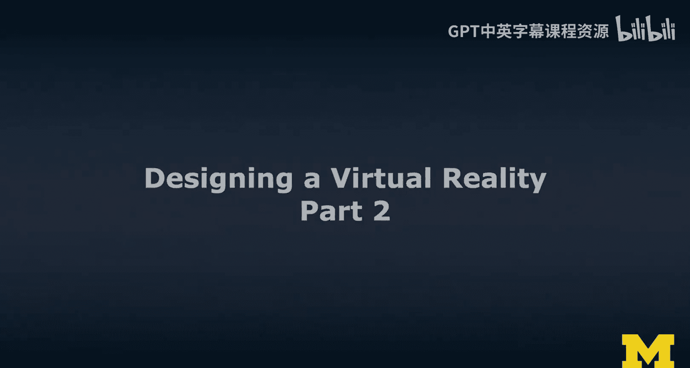

So now I'm going to actually take you to the zoo five times。

 essentially flying down into the zoo and showing you how we designed this in the zoo in layers。

 and it's also an example of iterative design， which is the next thing I want to talk about。😊。

So we are。Apparently， yeah。So here we are flying into the zoo。

 This was actually the scene that I had created as part of my office hours。

 So this was 20 minutes of work， I think， flying down this way。

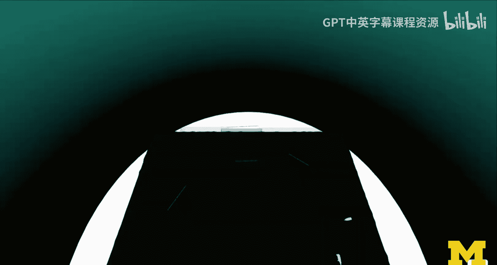

And then Kara came in。And this is a lot of the virtual world already in place。 we now have animals。

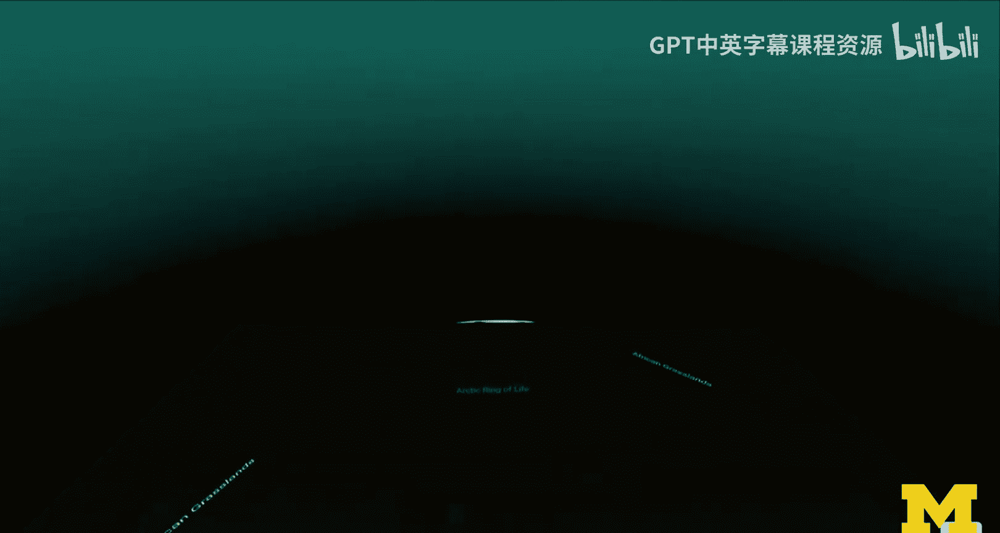

And here this is our more environmental design oriented solution。In a third stage。

 we actually developed， and I would recommend we developed this in a separate scene before we plug it into into the final version。

 a menu。And we then actually also brought in this patting。Aand。Ptting zoo and feeding area。

So the red one that's ahead of us。 And then the final experience。

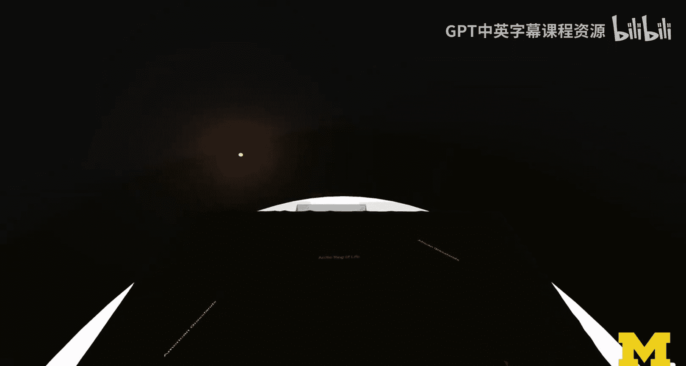

Taking these two lab scenes that we just had with a neutral environment and putting everything together。

 And here we are in the zoo。 And now that is pretty， pretty cool。

 I wanted to show you this composition， And I want to talk about in the last few slides。

 I want to talk about a few things as you iterate on projects as you build larger projects。

 So a few tips there， when you're designing virtual reality。 So you should approach this iteratively。

 just like when you do web design or mobile design， you do it iteratively。

 So one way to do this here， think of it as a layered approach to environmental design using three main ways to actually build your Vr scene。

 you can start with 3，60 content first。😊，You could then bring in 3D primitives and then finally only then you bring in the 3D models so the final 3D models so the 360 is really just the placeholder for the environment this could be a 360 sketch and that's something that we'll talk about or we have talked about if you took the second course then you will be familiar with that concept I'm going to show an example in a second。

Fcus is obviously on planning the scene visually and spatially very important。

 and you can do this spatially without depth。 So 360 is a good way thinking around the user。

 then you can actually work with 3D primitives。 So this is what I would do if I were like as a web designer this when I did web design you know I would start out with the divs and color code them and then I do CSS and then I do responsive design and so me color coding these divs essentially helps me understand the flow and the stacking and whatever I do in responsive design。

 And when I started out with the Detroit zoo I was also thinking in terms of these different kinds of areas。

 defining these boxes。 I left them in the final experience because they didn't seem to be distracting and they actually directly map to the map of the Detroit zoo So the areas that we have defined and the color is partially match depth。

😊，So I've been using the zoo example a lot， but I want to actually do an example here in the studio。

 so I took a 360 photo of the studio。 It's here。😊。

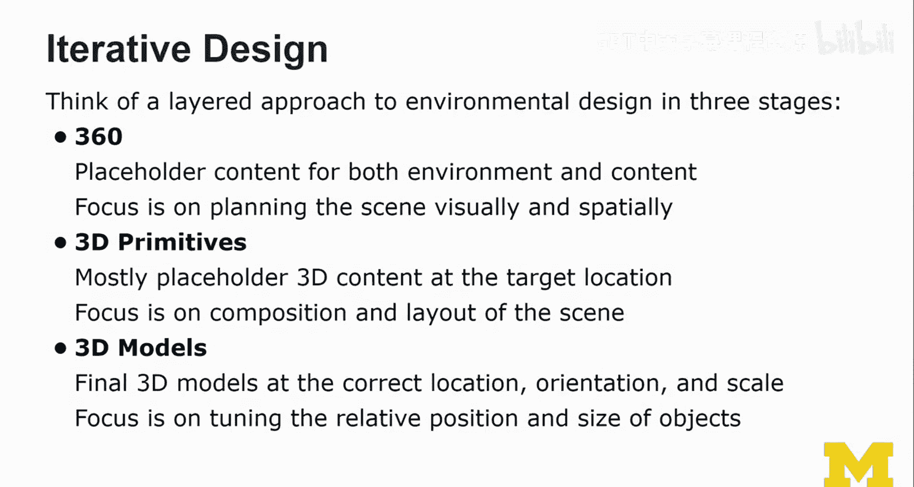

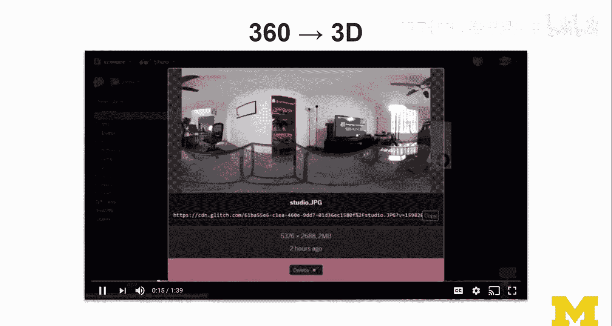

And then I have a glitch project。 and in this glitch project， I'm just going to bring in that photo。

 I've already uploaded and prepared the scene and everything。 And now it is actually visible。😊。

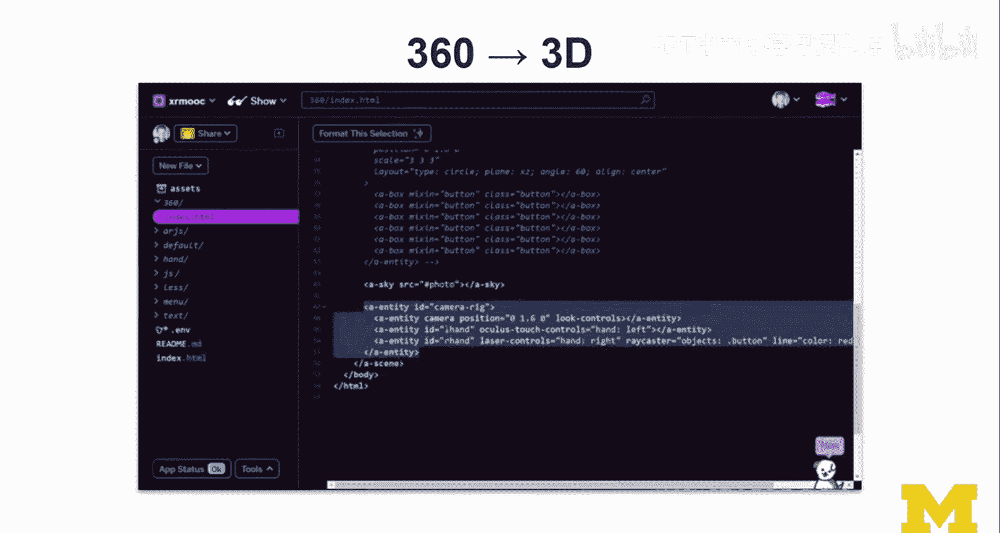

And I'm going bring it into my scene。 I load the scene here and Taa here we are。

 And because it is a 360 photo， I can go into VR and actually view it in VR。

This is what the would look like in V。

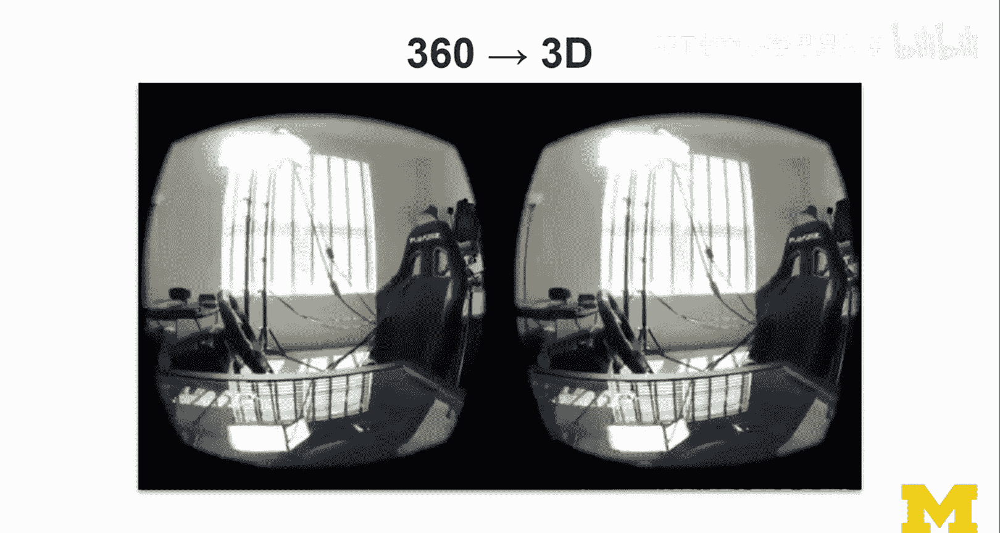

So that was just the first part using the 360 photo as a skybox and then we're going talk about interaction design quickly so at the highest level again。

 we can distinguish three types of X interactions and they also apply to VR。

 obviously implicit interactions， So camera based， gaze and I so I and gaze based so gaze like head head gaze or eye gaze。

😊，Then system based。 So could be location time， counter event physics。

 any any of these could actually trigger some kind of interactions with the interfaces。 So location。

 obviously if you think of GPS location aware applications time at the time of day could make a difference。

 we could go to the zoo at night when it's night and otherwise it's day so we could manipulate that experience as well。

 And then explicit interactions。 So really I would distinguish between user based explicit interactions and then environment based explicit interactions。

 So user based， youre using a Vr controller， you are pointing at something with your hand finger any kind of specific pose or gesture doing or voice commands if you issue voice commands。

 So that would be a user based explicit interaction。Usually some kind of keyword。

 some kind of pifying command。Environment-based interactions could be marker based or object based。

 You're bringing like some physical object into the view of the camera。 So this is mostly AR。

 but I wouldn't just think about it as AR。 I mean， we have output facing cameras on most VR devices。

 it is uncommon at the moment， but you could we're gonna talk about something like advanced techniques later on where you're bringing it in custom controllers into VR。

 So if you wanted to use instead of this， if you wanted to use I don't know this remote control because that is like whatever you're doing in your experience it allows you to go to different parts of listen to different listen to different audio。

 you know， how they give you these audio guides and when you go to museum。And so that could be。

Could be there。 You don't want to hold this fat controller。 So or you're watching virtual reality TV。

 doing it with a controller is a bit weird， but doing it with more like a remote control would be would be a different thing。

 And so if you wanted to track this objectject tracking is something to talk more about in the AR portions。

 but it， it would be possible。And we can also do some combination of the above。

 so system base plus user base so any kind of mixed initiative。

 so for example you dwelling on a target， so it's very common in gaze based。

 three degrees of freedom， so we do have a button here but not all cardboards have a button and so sometimes it's just like like dwelling on an object it gives you a fuse that's something we'll talk about as part of basic VI experiences in the honest track how to implement those things。

And could be userbased multimod。 So user plus user。

 So the user issuing different two different commands and using different modalities like thats gesture and speech。

 So we have a lot of options。 and we learn more about interaction design in this week when it comes to VR as well。

 So I wanted to continue my example， So once I have， for example， this 360 photo of the lab。

 I could enable a menu。 It could bring that in。 There could be a menu。

 that could be just all around me。 I'm just using basic layout here。

 Each of these could be a portal into a different scene could be a loading a different scene。

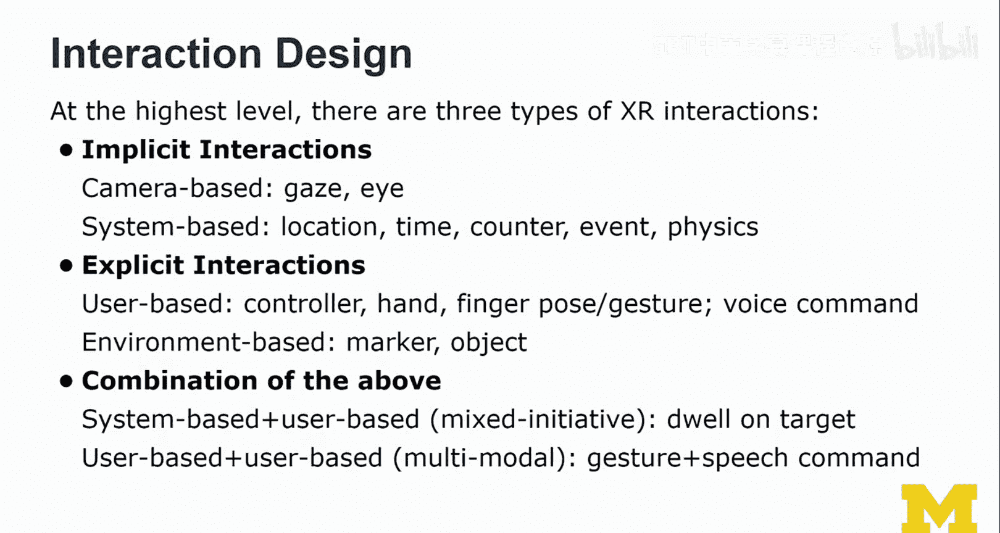

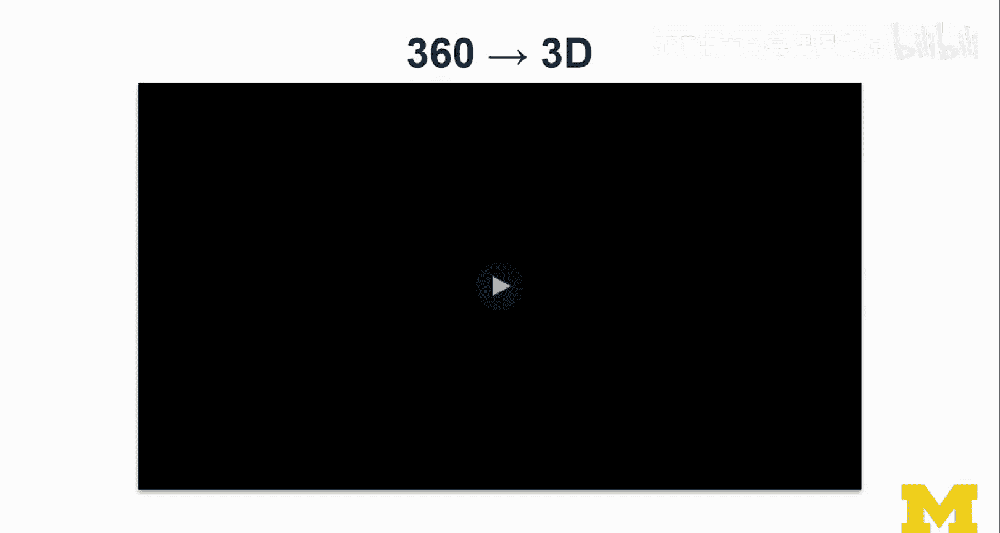

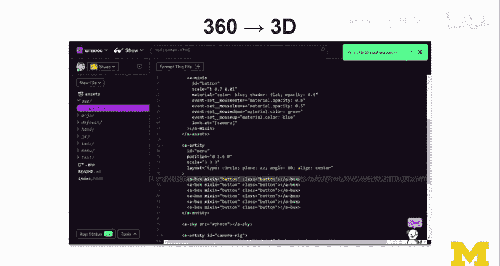

It's probably not the best kind of menu design， but。It would allow me very quickly。

 I'm mixing here 3D primitives with 360 content。 I just wanted to demonstrate how we can quickly prototype this way。

 and in Vr， it then looks actually quite interesting。 it feels it feels already quite immersive。

 and so it's a nice transition from 360 to 3D each of these could also be placeholders for other kinds of objects。

 you could think of it as you selecting an avatar or something and you see a preview and I'm just using a box to visualize that first。

 but we could actually obviously update from this primitive 3D primitive to another kind of objects selecting your avatar。

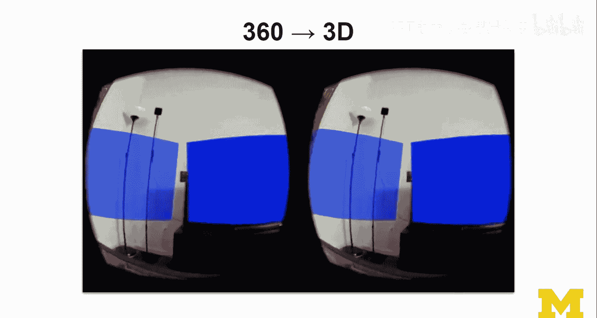

And those would be 3D models that I'll bring in later。

So this was a lot of the fundamental well decisions we have to make when we're designing a virtual reality。

 This was just to focus on the designing the environment part。

 we're going to expand on a few aspects of of virtual reality。

 So we're going to bring in more interactions we're going to learn about navigation and travel in VR。

 we're going bring in menus。 We're going to learn about how to select objects， ray casting， testing。

 all these things are coming to coming back here and play a role in virtual reality as well。

 we're going to talk about collliers we're going to talk about object selection and manipulation。

 So it's a lot of stuff that we want to cover。 It's not going too deep。

 but I just want us to have a right foundation。 Now this is the course that is really focused on development。

 and the issue with that is that we are losing track of some of the higher level design issues that we should really pay attention to as we designing。

Virtual reality and augmented reality experiences， you actually as a VR developer and designer。

 you have a tremendous responsibility。 you have often full control over what users are seeing。

 how they perceive content you can shock them， you need to be concerned about their safety at all times and so。

You need to do the right thing with that responsibility。

 And so here I want to just bring bring back these design issues。

 I want us to always keep those in mind。So any kind of social or ethical concerns。

 so when it comes to designing a virtual reality， obviously it's isolated。

 but it could be a collaborative VR experience as well。

 so isolated because it's not included the device。But there are interesting social and ethical concerns when it comes to VR。

 again， the kind of content how it appears to users and on the social side。

 obviously these devices have external， the inside out tracking parts have external sensors and cameras and not everybody wants to be seen by them。

It really depends on what happens on the device and not。

 but most people just don't want to be in the view of these cameras。And so keep that in mind。

 accessibility and。Next is accessibility and equity。So I really take issue with the problem that。

I really take issue with the decision to drop things like。

Google Daydream and Oculars go three degrees of freedom devices affordable。Affordable。

 relatively good quality， affordable devices to bring virtual reality to the masses。

 And that would have been a very great path forward for a lot of the things you wanted to do at Michigan。

 And so as a virtual reality designer and developer。

 I would still ask you to also design for lower and virtual reality headets。

 So think about how the stuff could work in cardboard。 Okay， obviously， if you， so the thing is。

 if you only have cardboard， that's， that's all you care about。 If you have a more powerful device。

 like a 6 degrees of freedom。😊，Ocus rift。 You usually forget about the。

People that that only have three degrees of freedom。And。

 and that might actually be substantially more people。 So this equity。Problem。

Not everybody's excited about VR， but there are a lot of people who would like to try it out。

 and they just can't afford。 And if you are developing a VR experience。

 and you assume the latest and greatest headsets， that is understand in research。

 we do this all the time。 But if for developing a product。

 you should think about reach and so you have also responsibility。 there accessibility。

 obviously a key thing in VR pretty hard， very predominantly visual。

So we're excluding quite a lot of people from VR。 And unless you're doing more with audio cues。

 And that's something to take into account as well。 then privacy and security。 So， yes， this course。

 like none of my courses are really focused on it。 But every course touches on it。

 If you're doing A R VR。

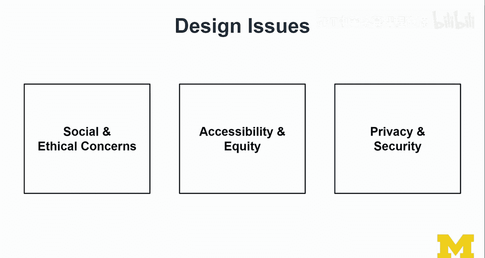

You have to deal with privacy and security issues。 A lot of it is if you're just using some frameworks。

 I understand you're just using the framework and so you're subject to whatever the privacy and security policies are and how they are implemented I understand as a developer。

 but that's not good enough you choose the tools。😊，So be careful what you're working with。

And make your decisions wisely。And that's all I'm gonna say because I do have opinions。

 but that is not so relevant here。 I just want you to think about it carefully what kinds of devices you're working for。

 And I seem pretty neutral because I have all kinds of devices here。

 but that doesn't necessarily reflect how I think about the different kinds of vendors out there and what they are doing。

😊。

