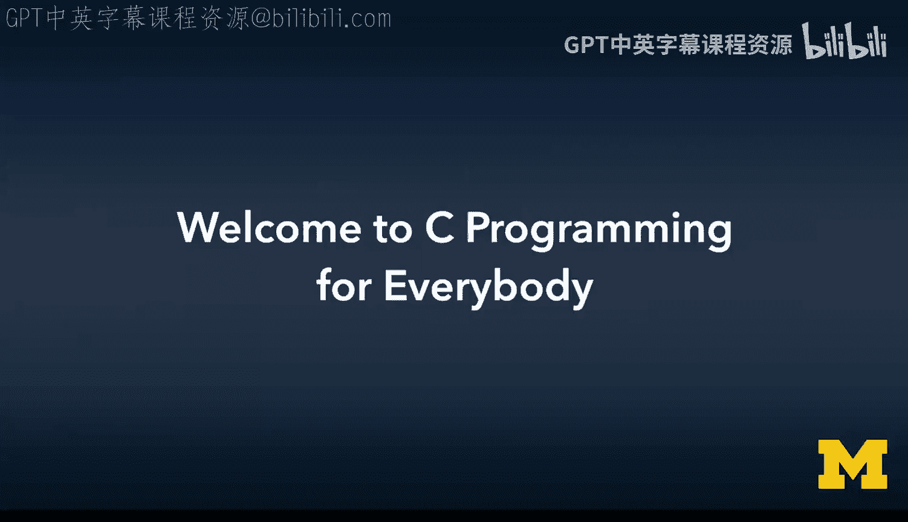
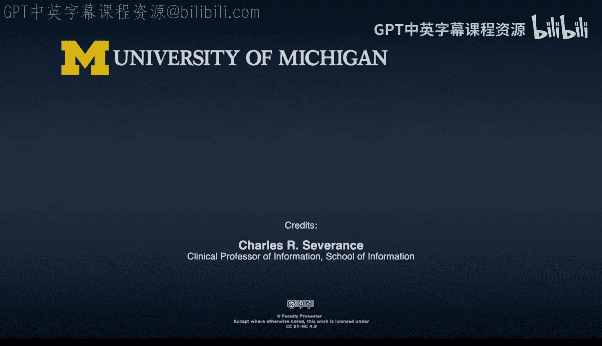
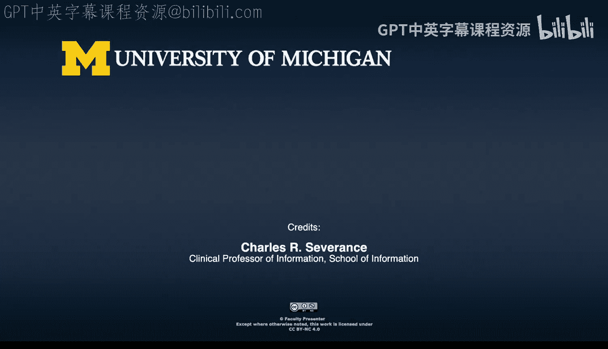

# 001：欢迎学习C语言编程 👋

在本节课中，我们将要学习C语言编程课程的概述，了解C语言的历史背景、重要性以及本课程的教学目标。

欢迎来到《给所有人的C语言编程》课程。我是查尔斯·塞弗里奇，本课程的讲师。

本课程及配套网站致力于学习源自1978年经典著作的C语言版本。这本书由布莱恩·W·克尼汉和丹尼斯·M·里奇合著。该书将读者置于20世纪70年代，那个计算机科学从以硬件为中心转向专注于编写可移植且高效软件的时代。

C语言被用于开发诸如Unix、Minix和Linux等操作系统。像Perl、Python、Java、JavaScript和Ruby等编程语言本身都是用C语言编写的。使得互联网成为可能的早期TCP/IP网络协议栈实现软件是用C语言编写的。最早的网页浏览器和网络服务器也是用C语言编写的。

用C语言编写软件推动了计算机体系结构和性能的重大进步。一旦我们有了针对新硬件平台的C编译器，操作系统、编译器和实用程序就可以被重新编译以在新硬件平台上运行。在过去的40年里，有如此多的软件是用C语言编写的，因此你每天使用的大部分软件很可能要么是用C语言编写的，要么是用C语言编写的编程语言编写的。

因此，我们学习C语言，与其说是为了将其作为日常使用的编程语言，不如说是将其视为现代软件和计算的基础。在许多方面，C语言相当于技术领域的罗塞塔石碑，因为它连接了过去和现在的编程语言。

网址 `www.cc4e.com` 中的名称“CC4E”指的是最初的Unix命令 `cc`。`cc` 是你用来编译C程序的命令。`cc` 代表C编译器。这个命令出现在K&R C书籍第一章的第一页。像我这样来自20世纪70年代和80年代的程序员，在AT&T 3B2等Unix系统上输入 `cc` 来编译并运行他们的第一个C语言“Hello World”程序。

本课程材料基于合理使用原则呈现，因为我们使用了已绝版且无法以任何格式广泛获取的受版权保护作品中的材料。该书也没有任何无障碍格式版本。我们在教学和研究背景下使用这些材料，重点是研究其对计算历史的贡献。这些材料免费在线提供给任何想要了解C语言、计算和计算机体系结构历史的人。

欢迎加入本课程。

---

本节课中，我们一起学习了C语言的历史地位和重要性。我们了解到C语言不仅是许多现代软件和编程语言的基础，也是连接计算技术过去与现在的关键。本课程将引导我们探索这门经典语言的核心。