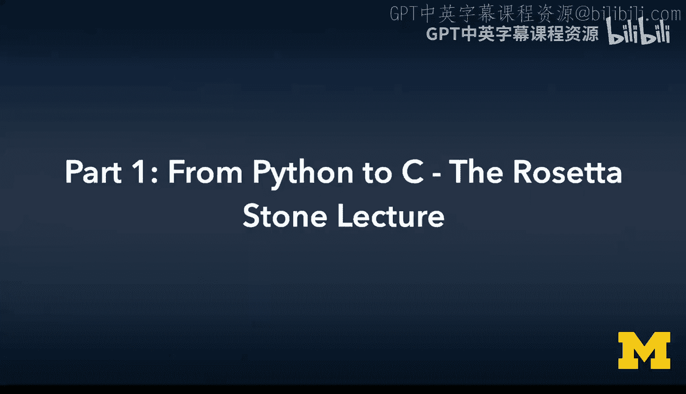
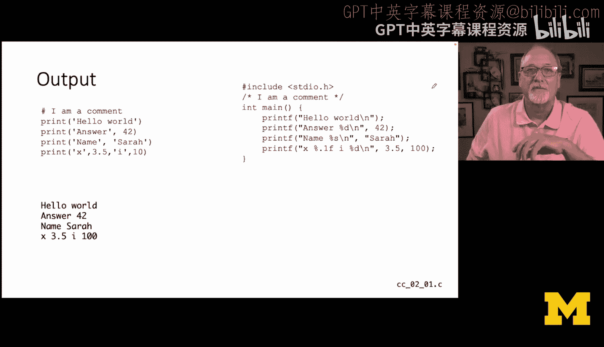
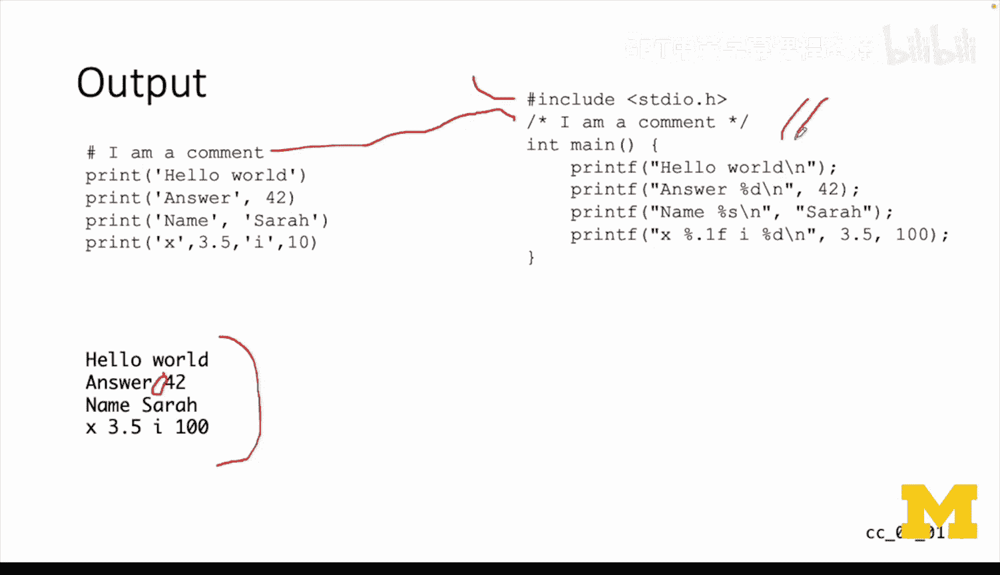
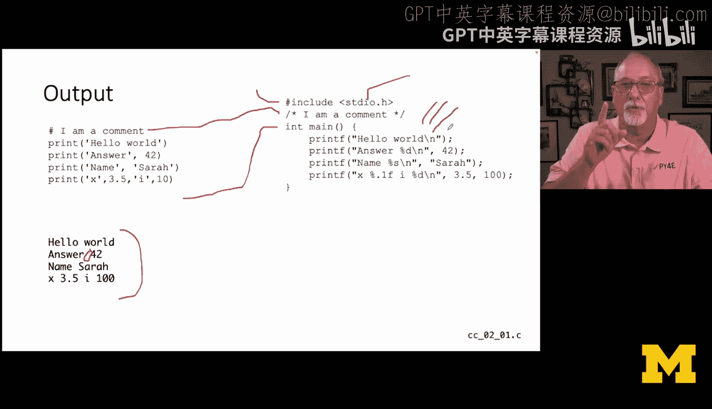
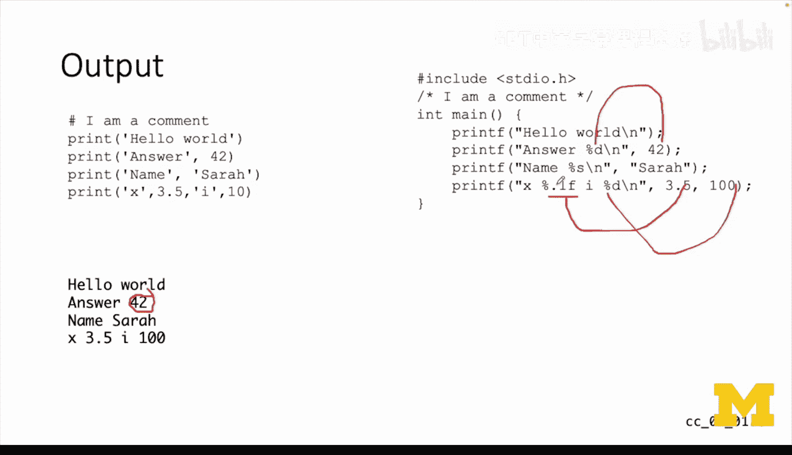
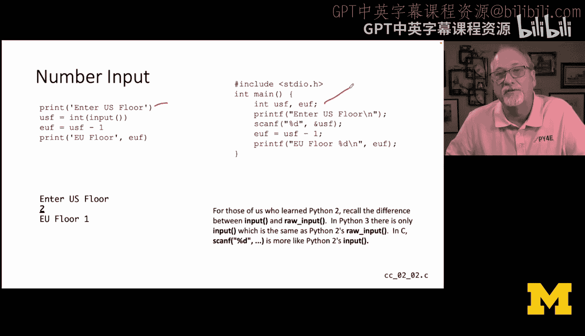
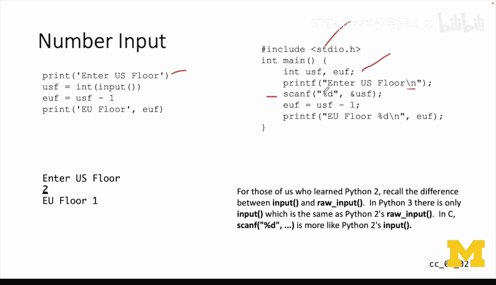
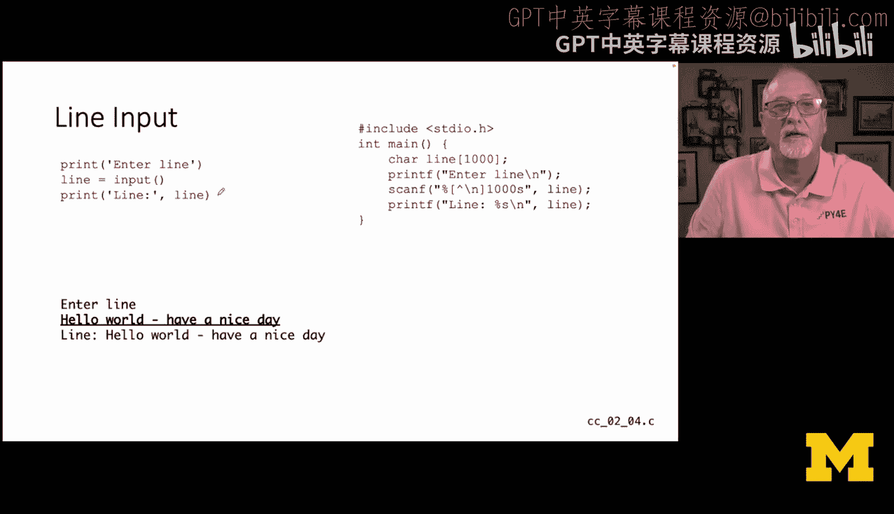
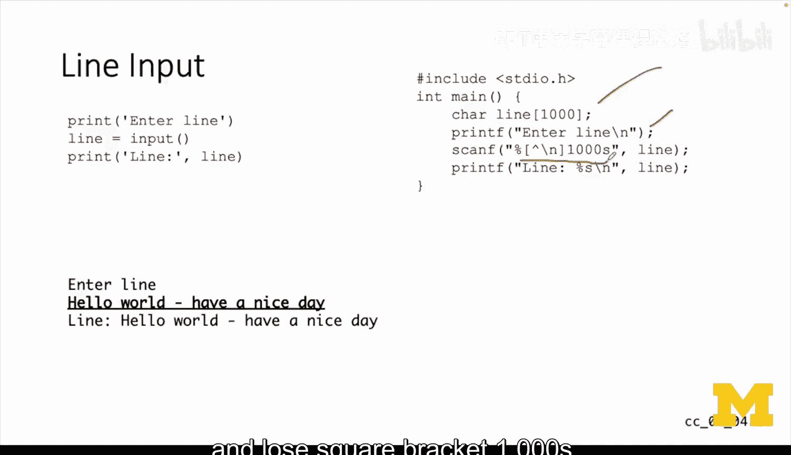
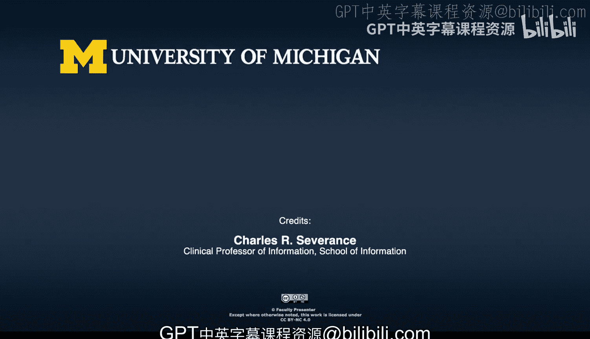

# 005：从Python到C——编程语言罗塞塔石碑（第一部分）



## 概述

在本节课中，我们将通过对比Python和C语言，快速学习C语言的基础语法。我们将从输出、输入、变量声明等基本概念开始，帮助你利用已有的Python知识来理解C语言的核心思想。

---

## 从Python到C：核心差异

上一节我们介绍了本课程的目标。本节中，我们来看看Python和C语言在设计哲学和语法上的主要区别。

Python和C虽然渊源深厚（Python本身由C语言编写），但在许多方面存在显著差异：
*   **语法**：Python使用缩进（空格）来定义代码块，而C语言使用花括号 `{}`，并忽略空格。
*   **面向对象**：Python是高度面向对象的语言，内置了列表、字典等方便的数据结构。C语言则完全不面向对象，它更底层、更高效，使用结构体、指针等概念来构建复杂数据结构。
*   **内存管理**：Python、Java等语言具有自动内存管理机制。C语言则需要程序员手动管理内存，这既是挑战，也带来了极高的控制权和效率。
*   **历史与定位**：C语言诞生于20世纪70年代，Python诞生于80年代。你可以将Python视为建立在C语言之上的一个“便捷层”。

尽管有这些差异，两者也有很多相似之处，例如运算符（`+`, `-`, `*`, `/`, `%`）、比较运算符（`==`, `!=`, `<`, `>`）、变量命名规则、循环概念（`break`, `continue`）等。

---

## 输出：`print` 与 `printf`

在Python中，我们使用 `print()` 函数进行输出。它非常方便，可以自动处理不同类型的数据并在输出项之间添加空格。

以下是Python的输出示例：

```python
print("Hello world")
print("Answer", 42)
x = 3.14159
print("x =", x)
print("Hello", "Sarah")
```

现在，让我们看看如何在C语言中实现相同的功能。

首先，每个C程序通常都需要包含标准输入输出库：

```c
#include <stdio.h>
```

C语言使用 `/* ... */` 进行多行注释（较新的标准也支持 `//` 单行注释）。

程序的执行从 `main` 函数开始：

```c
int main() {
    // 你的代码写在这里
    return 0;
}
```

在C语言中，我们使用 `printf` 函数进行格式化输出：

```c
printf("Hello world\n"); // \n 表示换行，必须显式添加
printf("Answer %d\n", 42); // %d 用于格式化整数
float x = 3.14159;
printf("x = %.1f\n", x); // %.1f 表示输出浮点数，保留一位小数
printf("Hello %s\n", "Sarah"); // %s 用于格式化字符串（字符数组）
```

**核心概念**：
*   `printf` 的第一个参数是**格式化字符串**，其中的 `%d`, `%f`, `%s` 是**格式说明符**，分别对应整数、浮点数和字符串。
*   额外的参数按顺序替换这些格式说明符。
*   换行符 `\n` 必须手动添加。
*   字符串在C语言中实际上是**以空字符 `\0` 结尾的字符数组**。

---

## 输入数字：`input` 与 `scanf`



在Python中，我们常用 `input()` 读取用户输入，并使用 `int()` 进行类型转换。

以下是Python读取并转换数字的示例（电梯楼层转换器）：

```python
print("Enter US Floor")
usf = int(input())
euf = usf - 1
print("EU Floor", euf)
```



在C语言中，我们使用 `scanf` 函数来读取格式化输入。

以下是等效的C代码：

```c
#include <stdio.h>

int main() {
    int usf, euf; // 必须在使用前声明变量类型
    printf("Enter US Floor\n");
    scanf("%d", &usf); // %d 读取一个整数，& 是“取地址符”
    euf = usf - 1;
    printf("EU Floor %d\n", euf);
    return 0;
}
```



**核心概念**：
*   C语言中变量必须**先声明类型，后使用**。
*   `scanf` 的第一个参数也是格式化字符串。`%d` 告诉程序读取一个整数。
*   `&usf` 中的 `&`（取地址符）至关重要。它允许 `scanf` 函数修改 `usf` 变量的值。这涉及**按值传递**与**按引用传递**的概念，我们将在后续章节深入讲解。

---

## 输入字符串：简单情况



在Python中，`input()` 函数直接返回一整行字符串。

以下是Python读取名字并问候的示例：

```python
print("Enter your name")
name = input()
print("Hello", name)
```



在C语言中，处理字符串需要更多步骤，因为字符串是字符数组。



以下是等效的C代码：

```c
#include <stdio.h>

int main() {
    char name[100]; // 声明一个最多存储100个字符的数组
    printf("Enter your name\n");
    scanf("%99s", name); // %s 读取一个字符串（遇到空格停止），99 防止溢出
    printf("Hello %s\n", name);
    return 0;
}
```

**核心概念**：
*   `char name[100];` 定义了一个固定长度的字符数组。你必须预估可能的最大输入长度。
*   `scanf` 中的 `%99s` 会读取一个**单词**（遇到空格、制表符或换行符即停止），`99` 确保了即使输入过长也不会超出数组边界。
*   注意，`name` 作为数组名，在传递给 `scanf` 时本身就代表了数组的起始地址，所以**不需要**在前面加 `&`。

---

## 输入整行文本

有时我们需要读取包含空格的整行文本。在Python中，`input()` 本身就能做到。

以下是Python读取并回显一整行的示例：

```python
print("Enter a line")
line = input()
print("Line:", line)
```

在C语言中，使用 `scanf` 配合一个特殊的模式可以实现类似功能。

以下是等效的C代码：

```c
#include <stdio.h>

int main() {
    char line[1000];
    printf("Enter a line\n");
    scanf("%999[^\n]", line); // 读取直到遇到换行符 \n
    printf("Line: %s\n", line);
    return 0;
}
```



**核心概念**：
*   `%[^\n]` 是一个扫描集说明符。`[^\n]` 的意思是“匹配任何不是换行符的字符”。这有效地实现了读取一整行（直到遇到回车）。
*   `999` 同样是为了防止输入超出 `line` 数组的容量。



---

## 总结




本节课中，我们一起学习了从Python过渡到C语言的基础知识。我们比较了两种语言在输出(`print`/`printf`)、输入(`input`/`scanf`)、变量声明和字符串处理上的关键区别。C语言要求更显式、更底层的操作，例如手动管理内存、显式指定数据类型和格式化细节。通过这种“罗塞塔石碑”式的对比，我们为后续深入学习C语言的强大功能（如指针、结构体）奠定了坚实的基础。记住，本节的代码示例旨在帮助你建立初步连接，请务必动手输入和运行它们以加深理解。