# 006：从Python到C——编程语言罗塞塔石碑（第二部分）🚀

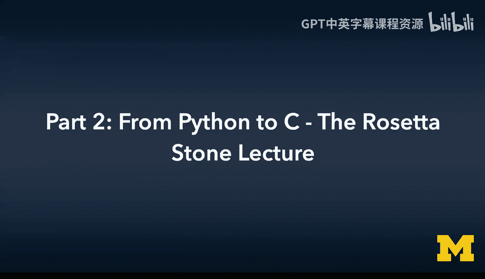

在本节课中，我们将继续学习如何将Python中的常见编程概念转换为C语言实现。我们将重点探讨C语言中的文件操作、循环结构、条件判断以及函数定义，并与Python中的对应概念进行比较，帮助你理解两种语言的核心差异。

---

## 文件读取与标准流

上一节我们介绍了C语言中的基本输入输出。本节中我们来看看如何在C语言中安全地读取用户输入和文件。

在C语言中，有一个更安全的方法来读取字符串输入，即使用 `fgets` 函数。`fgets` 函数的作用是：从指定的输入流中读取一行字符，直到遇到换行符或达到指定的字符数量上限。

以下是 `fgets` 函数的基本用法：
```c
fgets(buffer, sizeof(buffer), stdin);
```
这条命令表示：从标准输入（`stdin`）读取最多 `sizeof(buffer)` 个字符，寻找换行符，并将结果存入 `buffer`。

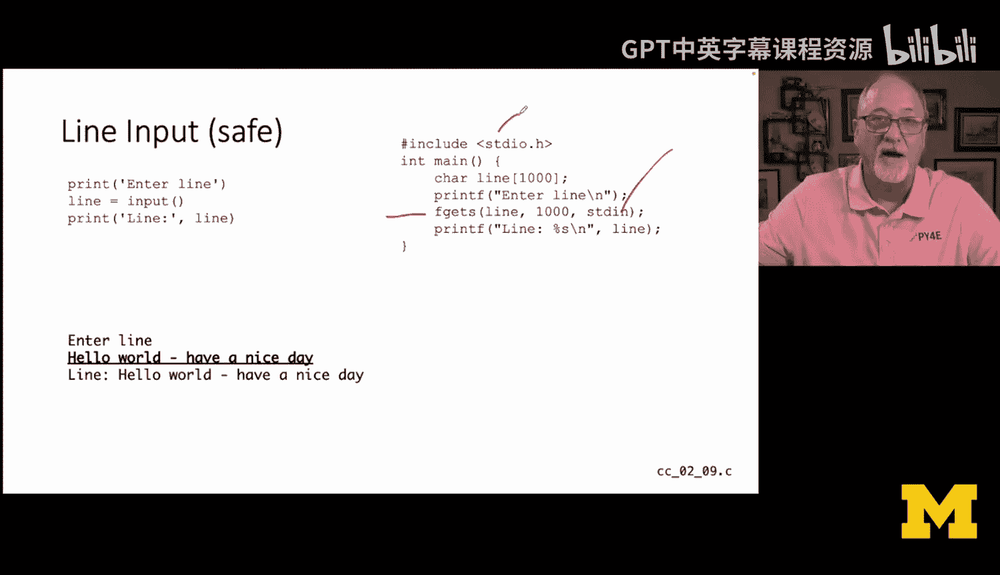

在C语言中，有三个基本的预定义文件流：
*   **标准输入 (`stdin`)**：通常是键盘输入，读取直到文件结束符（EOF）。
*   **标准输出 (`stdout`)**：`printf` 函数输出的目的地。
*   **标准错误 (`stderr`)**：用于输出错误信息，与标准输出分离。

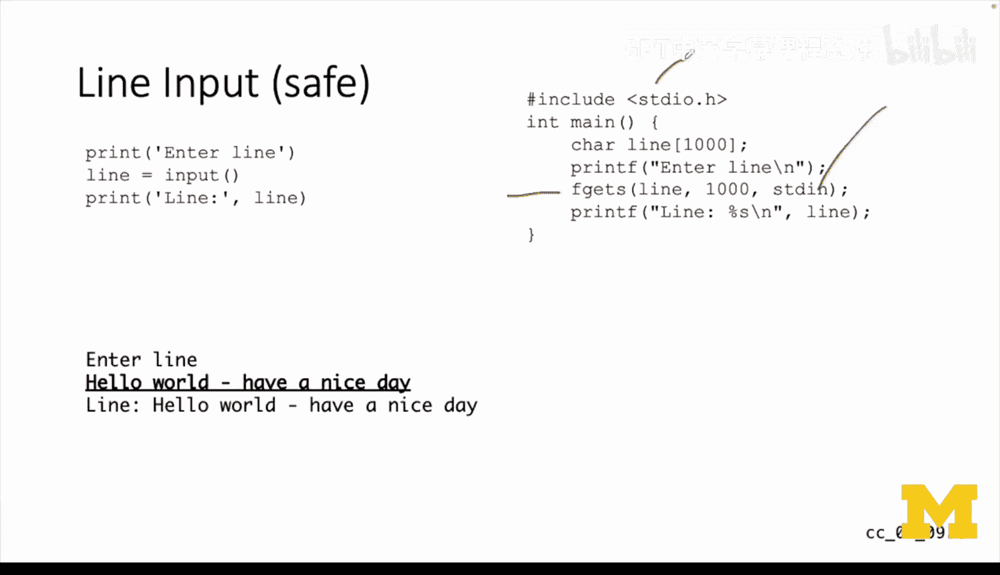

当你仅在终端命令行中运行程序时，标准输入是你的键盘，标准输出和标准错误都显示在你的屏幕上。但如果你重定向了程序的输入和输出，错误信息通常仍会显示在屏幕上，而不会混入被重定向的标准输出流中。

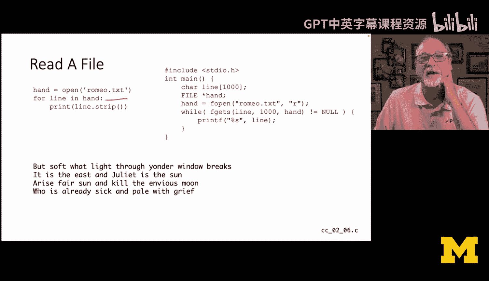

`fgets` 是标准库的一部分。当我们使用 `fgets(buffer, sizeof(buffer), stdin)` 时，表示从标准输入读取。稍后我们会看到，`fgets` 也可以从文件中读取，其第三个参数就是文件句柄。

在C程序中，有三个预定义的文件句柄：`stdin`、`stdout` 和 `stderr`。它们都是在 `<stdio.h>` 库中定义的常量。

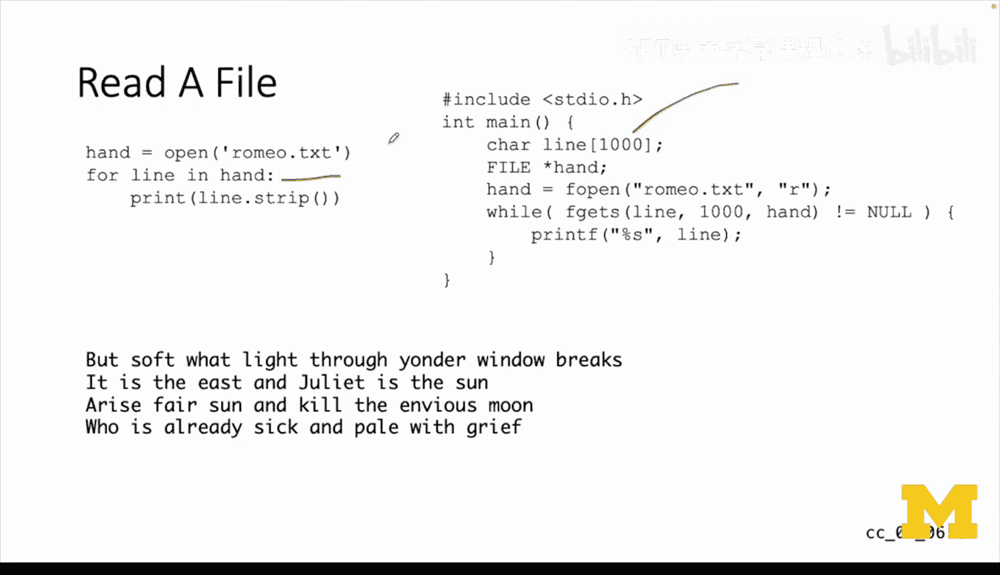

---

## 读取文件内容

现在我们将学习如何在C语言中读取一个文件。在Python中，我们经常这样操作：

以下是Python读取文件的示例：
```python
with open('romeo.txt') as hand:
    for line in hand:
        line = line.strip()
        print(line)
```
我们获取一个文件句柄，读取它。当然，如果文件不存在可能会失败。然后我们使用一个不确定循环（`for line in hand`），这是非常“Pythonic”且高效的表达方式。`line.strip()` 用于移除行末的换行符。这段代码会读取整个文件并打印出来。

在C语言中实现相同的功能，我们需要创建一个字符数组来存储每行内容。在Python中，文件行的长度可以是任意的，但在C语言中，我们必须预先声明能处理的最大字符数，因为我们用于读取的 `line` 变量是一个固定大小的数组。

以下是C语言读取文件的等效代码：
```c
#include <stdio.h>

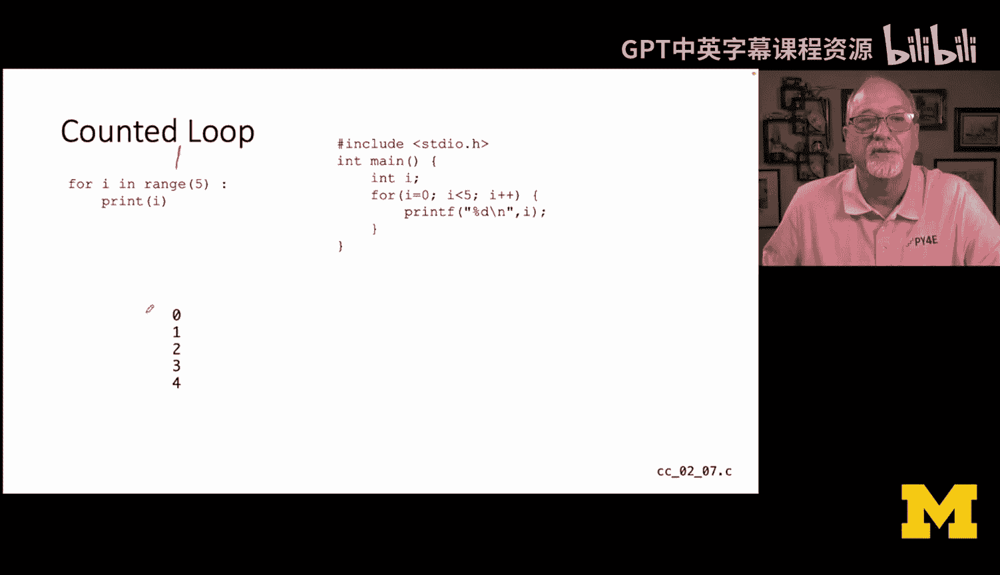

int main() {
    FILE *hand; // 文件句柄，是指向FILE对象的指针
    char line[1000]; // 声明一个最多存储1000个字符的数组

    hand = fopen("romeo.txt", "r"); // 打开文件，模式为“r”（读取）
    // Python的open()函数灵感来源于C的fopen()

    while (fgets(line, sizeof(line), hand) != NULL) {
        printf("%s", line); // 打印该行
    }

    fclose(hand); // 关闭文件
    return 0;
}
```
`FILE *hand;` 声明了一个文件句柄，它是指向 `FILE` 结构体的指针。`hand = fopen("romeo.txt", "r");` 打开文件。Python的 `open` 函数设计上借鉴了C的 `fopen`，但使用起来更简单。

我们需要自己编写 `while` 循环。`fgets(line, sizeof(line), hand)` 从文件句柄 `hand` 中读取最多 `sizeof(line)` 个字符到 `line` 数组中。当 `fgets` 遇到文件结束符（EOF）时，它会返回 `NULL`。因此，这个循环会读取文件直到结束。

注意，这里我们不需要像Python那样使用 `strip()`，因为 `fgets` 很“贴心”，它不会将行尾的换行符包含在读取的字符串中（实际上它会读取换行符，但通常我们会处理它）。而在Python中，如果不使用 `strip()`，打印时可能会出现多余的空行。

---

## 确定循环：for循环

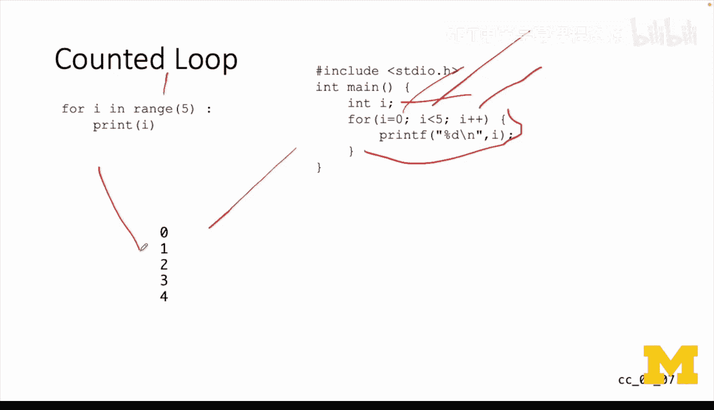

接下来我们看看确定循环，特别是 `for` 循环。在Python中，`range` 函数可以方便地生成一个数字序列。

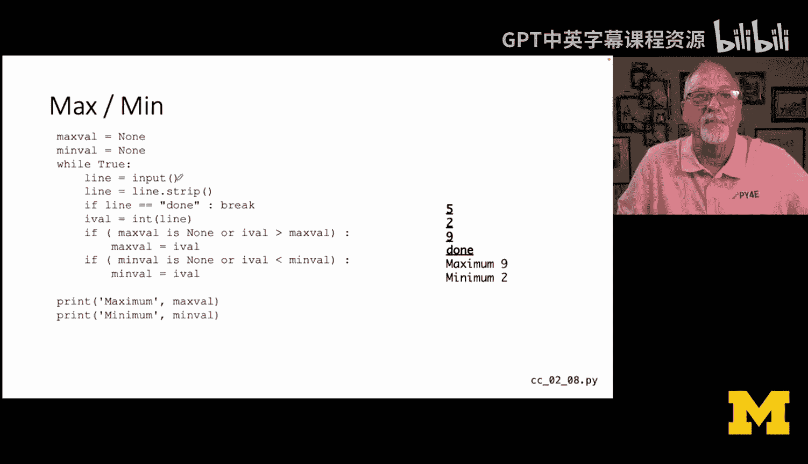

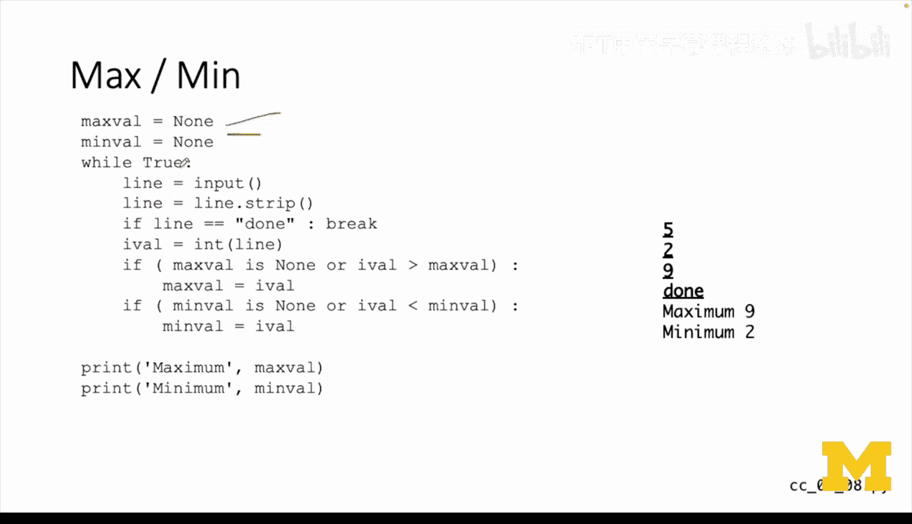

以下是Python的for循环示例：
```python
for i in range(5):
    print(i)
```
`range(5)` 是一个生成器，会产生数字0到4。然后我们打印 `i`，输出将是0, 1, 2, 3, 4。

在C语言中，`for` 循环的结构包含三个由分号分隔的部分：
```c
for (int i = 0; i < 5; i++) {
    printf("%d\n", i);
}
```
1.  **初始化部分 (`int i = 0`)**：在循环开始前执行一次，将变量 `i` 设置为0。
2.  **测试条件部分 (`i < 5`)**：在每次循环迭代开始前检查。如果条件为真，则执行循环体；如果为假，则退出循环。这是一个“顶部测试”循环。由于开始时 `i` 为0，小于5，所以循环至少会执行一次。
3.  **更新部分 (`i++`)**：在每次循环体执行完毕后执行，这里使用后置递增运算符将 `i` 的值加1。

这种 `for` 循环的语法在PHP、JavaScript和Java中都非常相似。循环体用花括号 `{}` 括起来。这两段代码（Python和C）会产生完全相同的输出。

---

## 非确定循环与条件逻辑

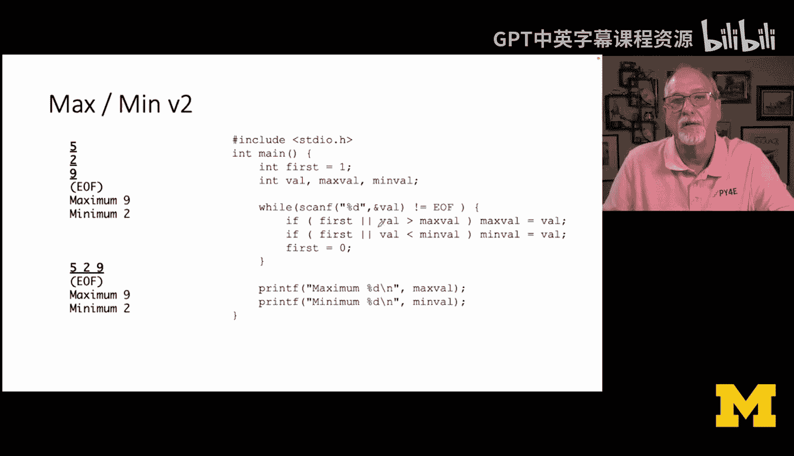

现在让我们看一个更复杂的例子，它涉及非确定循环和条件判断。我们将实现一个寻找最大值和最小值的程序。

在Python中，我们可能会这样写：
```python
max_val = None
min_val = None

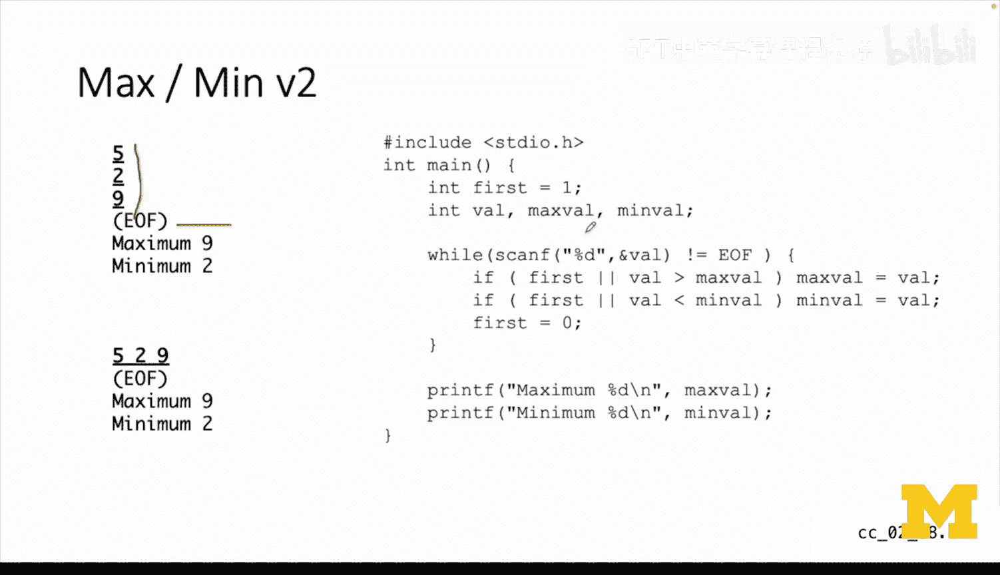

while True:
    line = input()
    line = line.strip()
    if line == 'done':
        break
    ival = int(line)
    if max_val is None or ival > max_val:
        max_val = ival
    if min_val is None or ival < min_val:
        min_val = ival

print('Maximum:', max_val)
print('Minimum:', min_val)
```
我们使用 `while True:` 创建一个无限循环（非确定循环）。读取输入行，去除首尾空白。如果输入是字符串 `'done'`，则用 `break` 跳出循环。否则，将字符串转换为整数。接着，检查并更新最大值和最小值。循环结束后，打印结果。


在C语言中，等效的代码使用 `scanf` 来读取整数：
```c
#include <stdio.h>

int main() {
    int max_val, min_val, v;
    int first = 1; // 用于标记是否是第一个数字

    while (scanf("%d", &v) == 1) {
        if (first) {
            max_val = min_val = v;
            first = 0;
        } else {
            if (v > max_val) max_val = v;
            if (v < min_val) min_val = v;
        }
    }

    printf("Maximum: %d\n", max_val);
    printf("Minimum: %d\n", min_val);
    return 0;
}
```
我们使用 `scanf(“%d”, &v)` 来读取一个整数到变量 `v` 中，`&` 符号表示“传引用”，以便 `scanf` 能够修改变量 `v` 的值。`scanf` 在成功读取一个项目时返回1，遇到文件结束或错误时返回EOF。

逻辑与Python版本类似：如果是第一个数字，同时将其设为最大值和最小值；否则，与当前最大值和最小值比较并更新。

`scanf` 会忽略空白字符（包括空格和换行），只寻找整数。因此，输入 `5 29 9` 和分三行输入 `5`、`29`、`9` 的效果是一样的。使用 `scanf` 的版本比使用 `gets` 或 `fgets` 然后转换更简洁，且无需担心字符数组的大小问题。

---

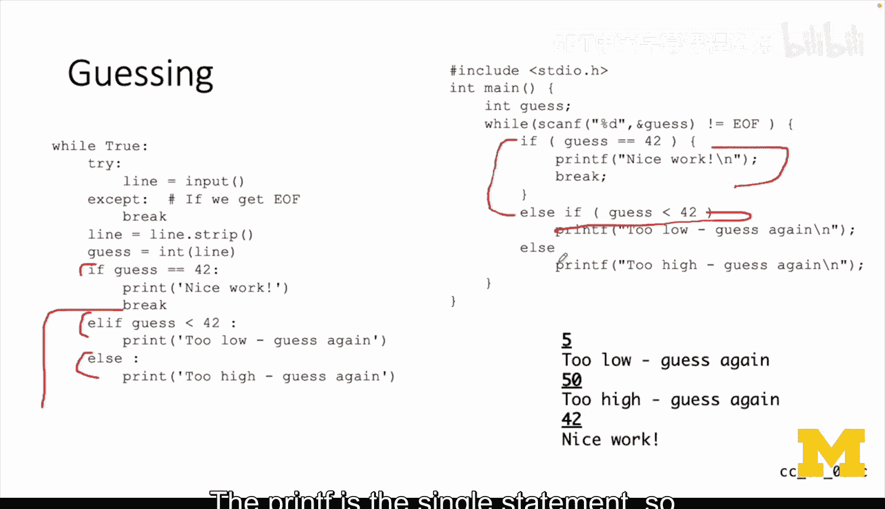

## 条件判断：if-else 与 else if

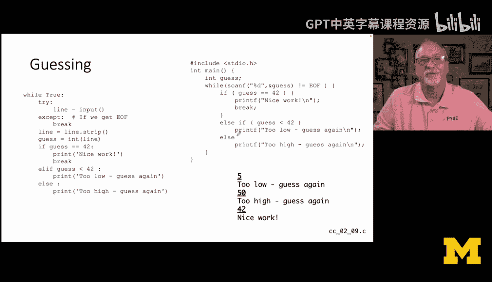

让我们通过一个猜数字游戏来深入理解C语言中的条件判断。在Python中，我们可以使用清晰的多路分支 `if-elif-else`。

以下是Python的猜数字游戏示例：
```python
while True:
    try:
        line = input()
        line = line.strip()
        guess = int(line)
        if guess == 42:
            print('Nice work!')
            break
        elif guess < 42:
            print('Too low')
        else:
            print('Too high')
    except:
        break # 遇到EOF或其他错误时退出
```
这是一个无限循环。我们使用 `try-except` 是因为 `input()` 在遇到EOF时不会明确返回，而是会抛出异常，我们需要捕获它并跳出循环。然后转换输入为整数。如果猜中（42），则打印信息并用 `break` 跳出循环（`break` 作用于循环，而非 `if` 语句）。否则，判断是太低还是太高。

在C语言中，等效的逻辑如下：
```c
#include <stdio.h>

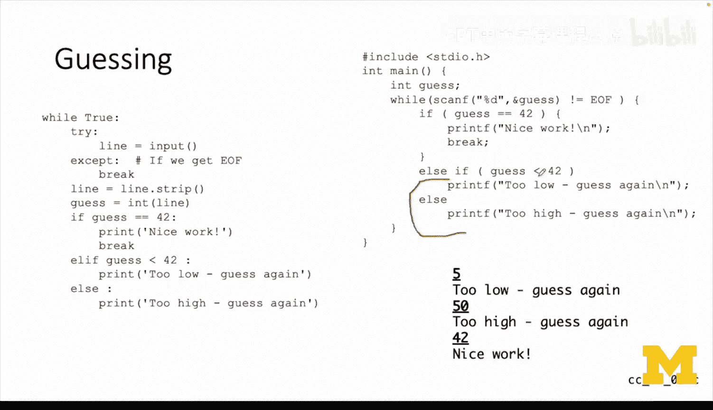

int main() {
    int guess;

    while (scanf("%d", &guess) != EOF) {
        if (guess == 42) {
            printf("Nice work!\n");
            break;
        } else if (guess < 42) {
            printf("Too low\n");
        } else {
            printf("Too high\n");
        }
    }
    return 0;
}
```
我们使用 `scanf` 循环读取，直到遇到EOF。如果猜中，打印信息并 `break`。注意，在 `if (guess == 42)` 后面，我们使用了花括号 `{}`，因为这是一个包含两个语句（`printf` 和 `break`）的代码块。当 `if` 或 `else` 后面跟有多条语句时，必须使用花括号。

现代程序员即使对于单条语句也倾向于使用花括号以增强清晰度和避免错误。但严格来说，如果 `if` 或 `else` 后面只有一条语句，花括号不是语法必需的。本例中，`else if` 和最后一个 `else` 后面的 `printf` 都是单条语句。

一个非常重要的概念是区分 **`else if`** 和 **`elif`**。
*   在Python中，`if-elif-else` 是一个真正的多路分支结构，它们属于同一个代码块。
*   在C语言中，并没有 `elif` 这个关键字。`else if` 实际上是两个关键字：一个 `else` 后面紧跟了一个 `if` 语句。

从结构上看，C语言的代码更像是：
```c
if (guess == 42) {
    // 代码块1
} else { // 第一个if的else子句开始
    if (guess < 42) { // else子句内嵌套了一个新的if
        // 代码块2
    } else { // 嵌套if的else子句
        // 代码块3
    }
} // 第一个if的else子句结束
```
按照严格的缩进，嵌套的 `if` 应该再向内缩进一层。但按照约定俗成的习惯，我们将其写成 `else if` 并保持与顶层 `if` 对齐，使其在视觉上像一个多路分支。当Python的设计者创建语言时，他认为这是一个很好的惯例，于是直接将 `elif` 作为语言的一部分，而不是一种惯用写法。

---

## 函数定义：传值调用

最后，我们来看看函数的定义。在C语言中定义函数相对直接。

以下是Python和C语言中函数定义的对比：
```python
# Python
def addtwo(a, b):
    c = a + b
    return c
```
```c
// C
int addtwo(int a, int b) {
    int c;
    c = a + b;
    return c;
}
```
C语言中没有 `def` 关键字。函数定义包括：
1.  返回值类型（`int`）
2.  函数名（`addtwo`）
3.  参数列表，**必须声明每个参数的类型**（`int a, int b`）
4.  函数体，用花括号 `{}` 括起来。

在Python中，你不需要声明参数类型，因为Python是动态类型语言，变量的类型与其值绑定。而在C语言中，你必须明确告诉编译器参数 `a` 和 `b` 是整数。如果调用时传入 `6.0`（浮点数），C语言不会自动进行类型转换，可能导致错误或不可预期的行为，编译器可能会给出警告，但不会替你修复。

`return` 语句在两种语言中功能基本相同。Python的 `return` 借鉴了C语言。

关于变量作用域：在C函数内部声明的变量（如 `c`），其作用域仅限于该函数内部。这与Python类似，在函数内部定义的变量在函数外部不可见。我们将在后面的章节中学习关于外部变量、静态变量等更复杂的作用域规则。

---

## 总结与展望 🎯

本节课中我们一起学习了多个核心概念，完成了从Python到C的“罗塞塔石碑”式对照学习：

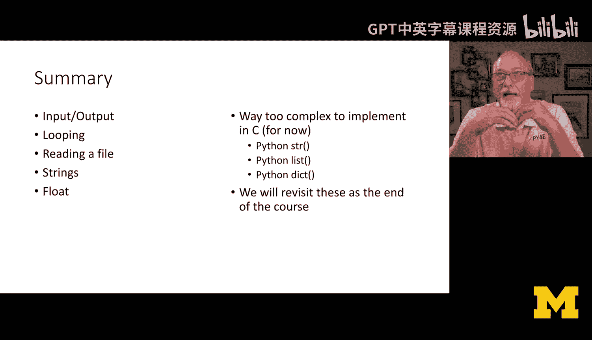

*   **输入/输出**：对比了 `input`/`print` 与 `scanf`/`printf`，以及更安全的 `fgets`。
*   **循环**：学习了确定循环（`for`）和非确定循环（`while`）在两种语言中的实现，包括文件读取循环。
*   **文件操作**：了解了如何使用 `fopen`、`fgets` 和 `fclose` 在C语言中读取文件。
*   **字符串**：认识到C语言中的字符串本质上是字符数组，需要谨慎管理内存。
*   **条件判断**：深入理解了 `if-else` 逻辑，并辨析了C语言中 `else if` 惯用法与Python中 `elif` 关键字的本质区别。
*   **函数**：学习了如何定义函数，重点是C语言中必须明确指定参数和返回值的类型。

我们讨论了整数和浮点数。在接下来的第五、六章，我们将深入更复杂的内容。本课程的一个重要目标是探索：如何利用C语言的基础构件（如结构体、指针、字符数组）来实现Python中的高级对象（如字符串、列表、字典）。我们不仅学习如何用C语言编程，更要理解像Python、JavaScript这样的高级语言底层是如何构建的。在课程结束前，我们将回到这个主题，窥探用C语言构建Python核心数据结构的思想。

这是一门内容丰富的课程，本节信息量也很大。请务必花时间消化这些代码示例，每一行都旨在教授特定的知识。不要急于求成，只有理解了背后的原理，完成作业才有意义。希望你能扎实地掌握这些材料。


加油！🚀