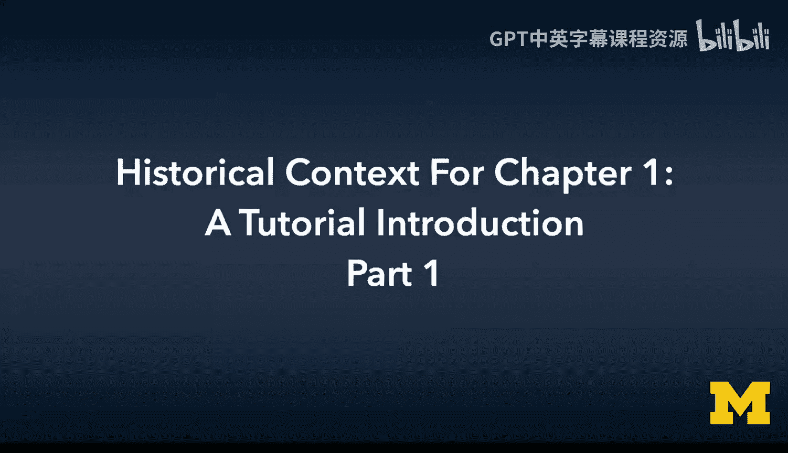
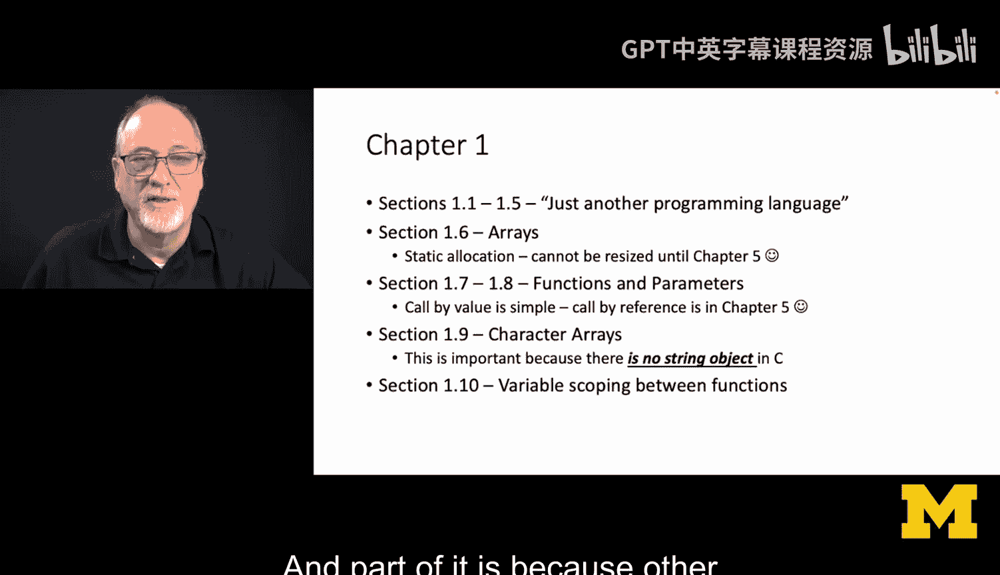
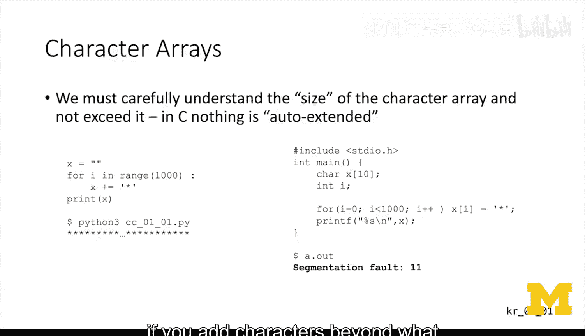
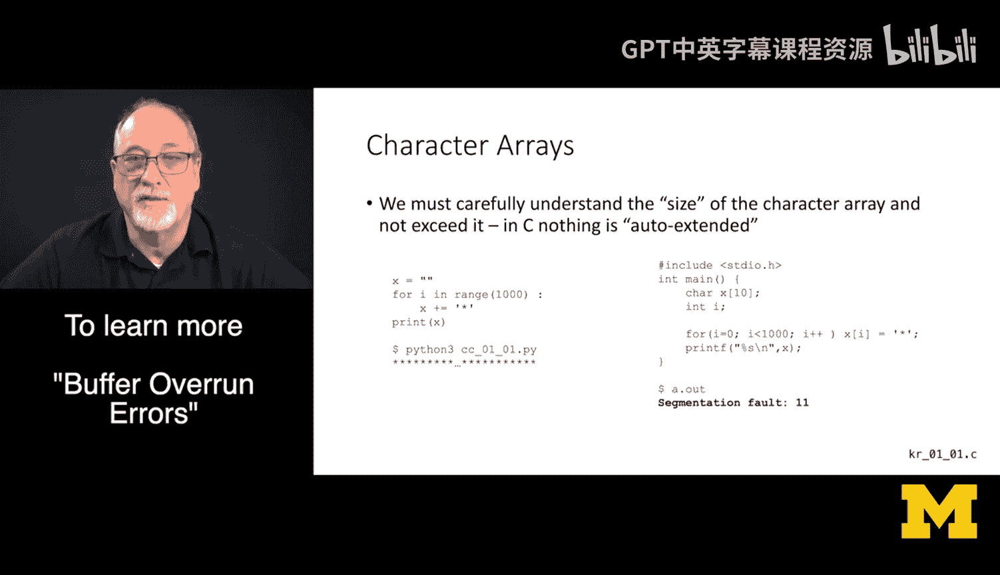
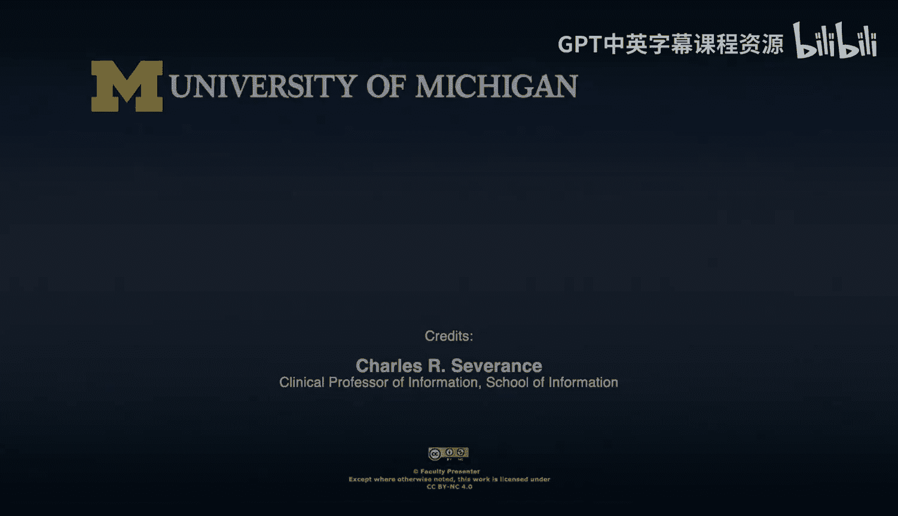
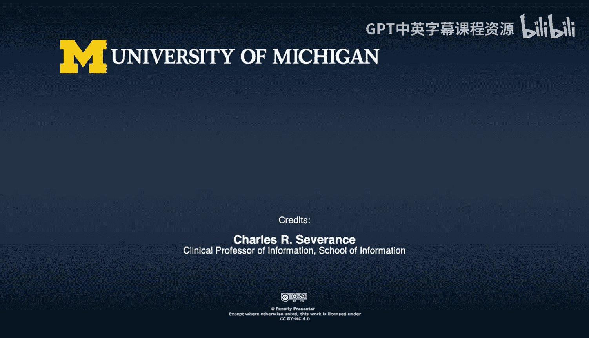

# 007：历史背景与教程导论 🎓

在本章中，我们将学习C语言的历史背景、本课程的学习路径、教材结构概览，并初步了解C语言的核心特性及其潜在风险。

大家好，欢迎来到卡内基和里奇（指《C程序设计语言》作者）著作的第一章。我是查尔斯·塞弗伦斯，也是这门关于历史的课程的教授。欢迎来到这门课程，它实际上是一个学习路径的一部分。我认为C语言不应该是你的第一门编程语言，也不应该是最后一门。我有一系列免费的在线课程，分布在freeCodeCamp、Coursera、edX等平台。在你当前的学习路径中，你正处于C语言编程阶段。我们学习C语言编程，并非仅仅为了掌握C语言本身，而是为了从历史角度审视计算机的工作原理，并为进一步学习计算机体系结构打下基础。我的目标不是教授如何用C语言编码，而是会借助C语言来解释计算机以及像Java这样的语言是如何工作的。这为我提供了一种向你解释Java的方式。

教材大纲是一本相当典型的计算机科学教科书结构，它从简单开始，然后内容会变得相当深入。第1章到第4章（我们现在就在第1章）主要是语法，集中在编程语言本身。特别是如果你了解一点Java、Python或JavaScript，其中一些语法会让你觉得似曾相识。答案是，这是因为所有这些语言都源自C语言。所以它感觉上就像另一门编程语言。

然而，数组不是列表，字符数组也不是字符串。字符数组看起来像字符串，但它们的运作方式不像字符串。你可能会因此陷入各种麻烦。但除此之外，一旦你不再担心事物的长度，假装一切正常（当然，这在写代码时是危险的），第1章到第4章的感觉就很像你在学习任何其他编程语言。

但第5章和第6章是本书最有价值的章节，它们也会变得困难得多。所以不要轻视第1到第4章，因为第5章和第6章会快速深入。第7章和第8章则主要是补充细节，不那么关键，只是填补了所有空白。这就是本书的大纲。只需预期第1到第4章会比较平顺，而第5章和第6章会让我们真正进入核心领域。

现在，让我们具体看看第1章的内容。第1.1到1.5节看起来与你学过的其他编程语言没有太大不同。

以下是第1章后续小节的核心内容介绍：

第1.6节讨论**静态分配数组**。在声明数组时，你必须知道它的大小，并且直到第5章我们讨论动态内存和指针之前，你都无法调整其大小。

第1.7和1.8节涉及**函数和参数**。在这个早期阶段，所有调用都是**传值调用**。**传引用调用**在第5章才会介绍，因为我们需要先了解指针。尽管在第1章中偶尔会使用一些指针语法，但深入讨论要等到第5章。

第1.9节是关于**字符数组**。请仔细阅读这一节，因为C语言中没有字符串对象，实际上C语言中根本没有对象。

第1.10节讨论**函数间的变量作用域**。这部分感觉与其他语言类似，部分原因在于其他语言从C语言中获得了灵感。

---

🎼 现在，让我们快速看一下C语言的字符数组。我们必须理解，字符数组的大小在分配时就确定了，并且没有自动扩展功能。如果你写了一个循环，超出了数组的边界——例如，我有一个长度为10的字符数组，却写了一个循环，向其中存储数据直到索引1000——最终程序会崩溃。在Python中，你可以直接添加字符，而在C语言中，如果你添加的字符超出了分配的空间，系统就会崩溃。

你可能听我说过不止一次，C语言可能要为计算领域90%的重大安全漏洞负责。这种分配一个数组然后肆意越界访问的代码，最终导致人们可以向操作系统、路由器等各种系统中注入恶意内容。

这就是为什么我们不常使用C语言编写程序。我的意思是，我们在这里，在第一章的第一页示例中，就看到了为什么我们不经常写C语言程序，或者即使写，也必须非常仔细地审查代码。它确实非常快，但也非常危险。

---

在本节课中，我们一起学习了C语言课程的历史背景和导论部分。我们了解了本课程在学习路径中的位置、教材各章节的难度分布，并初步认识了C语言中数组、函数、字符数组等核心概念的特性与潜在风险，特别是内存管理和安全性方面的问题。这为我们后续深入学习C语言及其底层原理奠定了重要的基础。