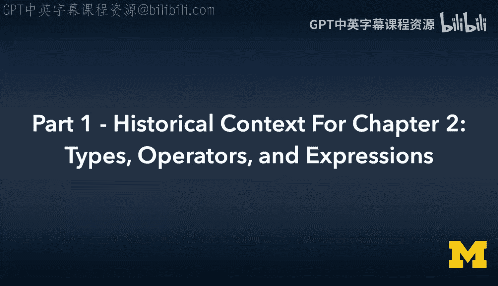
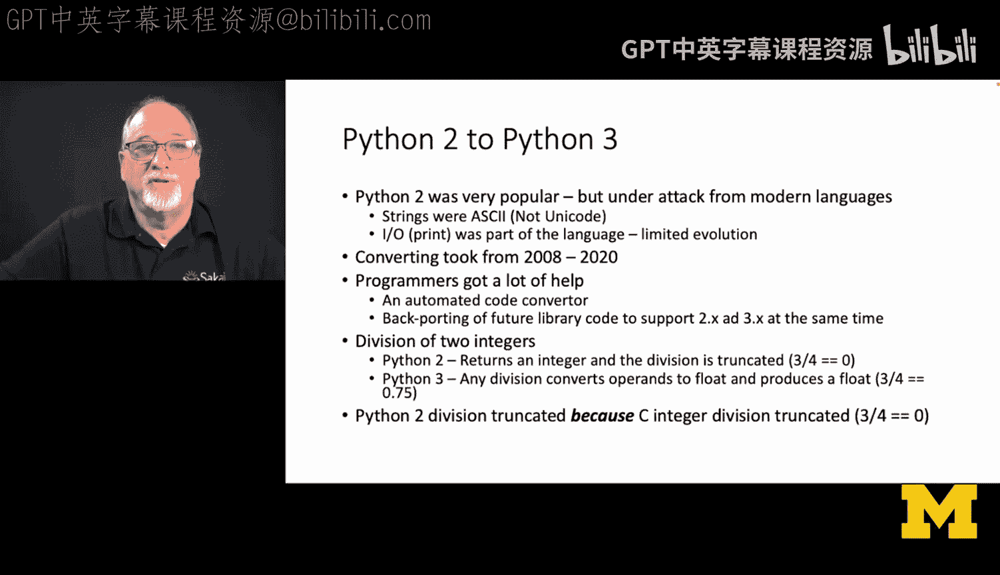
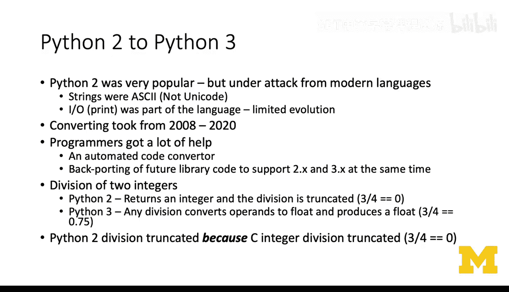
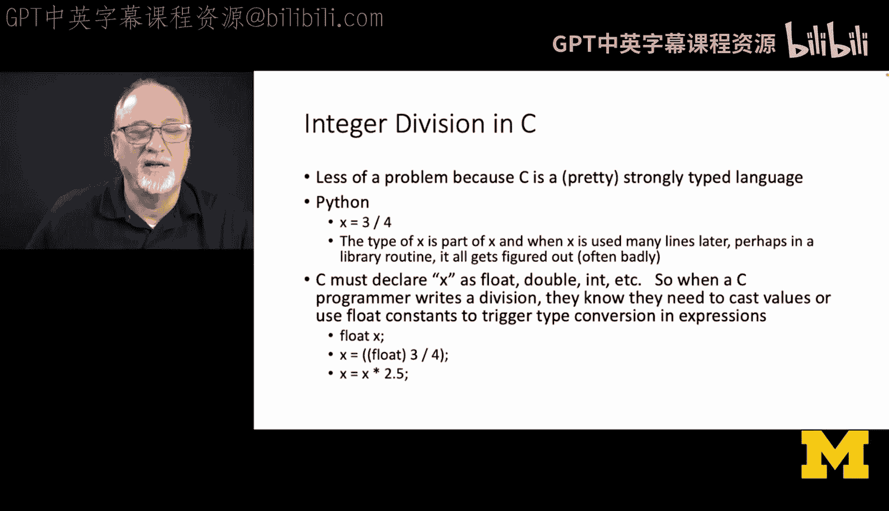
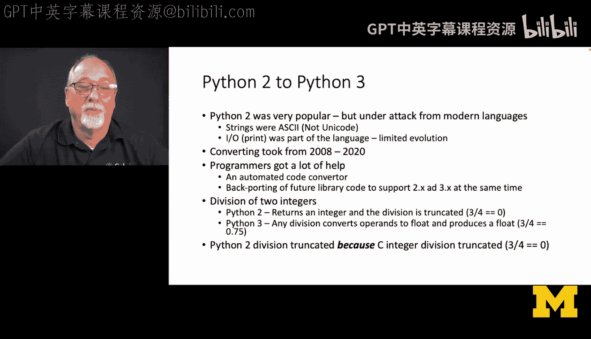
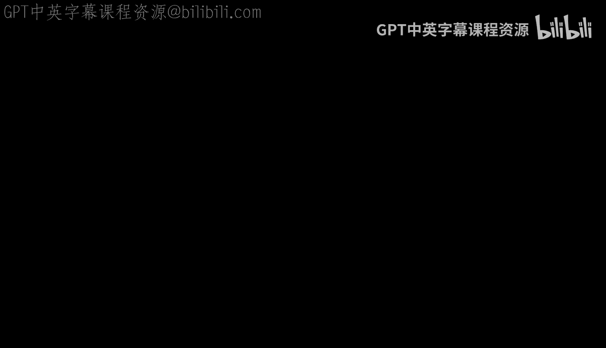
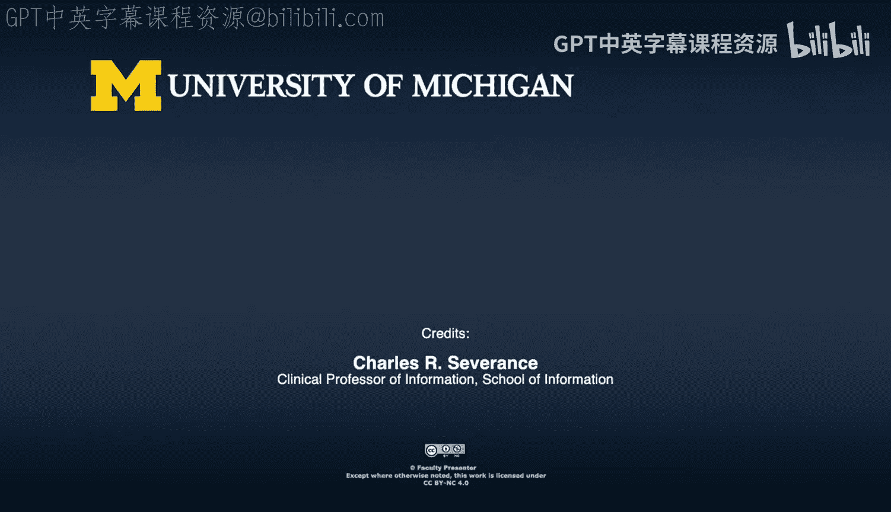

# 009：第2章 类型、运算符与表达式的历史背景 - 第1部分

欢迎来到第2章：类型、运算符与表达式。我不会复述书中的所有内容，我建议你阅读教材，它写得很好。我将重点讲解一些内容，如果你来自Python、JavaScript或PHP等语言，可能会觉得这些内容有些奇怪，因为在那些语言中，事物都是对象，你可能一直在使用对象而不自知。

我们将讨论数据类型和存储分配。教授C语言历史视角的一个好处是，我们必须讨论存储分配。`float`和`double`类型处理得相当好，部分原因是在C语言早期，它们完全由软件实现，因此设计得简单且有效。当时并不追求极致的速度，真正追求高速的是整数和字节（字符）数据类型、类型转换等。这里有一个故事，它连接了Python2中的整数除法、Python3中除法运算的改变及其带来的困扰，以及这种改变的原因和实现方式。这再次与性能以及当时做出的简单（有时令人遗憾）决定有关。

位逻辑运算。我们会讨论它们。你可能不会经常使用，但从历史背景理解它们为何如此完备非常重要。这主要是因为计算机从“字”导向转向“字符”导向时，我们这些程序员都在用“字”思考。如果没有移位、掩码和位运算，我们会觉得无法编程，因为在字导向计算机中，我们的很多工作就是掩码和移位。所以，我们必须拥有这些功能，尽管实际使用可能没有预想中那么多。

那么，让我们从除法开始。

在早期，我们不太担心做除法。如果你在做除法并且关心结果，很可能是在进行浮点运算，因为那是在做科学计算，而且是在超级计算机上进行的。通用计算机上不常做这个。Unix系统是为通用计算机设计的。在通用计算机上，人们会想：整数除法有那么重要吗？我确信他们当时做出了某个决定。我不知道具体原因，可能与他们当时使用的某台计算机有关，那台计算机的硬件执行截断除法，而非截断除法（或舍入除法）则由软件实现。或者，很多计算机甚至没有快速的浮点运算单元。他们当时使用的一些计算机，所有浮点运算都由软件完成，甚至整数除法也可能通过循环等软件方式实现。我们不得而知，但他们的决定是：**整数除法执行截断**。

这正是从Python 2迁移到Python 3过程中最痛苦的事情之一。

Python 2已有超过25年历史，它是在C语言之后不久用C语言编写的。从Python 2到Python 3的过渡是一件大事，花了很长时间，大约12年才完成。Python 2曾经非常棒，但存在一些问题。由于Python 2与C语言关系密切，其原生字符串是ASCII，而非Unicode，这意味着它甚至无法处理西班牙语字符，更不用说亚洲字符了。

程序员在迁移过程中得到了很多帮助，比如自动代码转换器、语法检查器等。他们做了很多工作，例如将某些库（如`print`函数）先引入Python 3，然后反向移植到Python 2，以便你能从使用`print`语句过渡到`print`函数。有很多措施使这个过渡尽可能容易。但有一件事他们始终无法完美解决，我们只能硬着头皮适应，那就是：**在Python 2中，整数除法返回整数**。

并且除法是截断的。所以，在Python 2中，`3 / 4`的结果是`0`；而在Python 3中，整数`3`除以整数`4`得到浮点数`0.75`，因为计算器就是这样做的。Python 2的除法之所以截断，是因为在80年代这似乎不太重要，而C语言的整数除法就是截断的。

所以，在C语言中，四分之三（整数运算）等于零，Python也是如此。20多年后，这成了我们无法自动转换到Python 3的一件事。Python 3按照Python自己的新方式处理。

这个问题在C语言中不那么严重，因为C实际上是强类型语言。这意味着如果我想计算`3 / 4`，我知道操作数是整数还是浮点数，我可以强制进行类型转换。但在Python中，你只是写一个变量，它会根据表达式的结果推断变量类型。

而C语言必须将`x`声明为`float`、`double`或`int`。因此，当C程序员写除法时，他们需要知道必须对值进行类型转换，或者使用浮点常量来触发表达式中的类型转换。所以，当你在阅读本章，看到这些类型转换和强制转换的内容时，那正是为了解决这类问题。后来Python简化了它，却又使其变得有些棘手，然后不得不修复它。Python 3中的处理方式更好，你们大多数人都只学过Python 3，所以很幸运。

是的。

是的。

---

## 本节总结

在本节中，我们探讨了C语言第2章中关于类型、运算符和表达式的历史背景，特别是整数除法的截断行为。我们了解到，这一设计选择源于早期计算机的硬件限制和性能考量，并对后来如Python等语言产生了深远影响。理解这些历史背景有助于我们更好地把握C语言的设计哲学，并明白为何在某些情况下需要进行显式的类型转换。下一节，我们将继续深入探讨其他数据类型和运算符。