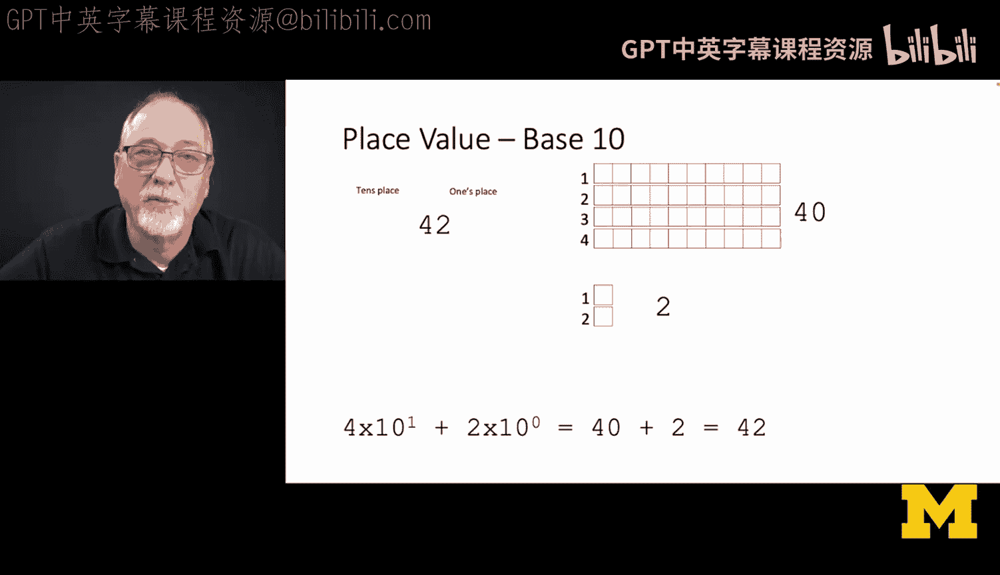
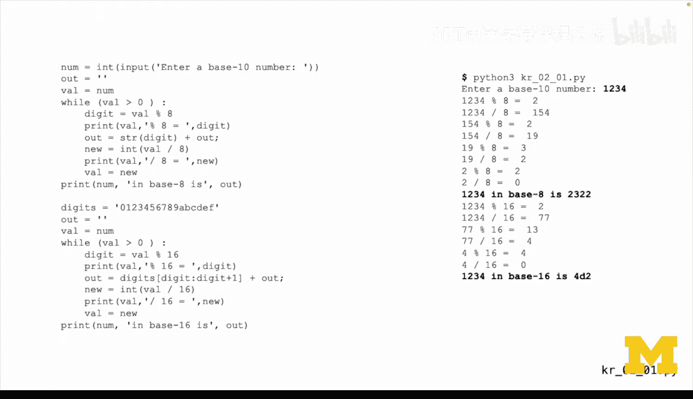
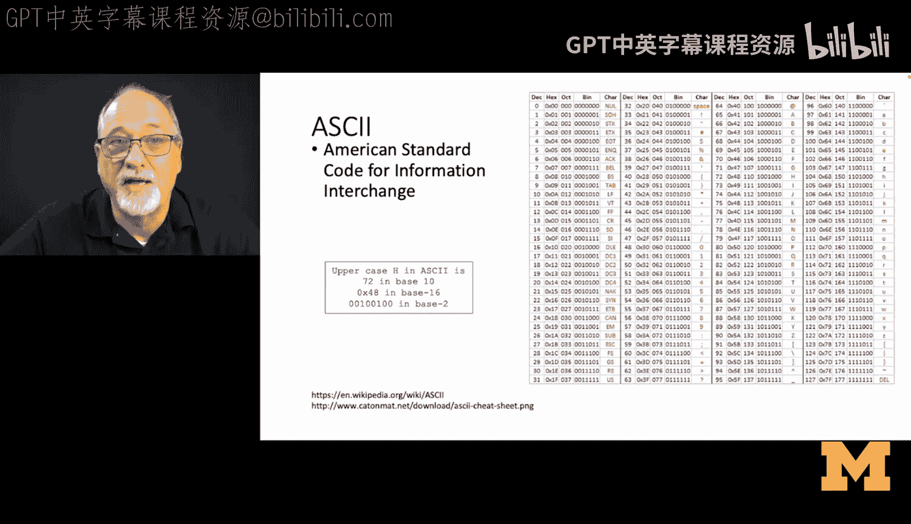
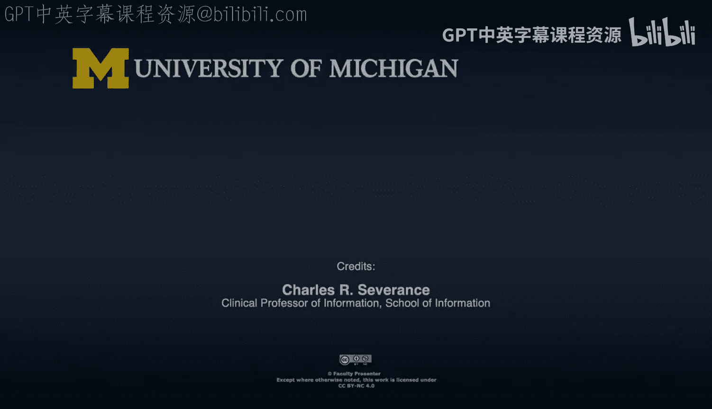
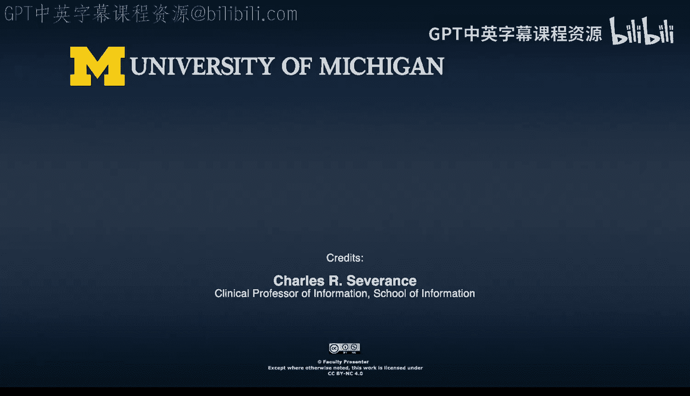

**C语言编程：2.1.4：进制与数据表示的历史背景（第二部分）**

在本节中，我们将探讨计算机中数据表示的基础——进制系统。我们将了解为何在编程中，除了常用的十进制，还需要理解二进制、八进制和十六进制，并学习它们之间的转换方法。

上一节我们介绍了数据类型和存储的基本概念。本节中，我们来看看计算机如何用不同的进制系统来表示和打印数据。

当我们开始以比特为单位思考存储分配时，就需要知道如何表示和打印数据。这不仅仅限于十进制。实际上，八进制和十六进制在打印二进制原始数据方面更具优势。十进制是我们日常生活中使用的数字系统，例如“你想要多少披萨？我想要16个或22个”。这是我们人类自然的思考方式。

要讨论进制，让我们从回顾十进制开始。十进制中有个位、十位，当然还有百位、千位等。

在数字42中，十位上的4代表4个10，可以看作是4乘以10，即40。个位上的2代表2个1。所以42就是40加2。这是我们本能的理解方式。

现在让我们看看八进制。十进制中的42，在八进制中是52。八进制的含义是，不同位置上的数字代表不同的值。在数字52中，5代表5个8，2代表2个1。因此，5乘以8等于40，加上2乘以1等于2。将八进制的52转换为十进制，就得到了42。八进制与二进制完美对应，因为三个二进制位正好对应一个八进制位。

早期我经常使用八进制，但现在我们更倾向于使用十六进制，因为它表示更紧凑。在十六进制中，最右边的位仍然是个位，下一位是16位。因此，在数字2A中，2在16位的位置上，代表2乘以16，即32。剩下的部分是10，我们用字母A表示。10加32等于42。

问题在于，我们只有0到9这十个数字符号。因此，按照惯例，10用A表示，11用B，12用C，13用D，14用E，15用F。F代表四个二进制位全为1。这使得十六进制和二进制之间的转换非常快捷。如果需要查看内存转储，我可以将其以十六进制形式转储，然后在需要时快速转换为二进制。

在十六进制和二进制之间来回转换是一个技巧。我并不要求你精通此道，但你可以获取示例代码并尝试。以下是一个将十进制数（如1234）转换为八进制和十六进制的示例。

这个转换算法本质上是从数字的最低位（最右边）开始，逐步向高位处理。具体方法是使用取模运算。

以下是转换算法的步骤：
1.  取数字1234，计算 `1234 % 8`，余数为2。这是新数字的最右边一位。
2.  使用整数除法 `1234 / 8` 截断余数，得到154。
3.  将余数2累积到转换后的数字中。
4.  计算 `154 % 8`，得到2，这是从右数第二位。
5.  计算 `154 / 8`，得到19。
6.  计算 `19 % 8`，得到3，这是从右数第三位。
7.  计算 `19 / 8`，得到2，由于2小于8，这成为从右数第四位。
8.  因此，十进制1234在八进制中表示为2322。

对于十六进制转换，过程完全相同，区别在于需要处理A到F的字符。我创建了一个包含这些字符的字符串。这里我们以Python为例。

我们重复执行取模16和整数除以16的操作。对于数字1234，转换为十六进制后，从低位开始得到2、D、4，我们读作4D2。

这就是一个在不同进制间转换的算法。我们倾向于使用这种取模运算的方法。在本课程中，进制转换并非重点，我们不会花大量时间在这上面。但我们只需要意识到，由于过去需要高度关注比特的存储方式，我们常常以十六进制或八进制的形式打印数据。

因此，我希望你了解这些概念。例如，查看我们已经见过的ASCII码表，你会看到字母A在十进制中是65，在十六进制中是41，在八进制中是101，在二进制中是一串0和一个1。

这仅仅是让你知道，在过去，你必须更加了解计算机内部的真实比特状态，而十六进制和八进制是了解这些比特状态的更好方式。

本节课中，我们一起学习了不同进制系统（十进制、八进制、十六进制）在计算机数据表示中的作用，理解了它们与二进制的对应关系，并掌握了通过取模和整数除法进行进制转换的基本算法。了解这些历史背景和表示方法，有助于你更深入地理解计算机底层的数据存储与处理。