# 011：类型、运算符与表达式的历史背景（第3部分）🎯

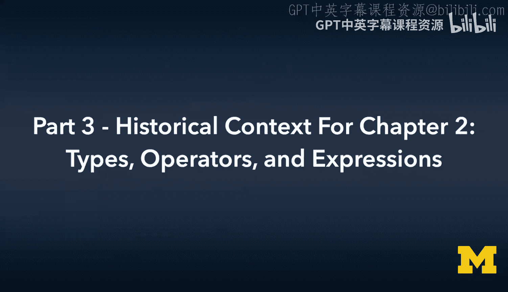

在本节课中，我们将了解C语言诞生时的历史背景，特别是它如何处理字符、字节与字，以及为何需要位掩码和移位操作。我们还将简要探讨字节序（大端序与小端序）的概念。

---

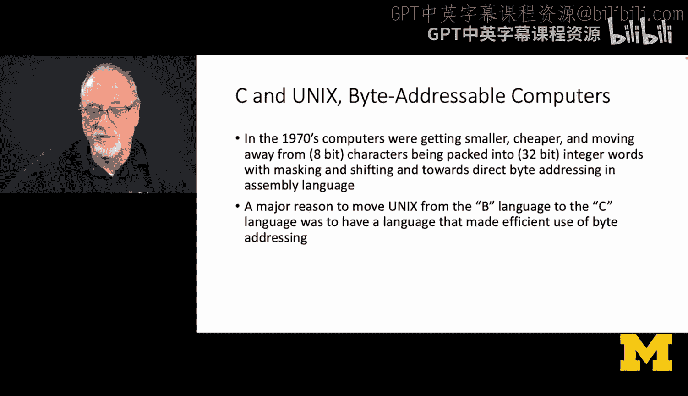

上一节我们讨论了早期计算机的数值表示。本节中，我们来看看C语言在处理字符数据方面的创新，以及它如何从面向“字”的编程过渡到面向“字节”的编程。

C语言是早期创新语言之一，其重要特性之一是支持**字节寻址计算机**。如今我们视字符串为理所当然，可以轻松访问其中的字符。但在C语言及其催生的那代计算机出现之前，情况并非如此。

当时硬件无法直接加载单个字符，只能加载整个**字**。程序员必须从字中手动找出所需的字符。

C语言的直接前身是B语言。B语言是一种很酷的、面向字的低级语言。C语言则从B语言演变而来，成为了一种面向**字节**的语言。C语言决定采用字节寻址。


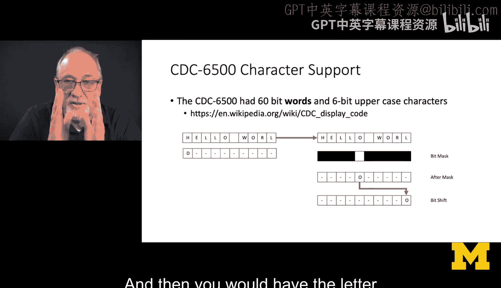

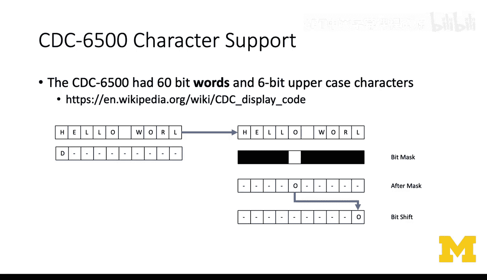

以下是我在1975-1976年使用的CDC 6500计算机上处理字符支持的方式。它是一台科学计算机，几乎不关心字符打印，甚至不支持小写字母。它使用60位的字，并将6位的大写字符打包进这些字中，用一系列零来填充剩余空间。

如果我想将“Hello World”存入CDC 6500，它需要两个字。第一个字打包了“Hello W”，第二个字包含了“orld”和用于填充的零。如果我想要知道这个两字字符串中的第五个字符（例如字母‘O’），就必须手动操作。

以下是提取特定字符所需的步骤：

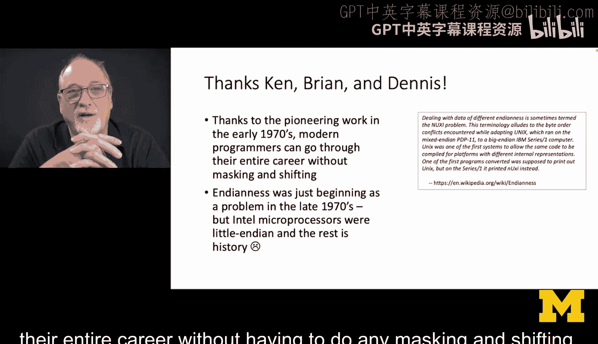

1.  **创建掩码**：创建一个位模式，在想要保留数据的位置置1，在想要清除的位置置0。
2.  **应用掩码**：将“Hello World”数据与掩码进行按位与运算，以提取目标字符所在的位。
3.  **移位操作**：将结果右移适当的位数，使目标字符位于字的底部（最低有效位）。

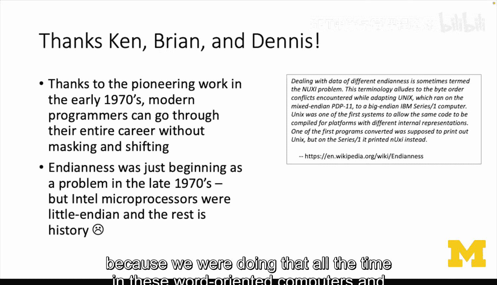

最终，我才能写一个if语句来检查第五个字符是否是字母‘O’。你可以想象，当我开始使用允许数组语法（如`string[5]`）来访问字符的编程语言时，我是多么高兴。在1977年，将字符视为数组的概念对我们来说还很陌生。

因此，整整一代程序员在其整个职业生涯中都不必进行任何掩码和移位操作。本章将向你介绍这些概念。你可能会问，既然C语言能自动处理这些，为什么还要展示底层操作？答案是，如果C语言没有提供良好的掩码和移位操作支持，像我这样的程序员就不会尊重这门语言，因为我们当时一直在面向字的计算机和语言中做这些事情。

---

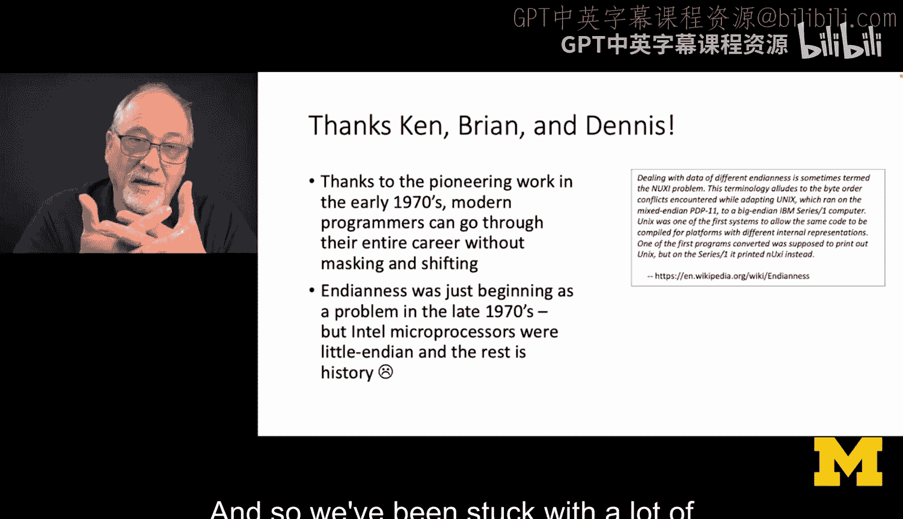

就在C语言和Unix系统让字符处理变得安全便捷时，我们遇到了另一个问题：**字节序**。

如果你要加载一个字，你是先加载最低有效位（小端序）还是最高有效位（大端序）？大多数计算机是**大端序**，这对我们软件开发人员来说最合乎逻辑，因为我们认为数据就应该那样布局。

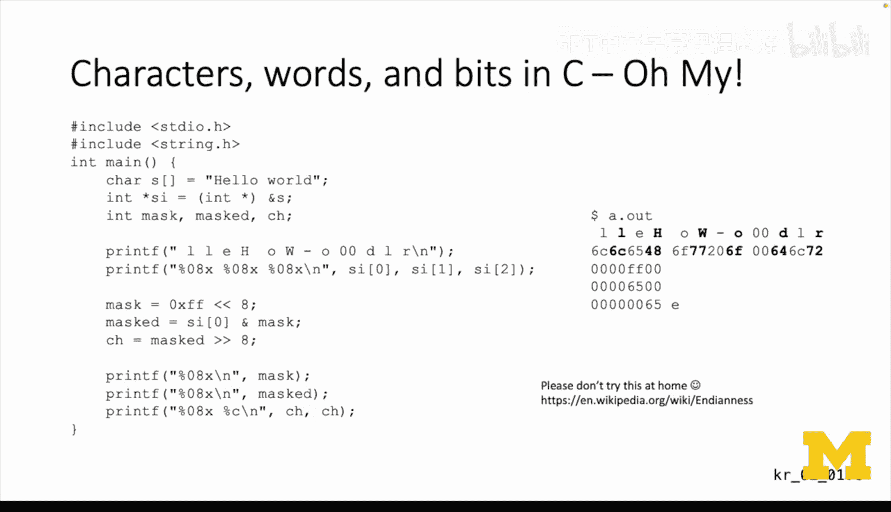

但一些处理器（如当时的Intel）为了性能，选择成为**小端序**。这样，它们在执行加法运算时，可以先加载整数的低端部分并开始计算，同时加载高端部分，从而实现加载和加法运算的重叠。自那以后，我们就一直受困于许多小端序微处理器。大端序与小端序是计算机科学中较难解决的问题之一。

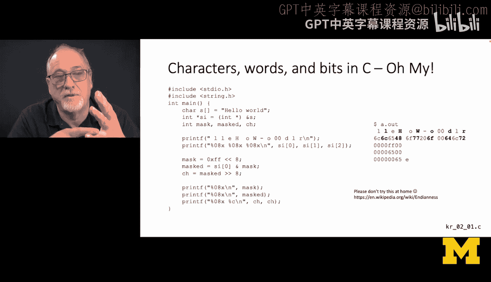

我接下来展示一些代码，并不是要你完全理解，而是希望你体会一下我们当年不得不处理字节序问题时的感受。让我概述一下这段代码在做什么，但不会详细讲解，它看起来有点吓人。在学到第5章之前，你可能无法理解大部分代码。这里我们只是简单讨论一下，如果没有字符数组，掩码和移位操作是如何工作的。

在这段程序中，我首先创建了一个字符数组：
```c
char s[] = "Hello World";
```
这个字符数组的长度是“Hello World”加上一个终止符‘\0’，即11+1=12个字符。


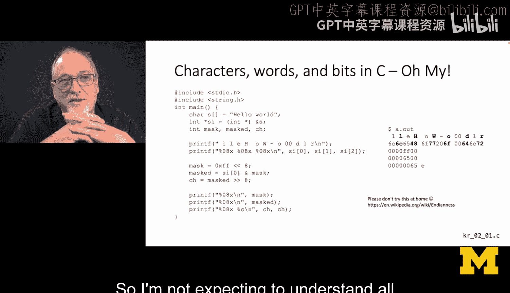

接下来这行代码`int *si = (int *) s;`的作用是：我实际上是想**将同一块存储空间视为一个整数数组**。这行代码获取第一个字符的地址，并将其从字符指针转换为整数指针。这里我提前涉及了第5章指针的概念，所以不期望你现在完全理解，只是让你有所了解。

在前两行中，我有了一个字符数组和一个（指向同一内存的）整数数组。这是一个32位整数，意味着字符是以小端序的方式被打包进32位整数中的。

因此，如果你从左到右查看内存，在第一个32位整数（即前四个字符）中，最先出来的字符是‘l’。你可以看到小端序的效果，这在你脑海中可能觉得应该是移位后的结果，但这是因为程序运行在小端序计算机上。不同的计算机会给出不同的结果。


通过掩码和移位，我将尝试提取出‘e’（它通常是字符串的第二个字符，但在第一个整数中，它位于从底部数起的第二个位置）。以下是操作步骤：

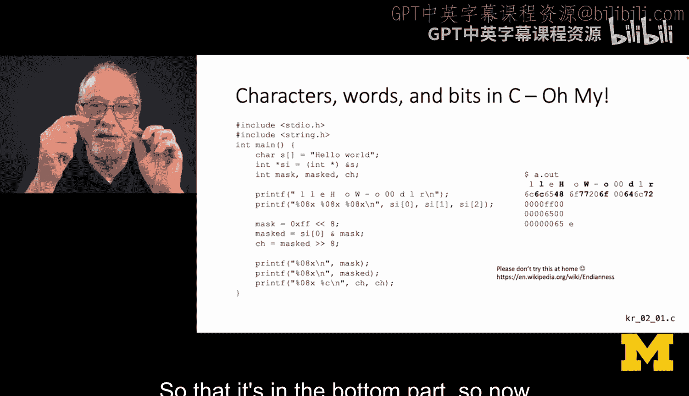

1.  我创建一个掩码`0xFF`（即8个比特位全为1）。
2.  我将这个掩码左移8位。
3.  我将整数数据与移位后的掩码进行按位与运算，以提取出包含‘e’的8位。
4.  由于提取出的字符位处于错误的位置，我必须将掩码后的结果再右移8位，使其位于底部。这样我才能检查那个字母是什么。


这就是我提取字符串第二个字符以检查它是否是‘e’的方法。因为在那个时代，我不能像在Python中那样直接比较字符串的第二个字符。这就是为什么后来人们构建字符串类，而不是直接使用字符数组来处理这类问题。我让情况变得更复杂，因为我从字符数组开始，将其视为整数数组，然后操作这些整数。

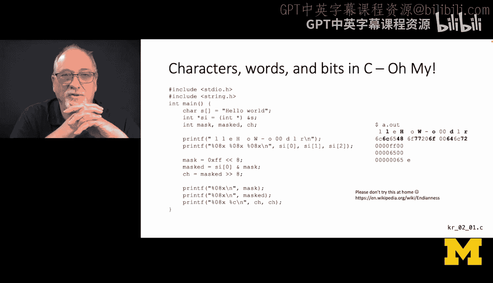

**你不需要完全理解这段代码**。只需庆幸你使用的是Python，或者即使用C语言，无论机器是大端序还是小端序，你都可以将字符数组视为字符数组，并使用方括号符号（如`s[2]`）来获取第三个或第五个字符。

---

本节课中我们一起学习了：
*   数字进制转换。
*   整数除法的历史背景（如Python 2的行为）。
*   **整数、字和字节**的概念。
*   **掩码和移位操作**在早期字符处理中的必要性。
*   **字节序**（大端序与小端序）问题。

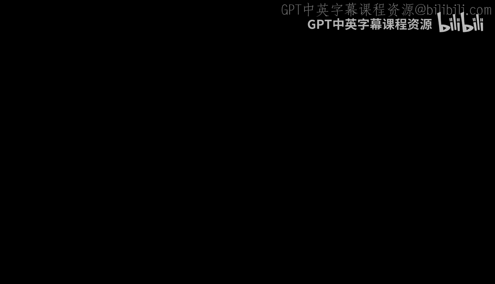

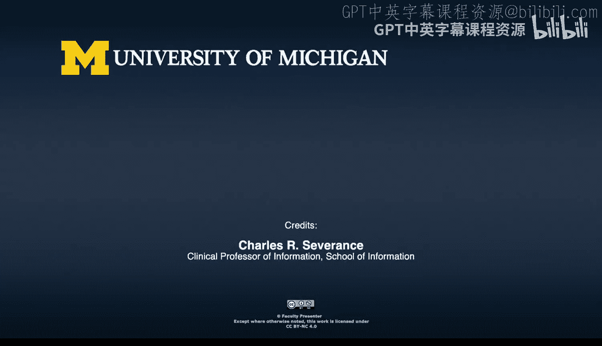

这些主题在本章中都有涉及，它们可能让你感到陌生和不自然。但请尝试阅读并理解它们，以后当我们学习结构体、指针、地址运算等内容时，这一切会变得更有意义。