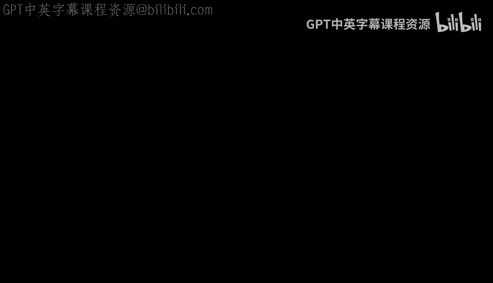

# 012：姜饼人赛道办公时间 🏁

在本节中，我们将跟随查克教授在密歇根州南黑文德国赛道的即兴办公时间，聆听一位学生的编程学习经历与应用实践。我们将了解他从学习Python到应用Django的旅程，并从中获得对编程学习的启示。

大家好，我是查克。我们又一次在南黑文的德国赛道进行即兴办公时间。

我遇到了一位学生，他刚好路过并打招呼说：“嘿，我正在学习《给所有人的Python》课程。”于是我说：“嘿，我们来录个视频吧。”所以，请介绍一下你自己，告诉我们你的名字（只提名字），并谈谈你学习Python的经历。

我的名字是克里斯。我从事IT项目管理大约15年了，想更深入地了解技术方面，所以我学习了《给所有人的Python》课程。我非常喜欢这门课，学到了很多，现在正在学习查克博士的Django课程。我也很喜欢这门课，它真的很有趣。我鼓励任何对计算机编程感兴趣的人投身其中，亲自动手实践。查克博士是引领你入门的最佳人选。

那么，请告诉我你在工作中是如何应用Python技能的。

我找到了一份实验室自动化相关的工作。我们涉及试管存储和分拣。我构建了一个应用程序，它位于试管存储区和分拣器之间。我可以获取数据，并重新排列试管，将它们以所需的新格式放入架子中。我使用Python来实现这一切。

我很好奇你对《给所有人的Django》课程有什么期望，因为我开设这门课有一个非常具体的原因。我想知道我为该课程设定的目标是否达到了效果。

我想向互联网开发方向发展，而我的基础是Python，所以这确实是我选择这条路线的主要动机。

对我来说，我开设这门课的目的并不完全是关于构建Web应用程序。

但你谈论的内容确实是在构建Web应用程序。

是的，没错。对我来说，我希望人们学习创业精神相关的编程。我希望人们学习……更好的Python，以更多样的方式应用Python。但显然，你最终会构建Web应用，这真的很棒。

是的，这会很有趣。Web应用部署起来更容易，你不需要去客户现场实施，只需在一个地方修改，然后任何访问它的人都能看到更新。所以你可能会为一些本地的小型需求开发Web应用，但基本上你不是在做一个Twitter的克隆品，你只是在做一些辅助工作的工具。

是的，用于我们内部的实用工具。

好的，这非常酷。非常感谢。你有什么想对你的同学们说的吗？

是的，慢慢来，完成所有练习，不要跳过任何内容，确保在继续前进之前真正掌握了所学知识。

我完全同意这一点。学习关乎精通，而非速度。如果你匆忙完成却什么都没记住，那完全是浪费时间。

好了，我们在密歇根州南黑文的德国赛道向大家问好。我们俩大约10到15分钟后都要回到赛道上。祝大家一切顺利，干杯！

---

**本节课总结**

在本节课中，我们一起聆听了学生克里斯分享的编程学习路径。他从IT项目管理背景出发，通过学习《给所有人的Python》课程打下基础，并进一步学习Django以构建实用的Web应用程序来解决工作中的自动化问题。他的经历强调了动手实践和扎实掌握基础知识的重要性，而非追求学习速度。这为初学者提供了一个从兴趣到实际应用的真实参考范例。