# 020：结构体（第一部分）


在本节课中，我们将学习C语言中一个非常核心且强大的概念——结构体。结构体允许我们将不同类型的数据组合成一个单一的、自定义的数据类型，这对于组织复杂数据至关重要。我们将从基础定义开始，逐步深入到结构体与指针、动态内存分配的结合，并最终构建一个简单的链表数据结构。

## 🏗️ 5.03.02：结构体基础

结构体是C语言中最优美的部分之一，就像指针一样。它是一种用户自定义的类型，可以包含一个或多个其他类型的数据。

我们称结构体内部的变量为“成员”。例如，在下面的结构体中，`x` 和 `y` 都是 `struct point` 的成员。

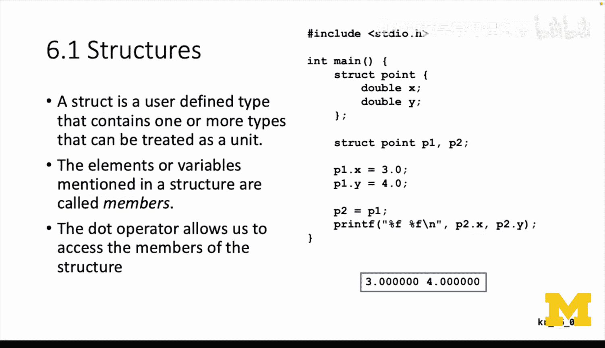

点运算符 `.` 允许我们访问结构体变量的成员。我们通过一个结构体变量，后接点运算符和成员名，来访问或修改该成员的值。

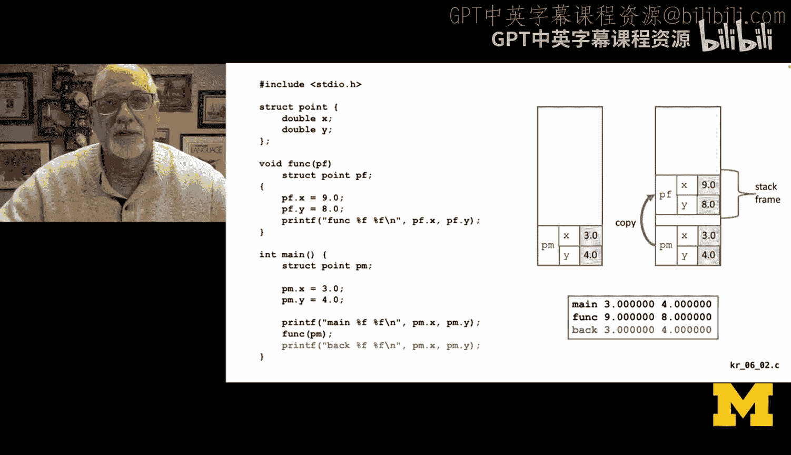

以下是一个基础示例，代码文件为 `KR0601.c`：

```c
struct point {
    double x;
    double y;
};
```

这段代码定义了一个名为 `point` 的新类型，它包含两个 `double` 类型的成员 `x` 和 `y`。注意，这仅仅是类型定义，并未分配任何内存。

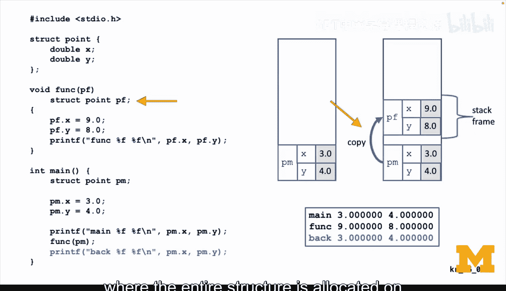

```c
struct point p1, p2;
```

这行代码才真正分配了两个 `point` 类型的变量 `p1` 和 `p2`，每个变量包含两个 `double`，共占用16字节（假设 `double` 为8字节）。

```c
p1.x = 3.0;
p1.y = 4.0;
p2 = p1;
printf(“%f %f\n”, p2.x, p2.y); // 输出：3.0 4.0
```

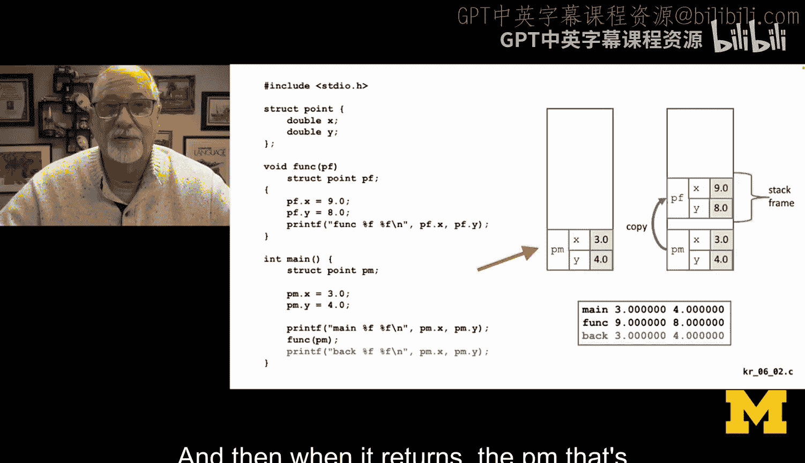

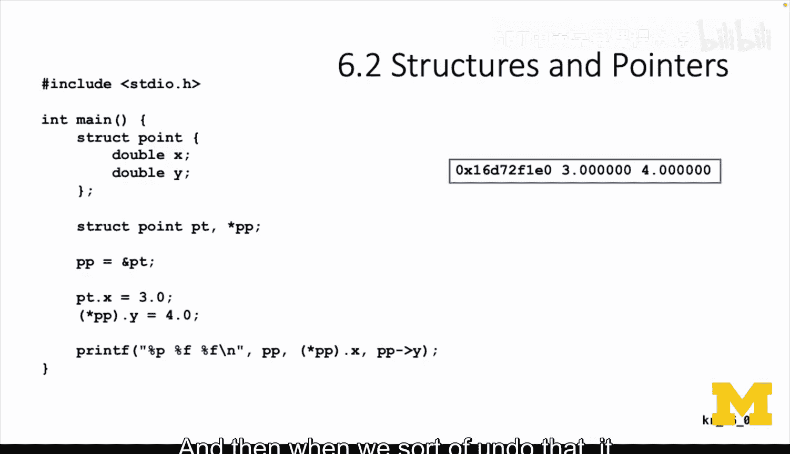

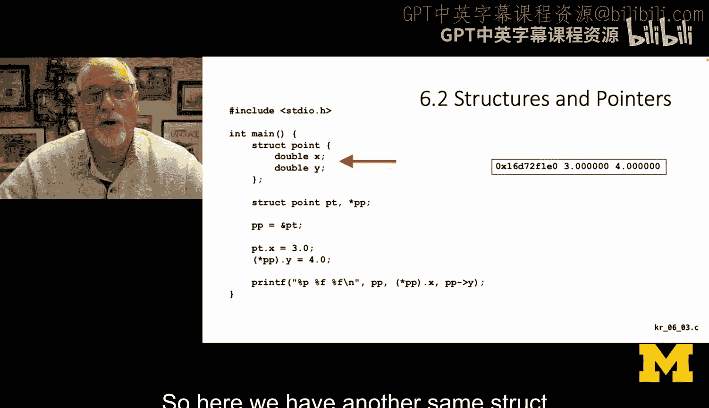

我们为 `p1` 的成员赋值，然后将 `p1` 整个赋值给 `p2`。这个操作会将 `p1` 的所有成员值复制到 `p2` 的对应成员中。最后打印 `p2` 的值，得到3和4。这就是结构体的基本用法。

## 🔄 5.03.02：结构体作为函数参数（传值）

结构体可以像其他基本类型一样作为函数参数传递。默认情况下，C语言对结构体采用“传值”调用。

这意味着当我们将一个结构体变量传递给函数时，整个结构体的内容会被复制到函数的栈帧中。因此，函数内部操作的是原始数据的一个副本，不会影响调用者中的原始结构体。

考虑以下情况：如果结构体非常大，这种复制可能会消耗较多内存和时间，所以需要谨慎设计结构体的大小。

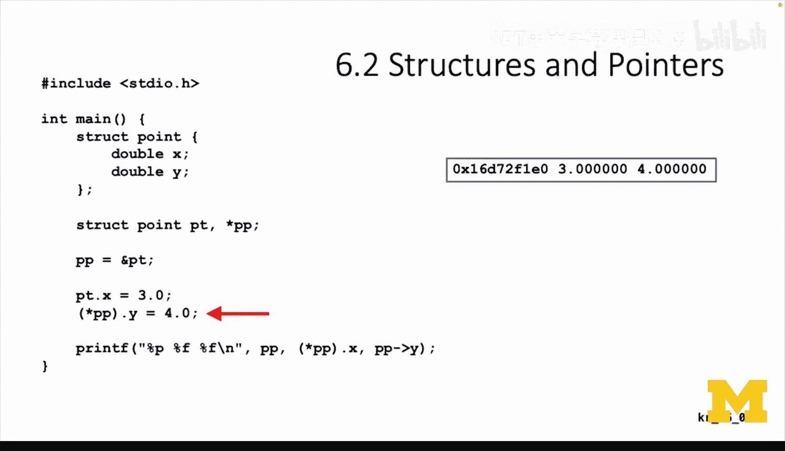

以下是传值调用的示例：

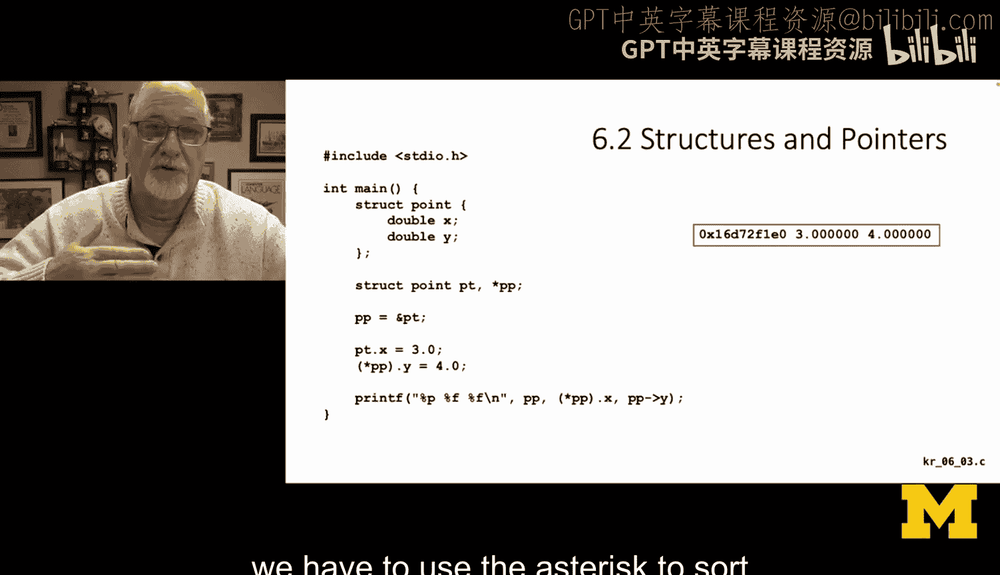

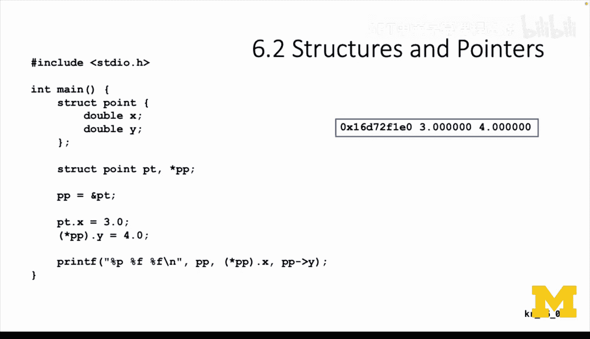

```c
void funk(struct point pf) {
    pf.x = 9.0; // 修改副本的成员
    pf.y = 8.0;
    printf(“Inside funk: %f %f\n”, pf.x, pf.y);
}

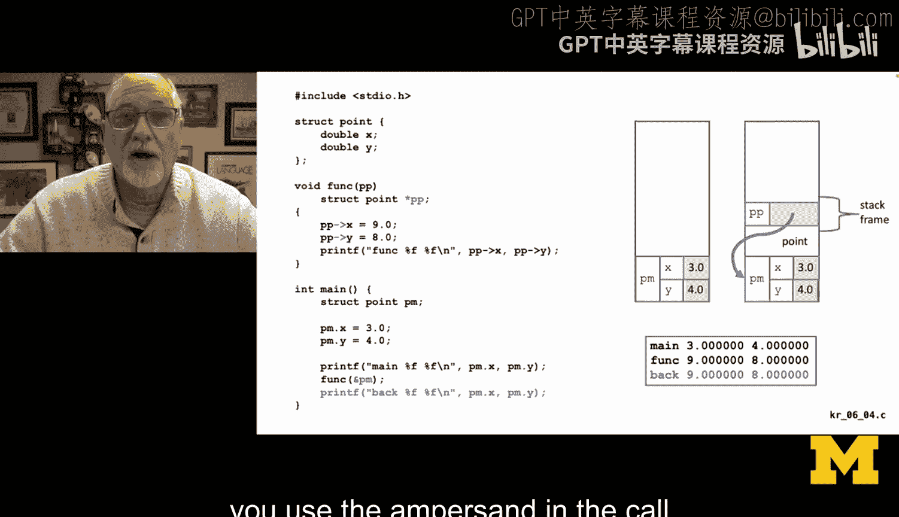

int main() {
    struct point pm = {3.0, 4.0};
    funk(pm); // 传递pm的副本
    printf(“In main: %f %f\n”, pm.x, pm.y); // pm的值未改变
    return 0;
}
```

在函数 `funk` 中，我们修改了参数 `pf` 的 `x` 和 `y` 值。但由于 `pf` 只是 `pm` 的一个副本，所以当函数返回后，`main` 函数中的 `pm` 保持不变。输出将显示函数内部的值被修改了，但 `main` 中的值仍是3和4。

## 🎯 5.03.02：指向结构体的指针

为了更高效地操作结构体，并允许函数修改原始数据，我们通常使用指向结构体的指针。这是结构体真正发挥威力的地方。

我们可以像获取整型变量地址一样，使用 `&` 运算符获取结构体变量的地址。

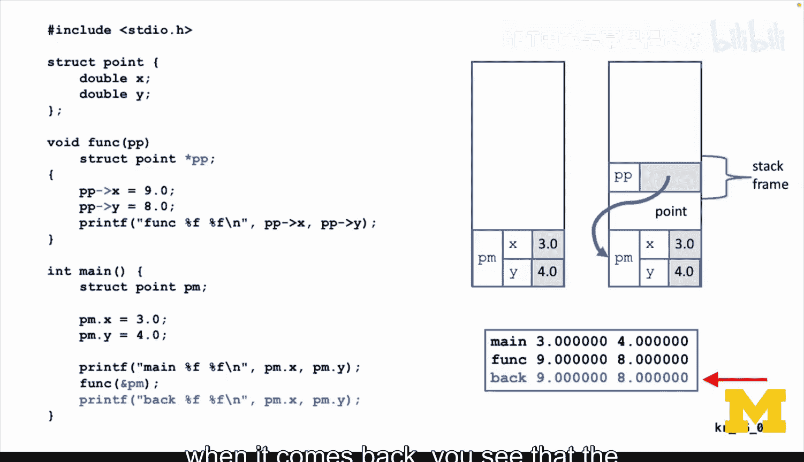

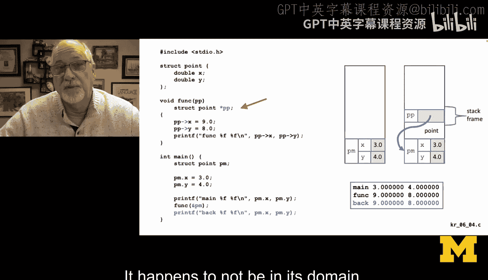

以下是定义和使用结构体指针的步骤：

1.  **定义指针**：`struct point *pp;` 声明了一个指向 `struct point` 类型的指针。
2.  **获取地址**：`pp = &p;` 将结构体变量 `p` 的地址赋值给指针 `pp`。
3.  **通过指针访问成员**：有两种等效的方法：
    *   解引用后使用点运算符：`(*pp).x = 3.0;`
    *   使用箭头运算符（更简洁）：`pp->y = 4.0;`

箭头运算符 `->` 是“解引用并访问成员”的简写形式，在C语言中极为常用。许多其他语言（如PHP）也借鉴了这个操作符。

## 📞 5.03.02：结构体作为函数参数（传地址/传引用）

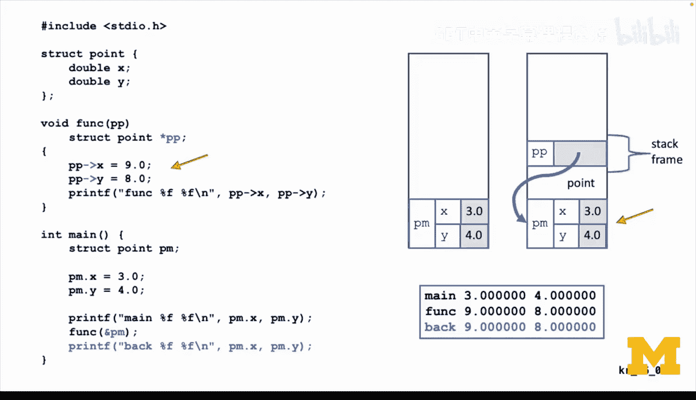

通过传递结构体的指针（即地址），我们可以在函数内部修改原始结构体的内容。这通常被称为“传地址”或“传引用”。

以下是传地址调用的示例：

```c
void funk(struct point *pp) { // 参数是指针
    pp->x = 9.0; // 通过指针修改原始数据
    pp->y = 8.0;
    printf(“Inside funk: %f %f\n”, pp->x, pp->y);
}

int main() {
    struct point pm = {3.0, 4.0};
    funk(&pm); // 传递pm的地址
    printf(“In main: %f %f\n”, pm.x, pm.y); // pm的值已被改变
    return 0;
}
```

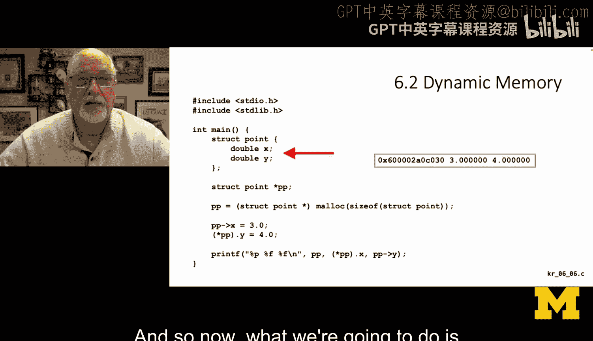

在调用 `funk(&pm)` 时，我们将 `pm` 的地址压入栈帧传递给函数。函数内部通过指针 `pp` 和箭头运算符直接操作 `pm` 所在的内存。因此，函数内的修改会直接影响 `main` 函数中的 `pm` 变量。输出将显示，无论在函数内部还是外部，`pm` 的值都变成了9和8。

## 💾 5.03.02：动态内存分配与结构体

到目前为止，我们创建的结构体变量都是静态分配的（在栈上）。但很多时候，我们需要在程序运行时动态地创建结构体，这就需要用到堆内存和 `malloc` 函数。

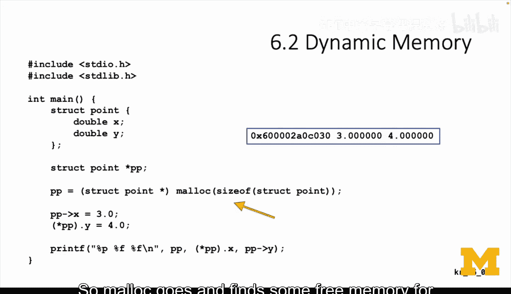

首先，我们需要知道要分配多大的内存。`sizeof` 运算符可以返回一个类型或变量所占用的字节数。

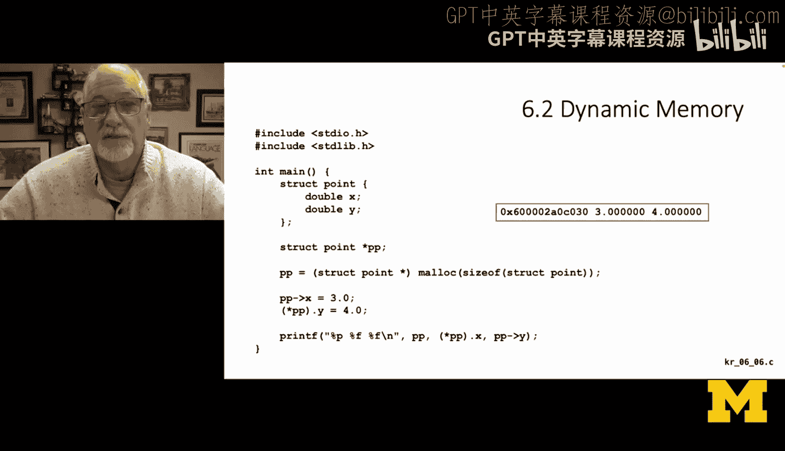

```c
struct point p;
struct point *pp;
printf(“Sizeof struct: %lu\n”, sizeof(struct point)); // 输出 16 (2个double)
printf(“Sizeof pointer: %lu\n”, sizeof(pp)); // 输出 8 (一个地址的大小)
```

`malloc` 函数（需要包含 `stdlib.h`）用于在堆上分配指定大小的内存，并返回一个指向该内存块的指针（类型为 `void*`）。我们通常需要将其强制转换为目标指针类型。

以下是动态分配结构体的示例：

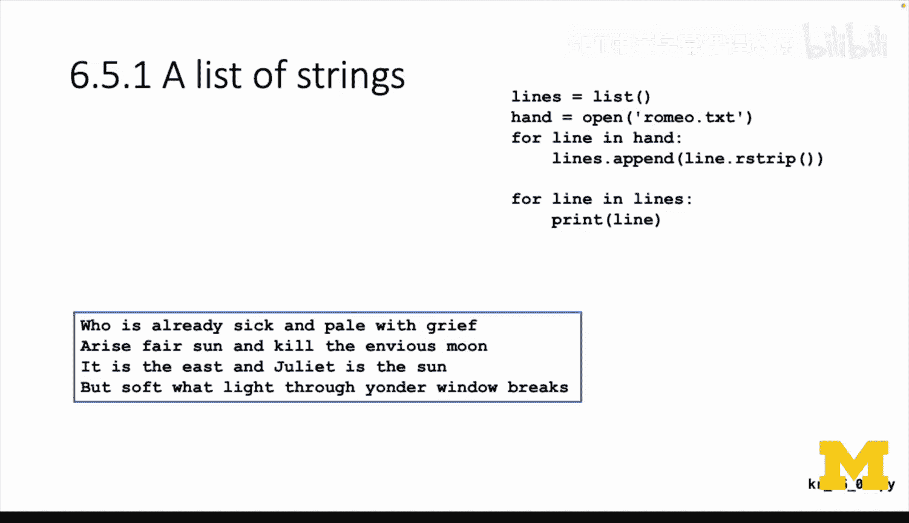

```c
#include <stdlib.h>
int main() {
    struct point *pp; // 仅分配了一个指针变量（8字节）
    // 动态分配一个 struct point 所需的内存
    pp = (struct point *) malloc(sizeof(struct point));
    if (pp == NULL) {
        // 处理内存分配失败
        return 1;
    }
    // 使用分配好的结构体
    pp->x = 5.0;
    pp->y = 10.0;
    // ... 使用完毕后
    free(pp); // 释放内存，防止内存泄漏
    return 0;
}
```

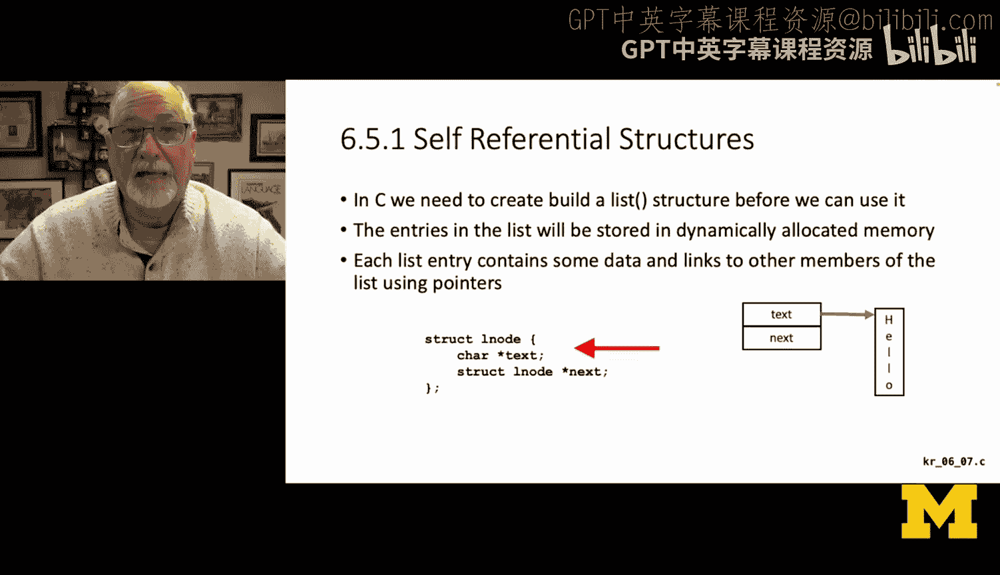

关键步骤：
1.  声明一个结构体指针 `pp`，此时它还未指向任何有效的结构体数据。
2.  使用 `malloc(sizeof(struct point))` 请求足够存放一个 `struct point` 的内存。
3.  将返回的 `void*` 指针强制转换为 `struct point*` 类型，并赋值给 `pp`。
4.  现在，`pp` 指向了一块有效的内存，我们可以通过 `pp->x` 等方式访问和修改其成员。
5.  使用完毕后，务必使用 `free(pp)` 释放内存。

## 🔗 5.03.02：构建链表数据结构

现在，我们将结合动态内存分配和结构体，来构建一个基础的数据结构——链表。链表允许我们动态地存储和管理数量可变的数据项，类似于Python中的列表。

首先，我们来看一个简单的Python程序，它读取文件并存储每一行到一个列表中：

```python
lines = list()
hand = open(‘romeo.txt’)
for line in hand:
    lines.append(line.rstrip())
for line in lines:
    print(line)
```

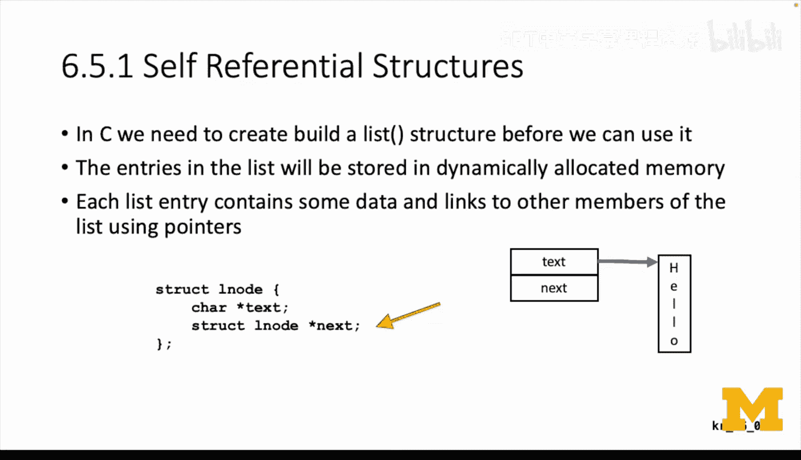

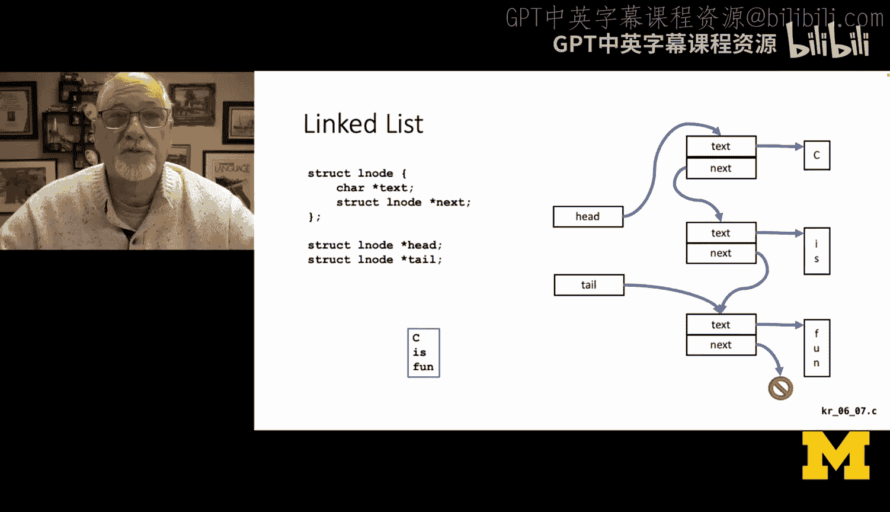

我们的目标是在C语言中实现类似的功能。链表中的每个元素（称为“节点”）将存储在动态分配的内存中。每个节点包含两部分数据：
1.  实际的数据（例如，一个字符串）。
2.  一个指向下一个节点的指针。

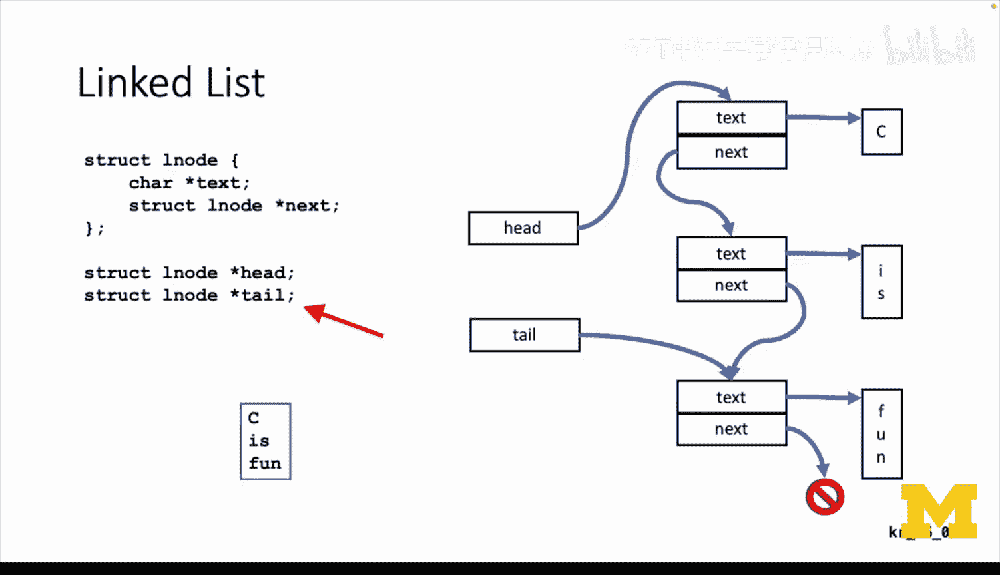

我们定义链表节点的结构如下：

```c
struct lnode {
    char *text;        // 指向字符串数据的指针
    struct lnode *next; // 指向下一个节点的指针
};
```

为了管理链表，我们通常需要两个全局指针：
*   `struct lnode *head;`：指向链表的第一个节点。
*   `struct lnode *tail;`：指向链表的最后一个节点。

初始时，链表为空，`head` 和 `tail` 都应为 `NULL`。

一个包含三个节点（”C”, “is”, “fun”）的链表示意图如下：
`head` -> [“C” | next] -> [“is” | next] -> [“fun” | next] -> `NULL`
同时，`tail` 指向最后一个节点 [“fun” | next]。

### 向链表追加节点

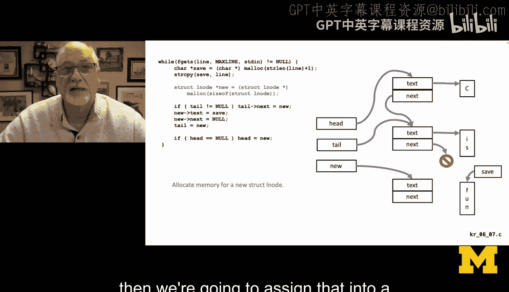

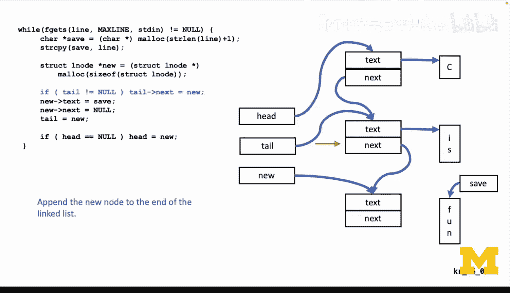

以下是向链表末尾添加一个新节点的逻辑步骤。假设我们从文件中读取了一行字符串 `line`：

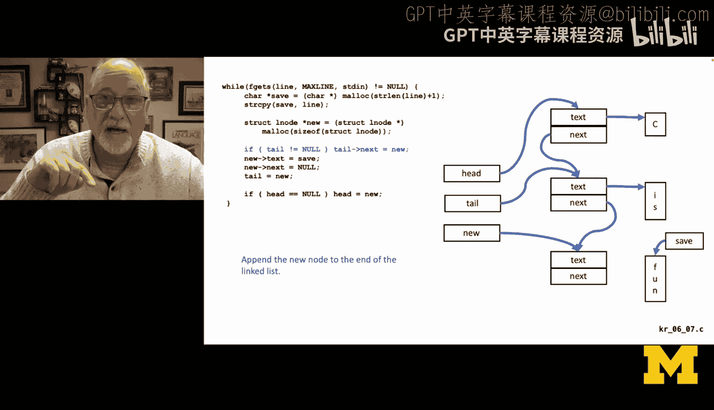

1.  **为字符串数据分配内存**：我们需要复制该字符串，因为原始输入缓冲区可能被覆盖。
    ```c
    char *save = (char *) malloc(strlen(line) + 1); // +1 用于存放字符串结束符 ‘\0‘
    strcpy(save, line); // 将 line 的内容复制到新分配的内存 save 中
    ```
2.  **为新节点分配内存**：
    ```c
    struct lnode *new = (struct lnode *) malloc(sizeof(struct lnode));
    ```
3.  **设置新节点的内容**：
    ```c
    new->text = save;   // 节点的 text 指针指向我们保存的字符串
    new->next = NULL;   // 新节点目前是最后一个，所以 next 指向 NULL
    ```
4.  **将新节点链接到链表**：
    *   如果链表为空（`head == NULL`），则新节点既是头也是尾：`head = new; tail = new;`
    *   如果链表不为空，则将当前尾节点的 `next` 指向新节点，然后更新 `tail` 指向新节点：
        ```c
        if (tail != NULL) {
            tail->next = new;
        }
        tail = new; // 更新尾指针
        if (head == NULL) {
            head = new; // 如果是第一个节点，同时设置头指针
        }
        ```

### 遍历链表

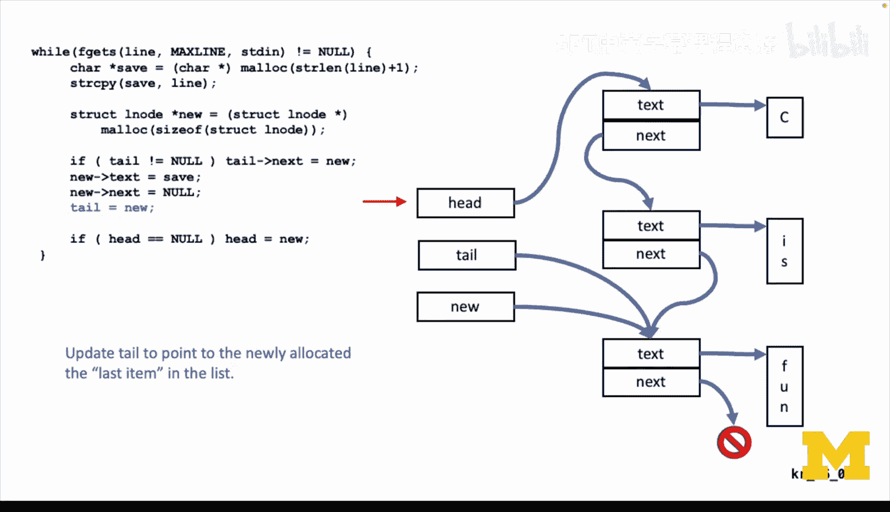

遍历链表意味着按顺序访问每一个节点。我们使用一个临时指针 `current` 从 `head` 开始，逐个节点移动，直到遇到 `NULL`。

```c
struct lnode *current;
for (current = head; current != NULL; current = current->next) {
    printf(“%s\n”, current->text);
}
```
这个过程类似于Python中的 `for item in list:` 循环。在每次迭代中，`current = current->next` 将指针移动到链表中的下一个节点。

**重要建议**：在处理链表这类指针结构时，动手画图是理解节点间连接关系的最有效方法。通过图示，插入、删除和遍历等操作会变得清晰直观。

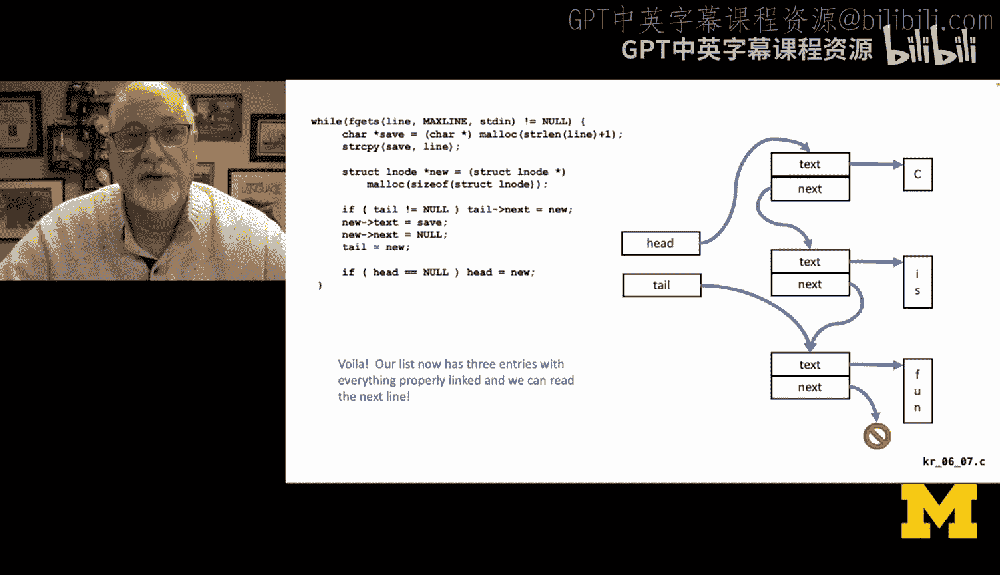

## 📚 本节课总结

在本节课中，我们一起深入学习了C语言的结构体。我们从最基础的结构体定义和成员访问开始，了解了如何使用点运算符。接着，我们探讨了结构体作为函数参数时的“传值”特性，并指出其对大结构体的效率影响。

然后，我们引入了指向结构体的指针和箭头运算符 `->`，这让我们能够高效地“传地址”给函数，从而在函数内部修改原始结构体数据。我们还学习了如何使用 `sizeof` 运算符和 `malloc` 函数在堆上动态分配结构体内存，这是构建动态数据结构的基础。

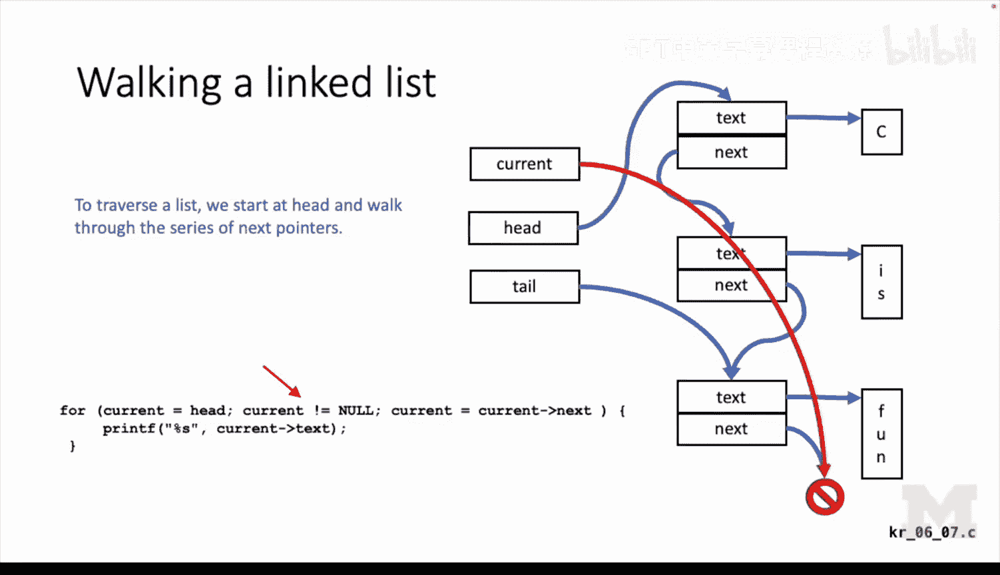


最后，我们综合运用这些知识，构建了一个简单的单向链表数据结构。我们定义了节点结构，实现了向链表追加节点的逻辑，以及遍历链表的方法。链表是理解更复杂数据结构（如树、图）的基石，掌握其原理对于成为一名优秀的程序员至关重要。记住，在操作链表时，画图是你最好的朋友。