# 025：跨语言比较面向对象编程方法 🆚

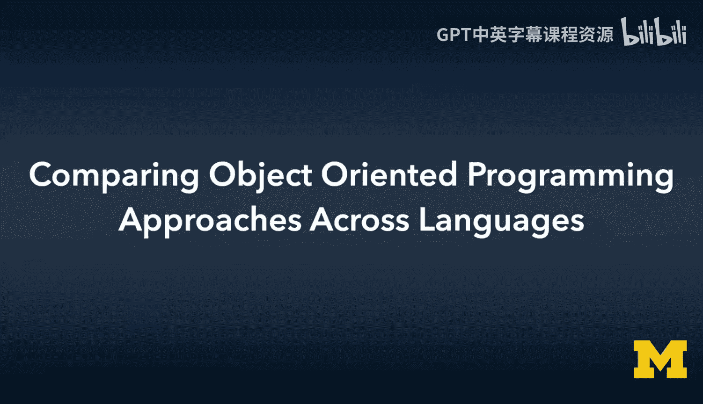

在本节课中，我们将要学习面向对象编程（OOP）在不同编程语言中的实现方式。我们将通过一个简单的“点”（Point）类示例，对比Python、C++、Java、JavaScript、PHP和C#等语言在语法和设计理念上的异同，从而理解OOP核心概念是如何在不同语言环境中演化和表达的。

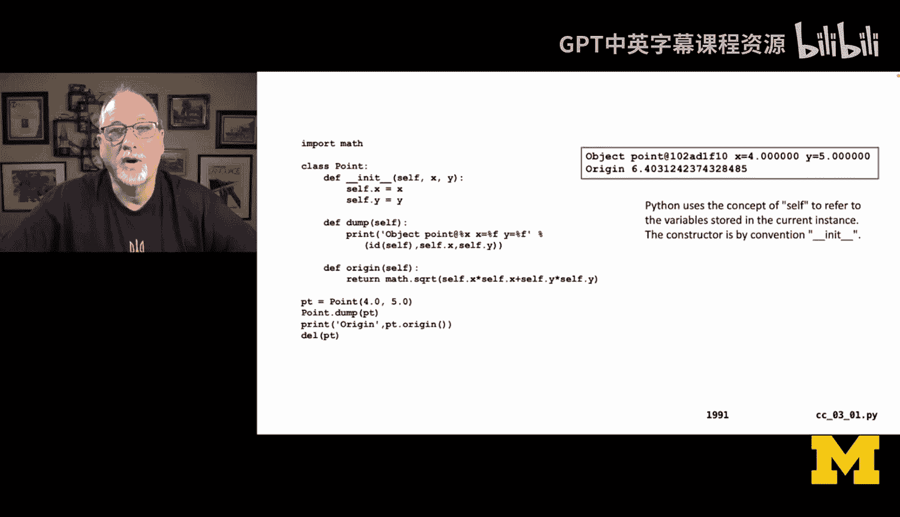

---

## 概述：面向对象编程的演变历程

上一节我们介绍了面向对象的基本思想。本节中，我们来看看几种主流编程语言是如何具体实现这些思想的。我们将从Python的早期实现开始，逐一分析C++、Java、JavaScript、PHP和C#的语法特点。

以下是几种语言及其面向对象特性出现的大致时间线：
*   **Python**：1991年。它在一个以过程式为主的语言之上实现了面向对象语法。
*   **C++**：1980年代。最初是作为C语言的预处理器实现的。
*   **Java**：1995年。深受C和C++影响。
*   **JavaScript**：1995年。其设计理念更偏向“纯粹”的面向对象。
*   **PHP**：约2000年（PHP 4/5）。它较晚引入面向对象，并融合了多种语言的特性。
*   **C#**：2001年。主要借鉴了C++和Java。

---

## Python (1991) 🐍

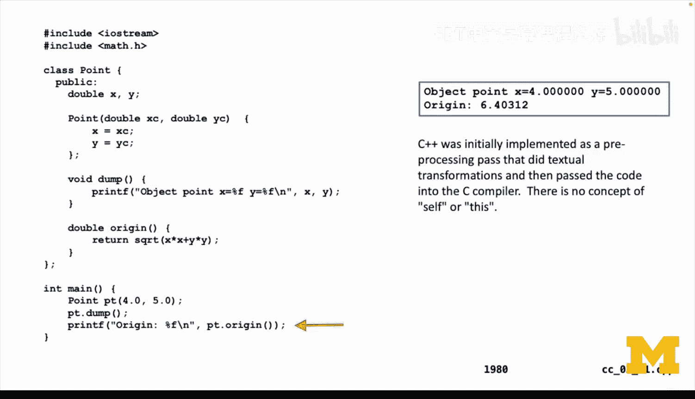

Python的面向对象实现建立在一个以过程式为主的语言之上。它的一个关键特点是使用 `self` 参数。

以下是Python中一个“点”类的示例：
```python
class Point:
    def __init__(self, x, y):  # 构造函数
        self.x = x
        self.y = y

    def dump(self):            # 方法
        print(f'x={self.x} y={self.y}')

    def origin(self):          # 方法
        return (self.x ** 2 + self.y ** 2) ** 0.5
```
核心概念：
*   **构造函数**名为 `__init__`。
*   **`self`** 是方法的第一个参数，它指向当前实例。这是一个**约定**，而非语言强制关键字，但被普遍使用。
*   访问实例变量时，需要使用 **`self.`** 前缀，例如 `self.x`。

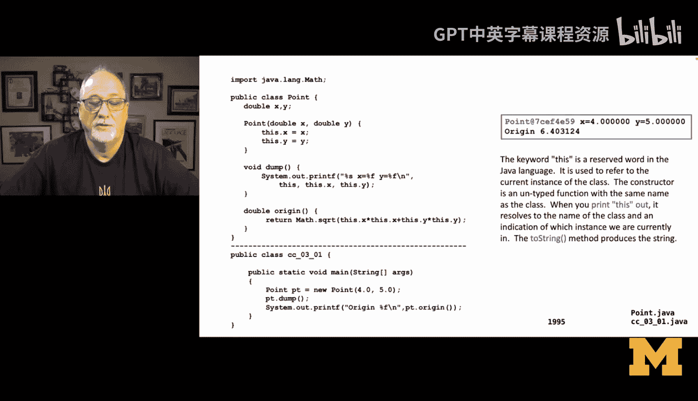

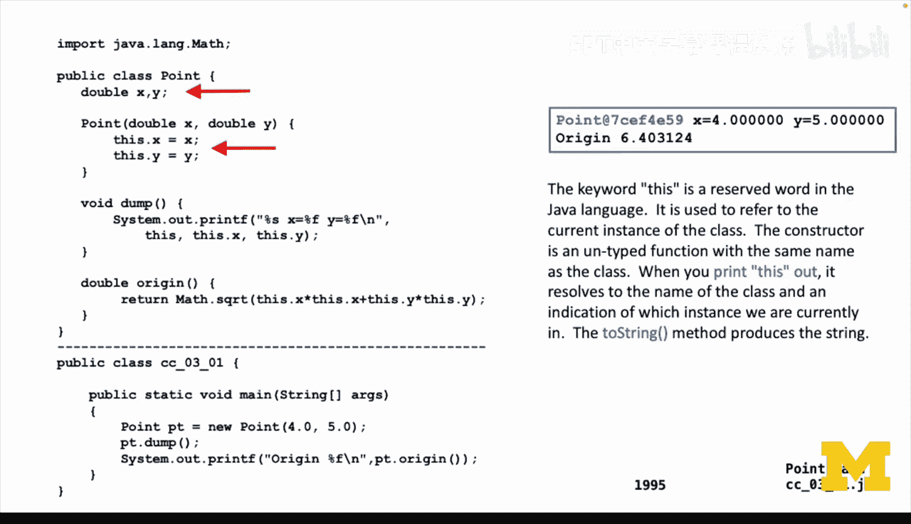

---

## C++ 🧠

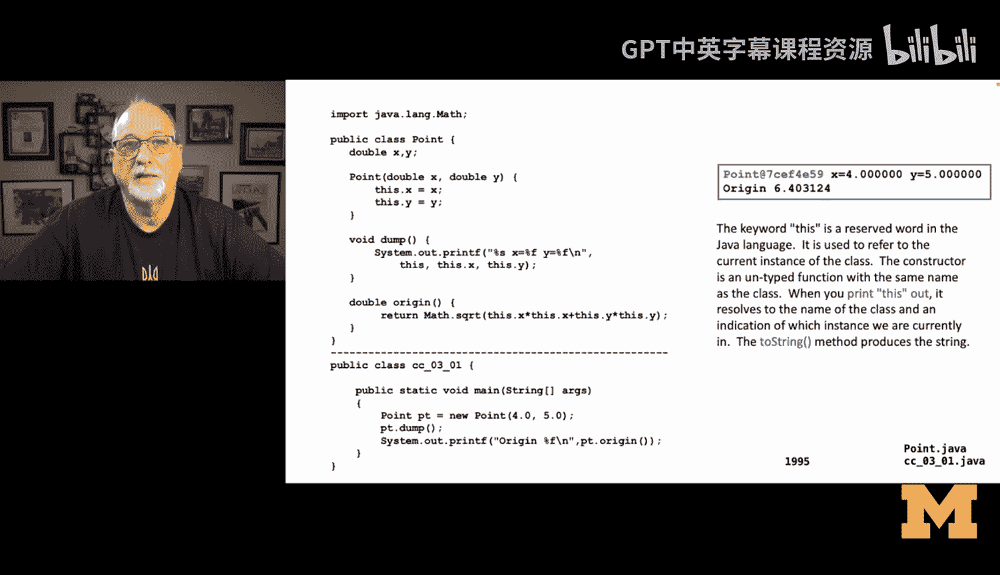

C++最初是作为C语言的预处理器实现的，它将 `class`、`public` 等新语法转换为标准的C代码，再交由C编译器处理。可以看到Python的语法设计受到了C++的启发。

以下是C++中“点”类的示例：
```cpp
class Point {
  public:
    double x, y;               // 实例变量
    Point(double xc, double yc) { // 构造函数
        x = xc;
        y = yc;
    }
    void dump() {              // 方法
        cout << "x=" << x << " y=" << y << endl;
    }
    double origin() {          // 方法
        return sqrt(x*x + y*y);
    }
};
```
核心概念：
*   构造函数名与类名相同（`Point`）。
*   实例变量（`x`, `y`）在类作用域内是“全局”的，因此在方法内部可以直接使用 `x` 和 `y`，无需 `self` 或 `this`。
*   为了避免命名冲突，构造函数的参数名通常与实例变量名不同（例如用 `xc`, `yc`）。
*   使用 **`.`** 语法调用方法：`pt.dump()`。

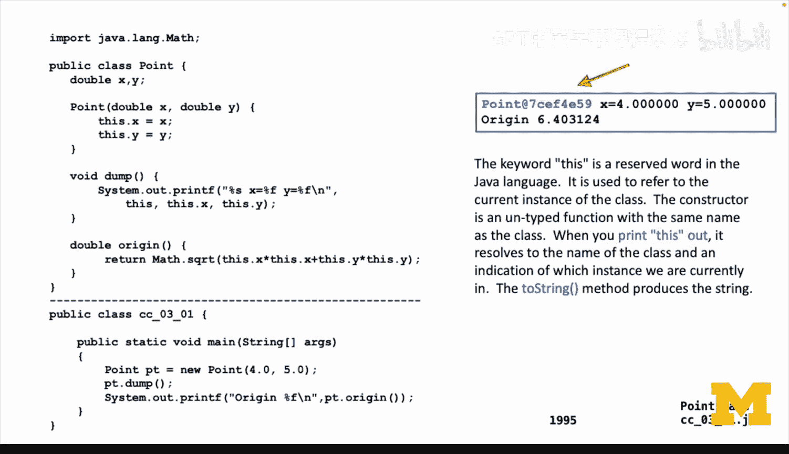

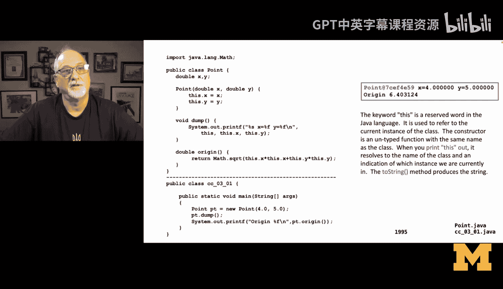

---

## Java ☕

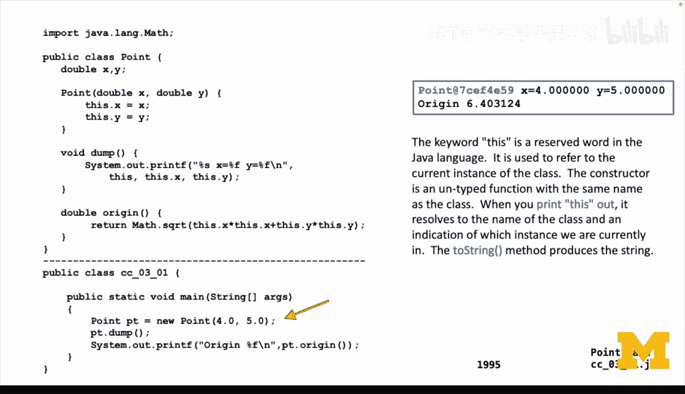

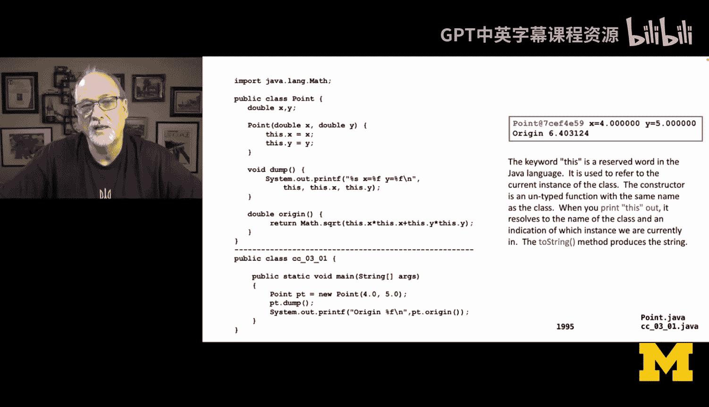

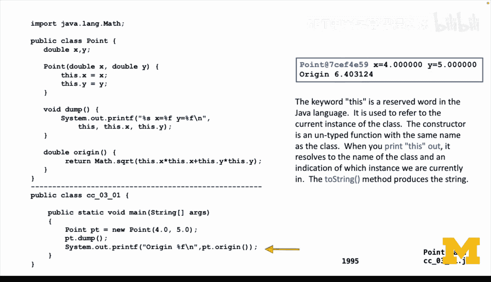

Java的设计灵感来源于C和C++，并引入了 `this` 关键字来更清晰地界定实例变量。

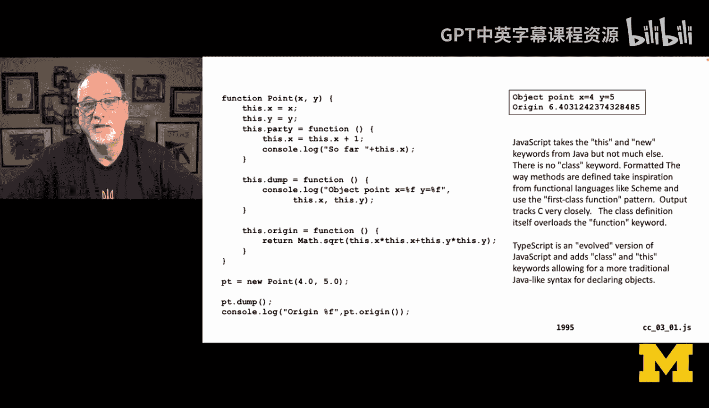

以下是Java中“点”类的示例：
```java
public class Point {
    double x, y;                     // 实例变量
    public Point(double x, double y) { // 构造函数
        this.x = x;                  // 使用 this 区分
        this.y = y;
    }
    public void dump() {             // 方法
        System.out.println("x=" + this.x + " y=" + this.y);
    }
    public double origin() {         // 方法
        return Math.sqrt(this.x * this.x + this.y * this.y);
    }
}
```
核心概念：
*   **`this`** 是一个**语言内置关键字**，指代当前对象实例。
*   使用 `this.x = x;` 可以清晰地将参数 `x` 赋值给实例变量 `x`，无需改变参数名。
*   使用 **`new`** 运算符显式调用构造函数：`Point pt = new Point(4.0, 5.0);`。

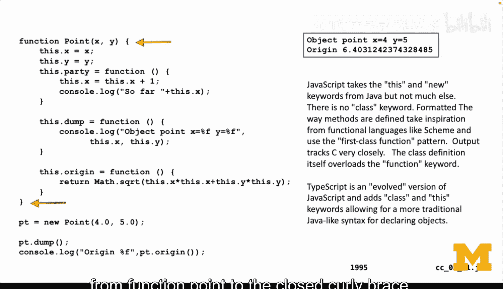

---

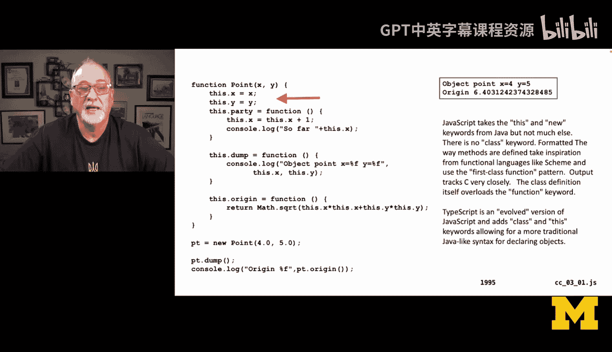

## JavaScript 🌐

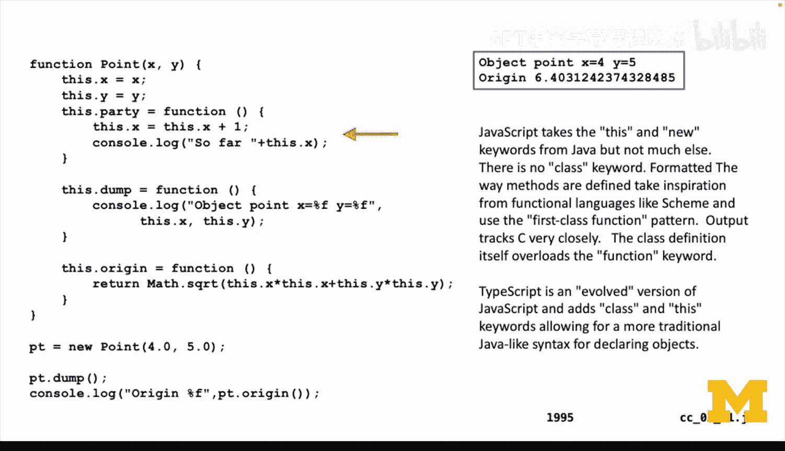

JavaScript的面向对象设计理念更为“纯粹”，它基于“一等函数”（first-class functions）的概念，早期没有 `class` 关键字（ES6后引入）。

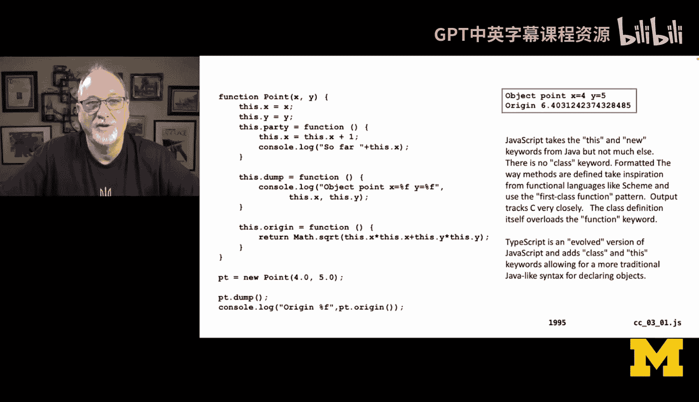

以下是JavaScript（ES5风格）中“点”类的示例：
```javascript
function Point(x, y) {               // 构造函数
    this.x = x;
    this.y = y;
    this.dump = function() {         // 方法作为函数赋值给属性
        console.log("x=" + this.x + " y=" + this.y);
    };
    this.origin = function() {       // 方法
        return Math.sqrt(this.x*this.x + this.y*this.y);
    };
}
```
核心概念：
*   构造函数就是一个普通函数。
*   所有属性和方法都在构造函数内部，通过 **`this.`** 进行定义和赋值。
*   方法被定义为**匿名函数**，并作为值赋给实例的属性（如 `this.dump`）。此时存储的是函数代码本身，而非执行结果。
*   同样使用 **`new`** 运算符创建实例：`var pt = new Point(4.0, 5.0);`。

---


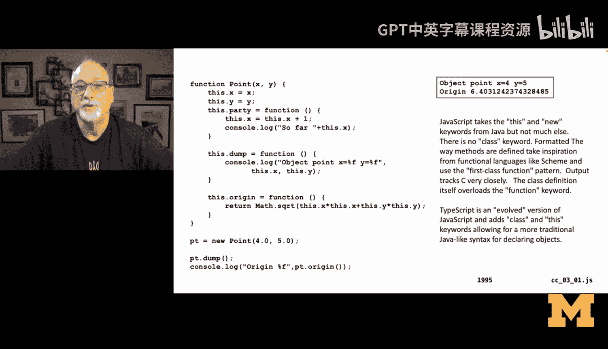

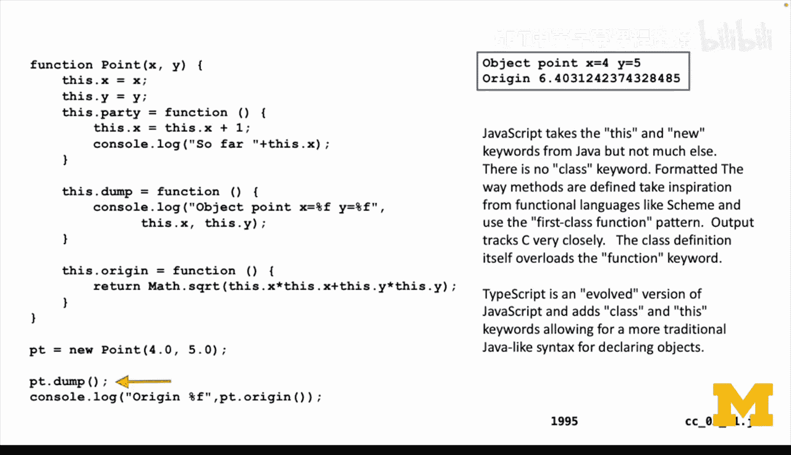

## PHP 🐘

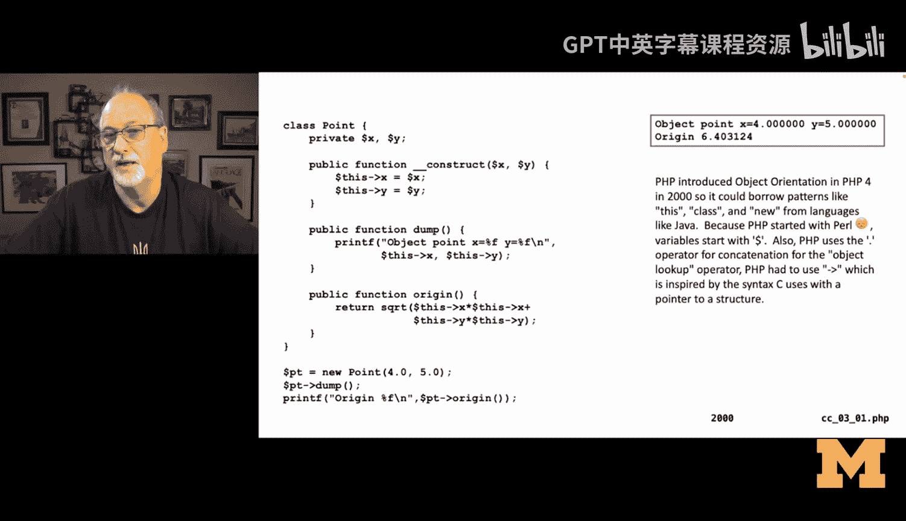

PHP最初是过程式语言，后来才引入面向对象特性。它借鉴了多种语言的特性，并有一些独特的语法规则。

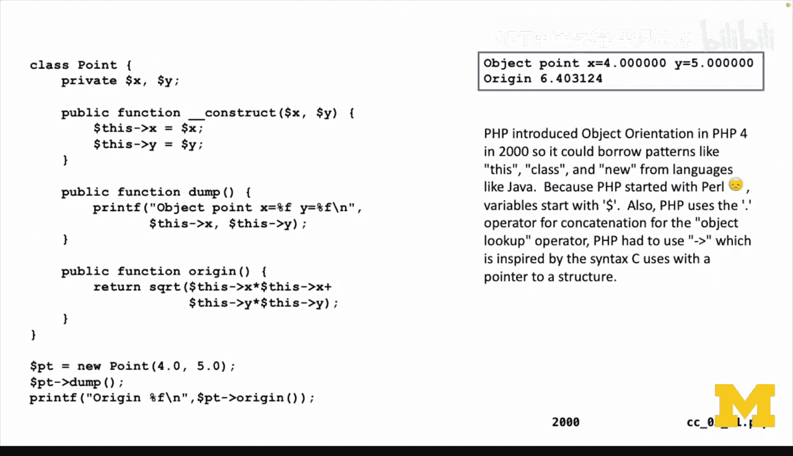

以下是PHP中“点”类的示例：
```php
class Point {
    public $x, $y;                   // 实例变量以 $ 开头
    public function __construct($x, $y) { // 构造函数
        $this->x = $x;               // 使用 -> 访问成员
        $this->y = $y;
    }
    public function dump() {         // 方法
        echo "x=" . $this->x . " y=" . $this->y . "\n";
    }
    public function origin() {       // 方法
        return sqrt($this->x * $this->x + $this->y * $this->y);
    }
}
```
核心概念：
*   变量以 **`$`** 符号开头。
*   因为点号 **`.`** 在PHP中用于字符串连接，所以访问对象成员使用箭头运算符 **`->`**（源自C语言中通过指针访问结构体成员的语法）。
*   构造函数名为 **`__construct`**。
*   在方法内部使用 **`$this`** 引用当前实例。
*   使用 `new` 创建对象：`$p = new Point(4.0, 5.0);`，调用方法为 `$p->dump();`。

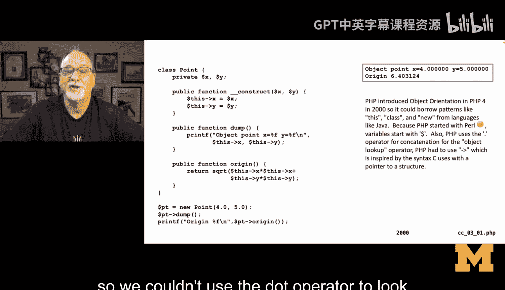

---

## C# ⚙️

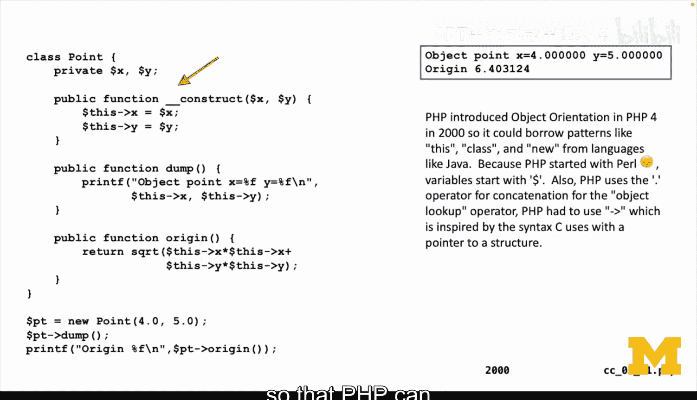


C#出现较晚，充分借鉴了C++和Java的特点，形成了自己的风格。

以下是C#中“点”类的示例：
```csharp
public class Point {
    double x, y;                     // 实例变量
    public Point(double xc, double yc) { // 构造函数
        x = xc;                      // 直接赋值，无需 this
        y = yc;
    }
    public void Dump() {             // 方法
        Console.WriteLine("x=" + x + " y=" + y);
    }
    public double Origin() {         // 方法
        return Math.Sqrt(x * x + y * y);
    }
}
```
核心概念：
*   语法与C++和Java高度相似。
*   与C++类似，实例变量 `x` 和 `y` 在类方法作用域内可直接访问，因此构造函数参数需要不同的名字（如 `xc`, `yc`）以避免歧义。
*   使用 **`.`** 语法访问成员：`Point p = new Point(4.0, 5.0); p.Dump();`。

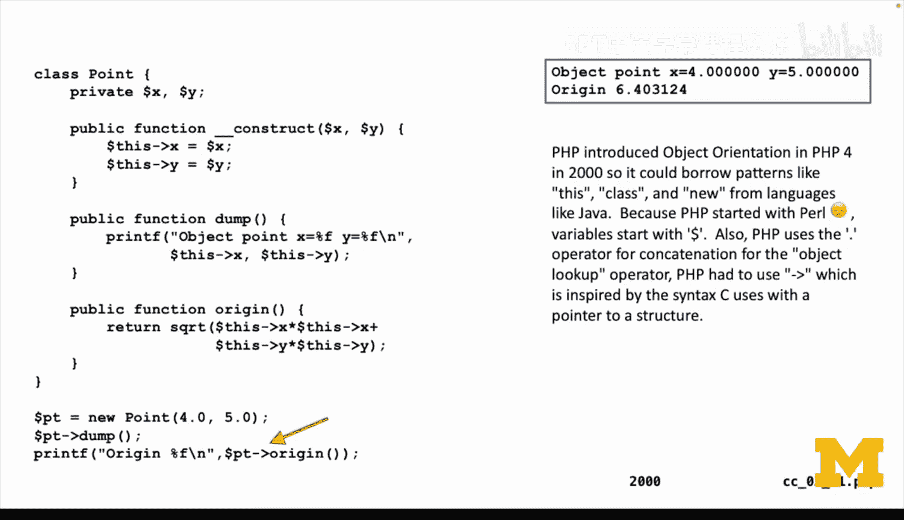

---

## 总结与展望

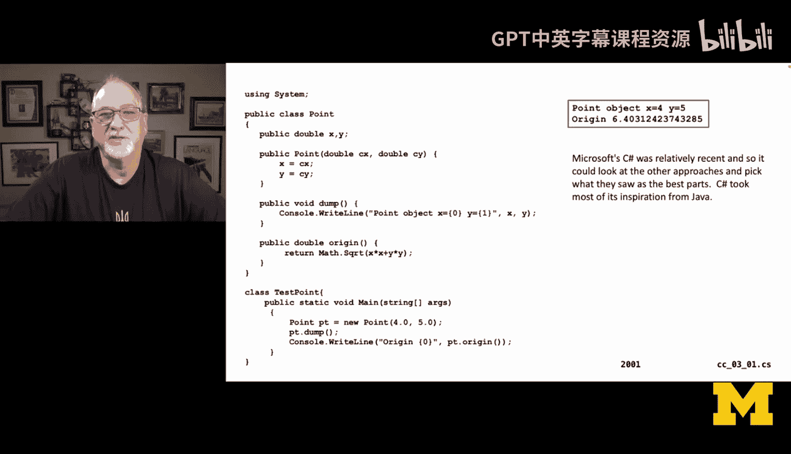

本节课中，我们一起学习了六种不同编程语言（Python、C++、Java、JavaScript、PHP、C#）实现面向对象编程的基本语法。我们看到：
1.  **核心思想一致**：都包含类、对象、构造函数、实例变量和方法这些基本概念。
2.  **语法细节各异**：
    *   **引用实例**：Python用约定的 `self`，Java/JS/PHP用 `this`，C++/C#在类内可直接访问。
    *   **成员访问符**：大多用 `.`，PHP因语法冲突改用 `->`。
    *   **对象创建**：Java、JS、PHP、C# 使用 `new` 关键字，Python和C++则更直接。
    *   **构造函数命名**：Python `__init__`，PHP `__construct`，其他语言与类名同。

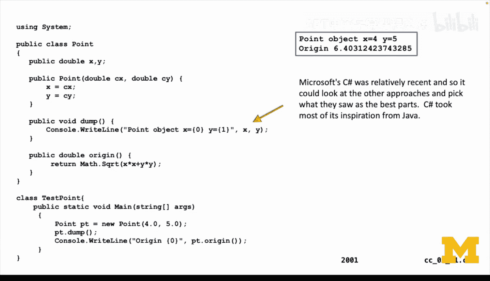

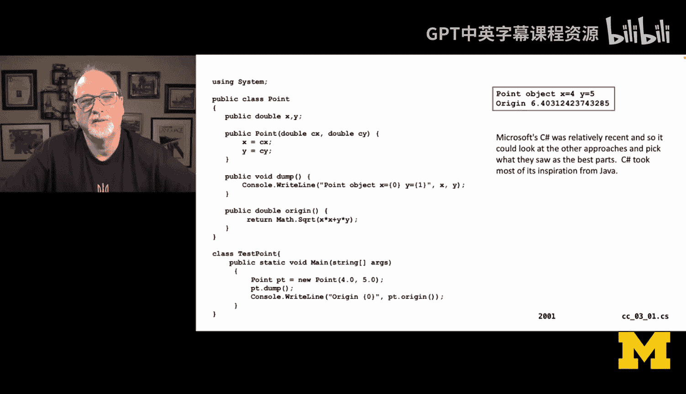

通过这次跨语言比较，我们可以清晰地看到面向对象编程思想是如何在不同语言生态中演化、相互借鉴并形成各自特色的。理解这些异同，有助于我们更深刻地把握OOP的本质。

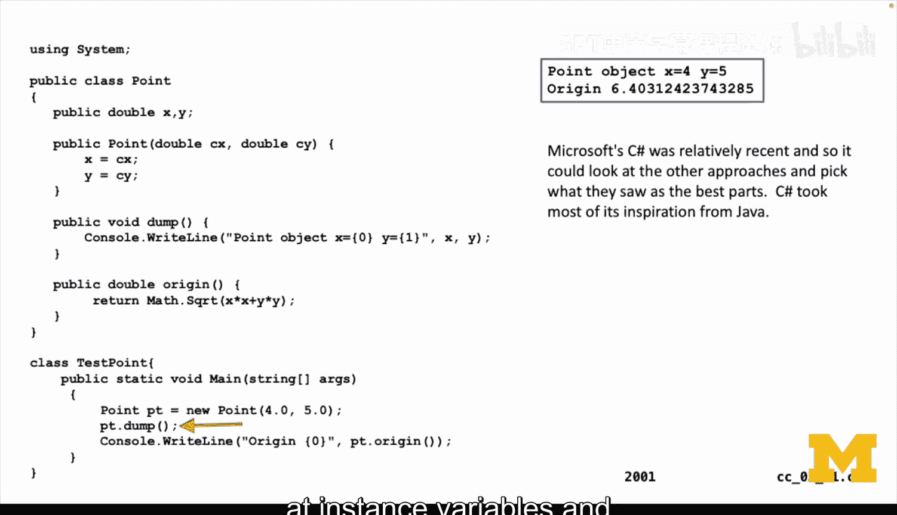


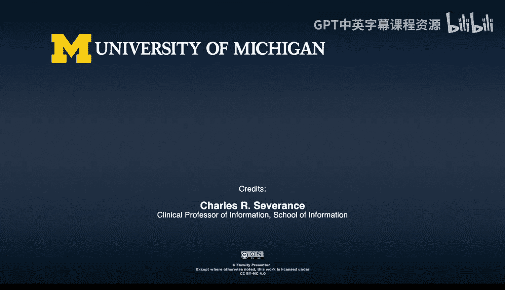

在接下来的课程中，我们将尝试在一个非面向对象的语言——C语言中，动手构建我们自己的“对象”模型，这将帮助我们从根本上理解面向对象机制在底层是如何工作的。