# 032：C语言面向对象模式的独特之处概览 🧩

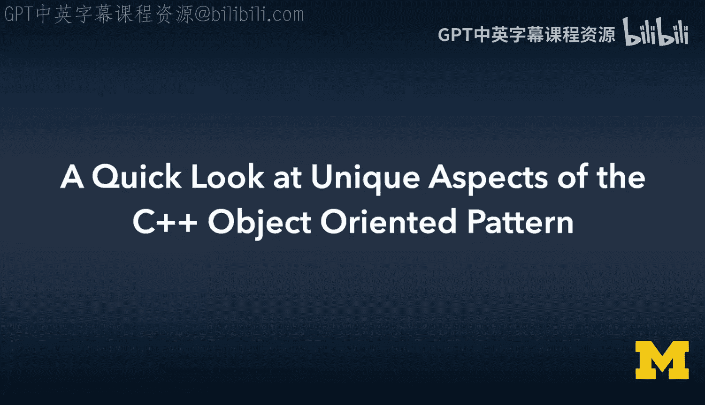

在本节课中，我们将探讨C++编程语言在面向对象编程发展中的关键作用，并分析其设计理念如何深刻影响了后续的Python、Java等语言。我们将重点关注**运算符重载**和**引用传递**这两个核心概念，并通过代码示例展示C++、Python和Java在处理类似问题时的不同设计选择。

## C++的历史地位与影响

C语言诞生于1972至1978年间，而C++则于1980年问世。在整个1980年代，C和C++共同演进。随后出现的C#、Java、Python、PHP等语言都深受C++的影响。

在C++出现之前，过程式编程和面向对象编程的开发者群体几乎是割裂的。C++的出现，在某种程度上统一了这两种范式。它既是主流的过程式编程语言，也是主流的面向对象编程语言，为“过程式-面向对象混合”编程模式带来了秩序。1980年后出现的语言，都受到了C和C++的强烈影响。

## 语法影响：以映射（Map）为例

为了理解这种影响如何随时间演变，我们可以观察一些语法上的传承。

C++作为最早的语言之一，最初是预处理器加编译器，后来发展成独立的编译器。它有一个`map`概念，可以分别指定键和值的类型，并使用方括号语法。

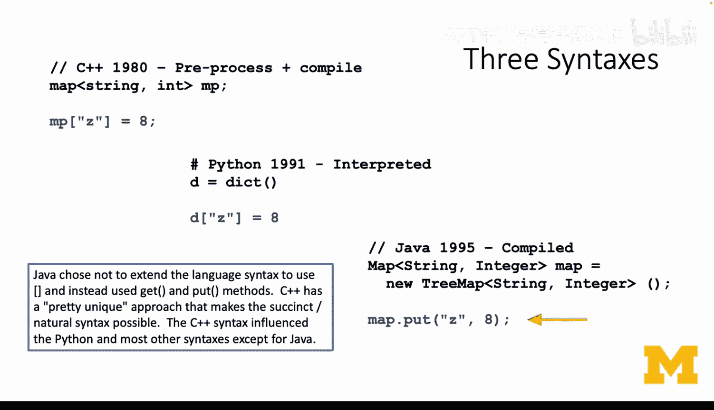

```cpp
map[“Z”] = 8;
```

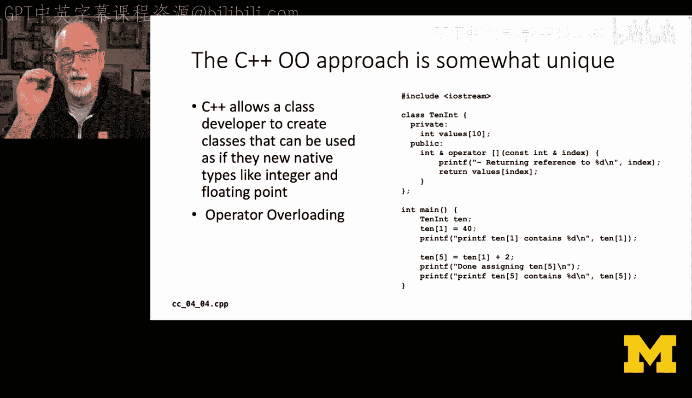

这行代码本质上是一个插入或更新操作，语法非常简洁。

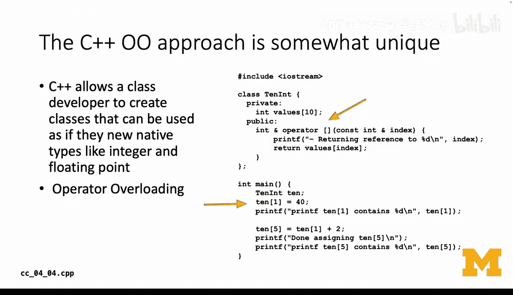

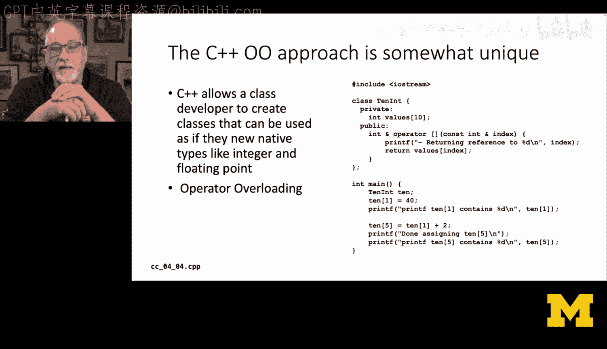

Python在设计时，不希望语法比C++更复杂。它创建了字典类型，并且由于是动态类型语言，无需声明键值类型。

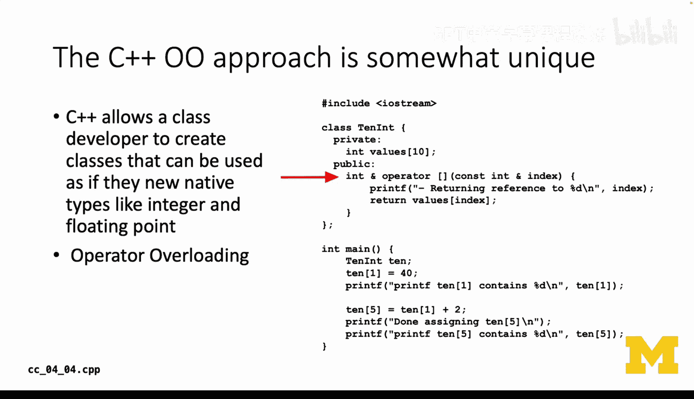

```python
d[“Z”] = 8
```

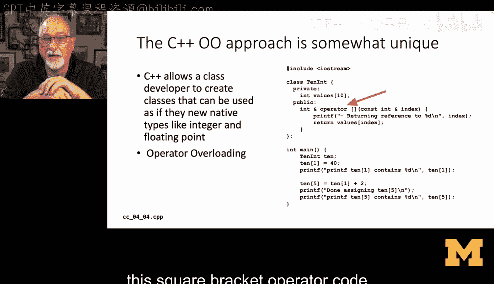

当你开始学习Python时，会觉得这种语法很自然。但其底层实现，更接近Java在1995年的做法。

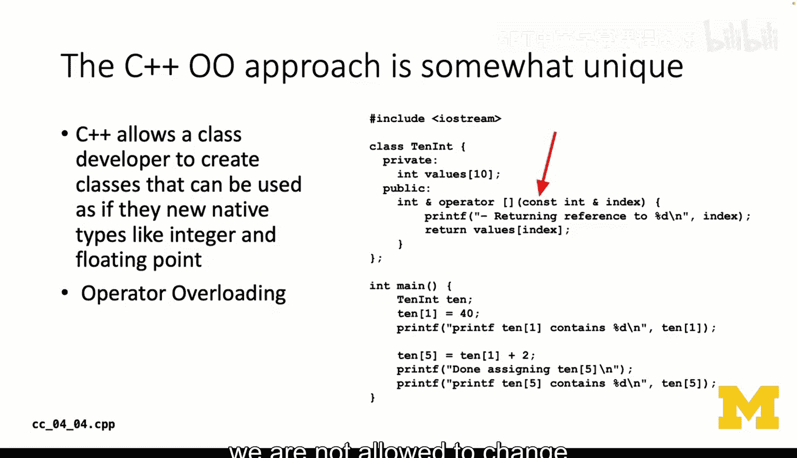

Java选择了更“纯粹”的面向对象方式，不使用方括号语法，而是使用方法调用。

```java
Map<String, Integer> map = new TreeMap<String, Integer>();
map.put(“Z”, 8);
```

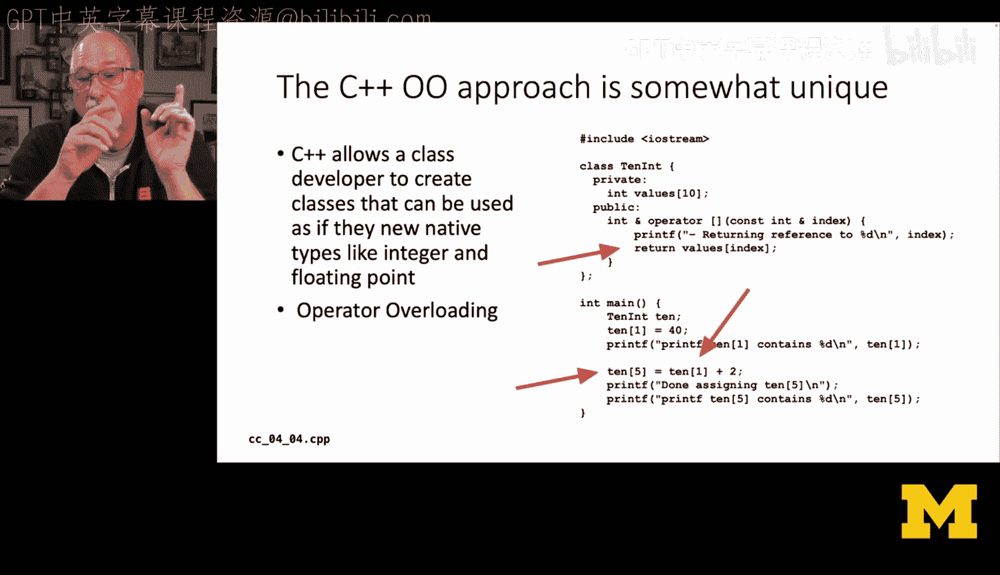

每种语言都在做出自己的设计选择，我们将在后续内容中重点分析这些差异。

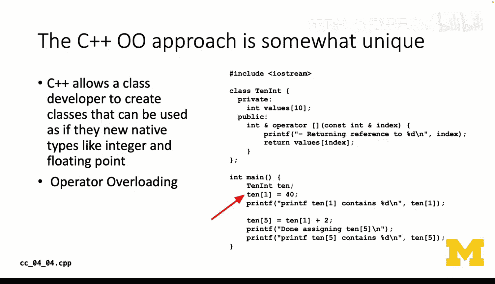

## C++的运算符重载

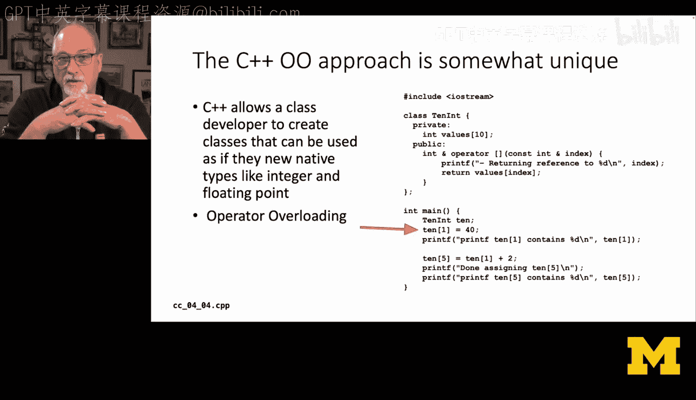

上一节我们看到了不同语言语法的差异，本节中我们来看看C++实现这种简洁语法的核心机制。C++的面向对象设计使得像`map`这样的高级类，在使用上几乎和`int`、`float`这样的低级基础类型一样简单，特别是它可以重载像方括号`[]`、加号`+`、减号`-`这样的特殊运算符。

其原理是：你可以在C++类中创建一个特殊命名的方法，当编译器遇到特定的语言语法（如方括号）时，会查找并调用这个方法。这个概念被称为**运算符重载**，意味着运算符的行为由类的编写者控制。

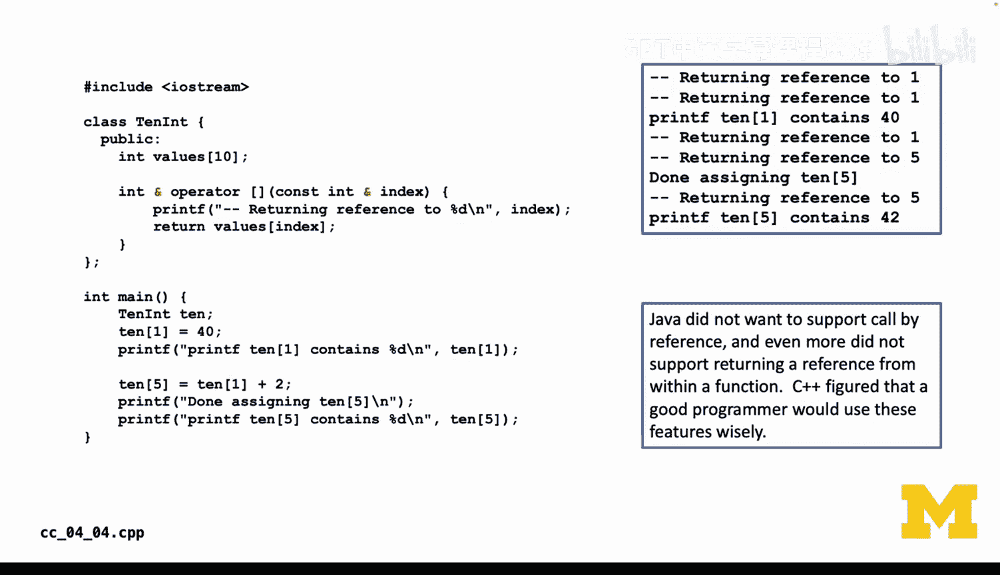

以下是一个示例代码：

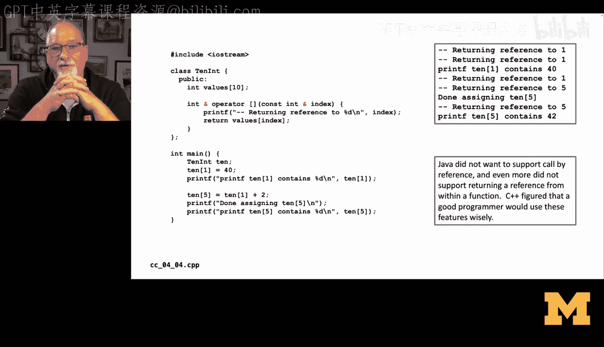

```cpp
class TenInts {
private:
    int values[10]; // 私有成员，外部无法直接访问
public:
    int& operator[](const int& index) {
        return values[index];
    }
};
```

我们来分析这段代码：
*   我们创建了一个名为`TenInts`的类，它内部有一个包含10个整数的私有数组`values`。
*   我们定义了一个公共方法 `int& operator[](const int& index)`。当编译器遇到`对象[索引]`这样的语法时，就会调用这个方法。
*   该方法的返回类型是 `int&`，即一个**整数引用**。这意味着返回值既可以放在赋值语句的左边（写入），也可以放在右边（读取）。
*   参数是 `const int& index`，即一个**常量整数引用**。`const`意味着我们不能在这个方法内部修改`index`的值。

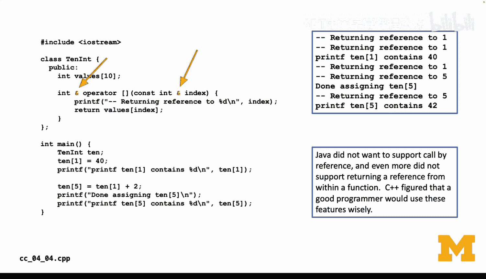

## 运算符重载的运行机制

现在，让我们看看这个机制如何在主程序中运行。

```cpp
int main() {
    TenInts ten; // 创建一个TenInts类型的变量ten
    ten[1] = 40; // 将40存入位置1
}
```

当编译器看到 `ten[1]` 时，它会发现`TenInts`类定义了`operator[]`方法，于是调用这个方法，并传入参数`1`。该方法返回一个指向`values[1]`的**引用**，然后数值`40`被赋值给这个引用。

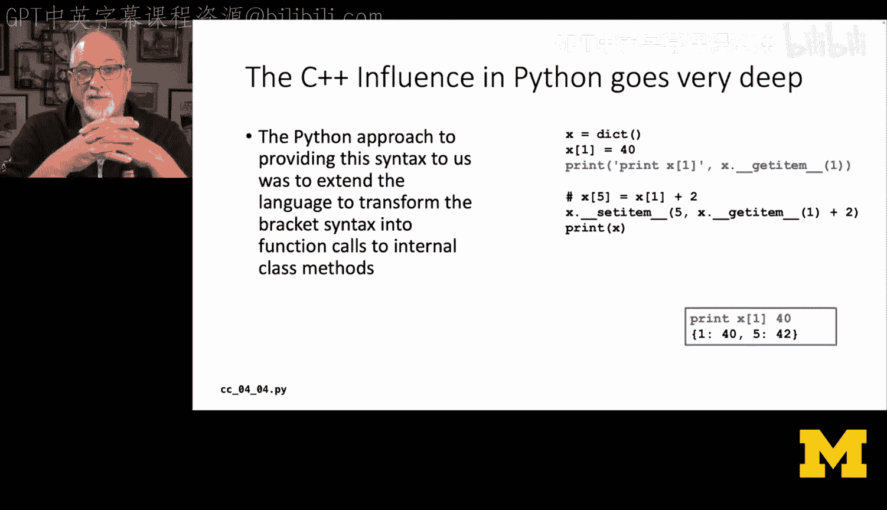

接下来执行打印：

```cpp
cout << “ten[1] contains ” << ten[1];
```

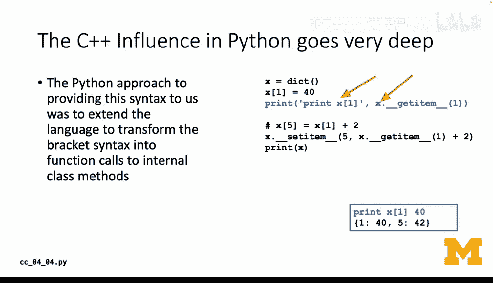

此时`ten[1]`位于赋值语句的右侧，它同样会调用`operator[]`方法，传入`1`，返回`values[1]`的引用，然后这个值（40）被打印出来。

再看一个复杂点的例子：

```cpp
ten[5] = ten[1] + 2;
```

其执行过程是：
1.  计算右侧 `ten[1] + 2`：调用`operator[]`获取`values[1]`的引用（值为40），加上2，得到结果42。
2.  计算左侧 `ten[5] =`：调用`operator[]`获取`values[5]`的引用。
3.  将右侧的结果42赋值给左侧的引用。

这一切都得益于**运算符重载**和**引用传递**的能力。

## 其他语言的设计选择

C++通过**传引用调用**和**返回引用**实现了强大的运算符重载。然而，后续语言做出了不同的设计决策。

**Java** 明确放弃了这种设计。Java不希望（也从未打算）在方法调用中通过引用传递值，更不希望方法返回引用。`&`符号（用于声明引用）对于C++实现运算符重载至关重要，但Java为了避免垃圾回收的复杂性和潜在的内存管理危险，没有引入引用概念。因此，Java既没有C++那样简洁的语法，也不支持运算符重载。

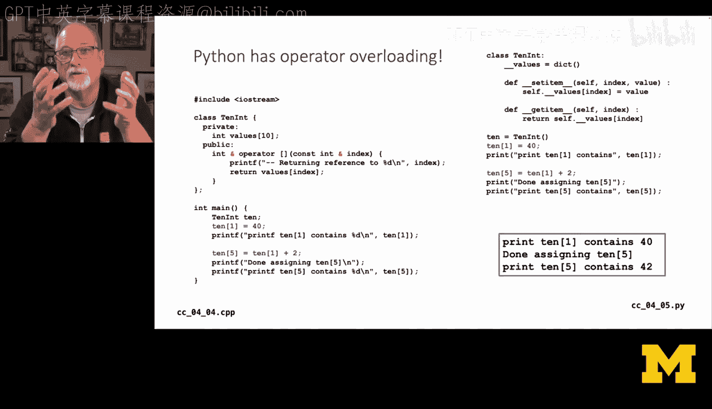

**Python** 则采取了一种折中方案。它借鉴了C++优美的语法，但底层实现上避免了引用传递。Python通过语法转换来实现类似功能。

以下是Python实现类似`TenInts`类的代码：

```python
class Ten:
    def __init__(self):
        self.__values = {} # 使用双下划线约定表示“私有”

    def __setitem__(self, index, value): # 对应赋值语句左侧
        self.__values[index] = value

    def __getitem__(self, index): # 对应表达式右侧
        return self.__values[index]
```

当我们执行 `ten[1] = 40` 时，Python在运行时将其转换为 `ten.__setitem__(1, 40)`。
当我们执行 `print(ten[1])` 时，Python将其转换为 `ten.__getitem__(1)`。

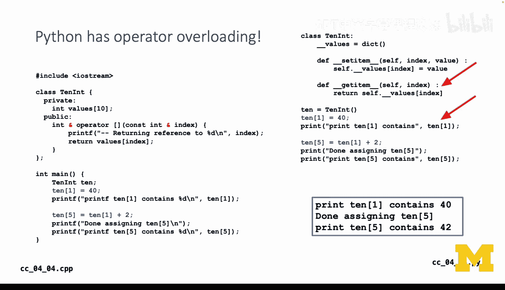

这样，Python无需处理复杂的引用，就实现了优雅的语法。它本质上和Java一样，所有操作都通过方法调用完成，只是编译器/解释器在背后做了语法转换，对开发者隐藏了细节。

## 总结与影响溯源

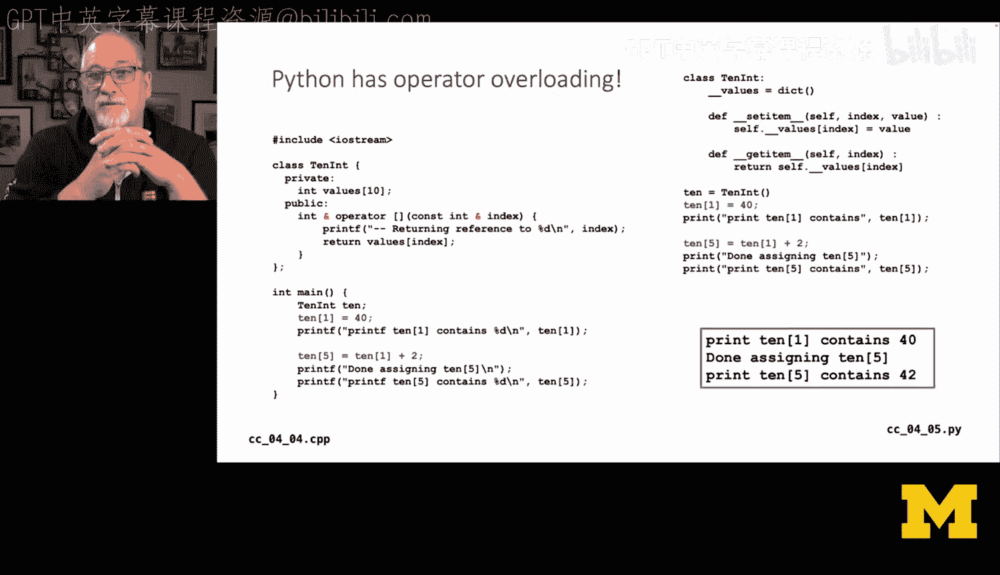

本节课中我们一起学习了C++面向对象设计的独特之处及其对后世语言的深远影响。

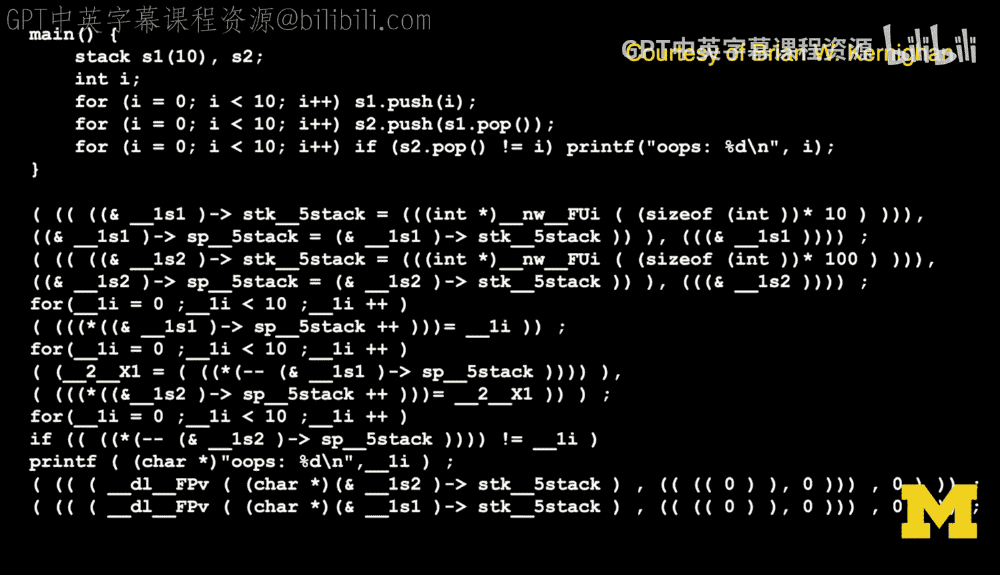

*   **C++的核心特性**：通过**运算符重载**和**引用传递**，使得自定义类型能拥有与内置类型一样直观的语法，赋予了程序员极大的灵活性和控制力（同时也要求更高的责任感）。
*   **Python的借鉴与改造**：继承了C++优美的语法，但通过内部的双下划线方法（如`__setitem__`, `__getitem__`）和运行时语法转换，避免了引用传递的复杂性，使其在拥有垃圾回收机制的同时保持了代码的优雅。
*   **Java的纯粹选择**：为了简化内存管理和语言设计，彻底放弃了运算符重载和引用语法，要求所有操作都通过显式的方法调用（如`put`, `get`）来完成，强调了清晰性和一致性。

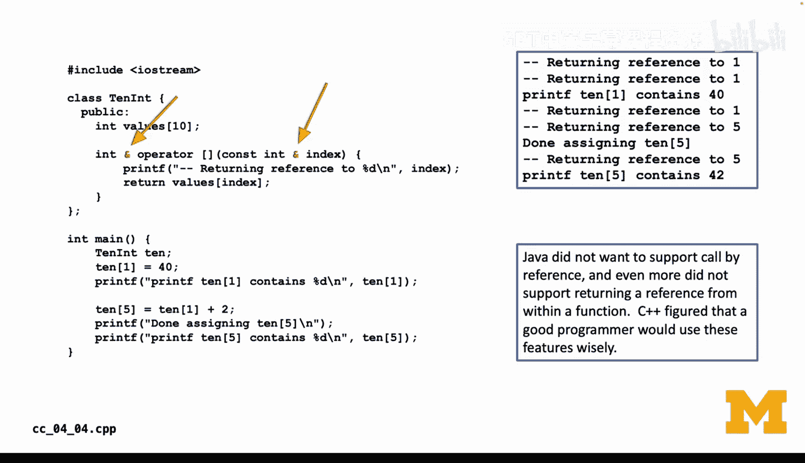

这些设计差异源于不同语言哲学：C++信任程序员是“武士”，提供所有可能需要的强大工具；Python和Java则更注重安全性和简易性，通过限制某些能力来防止常见错误。

这种语言的演进与设计师的背景紧密相关。C++之父Bjarne Stroustrup在贝尔实验室与C语言之父Dennis Ritchie等人共事，C++因此深深植根于Unix和C的传统。而Python之父Guido van Rossum在开发Python时，大量借鉴并改进了C++中的模式和惯例（例如使用双下划线表示私有成员的约定）。

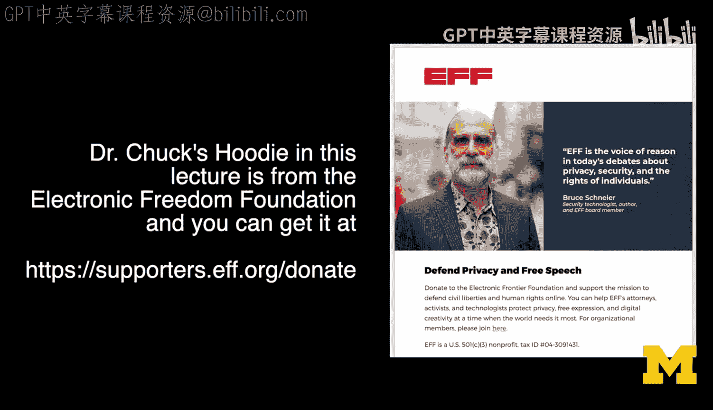

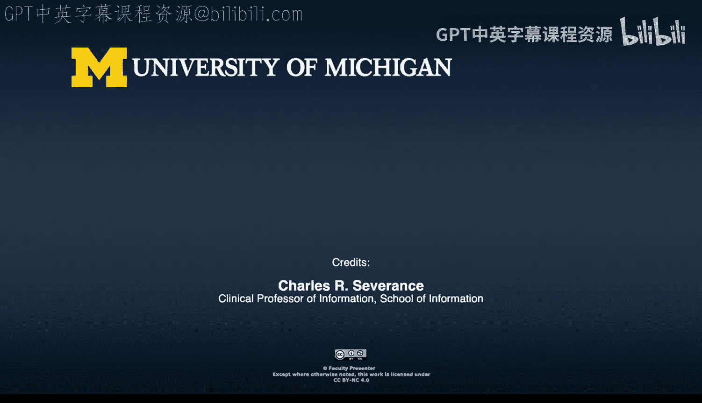

正是这些精妙的设计决策和跨语言的灵感借鉴，塑造了我们今天所使用和热爱的编程语言生态系统。理解这些底层原理，能帮助我们更好地理解每门语言的特性和其背后的设计思想。