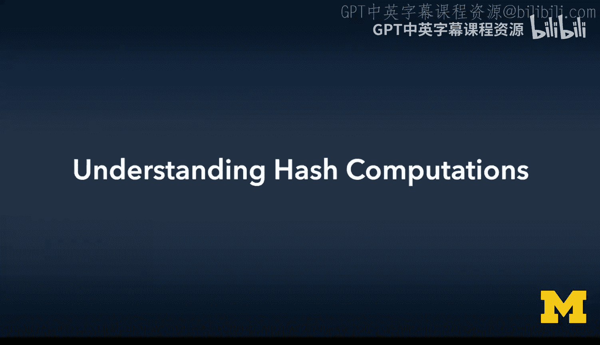
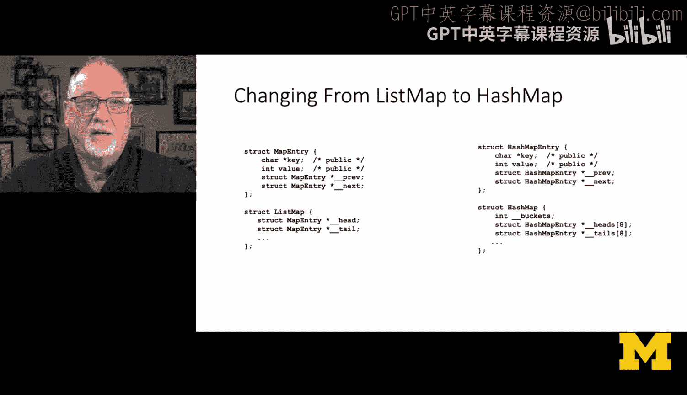
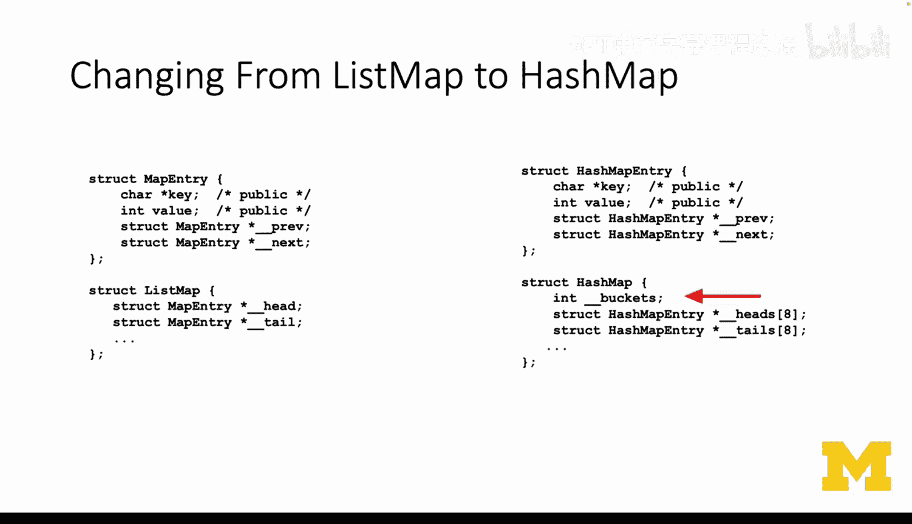
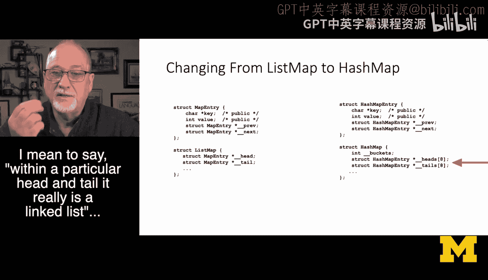
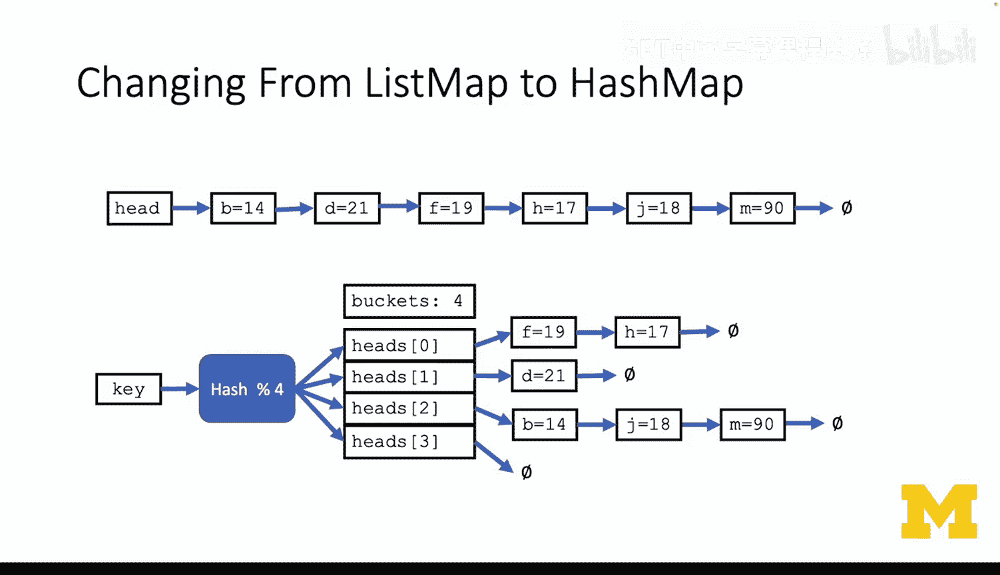
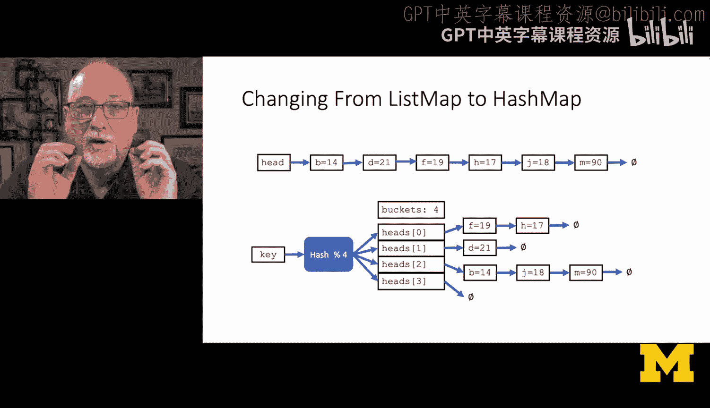
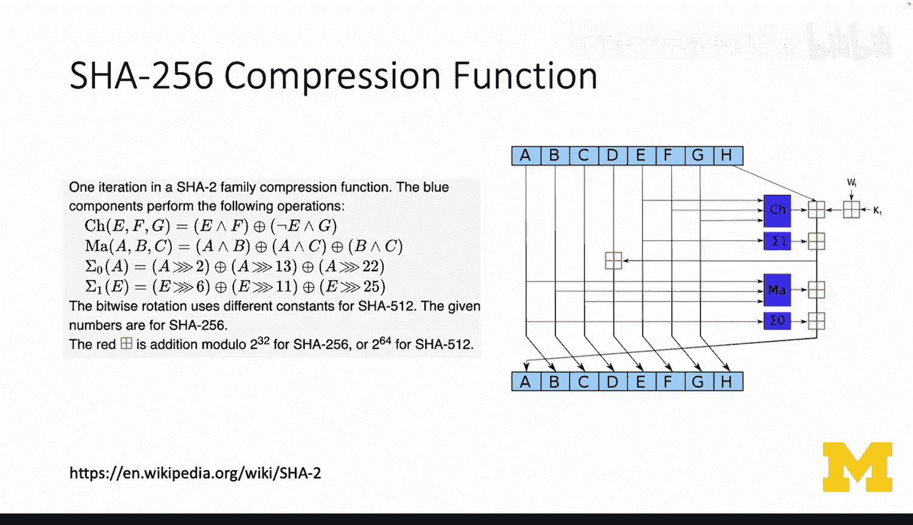
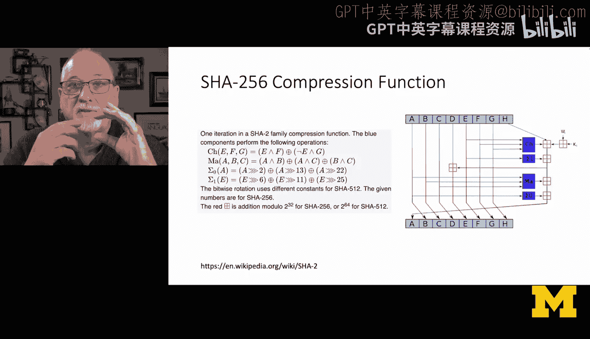
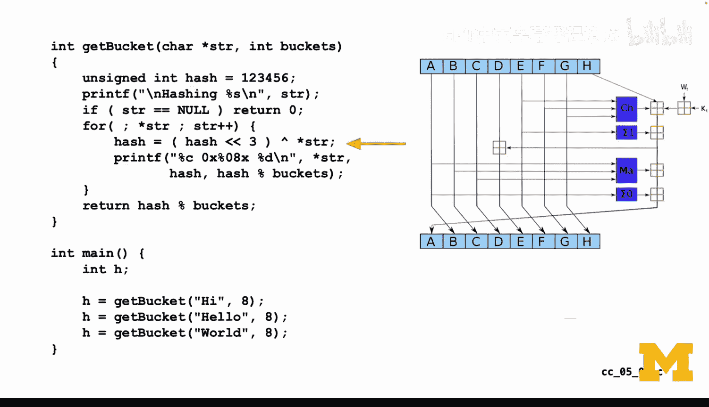

# 037：理解哈希计算原理 🧮



在本节课中，我们将要学习如何实现一个基于哈希的映射（Map）。哈希映射是编程面试中最常见的问题之一，其实现原理优美而简单。我们将从基础的链表映射出发，逐步理解哈希映射的数据结构和工作原理，并学习如何通过哈希函数将键（Key）分配到不同的“桶”（Bucket）中。

## 从链表映射到哈希映射

上一节我们介绍了链表映射（List Map）的实现。本节中我们来看看如何将其扩展为哈希映射（Hash Map）。

链表映射的结构相对简单：它包含一系列通过指针链接在一起的条目（Entry），每个条目存储一个键值对。哈希映射的核心思想是使用多个链表，并通过一个哈希函数来决定每个键值对应该存储在哪个链表中。

哈希映射的内部数据结构包含一个固定数量的“桶”数组。每个桶本质上是一个独立的链表。当我们插入或查找一个键时，首先通过哈希函数计算该键的哈希值，然后通过取模运算确定它属于哪个桶，最后在该桶对应的链表中进行操作。



以下是哈希映射与链表映射的核心结构对比：
*   **链表映射 (`ListMap`)**: 包含一个头指针 (`head`)、一个尾指针 (`tail`) 和一个计数器 (`count`)。
*   **哈希映射 (`HashMap`)**: 包含一个桶数组 (`heads[]` 和 `tails[]`) 以及桶的数量 (`n_buckets`)。



## 哈希函数的工作原理



理解了哈希映射的数据结构后，我们来看看决定数据分布的关键：哈希函数。

哈希函数的作用是将任意长度的输入（例如一个字符串）映射为一个固定大小的整数值（哈希值）。在哈希映射的上下文中，我们随后会对此哈希值进行取模运算，以确定其对应的桶索引。

一个简单但有效的字符串哈希函数实现如下：



```c
int hash_function(const char* key, int n_buckets) {
    int hash = 0;
    for (int i = 0; key[i] != '\0'; i++) {
        hash = (hash << 3) ^ key[i]; // 左移3位后与当前字符进行异或操作
    }
    return hash % n_buckets; // 取模得到桶索引
}
```

这个函数遍历字符串的每个字符，通过位左移和异或操作不断更新哈希值。异或操作有助于增加结果的随机性。最后，通过对桶数量取模，得到一个介于 `0` 到 `n_buckets-1` 之间的索引号。



例如，假设我们有8个桶 (`n_buckets = 8`)：
*   键 `"hi"` 可能被哈希到桶 `1`。
*   键 `"hello"` 可能被哈希到桶 `7`。
*   键 `"world"` 可能被哈希到桶 `4`。

## 处理哈希冲突



需要理解的一个重要概念是**哈希冲突**：两个不同的键经过哈希函数计算后，可能得到相同的桶索引。由于我们的每个桶都是一个链表，处理冲突非常简单：只需将哈希到同一桶的多个条目依次添加到该桶的链表中即可。



因此，哈希映射的插入和查找操作分为两步：
1.  **计算桶索引**：`bucket_index = hash_function(key, n_buckets)`。
2.  **操作链表**：在 `heads[bucket_index]` 指向的链表中执行插入、查找或删除操作，这与普通的链表映射操作完全相同。

## 构建哈希映射

现在我们已经掌握了哈希映射的原理和哈希函数的工作方式。接下来，构建一个哈希映射就变得非常直观。

实际上，你可以基于链表映射的代码来创建哈希映射。主要修改是将对单个链表的操作，转化为先计算桶索引，再对特定桶的链表进行操作。许多链表映射中的方法（如插入、查找）都可以被复用，只需在开头增加计算哈希桶的步骤。

一个更复杂的实现会包含“重哈希”（Rehashing）机制，即当条目数量增多导致单个桶内的链表过长时，自动增加桶的数量并重新分配所有条目，以保持高效性。为了简化初学者的理解，本教程中的示例将使用固定数量的桶。



---


本节课中我们一起学习了哈希映射的核心概念。我们了解到哈希映射通过哈希函数和桶数组将查找时间平均化，从而实现了高效的插入和查找操作。其本质是**多个链表的组合**，利用哈希函数快速定位到目标链表。我们还学习了一个简单的字符串哈希函数实现，并理解了哈希冲突是如何通过链表自然解决的。掌握这些原理，是理解现代编程语言中字典或哈希表这类数据结构的基础。