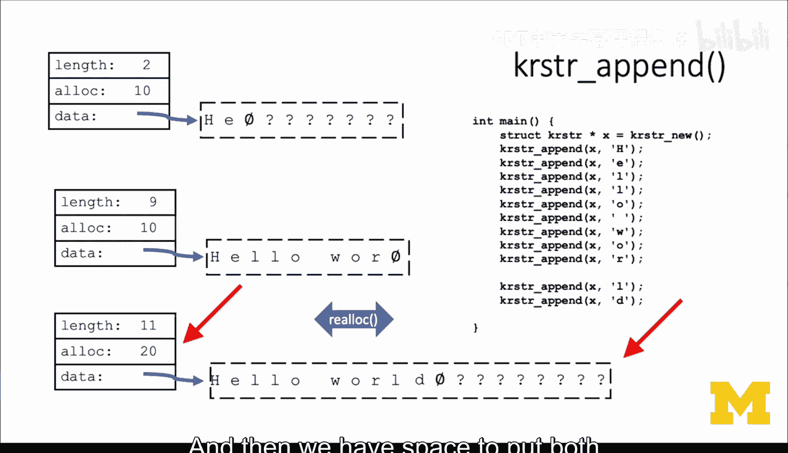
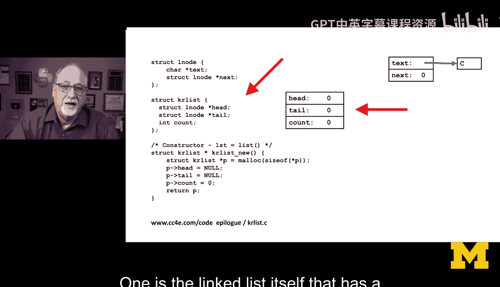
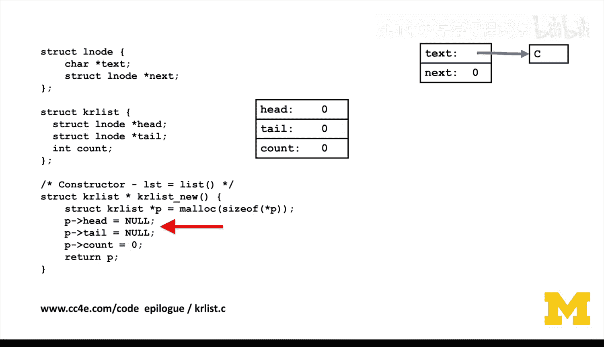
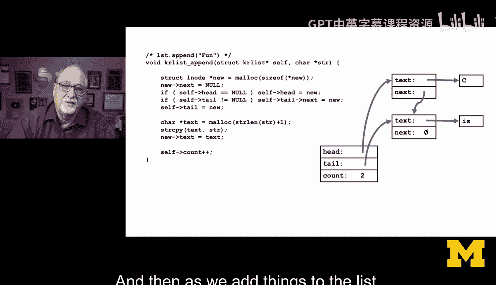
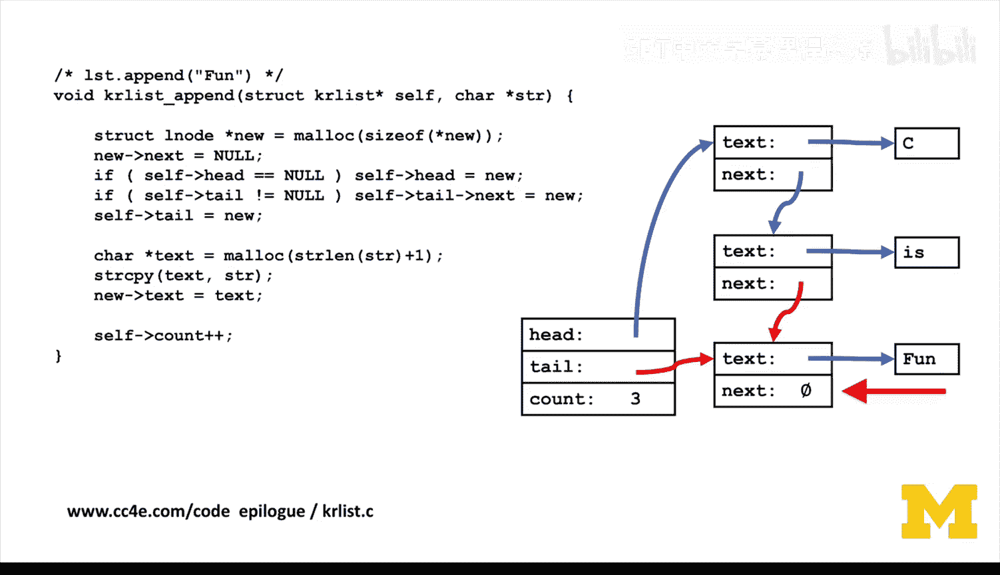
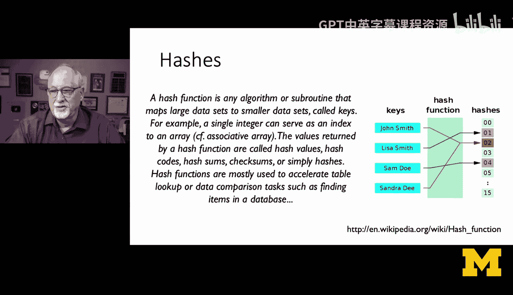
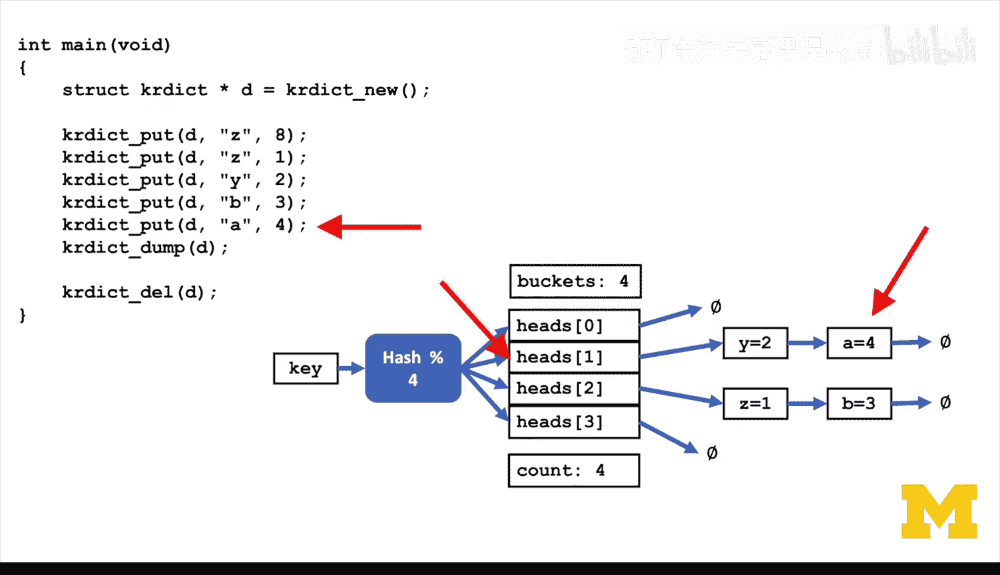

# 042：回顾与展望 🎯


在本节课中，我们将回顾整个课程的核心项目，并探讨如何将C语言中的数据结构概念与Python的高级数据结构联系起来。我们将看到，通过实现Python风格的字符串、列表和字典类，可以深刻理解接口与实现分离的概念。

## 课程回顾与项目缘起

上一节我们完成了课程的主体内容。本节中，我们来看看整个项目的总结与延伸思考。

这门《给所有人的C语言编程》课程对我而言是一个长达四年半的项目，涵盖了编写教材、创建自动评分系统、录制讲座、在Coursera平台上线以及发布到互联网等全部工作。在课程进行到某一阶段时，我遇到了Kernighan和Ritchie著作的第六章。我当时思考的问题是：有哪些好的示例可以提供给那些可能已经学过《Python for Everybody》的学生使用？

我的想法是：为什么不直接实现一些Python类呢？这样可以观察它们的复杂度，并验证接口与实现的概念是否有效。事实证明，这个想法效果非常好。

## 实现Python字符串类

以下是实现Python字符串类的核心思路。

我们按照Kernighan和Ritchie第六章的方法，构建了一个Python字符串类。这个类采用了可扩展字符数组的设计，它会预先分配一块空间，当空间被填满时再进行扩展。

```c
struct PyString {
    int length;    // 已使用的字符数
    int alloc;     // 已分配的总空间
    char *str;     // 指向字符数组的指针
};
```

在这个结构中，`length`表示我们已经使用了多少个字符，`alloc`表示我们分配了多少空间。我们自动在字符串末尾添加一个`\0`字节。当你不断添加字符时，最终`length`会变为9（加上一个`\0`字节），而`alloc`是10，这意味着我们无法再添加字母“D”。此时，我们使用`realloc`函数将其扩展到20个字符，这样就有空间存放字母“D”和字符串结束符了。

## 实现Python列表类

接下来，我们看看如何实现一个Python列表类。





构建Python列表类非常自然，就是将其实现为一个链表。链表涉及两种结构体：一种是链表本身，它包含头指针、尾指针和一个记录项目数量的计数器；另一种是节点。

```c
// 链表结构
struct PyList {
    struct ListNode *head;
    struct ListNode *tail;
    int count;
};



// 链表节点结构
struct ListNode {
    char *text;           // 指向字符串（字符数组）的指针
    struct ListNode *next; // 指向下一个节点的指针
};
```



在我们的构造函数中，我们分配对象，然后将`head`和`tail`指针设置为`NULL`以表示链表当前为空，并将计数器`count`设置为0。

当我们向列表中添加元素时，我们操作这些指针：将`head`指向列表的开头，将`tail`指向我们添加的最后一个项目。我们使用`malloc`为字符串分配内存，这样我们就获得了一个指向字符串的指针，这个字符串由列表“拥有”，而不是属于传入的参数。然后我们连接`next`指针。

这里有一些细节需要注意：如果链表为空（即`head`为`NULL`），我们只需将`head`指向新分配的节点。如果`tail`不为`NULL`，我们将最后一个节点的`next`指向新创建的节点，并将`tail`更新为新节点。接着，我们分配字符串内存，将参数中的文本复制到`text`中，存储该指针，并更新计数器`count`。

如果我们再添加一个元素，需要将新节点链接到`tail`之后。这样，`tail`的`next`指针就不再是`NULL`，而是指向新创建的节点。然后我们将`tail`更新为指向这个新节点，而新节点的`next`指针设为`NULL`，这是我们结束链表的方式。

要遍历这个链表，我们从`head`开始，查看当前项目，然后移动到`next`指向的节点，查看那个项目，如此反复，直到`next`为`NULL`时结束。通过这种方式，我们成功构建了一个功能相当完善的Python列表对象。



## 实现Python字典类

最后，我们探讨如何实现一个Python字典类。

正如你所料，当我们转而构建字典类时，直接参考了第6.6节，创建了一个带“桶”的哈希表。这种基于桶的哈希映射可能是最常见的编程面试题。

字典本质上是一组“桶”，每个桶是一组指向链表的指针。哈希函数接收一个键，并生成一个大的伪随机数（这意味着它是确定性的，但分布广泛），目的是减少冲突。例如，“John Smith”和“Joe Smith”的哈希值应该不同。

我们再次遵循Kernighan和Ritchie的方法：使用键计算哈希值（通常是一个大整数），然后根据桶的数量进行取模运算。因此，这些桶本质上就是链表。



```c
// 字典结构（以4个桶为例）
struct PyDict {
    int nbuckets;
    struct ListNode *heads[4]; // 每个桶的头指针数组
    struct ListNode *tails[4]; // 每个桶的尾指针数组
    int count;
};

// 字典节点结构
struct DictNode {
    char *key;    // 指向键字符串的指针
    int value;    // 整型值
    struct DictNode *next;
};
```

在新建操作中，我们分配字典对象，决定桶的数量（在示例结构中定义为4个元素的数组），然后将所有头尾指针初始化为`NULL`，以表明链表为空。这里需要说明的是，这个实现没有包含扩展机制，为了保持数据结构的简洁性，我暂时省略了重新哈希和扩展的功能。

插入元素时，我们使用哈希函数计算索引，然后操作对应的链表。如果你比较列表代码和字典代码，会发现很多部分看起来相似，区别在于字典的`head`和`tail`是通过哈希计算并取模后选定的。

## 从Python视角反思

完成所有这些实现后，我开始深入思考。我逐渐不再仅仅从C语言和Kernighan & Ritchie的角度来看待这些代码，而是更多地从Python的视角来审视。

我不禁想问：我是不是无意中做了和Guido van Rossum（Python创始人）完全相同的事情？Guido van Rossum是否也像我们大多数人在七八十年代那样读过这本书？他是否也曾说过：“我要创建一个列表对象，它将是一个链表；我还要创建一个哈希对象，它将是一组由链表组成的桶”，就像大家都会做的那样？



这种思考将C语言底层的数据结构实现与高级编程语言Python的设计联系了起来。

## 总结

本节课中我们一起回顾了如何用C语言实现Python的核心数据结构。我们构建了可扩展的字符串类、基于链表的列表类以及基于哈希桶的字典类。通过这些实践，我们不仅深入理解了Kernighan和Ritchie经典著作中的数据结构，也窥见了高级语言底层实现的巧妙思路。这趟旅程的结束，正是理解编程语言设计与实现之间深刻联系的开始。