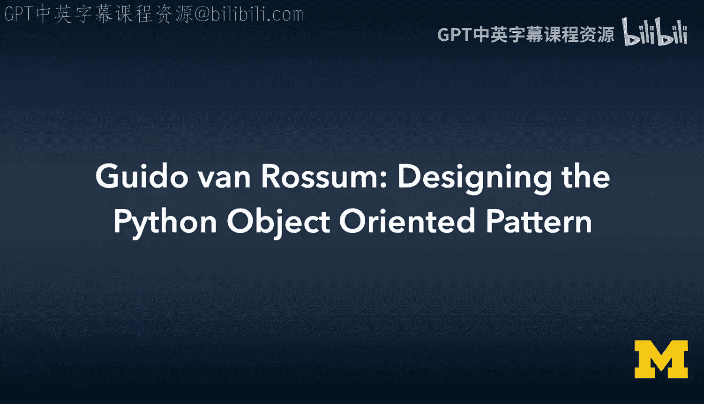
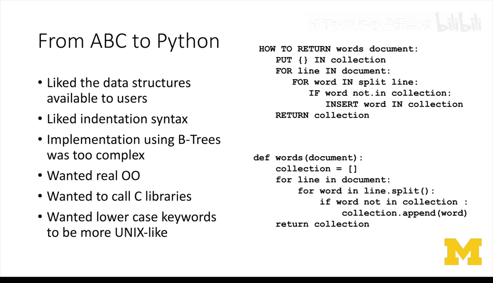
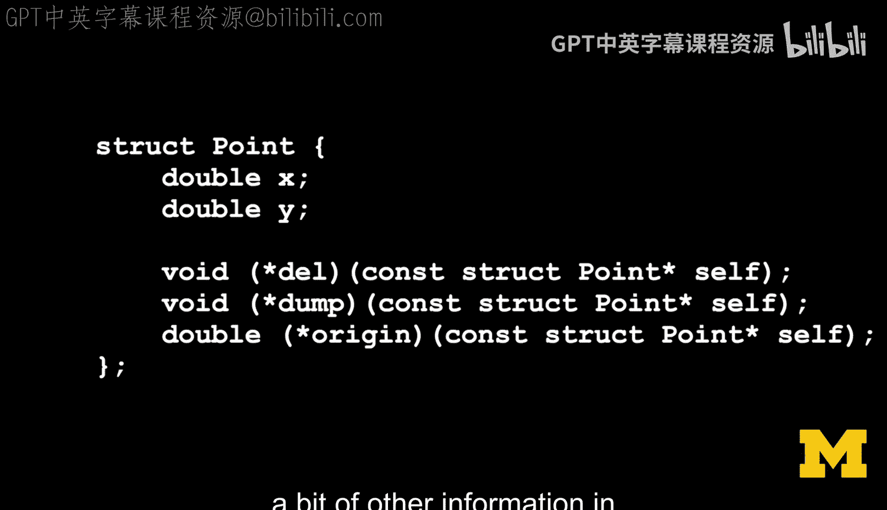
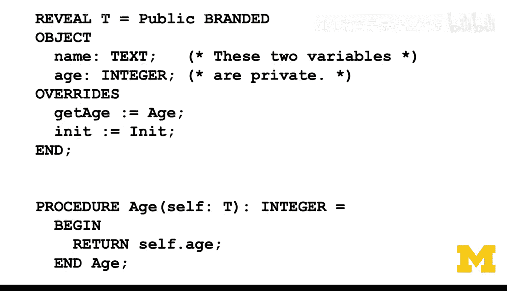
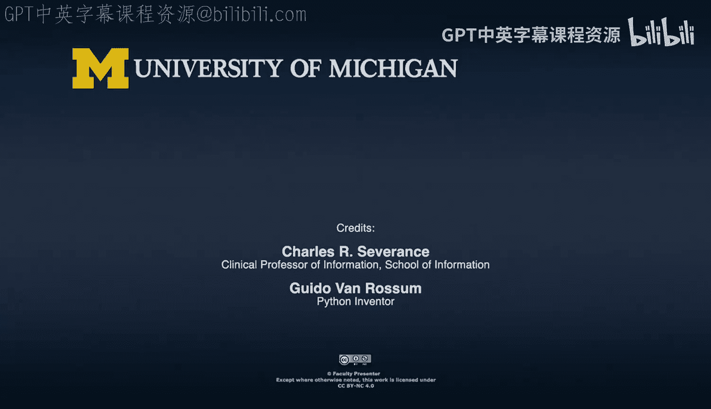

# 047：Guido van Rossum的灵感与历史

在本节课中，我们将跟随Python之父Guido van Rossum的讲述，了解Python面向对象设计思想的灵感来源与演变历史。我们将探讨从ABC语言到Modula-3，再到C++的影响，以及Python如何最终形成其独特的面向对象实现。

---

## ABC语言：非面向对象的基础

上一节我们介绍了课程背景，本节中我们来看看Python设计思想的起点——ABC语言。ABC语言并非面向对象语言。

ABC语言拥有一组固定的数据类型。虽然这些数据类型是可组合的，例如，你可以拥有一个整数列表或一个字符串列表，并且它们共享列表上的操作，但ABC语言中不存在“类”的概念。用户无法定义类，也没有子类化的概念，无论是对于用户自定义类型还是内置类型都是如此。

ABC语言提供了一组非常便于使用的基础数据类型。这些类型为用户做了大量工作，但它们并非真正的面向对象。ABC语言甚至坚持只使用单一的数字类型，以避免处理整数、浮点数、有理数等复杂的类型层次结构。

## C++的影响与自动引用计数的尝试

在开始设计Python时，面向对象编程是Guido van Rossum的核心关注点之一，而不仅仅是提供一组方便的基础数据类型。那么，这种面向对象的思维从何而来呢？

以下是Guido van Rossum接触面向对象语言的主要经历：
*   **熟悉C++**：当时，C++可能是他唯一了解的面向对象语言。
*   **了解Simula**：他拥有一本关于Simula（所有面向对象语言的鼻祖）的大部头书籍，但并未深入研读，也从未获得过Simula编译器。
*   **C++编程经验**：他编写过足够多的C++代码，甚至尝试过发明自动引用计数指针（类似于智能指针），以在C++编程中保持理智。

Guido van Rossum对引用计数非常熟悉，因为ABC语言的实现就是用C写的，并且所有东西都使用引用计数。这在ABC中运行良好，因为其数据类型不可能出现循环引用（没有可变数据类型，一个对象无法直接或间接地包含或引用自身）。

然而，在ABC的实现中，引用计数容易出错。团队经常需要处理内存泄漏或提前释放内存导致的崩溃问题，调试遗漏的引用计数增减操作非常困难。

在自学C++的过程中（大约在80年代中期），他尝试利用C++可以重载基本操作符的特性，构建了自动引用计数机制。但实验发现，这种自动机制并不理想。问题在于，如果手动管理引用计数，在将对象传递给函数时，若调用者仍持有引用，则函数内部无需增加引用计数。而他的自动引用计数实现会在每次传递参数时都增加引用计数，并在函数返回时减少，导致引用计数操作过于频繁且低效。因此，Python最终选择在C语言中手动管理引用计数，而非使用C++的自动机制。

## Modula-3的关键启发：方法即函数指针

在Python实现面向对象的过程中，还有一个关键步骤。大约在1988年，Guido van Rossum在DEC SRC实习，接触到了Modula-3语言的设计者。

他从Modula-3（或Modula-2+）的文档中学到了一个核心概念。Modula-3并非完全的面向对象语言，但其设计包含了面向对象使用的关键部分，可以看作是对C++实现方式的一种反应。

在Modula-3中，如果你使用 `object.method(arguments)` 这样的语法，那么 `object` 必须是一个包含一系列函数指针的结构体类型。方法名就是该结构体中的字段（成员）。要创建一个“类”，你就定义一个包含一系列类型化函数指针的结构体。编译器的技巧在于，当它发现你正在调用这样的方法时，会自动将调用该方法的对象作为第一个参数插入到函数调用中。

**这正是Python中显式 `self` 参数的来源。** Python最初复制了Modula-3的这一设计。

## Python的早期实现与“class”关键字的引入

最初，Python在头五六个月里并不是面向对象的。其实现有一个概念：可以通过将一堆函数指针和一些其他信息放入一个标准结构体中来定义一个对象类型（Guido称之为“type”而非“object”），这本质上是在模拟C++创建对象或进行面向对象编程的方式。

最初，Python甚至没有提供用户层面的语法来定义这样的类型，类型系统只能通过编写C扩展来扩展。“class”关键字并不存在。

大约在项目开始五个月后，一位更熟悉C++的实习生提出了一个方案：添加一点语法，将其映射到实现时的结构体，就能让一切运行起来。于是，“class”关键字被引入。至此，Python已经拥有了一个可工作的解释器，包含数字、字符串、元组、列表、字典、函数等类型，并且类型在内部已经是“对象”。当时甚至已经可以查询对象的类型。

在那最初的六个月里，Guido van Rossum并未觉得自己在进行关于未来面向对象该如何定义的核心研究。他只是在拼凑一个不知将走向何方的语言实现。他是一名程序员，而非研究者，也没有博士学位。

## 设计取舍与后续演进

Guido van Rossum并不认为自己做出了深远的贡献，他认为Modula-3的设计者们才是更深入思考理论影响的人。他自己则乐于实现一些东西，即使在某些边缘情况下它可能完全无法正确工作。

一个典型的例子是循环引用导致的内存泄漏。在很长一段时间里（大约十年），由于Python使用引用计数且没有循环垃圾回收器，如果创建了循环引用并丢失了从外部指向该循环的最后指针，内存将无法挽回地泄漏。直到用户用实际案例说服开发团队这是一个真实存在的问题后，Python才最终加入了循环垃圾收集器。

---

本节课中，我们一起学习了Python面向对象设计思想的演变历程。从非面向对象的ABC语言基础，到尝试并放弃C++风格的自动引用计数，再到借鉴Modula-3将方法实现为结构体中的函数指针并引入显式 `self` 参数，最终通过实习生的贡献引入了“class”关键字。整个过程体现了Python务实的设计哲学：优先解决实际问题，在必要时接受设计上的取舍，并根据用户反馈和实际需求持续演进。