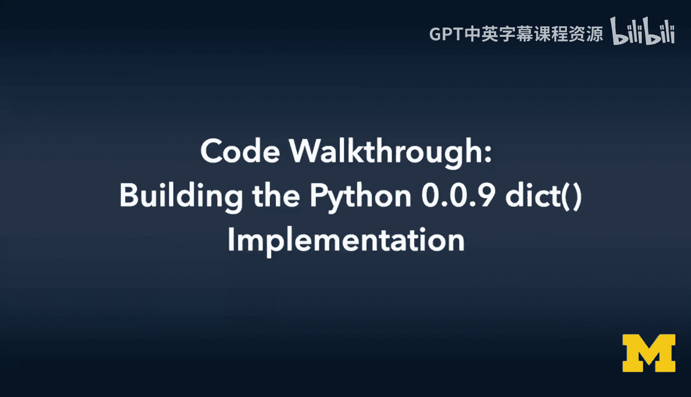
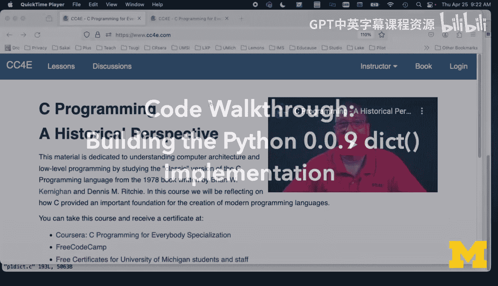
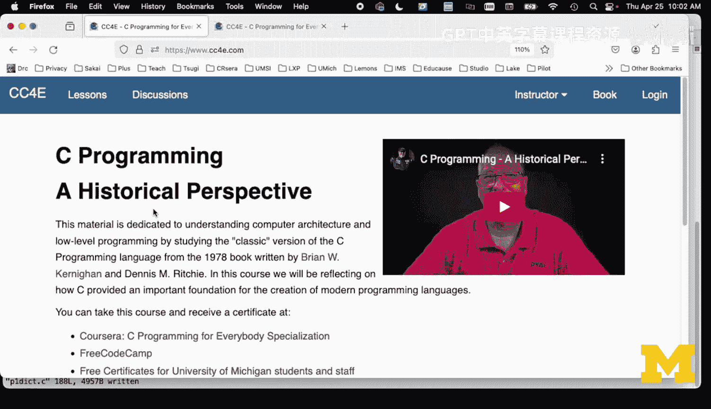

# 050：代码走查-构建Python-0.0.9字典实现





在本节课中，我们将通过代码走查，对比分析K&R教材中实现字典的方法与Python创始人Guido van Rossum在Python 1.0中实现字典的方法。我们将重点关注数据结构、哈希函数、冲突解决和动态扩容等核心概念。

---

## 数据结构对比

上一节我们介绍了课程目标，本节中我们来看看两种实现方式在数据结构上的根本区别。

在我的K&R风格实现（`kr_dict`）中，字典是一个**数组加链表**的结构。我定义了一个固定大小的数组（例如4个桶），每个桶指向一个链表的头节点。

```c
// K&R 风格字典节点
struct dict_node {
    char *key;
    int value; // 为简化，值设为整数
    struct dict_node *next; // 指向链表下一个节点
};

// K&R 风格字典结构
struct kr_dict {
    int num_buckets;
    int count;
    struct dict_node **heads; // 桶数组，每个元素是链表头指针
    struct dict_node **tails; // 链表尾指针，便于追加
};
```

而在Guido的Python 1.0实现（`p1_dict`）中，字典是一个**一维数组**，数组的每个元素直接是一个键值对节点。节点中的“空”状态用`NULL`指针标记。

```c
// Python 1.0 风格字典节点
struct dict_node {
    char *key;   // 字符串键
    char *value; // 字符串值
};

// Python 1.0 风格字典结构
struct p1_dict {
    int length;   // 已使用的项目数
    int alloc;    // 数组总容量
    struct dict_node *items; // 指向dict_node数组的指针
};
```

Python 1.0的实现与它的列表实现非常相似，列表也是一个`length`、一个`alloc`和一个指向数据数组的指针。这种设计体现了字典和列表在Guido心中的某种对等性。

---

## 构造函数与初始化

理解了基本结构后，我们来看看如何创建和初始化一个字典对象。

在`p1_dict_new`函数中，我们进行以下操作：
1.  为字典结构体分配内存。
2.  将`length`初始化为0，因为字典为空。
3.  将`alloc`初始化为2，这是一个较小的初始容量，便于我们测试和调试扩容逻辑。
4.  为`items`数组分配内存，大小为 `2 * sizeof(struct dict_node)`。
5.  将数组中每个节点的`key`和`value`指针都设为`NULL`，以此标记所有槽位都是“空”的。

以下是初始化后的状态：
*   `length = 0`
*   `alloc = 2`
*   `items`是一个包含两个`dict_node`的数组，它们的`key`和`value`均为`NULL`。

---

## 核心操作：插入（Put）

字典的核心功能是插入键值对。以下是`p1_dict_put`函数的主要步骤。

首先，我们需要找到键`key`应该存放或已经存放的位置。这通过一个辅助函数`p1_dict_find`完成。

### 查找函数 `p1_dict_find`

这个函数负责根据键找到数组中对应的槽位。它实现了**开放寻址法**和**线性探测**。

1.  **计算哈希桶**：使用一个简单的哈希函数`get_bucket`，根据键的字符串计算出一个哈希值，然后对数组容量`alloc`取模，得到初始索引`bucket`。
    ```c
    // 简化示例哈希函数
    int get_bucket(char *key, int alloc) {
        unsigned int hash = 0;
        for (char *p = key; *p != '\0'; p++) {
            hash = (hash << 5) ^ *p; // 左移5位并异或字符
        }
        return hash % alloc;
    }
    ```
2.  **线性探测解决冲突**：从`bucket`位置开始，线性地向后遍历数组（到达末尾后回到开头）。对于每个检查的位置`i`：
    *   如果`items[i].key == NULL`，说明找到了一个空槽位。返回该槽位的地址。
    *   如果`items[i].key`不为`NULL`且与目标键`key`匹配（`strcmp`相等），说明找到了已存在的键。返回该槽位的地址。
    *   如果`items[i].key`不为`NULL`但不匹配，则继续检查下一个位置（`i+1`）。
3.  **查找失败**：如果遍历了整个数组（检查了`alloc`次）都没有找到空槽或匹配的键，则查找失败。在正确的实现中，这通常意味着字典太满（超过负载因子），需要扩容。这里我们打印错误信息。

### 处理插入逻辑

回到`p1_dict_put`，根据`find`返回的结果`old`（指向找到的槽位），我们分情况处理：

1.  **键已存在（替换值）**：如果`old`不为`NULL`且`old->key`也不为`NULL`，说明找到了一个已存在的键。
    *   释放旧值`old->value`所占用的内存。
    *   为新值`value`分配内存并复制字符串。
    *   将`old->value`指向新分配的内存。
    *   完成操作，无需改变`length`。

2.  **键不存在（插入新键值对）**：如果`old`指向一个空槽位（`old->key == NULL`）。
    *   **检查是否需要扩容**：如果当前已使用量`length`大于等于容量的70%（`length >= alloc * 0.7`），则调用`_rehash`函数进行扩容。扩容后需要重新调用`find`查找`key`的位置。
    *   **执行插入**：为`key`和`value`分配内存并复制字符串。
    *   将`old->key`和`old->value`指向新分配的内存。
    *   `length`加1。

---

## 动态扩容与重哈希

当字典的负载因子（已使用量/总容量）过高时，查找效率会下降，冲突增多。因此需要在插入新元素前检查并扩容。

`_rehash`函数的工作流程如下：
1.  保存旧的`items`数组指针和`alloc`容量。
2.  将新的容量`alloc`加倍（例如从2变为4）。
3.  为新的`items`数组分配内存，大小为 `新alloc * sizeof(struct dict_node)`。
4.  将新数组的所有槽位的`key`和`value`初始化为`NULL`。
5.  **关键步骤：重哈希**：遍历旧的`items`数组。对于每一个非空槽位（`key != NULL`）：
    *   以新数组（`self->items`此时已指向新数组）为基准，调用`find`函数，找到这个`(key, value)`在新数组中应该存放的位置。
    *   将旧节点中的`key`和`value`**指针**（注意不是字符串内容）复制到新数组找到的槽位中。这是一个浅拷贝，避免了字符串的重复分配和复制。
6.  释放旧的`items`数组内存（注意，不释放`key`和`value`指向的字符串内存）。

**重要影响**：重哈希后，键值对在新数组中的位置可能发生变化，因为哈希值取模的基数（`alloc`）变了。这意味着字典的迭代顺序在扩容后可能改变。

---

## 与K&R实现的对比

现在，让我们将Python 1.0的实现与我基于K&R教材编写的实现进行对比。

在K&R的链地址法实现中：
*   **冲突解决**：哈希冲突通过链表解决。多个哈希到同一桶的键值对会形成一条链表。
*   **扩容**：理论上，当链表过长时也需要扩容（增加桶的数量并重哈希所有元素到新链表）。但在我的示例代码中，为了简化，没有实现动态扩容。
*   **插入逻辑**：插入时，先找到桶，然后遍历链表。如果找到键则更新值；否则，将新节点追加到链表末尾。不需要线性探测。
*   **内存**：每个节点都需要额外的`next`指针开销。

Python 1.0的开放寻址法实现：
*   **冲突解决**：哈希冲突通过线性探测在数组内部解决。
*   **扩容**：有明确的负载因子检查（70%）和完整的重哈希逻辑，是实现的一部分。
*   **数据局部性**：所有数据存储在一个连续的数组中，理论上对CPU缓存更友好。
*   **内存**：没有额外的链表指针开销，但需要维护一个可能稀疏的数组。

---

## 总结

本节课中我们一起学习了Python 1.0字典实现的代码走查。

我们深入分析了其核心数据结构——一个通过`NULL`标记空位的键值对数组。我们探讨了如何使用哈希函数和线性探测来解决键的定位和冲突问题。重点理解了动态扩容的机制，即在插入新元素前检查负载因子，并通过“重哈希”过程将所有现有元素重新放置到新的、更大的数组中，这个过程会导致键的存储位置发生变化。




最后，我们对比了这种开放寻址法与K&R教材中使用的链地址法在数据结构、冲突解决和扩容策略上的异同。Python 1.0的实现体现了设计上的一致性（与列表类似）和对性能的初步考量，为后续Python版本的字典优化奠定了基础。