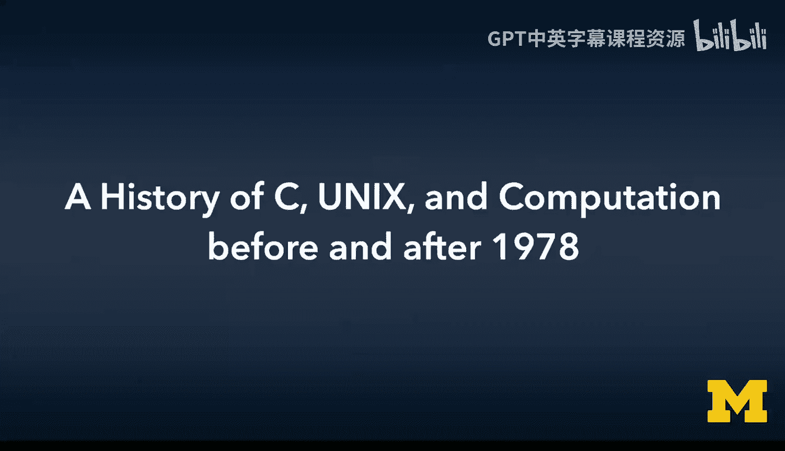
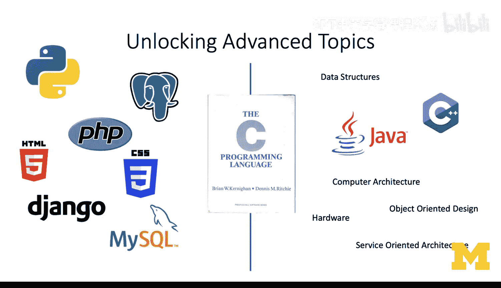
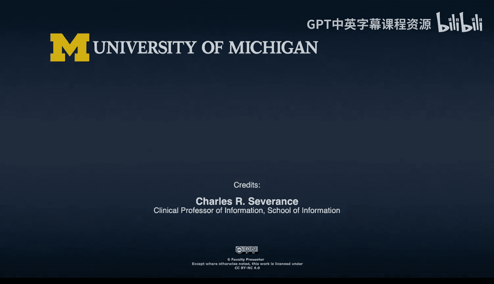

# C语言编程：P02：C语言历史：1978年前后的Unix与计算发展 🕰️💻

## 概述

在本节课中，我们将学习C语言的历史背景，特别是1978年前后Unix操作系统与计算技术发展的关键时期。我们将了解C语言的起源、演变及其对现代编程语言的深远影响。

## C语言的历史背景

C语言的历史可以追溯到更早的语言。在AT&T贝尔实验室，人们曾使用一种名为B的语言来构建实用程序和操作系统组件。但B语言过于“面向字”，不够灵活。随着支持字节寻址的新计算机硬件的出现，C语言应运而生。这种新硬件能够加载和存储字节串，而不仅仅是“字”（字通常大于一个字节，多个字符被压缩进一个字中）。在60年代末和70年代初，C语言旨在将字符作为一种核心的、低层次的数据类型。

## Unix与C的共同演进

在70年代早期和中期，C语言和Unix操作系统共同演进。开发者的目标是在PDP-11/20上良好地运行Unix，同时使其能够移植到其他系统。这很大程度上得益于PDP-11/20酷炫的内存架构，特别是其字节寻址能力。他们精心地用C语言重写Unix，同时改进C语言，为Unix的可移植性奠定基础。到了1978年，K&R C（由Brian W. Kernighan和Dennis M. Ritchie合著的《C程序设计语言》）一书出版。此时，这本书可以看作是十多年来关于如何构建可移植编程语言，并用该语言构建可移植操作系统（即C和Unix）的研究总结。

## C语言的标准化与演变

到了1989年，C语言已变得非常流行，标准化需求应运而生。于是出现了C89（ANSI标准），随后同一版本也被ISO（国际标准化组织）采纳为C90。这是第一个我们都能达成共识的C语言版本。ANSI标准并未试图偏离K&R C太远，而是确定了一些在当时看来需要明确的重要细节。从1990年至今，C语言持续演变，经历了数次重大修订。但现代C语言修订的关键在于，它们并不试图将C变成像Python或JavaScript那样易于使用的语言。C语言在众多编程语言中清楚自己的定位，并很好地履行了其职责。

## C语言的未来与替代者

那么，未来会怎样？C语言作为一种通用编程语言使用起来较为困难。Python是优秀的通用语言，但不是优秀的系统编程语言。C语言主要缺失两点：核心类型和库中缺乏真正可靠的动态内存支持；以及没有安全的字符串类型。C语言中没有“字符串”类型，只有字符数组，而数组有固定大小。如果你试图在数组边界之外存放数据，程序就会崩溃。对我而言，C++并非C的未来版本。对于从事专业复杂系统应用开发的程序员来说，C++是更强大、更精密、更灵活的C语言版本。在某些方面，写好C++比写好C更困难。

在通用编程领域，接过C语言衣钵的语言包括Java、JavaScript、C#或Python。这些语言的关键在于，它们不将字符串视为原始的字节数组，并且提供了一个简单的面向对象层，使我们远离底层硬件。而C语言的目标是接近硬件，贴近“金属”。因此，Java、JavaScript、C#、Python都是优秀的语言，非常适合它们的应用场景，但它们并不适合编写操作系统内核。

最有可能成为“下一个C”的语言或许是Rust。Rust的理念是保持贴近硬件，同时提供一些简单且安全的核心数据类型。最近，Linux内核开始接受部分Rust代码，这意味着Rust必须足够成熟和稳定。操作系统依赖一种编程语言（如Rust）时，该语言必须非常成熟，更重要的是必须稳定。不能因为编程语言的巧妙创新而导致操作系统（如Linux）出现功能退化。所以，请关注Rust。

## C语言之前的编程世界

在C语言出现之前（C语言始于1972年，书籍出版于1978年），大多数人会使用汇编语言或Fortran。有些人使用PL/I（图中未列出）。Fortran并非真正的通用编程语言，你不会用它来编写像`cat`这样的命令行工具。Fortran主要用于科学计算。50年代和60年代最早的计算机要么专门用于工资和人力资源系统，要么专门用于科学计算。那些用于科学计算的计算机使用Fortran，因为它是为这些旨在进行科学计算的计算机设计的合适语言。

C语言则不同，它旨在编写系统代码、内核、操作系统及其周边实用程序（包括其他语言）。因此，C语言可以说是众多衍生语言的母语，如Bash、Perl、Python、PHP、C++、JavaScript、Java、C#和Objective-C都源于C语言的开端。这就是为什么你在这些其他语言中看到许多相似的语法模式，例如JavaScript和Java都从C语言继承了它们的`for`循环语法。

## 计算机发展简史

在C语言历史之上，我们可以简要回顾一下计算机的发展史。我有一门完整的课程叫“互联网历史、技术与安全”，它从20世纪40年代开始，更侧重于通信而非计算，尽管通信与计算从40年代至今一直紧密相连。

在50年代早期，计算机最好被视为价值数百万美元的战略资产，每一台计算机都是如此，而且很多是定制的。例如，我就读的密歇根州立大学的第一台计算机是由该校电气工程专业的学生根据他们从爱荷华州借鉴的一些设计自行建造的。因此，编程语言、操作系统等都没有太多通用性或共享性。人们倾向于将代码写在纸带或后来的磁带上，然后加载运行。只要代码能运行就很开心了，不需要操作系统，这些也不是多进程计算机，软件环境非常精简。

到了50年代末和60年代，像IBM和数字设备公司这样的公司开始销售通用计算机。他们可以制造并开始销售这些计算机，虽然价格仍然昂贵，通常一个企业可能只有几台用于处理工资单等重要事务，因为计算机太贵了。

60年代，计算机组件、芯片等开始成为商品。你可以直接去一个地方购买芯片，然后通过购买一堆芯片组装成计算机。由于不需要从头开始建造一切，成本大幅降低。这些较便宜的计算机速度可能稍慢，但到60年代末，计算机数量已经很多了。有非常昂贵、特殊的小批量生产计算机，也有像前几代小型机那样大量存在的旧计算机，散落在旧的计算机科学系或不知道如何处理它们的企业里（他们想买新的）。同时，创新的低成本计算机不断涌现。

70年代，在这种新旧计算机硬件混杂的环境中，问题在于：我们能否利用所有这些旧硬件做些什么？是否存在一种通用的解决方案？这就是Unix和C出现的地方。当然，70年代之后，我们进入80年代，那是微处理器和个人计算机的时代。计算机从冰箱或桌子大小缩小到可以集成在单个芯片上。起初，像IBM PC或Commodore PET这样的个人电脑性能很差，但一旦所有东西都能集成到单个芯片上，性能就能迅速提升。并且，由于个人电脑成为大众市场产品，大量资金可以投入其中。

到了90年代，个人电脑持续发展，但通信和信息交换的需求变得重要。因此，在90年代，我们看到越来越注重通过互联网和其他网络连接计算机，计算机的性能不断提升，价格持续下降。进入21世纪，亚马逊的AWS成立于2002年，它使用英特尔等公司的个人电脑微处理器，将计算作为一种商品提供。所以，你甚至不再需要购买计算机，只需去亚马逊说，我每月花7美元租一台计算机。

因此，我们看到1978年是一个转折点：计算机变得越来越普及，价格下降，数量增多，并且种类多样。如今，计算机的种类实际上减少了。

## Unix操作系统的历史

让我们看看与C语言紧密相连的操作系统——Unix。在60年代，有一个多用户操作系统叫Multics。到了70年代，他们想开发另一个操作系统，最终称之为Unix，并在PDP-11/20上运行，这是当时市场上基于商品化部件的新型计算机之一。

1973年，Unix用C语言重写，但最初只运行在PDP-11上。尽管他们从一开始就为可移植性奠定了基础，知道他们希望一切都是可移植的，但第一个版本只能先确保在PDP-11上运行。到了1978年，Unix运行的第二个计算机是Interdata 8/32，这是一台相当不同的计算机。这次移植非常成功，他们真正学到了很多关于使Unix成为可移植软件的知识。

在70年代早期，C语言的演进是为了让Unix能够被移植。这就像在PDP-11和Interdata之间遇到了问题，我们如何解决？我们可以改变操作系统的工作方式，修改操作系统代码，也可以改变C编译器，然后用更多的C语言代码重写操作系统代码，减少汇编语言的使用。目标是让Unix中只包含非常少量的汇编语言。多年来，这个比例越来越低。

Unix被多次重写，70年代出现了多个版本，都与可移植性有关。到1978年，Unix第七版（Version 7）也能运行在DEC公司全新的VAX系统架构上。

加州大学伯克利分校有自己的Unix发行版，称为BSD（伯克利软件发行版）。这非常酷，因为大学通常推动像网络、TCP/IP这样的技术。BSD Unix是许多人第一次见到TCP/IP的地方。1982年，一家完全基于Unix的公司——Sun微系统公司成立。Sun融合了斯坦福和伯克利的一些工作，全部基于Unix。他们实际上创建了Unix工作站市场。此时，你可以想象世界即将全面采用Unix。Unix是最伟大的东西，计算机科学系在80年代中期都在操作系统课程中教授Unix。

问题在于，AT&T从未真正为Unix制定一个商业计划。因此，在如何将这个极其流行的事物货币化方面，出现了一些反复和起步。他们做得并不好，花了很长时间才弄清楚什么会成功。等到AT&T理清头绪时，市场已经向前发展了。

## Minix与Linux的崛起

Minix是由荷兰的Andrew Tanenbaum开发的一个操作系统。他构建了一个完全免费开源的操作系统，用于教育。他围绕它编写了一本教科书，非常受欢迎。但他当时不希望商业化，至少在那个时间点不希望。因此，他某种程度上将其抓得太紧，这又是一种知识产权上的失误。

1991年，一位名叫Linus Torvalds的程序员决定从头开始实现一个100%免费的Unix-like内核。他不打算使用Unix或Minix的代码，想创造另一个东西。最初这只是个爱好，他想看看自己能走多远。到1992年，Linux开始运行，并采用了GPL（GNU通用公共许可证）。这是一种严格的开源许可证，使得将Linux移出开源领域变得困难，这意味着人们可以放心地对Linux进行投资。因此，Linux成为了现代的Unix-like系统。Unix试图坚持了一段时间，但确实无法竞争。如今，剩余的Unix发行版只占市场的极小部分，而Linux占据了市场。

## 个人经历与行业变迁

回顾这一切，请记住1978年是历史上我认为一切都发生改变的转折点。我从事计算机科学工作已经很久了，始于1975年。1975年，我在一台CDC 6500计算机上学习Fortran，它运行一个特殊的操作系统叫Scope。我学习汇编、Fortran甚至Pascal。Pascal在70年代是一种宣称“未来在此”的语言（我也有关于Pascal的视频），但它主要面向教学，所以我在教育环境中使用Pascal。

当我成为80年代的专业程序员时，我使用了很多东西：汇编语言、COBOL，偶尔用点Unix和C。在80年代早期，Unix并非无处不在，至少在专业领域不是，因为PC革命正在发生。我们有DOS、早期Windows版本。我使用过dBase和Turbo Pascal，在IBM 360上教过课，也教过汇编语言。我使用过DEC VAX和VMS（非Unix）操作系统以及Fortran。然后在80年代中期，我在AT&T的Western Electric（我想是叫3B2）上教过Unix、C和Fortran。因此，尽管我们可以追溯到1978年是万物变革的时刻，但市场并非一夜改变。

然而，90年代发生的是，随着微处理器速度的提升，所有这些老牌计算机厂商（如Burroughs、Unisys、IBM、Cray、Control Data）以及许多小公司，都开始创建越来越快的Unix工作站。因为他们可以制造快速的新硬件，然后移植Unix操作系统，让操作系统在他们的新硬件上运行。这催生了一些惊人的创新。我使用过Sun、Ardent、Stellar（这些公司现在都已消失）、IBM RS/6000、Convex C240等。我的桌上曾有一台NeXT，我使用C语言，但TCP/IP、Windows、HTTP、万维网、Windows和Mac OS都混杂其中。但创新最快发生的领域确实是Unix空间。

到了21世纪，我接触的所有东西几乎都带有Unix的某些方面。我不是Windows用户，所以我接触的所有东西都带有Unix的某些方面。Mac OS仍然包含Unix，Linux也是。我使用的语言则逐渐收窄到Java、PHP和JavaScript。然后到了2010年代，Linux、Mac OS、Python、PHP、JavaScript。事情确实已经稳定在一个世界里：我自己的软件开发几乎总是在使用Unix-like系统，以及基于C或衍生自C的语言，因为Python、Java、PHP和JavaScript都基于C。这就是为什么理解C语言如此重要。我并非以专业身份编写C代码，但我每天都在运用我所有的C语言知识。

## 课程寄语与学习建议

那么，进入“给所有人的C语言编程”课程。我要说，C语言是你将要学习的最重要的编程语言。它绝不应该作为教给任何学生的第一门编程语言。在你的职业生涯中，你可能永远不会在专业环境中写一行C代码。我教C语言，不是为了让你成为一名专业的C程序员，我教C语言，是为了让你成为一名专业的Java程序员。但是，如果你在学习旅程的合适时机学习C语言，这是成为编程大师道路上必要的一步，而且是重要的一步。因为如果我没有先教你C语言，我就无法向你解释Java是如何工作的。

所以，这门课不仅仅是“拿个C语言证书，去赚大钱”。因为我不认为这个证书能让你赚很多钱，但我确实认为这个证书将为你作为程序员的未来打开大门。

因此，请对这门课程的材料保持耐心，不要急于求成。这是一门在线课程。我保证，你可以搜索到我创建的每一个编程练习的解决方案，我改动不大，所以解决方案就在那里。如果你的目标是取巧，只是搜索编程解决方案，那就去吧，完成课程，恭喜你。但你只是剥夺了自己学习的机会。你没有骗过我，你搜索并粘贴解决方案，我没有任何损失。

从始至终，每一个练习都试图让你在理解上向前迈进一小步。即使开头的简单练习有很多，它们也是为了让你为课程后期更具挑战性的内容做好准备和加强。如果你在课程开始时就开始粘贴解决方案，你在课程结束时将毫无机会。当你那样做时，你只是在浪费自己的时间。

我期待你学习这门课程的其余部分。当然，我也期待你告诉我，我关于这门课对你有多重要的直觉是否正确，尤其是在你学习了更多课程并找到成为专业人士的道路之后。

## 总结

本节课中，我们一起学习了C语言在1978年前后的历史背景，了解了它与Unix操作系统的共同演进、标准化过程以及对后世编程语言的深远影响。我们还回顾了计算机从昂贵专用设备到普及化商品的发展历程，以及Unix家族的兴衰演变。最重要的是，我们明确了学习C语言的目的：并非为了成为C语言专家，而是为了深入理解现代高级编程语言的底层原理，为成为真正的编程大师奠定坚实的基础。