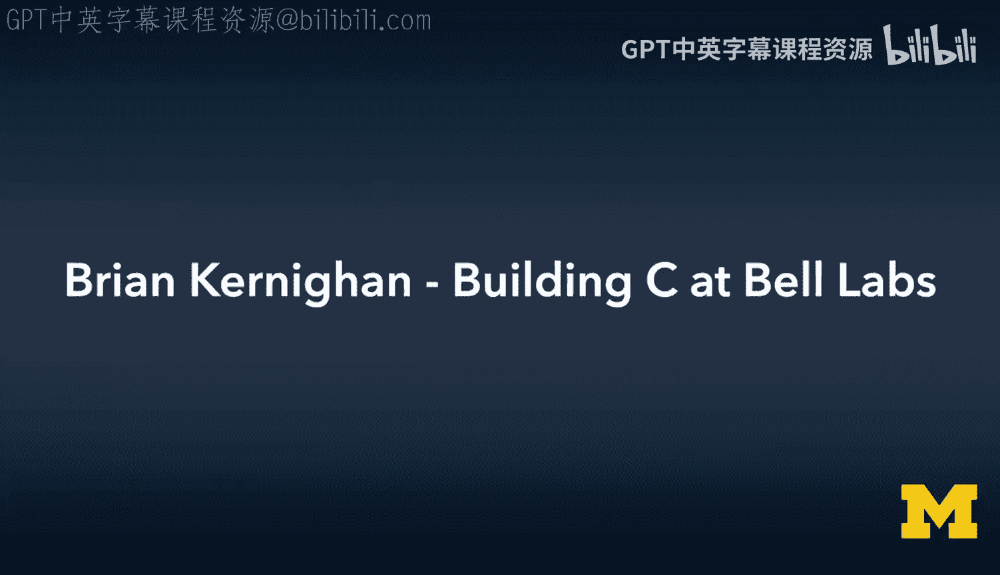
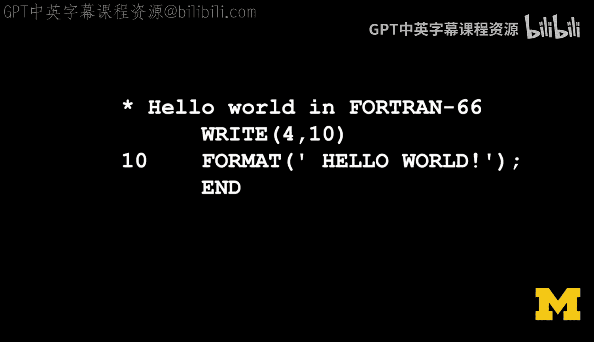
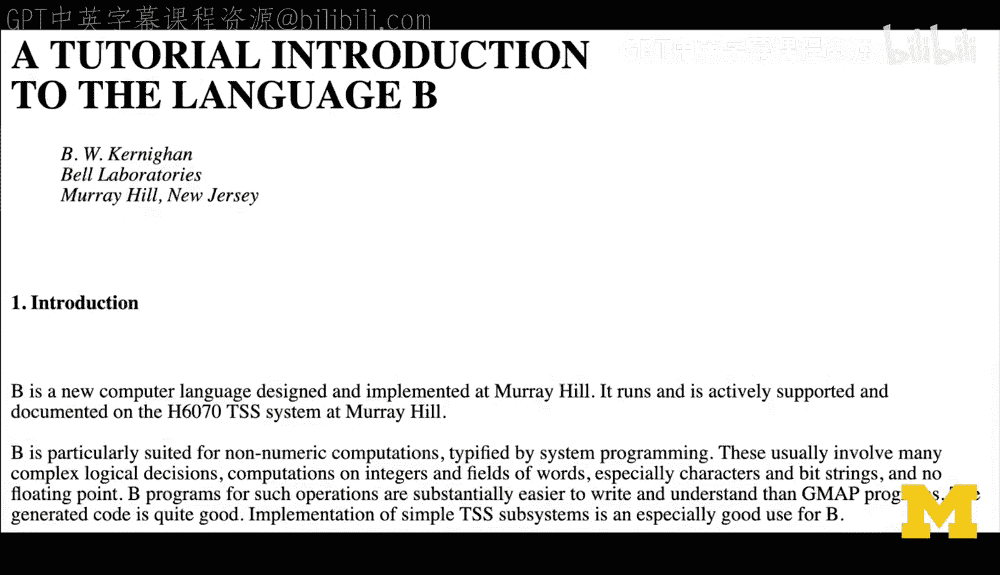
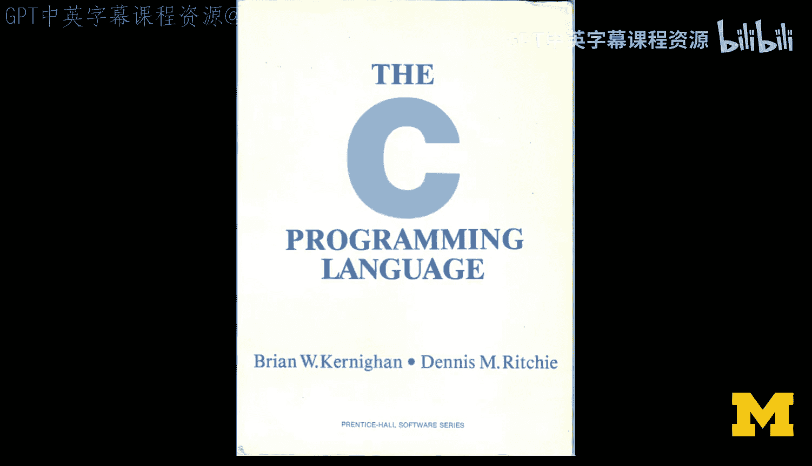
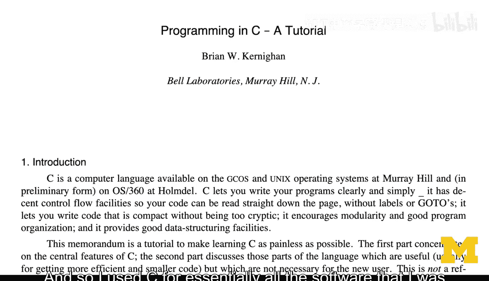
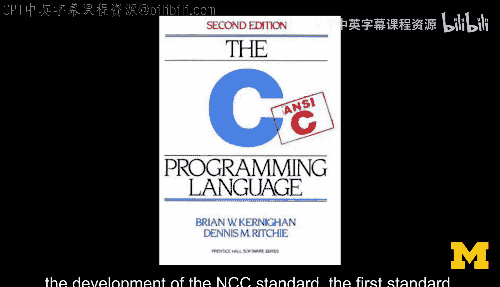
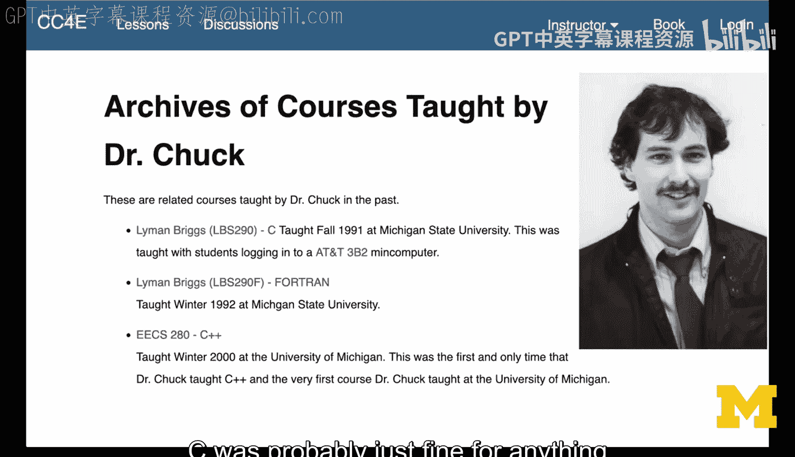
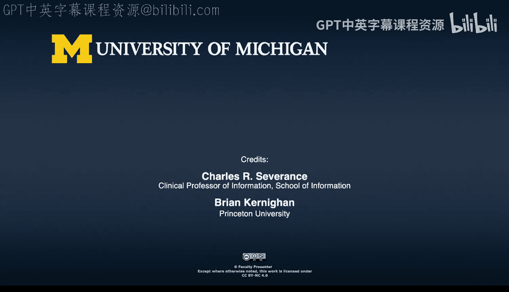

# 密歇根大学《给所有人的C语言编程课（了解C、用C编程、数据结构、创建对象）｜C Programming for Everybody》 p03 3_01_06_布莱恩·克尼汉：贝尔实验室的C语言构建.zh_en -BV1v2421P7pt_p3-

That Bill Ebbs。A bunch of smart people。Call it 1，200 PhD level people in Murray Hill in basically one giant building。

 and so that's a lot of people rubbing up against each other and they're all doing technical kinds of things。

And the environment did not tell people what to do。

 it was go do your thing and once a one side of one piece of paper tell us what you did and that'll determine how much money you get next year。

 but it was a very long cycle。The one extra thing is that it was a problem rich environment。

 and so there were things that。You could work on， and there was this， I think。

 very gentle gravitational drift towards。Doing something that somebody else might care about。

 lots of people， you know， who cares what other people think， I'm going to do my stuff。

 But I think most people got some reward， you know， psychic reward from。I do something。

 I give it to you and you say that was great。 and then you say but and you tell me all the things that aren't yet great。

 but that kind of thing was very common at the labs because AT&T at that time basically supply telephone service of most of the United States。

 many people， all kinds of interesting problems in and around communications and so no matter what you were interested in there'd be some part of AT&T that could probably make use of that。

 So that was part of it， but then there was the external world as well。

 the research community Bell labbs was just part of the academic research community。

 So there were both outlets and the labs was perfectly happy to have people do either。

And so all of that， I think worked out really very well and it helped to have stable funding because basically at that point。

 if you made a，A long distance phone call in the United States。

 remember a concept of long distance right， if you made one of those calls a tiny slice of the revenue of that。

Finance bill labs with the charter of make the service better。

And don't we won't worry about the details of how you do that So at the time there was a lot of interest in programming languages。

 this all came out of the Maltics experience right where people at Bell Labs and of course the folks at MIT were had realized that writing things in a high levelvel language made sense and then the question is what's the high levell language and they started with PL1 which in the abstract sounded like a good idea and in reality was a horrible idea because it was a horrible language and so Martin Richardfords from Cambridge University of Cambridge had this language called BCPL and he had spent。

 if I understand it correctly a sabbatical year at MIT。Planted the language in some sense。

 and it was much simpler， much cleaner， much better suited to system programming kinds of things than any version of PL1 would have been。

And so the people at Bell Labs， Ken Thompson。Dennis Richie and So had gotten some experience with。

High level language is as suitable for writing lots of different things。

VCPL wasn't a suitable thing for modern machines because it was typeless and newer machines clearly were coming on stream that would have types like bytes and integers and maybe bigger things。

So。At some point， Ken did a lot of experimenting Ken Thomashompsson did a lot of experimenting with simpler versions even of BPL。

 a particular one called B， which was an interpretive language， no compiler and that was again。

 expressive enough that people started to like it and that's sort of where I started in on this。

 I mean， I had written bits of P1。 It was awful。 I'd written Fortran better。

But the be was sort of nicer to use， but it was still typeless。

And an interpreter as well so it wouldn't be terribly efficient。

 but with the PDP 11 in the offing and I don't remember the exact timing here。

 it was clear that a version of something that was felt sort of like B but which had some mechanism to include types so that you could talk about characters or integers was going to be the way to go and that's where Dennis picked up and started developing the C language and the compiler to go with it and so on。

 portability was very much on people's minds at that time because although the core Unix work was done on the PDP11 there were other machines at the time that were you know in the same equivalents class Indata had a couple as 732。

832 numbers like that， and I think。There were probably HP machines as well and et cetera。

 and the other thing that was in some ways harder was that there was the big mainframe kind of computers that were used。

By the local computer center， and these were fundamentally。

Stripped down versions of the Malticx machines， they were GE 635 kind of things。

 and so those were big， clunky word oriented machines that were in effect。

 IBM 7094 is cleaned up a bit。And。Getting something that would compile sensibly for those。

Machines that really didn't have characters in a language which had become what it was。

 so it could manipulate characters。 I think there was a bit of a strain there， but that portability。

 how do you。Get the same language to work on different computers。

 and Dennis's original compiler really was targeted at the PDP 11。

 and Steve Johnson came along with the portable C compiler， which。

Basically separated at the front end， let's recognize the language。

 let's build some intermediate structure， and then let's generate code for different kinds of machines。

I had written a tutorial on B because you know I thought it was interesting maybe I can tell other people how to use it and so when C started to be used and I became somewhat better at using it。

 then I basically repurposed the B tutorial， brought it forward and made the C tutorial out of it。

And so I used C for essentially all this software that I was writing at that time。

You know kind of liked it， it was good， it was a nice match for the way people think about computing。

 I think but also a very nice match for the actual hardware of the time you could imagine what the compiler was doing。

All of it was clear， so efficient， expressive， and nicely matched to everything around it。

And then somewhere。In probably 1977 earliest I coerced Dennis into writing a book。

 but first edition came out in '78 and at that point the language is pretty reasonable the book I think。

It was right on the cusp of whether structures were fully part of the language or not。

 a bit of overhanang there， and I don't remember， but I think probably they were not quite but awful clothes and since Dennis was doing both compiler and book。

It was at least a consistent viewpoint question， can you pick up a structure as a unit and pass it around or do you have to do something special？

嗯。So but that's a milestone， and then the next one is probably the 1988 book and the development of the AnNs Sea Standard。

 the first standard， which is essentially again about the same time。

🎼Am。And so I think。Those are the ways I measured and at that point， call it 1988。

 give or take just before you encountered it， see was probably just fine for anything you might reasonably want to do。

This is probably heresy or something， but I don't think that the changes in evolution since then have bought enough in some sense。

