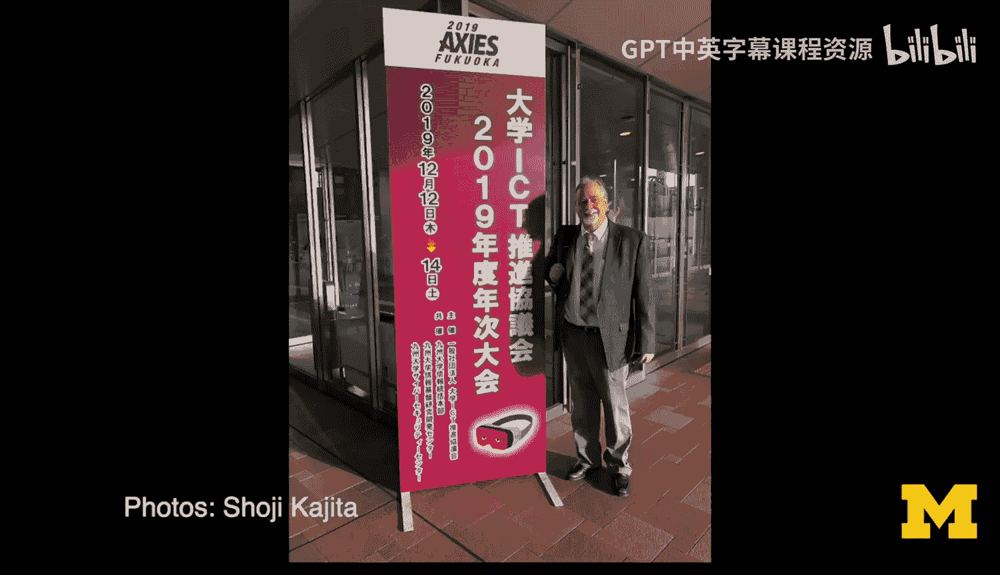
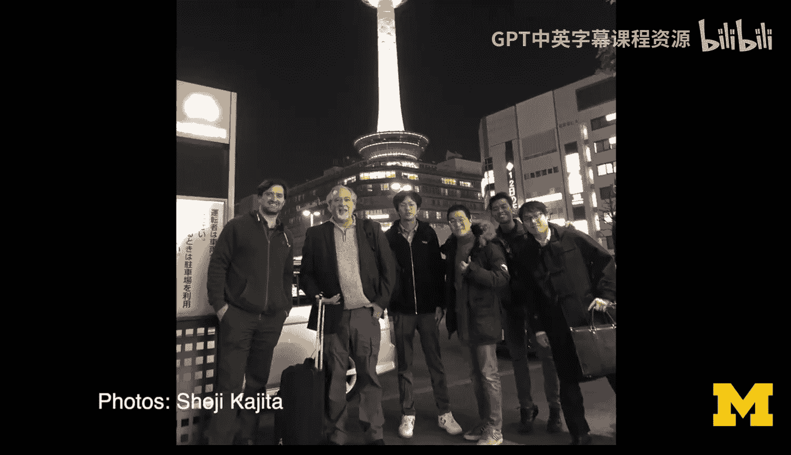

# 密歇根大学《给所有人的C语言编程课（了解C、用C编程、数据结构、创建对象）｜C Programming for Everybody》 p04 4_01_01_附加内容：西班牙瓦伦西亚办公时间.zh_en -BV1v2421P7pt_p4-

Hello everybody， Chuck here， I'm in the middle of the Atlantic Ocean on the way back from Spain。

 where I did my first。

Face to face office hours worth my online students。And well over two years。

 and I'm really excited to share it with you。Hello everybody， Chuck here in Valentia， Spain。

 We are at the first office hours in over two years。

 The last one was December 2019 in Kyoto with my friend Shoji present at a karaoke box and and my first international trip since the pandemic and I'm enjoying myself and so I'd like you to meet some of your fellow students for literally the first time in two years。

 and so here we go。 so tell us your name or hi I'm herman I'm really pleased to be here and I'm Jay Llo I had with these guys really is's really fine you know。

I'm glad you're here Hi I'm Chawi， Professor Chauck is really amazing。😊，Oh， thank you。Hi。

 I'm Gabriel and I'm just going to start to study Python more often a mile， there you go。

Hi I' Raphael， I'm very very glad to be here and having from the professor and you're an artist that is learning Python。

 right？Hi， my name is Joann， and am glad to be here with no meeting at last。

 the man who introduced me to programming。And teach me what is lu Booleion。

And what were you before you learned to do Python， chemmist， Cheem was a chemist。

 and have you gotten programming？So if you' got a programming job， yes。

 how did you get your programming job， Yes， this I in my second job no， well。

 how did you get your first job？I took an internship。

And I work as a assistant admin and moved to a do net position。

So there you go one of the most common questions I get and then the question was the first question we had here and that is how do you transition from knowledge to a job and it's difficult right and the key thing is is as。

🎼I've written in many articles that the key is is getting to know people because beginning jobs are hard to find so maybe you start with an internship or you start with quality assurance or you start with something that gets you in the door because it's really difficult to just knock on a door and get an in introductory programming job so again here we are from from Valenia our first face toface meeting as the pandemic hopefully continues to receive so cheers all。

