# 密歇根大学《给所有人的C语言编程课（了解C、用C编程、数据结构、创建对象）｜C Programming for Everybody》 p08 8_05_01_第一章历史背景：教程导论第二部分.zh_en -BV1v2421P7pt_p8-

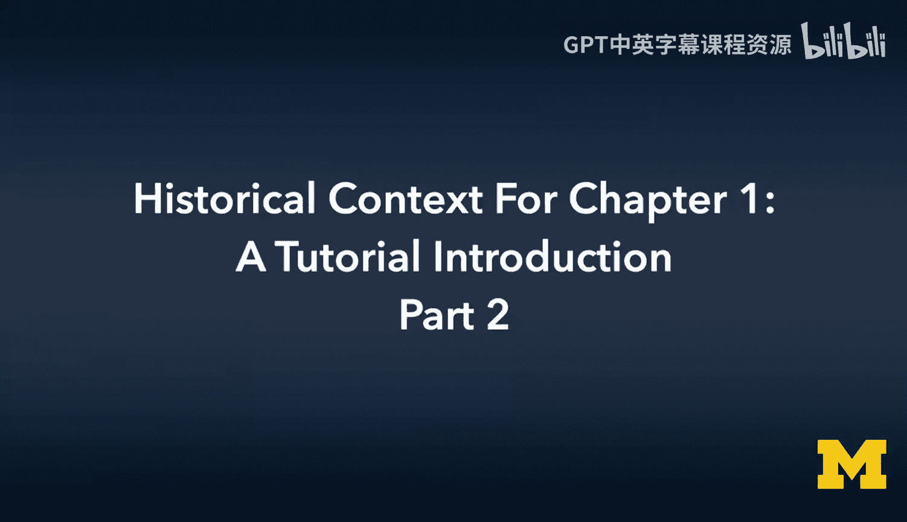

A string constants and character constants。Stings and characters in most languages。

 job is a little different， but PhP Python and JavaScript treats single and double quotes roughly the same and they create string constants。

 and that's a multi characteracter thing that has a length。

C doesn't have a multi character thing has a length that has an array of characters that has a zero character at the end of it。

 in C， single quotes are a single character and double quotes are a character array。So a single。

A double quote with one character in it is actually two bytes because it's the character and the string ending。

Whereas in Python， a string has a length that doesn't really have an ending character。

 there's a special character that we use for an ending。

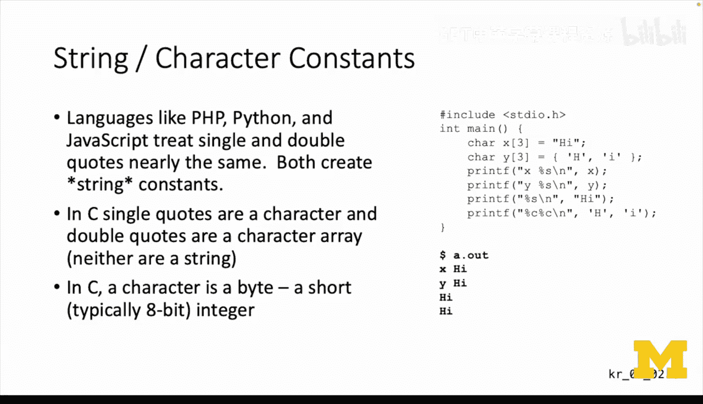

In C a character is a bitete。Which is a short integer， usually8 bits in most computers and so we。

You got to be real careful you got double quote things and single quote things and single quote things in C are far more like integers and far less like strings and so in Python you just use them interchangeably。

 single quotes and double quotes。

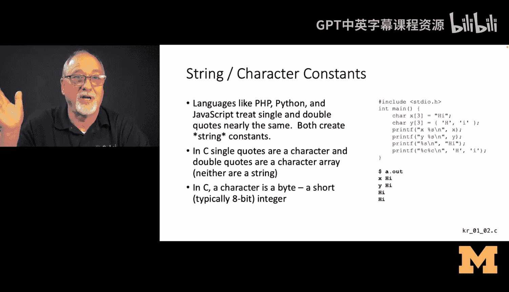

Character sets。The cha in C is like a number。 It's a tiny number。 It's 8 bits long。

 so you can go from 0 to 255， and the character representations depend on the character set。

 but quite often。They're ASI。 And so you can just go look up at an ASI chart and figure out what the numeric representation of the letter A is。

 And in Python， we can actually see the ordinal position of a by using the ord function。

 but that's the ord function of a single character string。

 which pulls the ord of the very first character， and we find it at 65。

 And if you look up in the ASI chart ats 65。 But in Python， Python 3。

Python3 are multibte characters that represent UniIode， and Unicode is much larger than 8 bits。

 I think Unicode is 32 Bs。UTF 8 is a way to represent UniIcode and Unicode is a 32 bit character set。

 And so if you say what is the character， the integer equivalent of the character smiley phase。

 you see that it's 128522。 and that's in a space of 32 bit。

 It's a 32 bit integer and that's the character point within that 32 bit integer that represents smiley face。

 And see there is no smiley face。 You can't represent well。

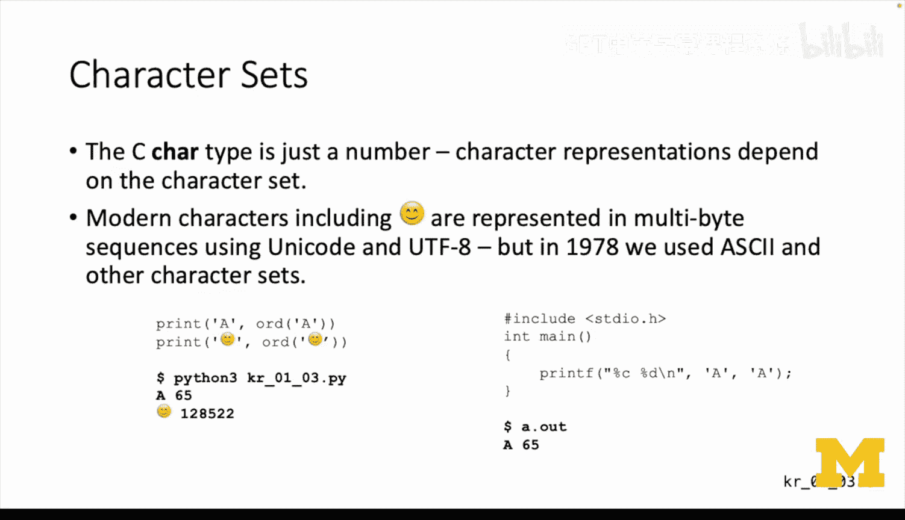

Unless you put a bunch of libraries into it， but the normal out of the box seed can't represent a smiley face。

It can represent an uppercase A and you can say what is the A and you'll notice so we're printing it out with a percent C and a percent D and it's the same thing。

 if you print a character out as a character， it's an A and if you print it out as an integer。

 it's an A， we don't even need an ord function because。

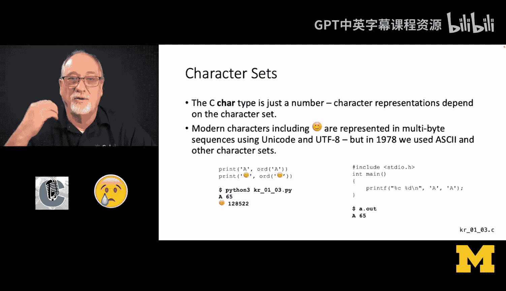

Character constants are really integer constants in the ASCII character set。Okay。😊。

Just understand that every time you see single quote a， single quote。

 think of it as an integer as a number that happens to be conveniently looked up for you by the C compiler。

And you can take a look at the ASII character set and you can go look at uppercase A and you see that its decimal equivalent is 65。

 You also see in this table that its hexadeciimal is 41 and its ocals101 and its binary。

 it's actual bits are one bunch of zeros and a1 Now the reason we like ocal and and hex as programmers is it's easier to convert directly one without having converting from decimal requires like divisions and modullo and stuff like that。

 but converting from ocal or hex to binary is direct on a digit by digit basis。

 so I can convert an ocal digit to a binary set of binary digits。

Just by looking at each digit in succession， so when we're printing out and we want to be able to understand what the raw bit pattern is of some data。

 we tend to print it out in Hex or in octal so that we can quickly figure out what bits are set inside that value。

Strings in C are not strings， they are arrays of characters， and there is no length。

 so you can ask Python what the length of a string is and the string knows its length。

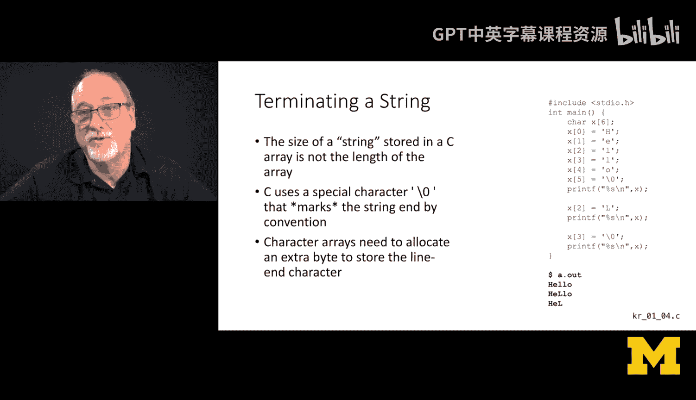

But in C that you can ask that the length of a string is。

 but it turns into a for loop that scans until it finds the end of the string。

 and the end of the string is a special character， which is quote， back slash0 quote。Which is 0。

 I mean， it's literally the integer 0。 So you have characters that are non0。

 and then you have a 0 character。 and the length is how many characters are in this array up to the end。

 Now， that is different than the allocation。 So you can have， in this case。

 I have us an example of a6 character array。And I put six things in it。 It's all full。

 I could have terminated it。 Like you notice， I say x sub 3 equals 0。

 It's no that's still got six characters in the array。

 But now the end of the string in that array or the end of the character sequence in that array has a0 at position sub 3。

 And， of course， array started 0。 So you see the first three characters。 And the third one is an end。

 and that that stops it to print out。 And so you got。

 you got an a allocate for the end of the character string。

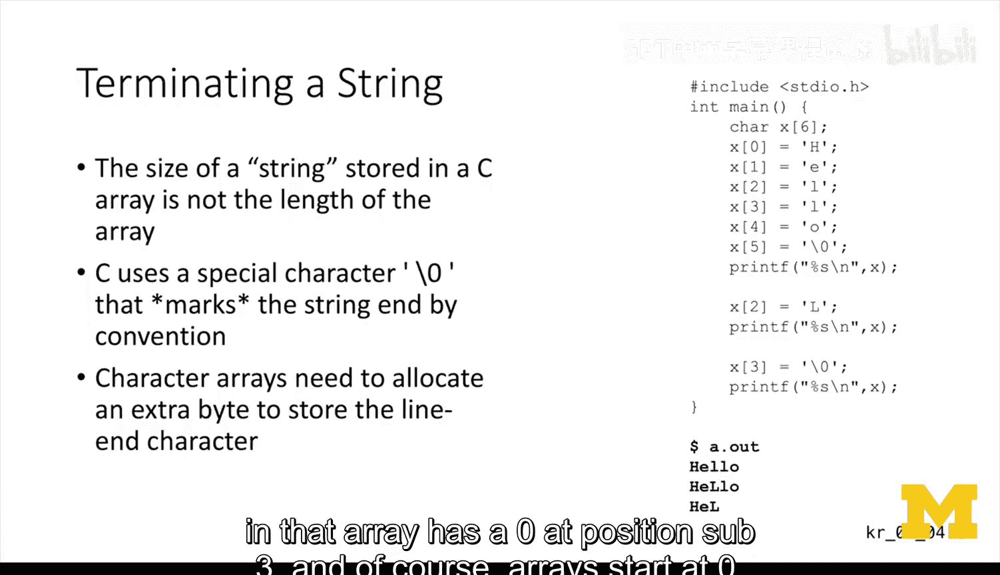

And you be， you've got to have it there if just because it goes up to six。

 if you don't have the end of the string， it's going to go off and randomly go through memory。

Until it。Blows up， probably， right。 And so strings must be terminated。

 If you append something to a string， first， you have to have enough space in that string。

If youpen something to a character ray you have to have enough space。

 and then if you overwrite the end of the string， youve got to add another little mark to say now the end of the string has been moved。

 So terminating a string is a thing that you always got to think about both when you're scanning through a string and when you're creating a new string。

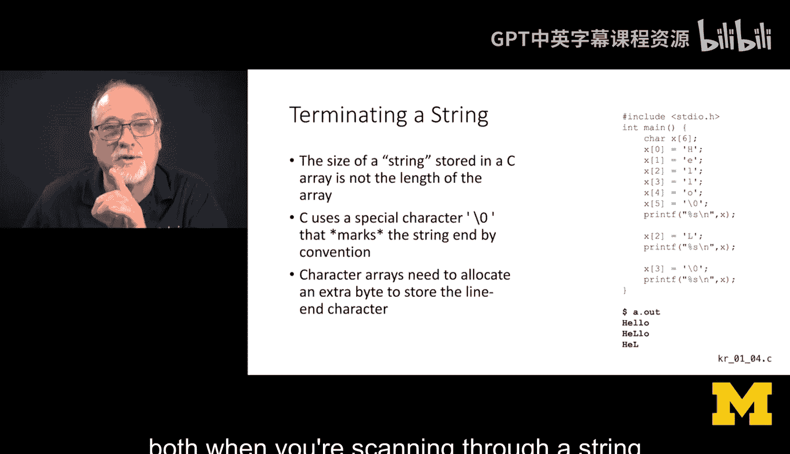

Like I said， the C string length is only computable by a loop that scans for a zero character。

 So there's a stir lens function in string dot H that computes the string， but it's very。

 very different than the lens function in Python。 lens function in Python X is an object and length is an attribute of that object。

 whereas in C， there is an array and it has a length， and it has a zero position。

 but to ask how long is it。 You've got to actually loop through all the characters looking for the zero marker。

😊。

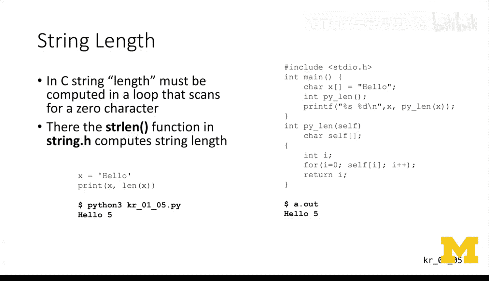

So you kind of can find a length of a character， a length of a string。

 the length of a quote unquote string in C， but you go write a for loop to do it。

 you don't have to write a for loop because Python just knows the length。Later。

 we'll bring all these things together much later。So。One of your assignments。Exercise 1。

17 is reversing a string in C。Without requiring any information， an extra string， you can't。

 you have a string， it's got a certain amount of space， and you've got to just flip。

You got to swap to the characters。 You're going to probably have to draw a picture to do that。

🎼It is exercise 117。 and I'm going to tell you， do not cheat。

 There are probably a million solutions out there on the Internet。

 Chet GT will tell you how to do it。Don't be tempted。As you do this。🎼You will get there。

 I show you a。Burd out version of it it's not all that much code， so don't shortcut this。

 don't just a solution getting the solution to this assignment without actually doing it is the meanest thing you'll ever do to yourself。

🎼You have to do the reversal in place， it's a classic interview question。At the interview。

 you don't get to go to chat GT。You got to think about even length strings， odd length strings。

 empty strings， and single character strings， you're going to have to draw some pictures。

Take your time。Enjoy this assignment seriously。

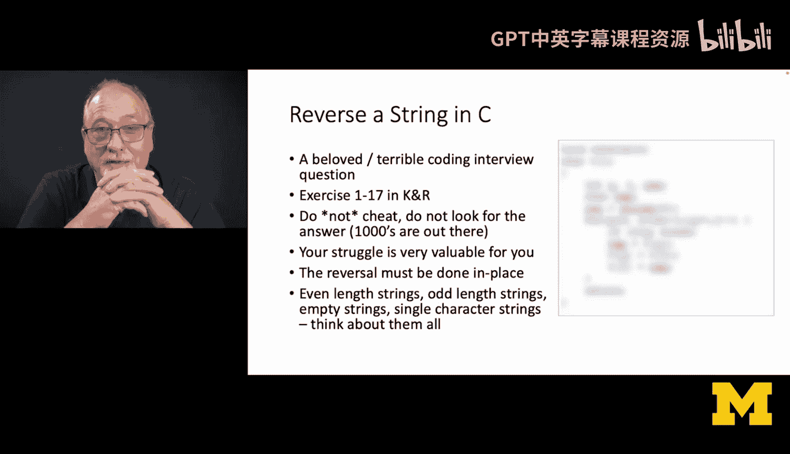

🎼It's not that big and when you get it done， you can be very。

 very proud of yourself that you really thought through the low level storage of what an array of characters with an ending marker is working with and so that's why it's such a good interview question。

So there we go， that's kind of my call outs from chapter one。

 give you a sense that overall sense of the book， see character arrays and encouraging you to actually do your homework。

 even though there's a million ways to get it done for you， cheers。

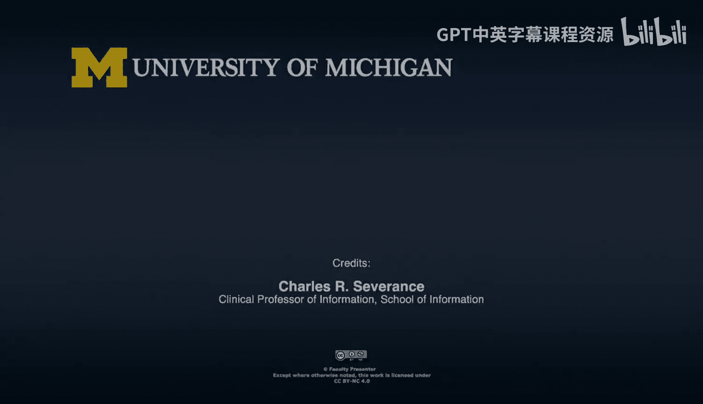

🎼Yeah。

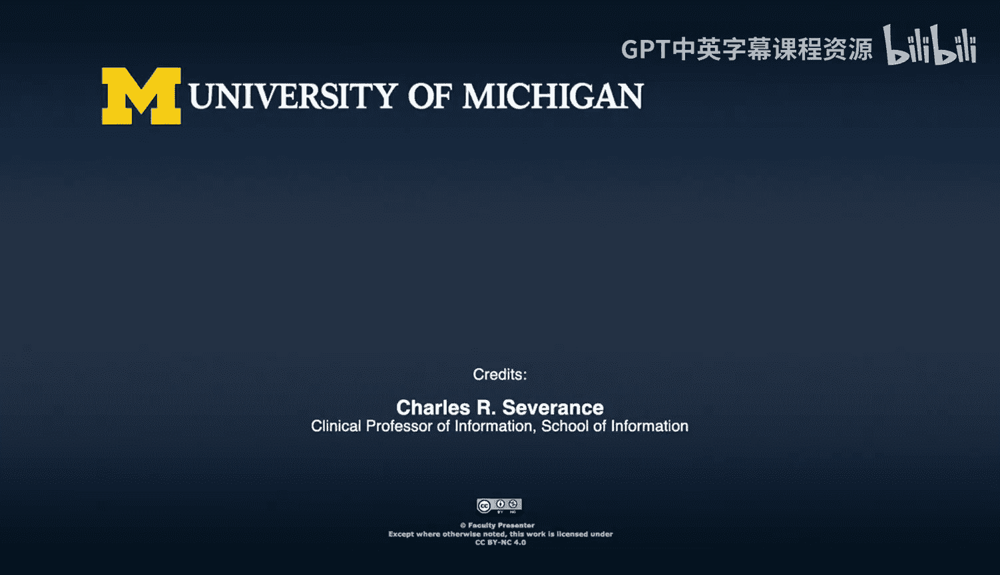

Yeah。