# C语言编程：第3章：控制流的历史背景 🧭

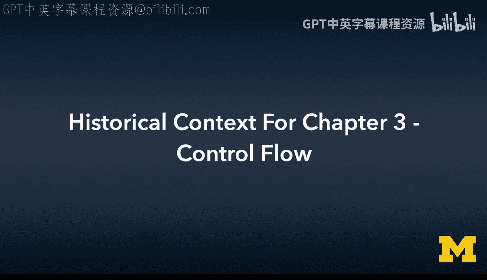

在本节课中，我们将学习C语言第3章“控制流”中一些独特的历史背景和语法细节。我们将探讨分号的使用、`else if`的微妙之处、`switch`语句的起源、逗号运算符，以及早期编程中追求代码极度简洁的倾向。理解这些背景知识，能帮助我们更好地阅读教材中的代码，并明白现代编程风格与过去的差异。

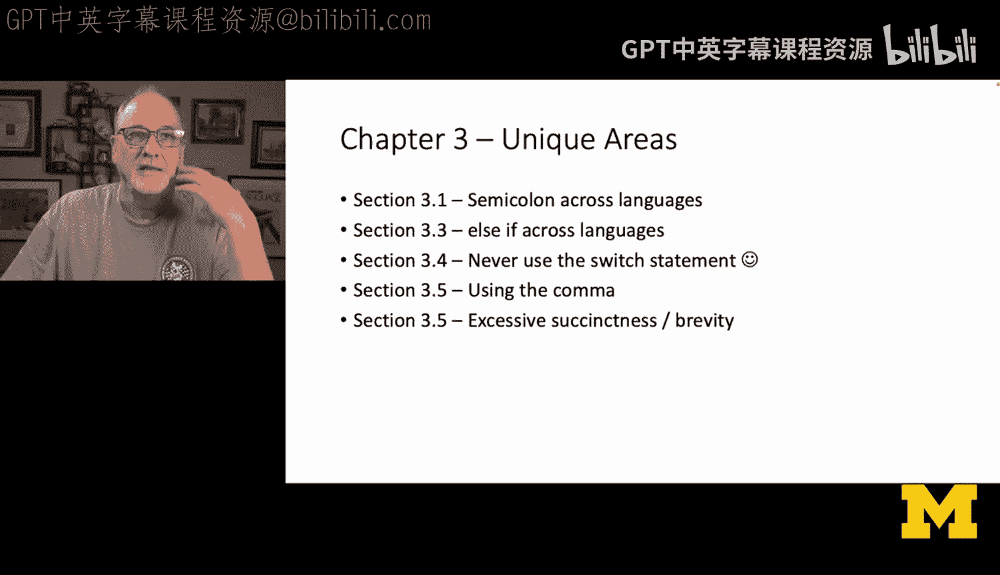

---

## 分号：终结符与分隔符 🔚

上一节我们介绍了本章的概述，本节中我们来看看分号在不同语言中的角色。分号在C语言中是一个**语句终结符**，这意味着每个独立的语句都必须以分号结束。

**C语言示例：**
```c
x = x + 1;
x = x / 2;
printf("%d", x);
```

然而，在其他语言中，分号的规则有所不同。以下是不同语言中分号作用的对比：

*   **Python**：分号是**分隔符**而非终结符，通常可以省略。它允许你将多个语句写在同一行。
    ```python
    x = x + 1; x = x / 2  # 合法但不常见
    ```
*   **Java**：遵循C语言模式，分号作为**终结符**。
    ```java
    x = x + 1;
    System.out.println(x);
    ```
*   **PHP**：紧密遵循C语言，分号作为**终结符**。
*   **JavaScript**：分号作为**分隔符**，在大多数情况下可以省略，但许多开发者习惯加上。
*   **Shell脚本**：使用分号作为命令**分隔符**，这与在同一行写多个C语句的样式相似。

理解分号是“终结”还是“分隔”语句，是阅读不同语言代码的关键。

---

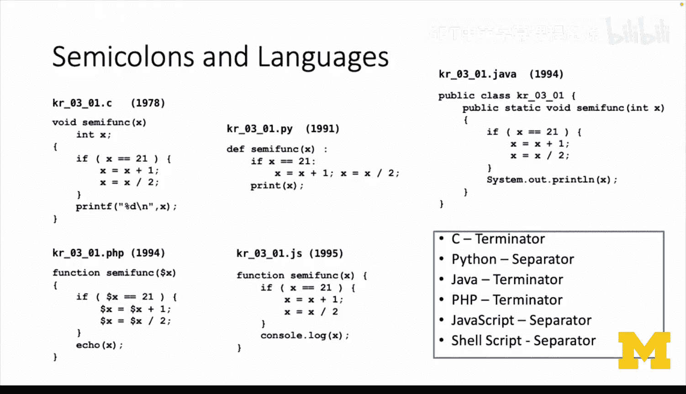

## `else if`：语法嵌套的错觉 🧩

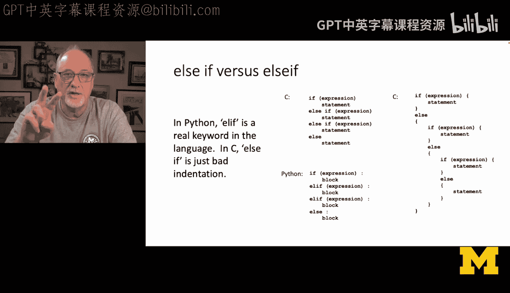

了解了分号的基本用法后，我们来看一个更微妙的语法点：`else if`。在C语言中，`else if`实际上是两个独立的关键字：`else` 和 `if`。它的结构本质上是嵌套的。


**C语言中的`else if`结构：**
```c
if (expression1) {
    // 语句块1
} else if (expression2) {
    // 语句块2
} else {
    // 语句块3
}
```
从技术上讲，上述代码等同于以下完全展开的嵌套形式：
```c
if (expression1) {
    // 语句块1
} else {
    if (expression2) {
        // 语句块2
    } else {
        // 语句块3
    }
}
```
而在Python中，`elif`是一个独立的、专门的语言构造，并非`else`和`if`的简单组合。这使得Python的语法在表达多分支条件时更加扁平化和优雅。

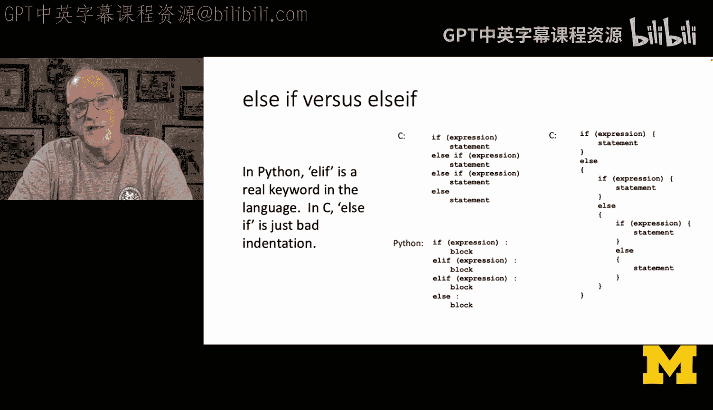

**Python中的`elif`结构：**
```python
if expression1:
    # 语句块1
elif expression2:  # `elif`是一个关键字
    # 语句块2
else:
    # 语句块3
```
这种差异体现了语言设计上的不同思路。虽然C程序员很少会像上面那样刻意缩进，但了解其底层逻辑有助于理解代码结构。

---

## `switch`语句：跳转表的遗产 🗺️

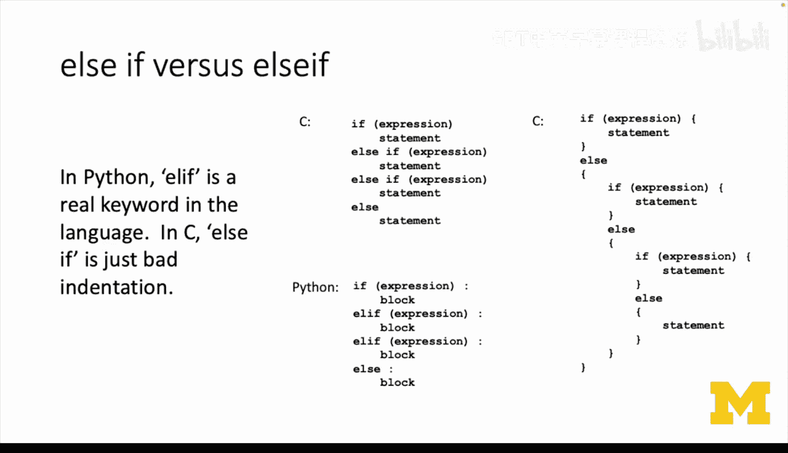

上一节我们讨论了条件分支，本节中我们来看看另一种分支结构：`switch`语句。`switch`语句的引入有着特定的历史背景。在早期的汇编语言编程中，程序员经常使用“跳转表”来根据一个整数值快速跳转到不同的代码段。

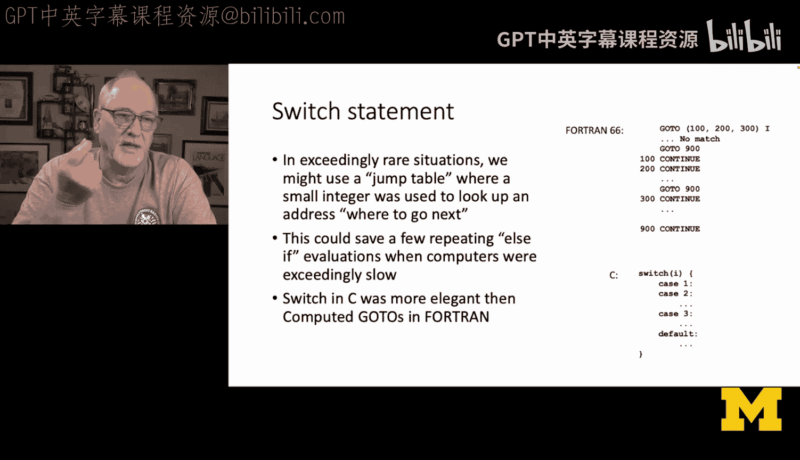

C语言中的`switch`语句就是对这种底层模式的一种高级抽象，它比当时Fortran语言中的`COMPUTED GO TO`语句要清晰和优雅得多。

**C语言`switch`语句示例：**
```c
switch (value) {
    case 1:
        // 执行操作1
        break;
    case 2:
        // 执行操作2
        break;
    default:
        // 默认操作
}
```
`switch`语句允许你将多个`case`标签堆叠在一起，并且需要一个`break`语句来防止“贯穿”到下一个`case`。尽管在现代编程中，由于编译器优化非常出色，一连串的`if...else if`语句通常和`switch`语句效率相当，因此`switch`的使用频率已大大降低，但了解其历史渊源仍然很有意义。

---

## 逗号运算符：循环中的轻量级分隔符 ⚖️

在C语言中，逗号`,`可以作为一个运算符或分隔符使用。它最常见于`for`循环的初始化和增量部分，用于在同一个语法位置执行多个表达式。

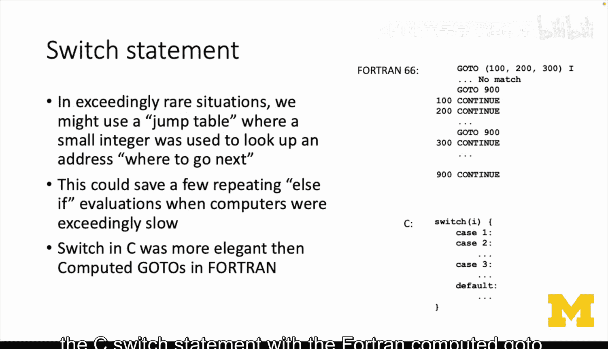

**逗号在`for`循环中的应用：**
```c
for (i = 0, j = strlen(s) - 1; i < j; i++, j--) {
    // 循环体：使用i和j进行操作
}
```
在上面的代码中：
*   `i = 0, j = strlen(s) - 1`：在循环开始前，**同时**初始化`i`和`j`。
*   `i++, j--`：在每轮循环结束后，**同时**递增`i`和递减`j`。

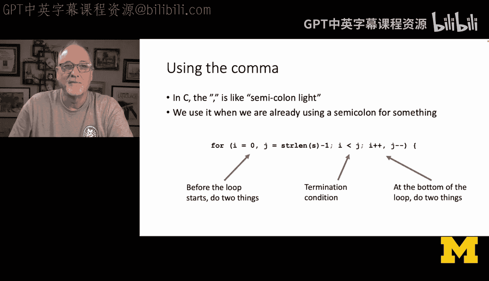

你可以把逗号理解为`for`循环结构内部的“轻量级分号”。因为`for`语句的括号内已经用分号分隔了三个部分（初始化、条件、增量），所以当需要在其中一个部分做多件事时，就使用逗号来分隔。这是一种简洁的惯用写法。


---

## 追求简洁：历史背景下的代码风格 ⚡

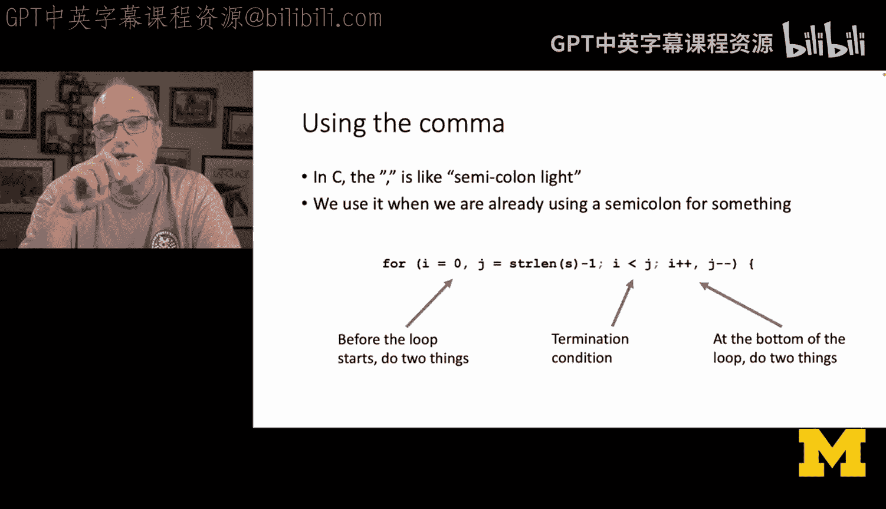

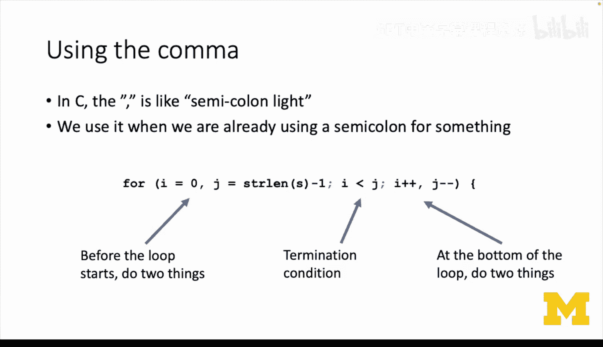

早期C语言程序员很多有汇编语言背景。在那个时代，编译器优化技术还不成熟，硬件资源也极其有限。因此，程序员常常手动编写极其简洁（有时甚至晦涩）的代码，以期获得更高的执行效率。

以下是教材中可能见到的一些“简洁”风格：

1.  **在条件中完成工作**：将读取、计算和赋值全部塞进循环的测试条件中。
    ```c
    while ((c = getchar()) != EOF && c != ‘ ‘ && c != ‘\n’ && c != ‘\t’) {
        // 循环体可能为空，因为所有工作都在while的条件中完成了
    }
    ```
2.  **利用表达式副作用**：一个表达式既完成计算，又用于条件判断。
3.  **极简的循环体**：如上面例子所示，有时循环体只是一个分号`;`，因为所有操作都在循环头部的测试或增量部分完成了。

这种风格源于对生成高效机器码的直接关注。当时程序员甚至会检查编译器输出的汇编代码，并尝试用手写更简洁的C代码来“引导”编译器生成更好的机器码。

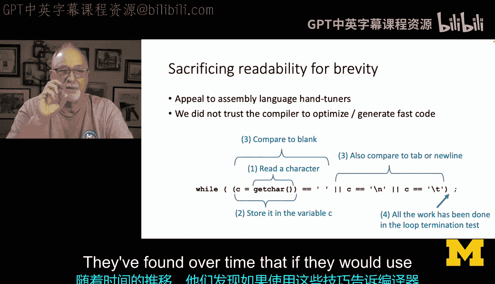

**重要提示**：对于现代初学者来说，**不应刻意模仿这种晦涩的编码风格**。当今的编译器优化能力已经非常强大，清晰可读的代码远比看似“聪明”的简洁代码更重要。我们在阅读教材时，理解这些代码背后的历史原因即可，但在自己编写代码时，应优先保证逻辑清晰。

---

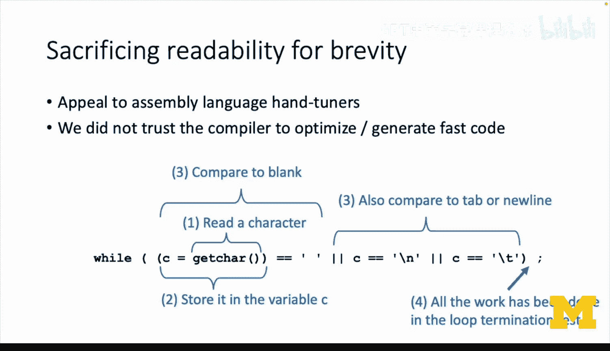

## 总结 📚

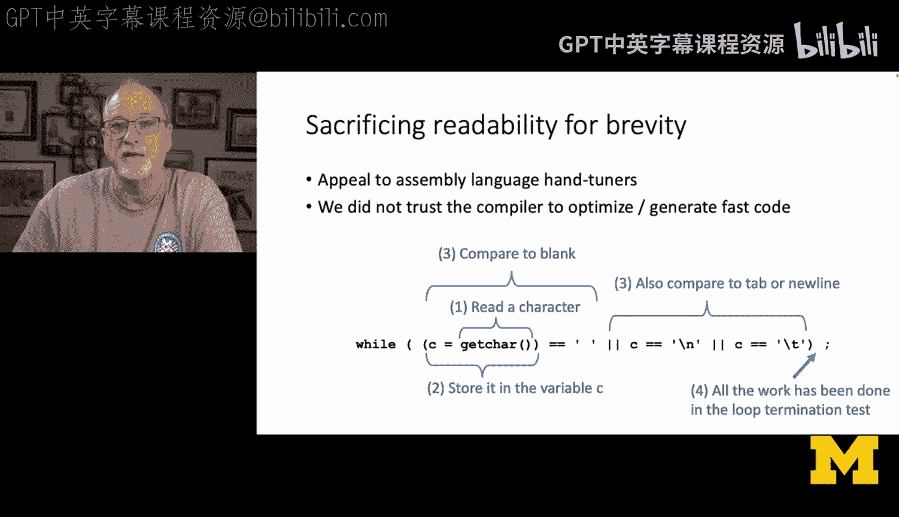

本节课中我们一起学习了C语言第3章涉及的一些历史背景和语法细节。

*   我们分析了**分号**在C语言（作为终结符）与其他语言（如Python，作为分隔符）中的不同角色。
*   我们揭示了C语言中**`else if`** 实质是嵌套语法，与Python的独立关键字`elif`的区别。
*   我们探讨了**`switch`语句**起源于汇编语言的“跳转表”，并了解了其基本结构。
*   我们介绍了**逗号运算符**在`for`循环中用于分隔多个表达式的惯用法。
*   最后，我们理解了早期C代码追求**极度简洁**风格的历史原因，并强调在现代编程中代码可读性优于这种过时的“优化”。

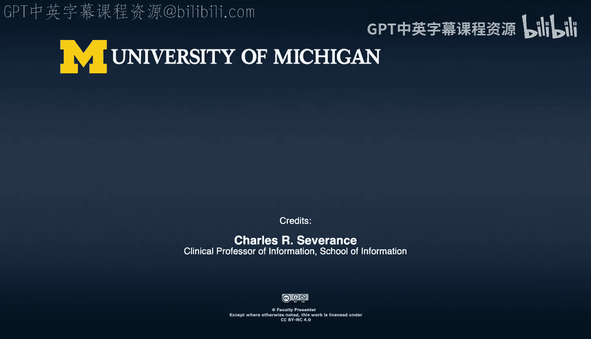

掌握这些背景知识，能帮助你更顺畅地阅读经典教材中的示例代码，并培养出编写清晰、易维护的现代代码的好习惯。