# C语言编程：第4章：函数与程序结构的历史背景 - 第1部分 🧱

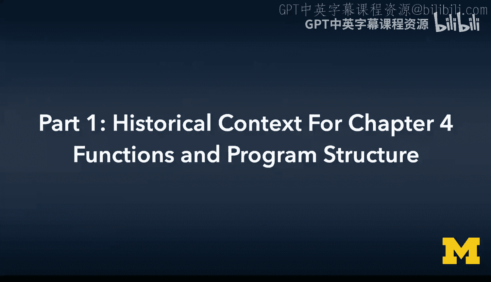

在本节课中，我们将开始更深入地探讨C语言的核心机制。课程的目标之一是让大家理解程序在底层是如何工作的。最终，在后续课程中，我们甚至会深入到硬件、架构和逻辑门层面。现在是时候揭开面纱，看看事物运作的原理了。本章我们将学习多个重要概念，其中最关键的是**栈**的概念。我们还将了解**按值传递**和**按引用传递**的工作原理，初步接触**递归**，以及**预处理器**。这些内容不仅关乎函数如何工作，更关乎函数是如何被实现的，以及这种实现方式如何影响它们的行为。

首先，我们来讨论一个非常巧妙的计算机科学概念：**栈**。

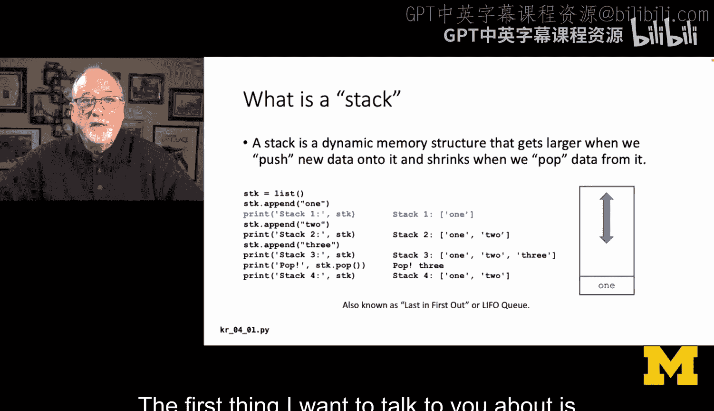

## 什么是栈？ 📚

栈是一种我们使用的数据结构，它有几个关键属性。栈的概念是：我们从一个空栈开始，将东西放入栈中，然后再取出。我们取出的顺序是**后进先出**。你可以将元素**压入**栈顶，也可以从栈顶**弹出**元素。

我们可以用Python列表来模拟栈的行为：

```python
stack = []          # 创建一个空栈
stack.append('1')   # 栈中现在有 ['1']
stack.append('2')   # 栈中现在有 ['1', '2']
stack.append('3')   # 栈中现在有 ['1', '2', '3']
item = stack.pop()  # 弹出 '3'，栈变回 ['1', '2']
```

栈底元素是`‘1’`，栈顶元素是`‘3’`。当我们执行`pop()`操作时，得到的是最近压入的元素`‘3’`，并将其从栈中移除。这被称为**后进先出**原则。我们将在函数调用中使用栈。

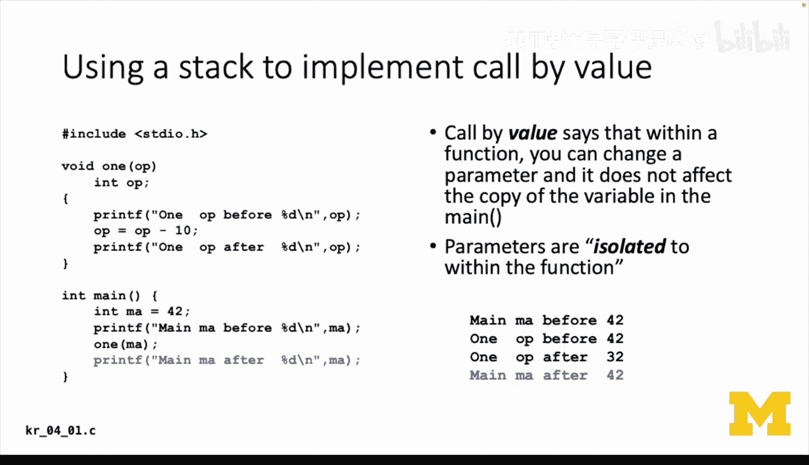

## 按值传递与栈帧 🖼️

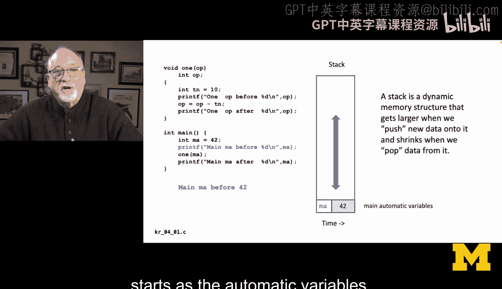

历史上，当我们讨论**按值传递**和**按引用传递**时，我们通常说：按值传递意味着主程序中的一个值（例如变量`ma`的值为42）会被复制到函数中，参数`o`获得的是42的一个副本，而不是原始的`ma`。

这是一个巨大的简化。让我们看看栈是如何用来实现这一点的。

在C语言中，函数开始执行前在其内部分配的变量被称为**自动变量**。实际上，主函数`main`中的`int ma = 42;`也是一个自动变量，因为`main`本身就是一个函数。

当程序执行到`int ma = 42;`并打印`ma`时，C运行时环境会在栈上分配一个整数空间，并将42赋值给它。这就是在`main`中第一个打印语句时栈的状态。

接着，我们调用函数`one`并传入`ma`。此时，C运行时库会在函数`one`开始执行前，分配一个称为**栈帧**的结构。一个栈帧包含了函数的参数和其内部的自动变量。

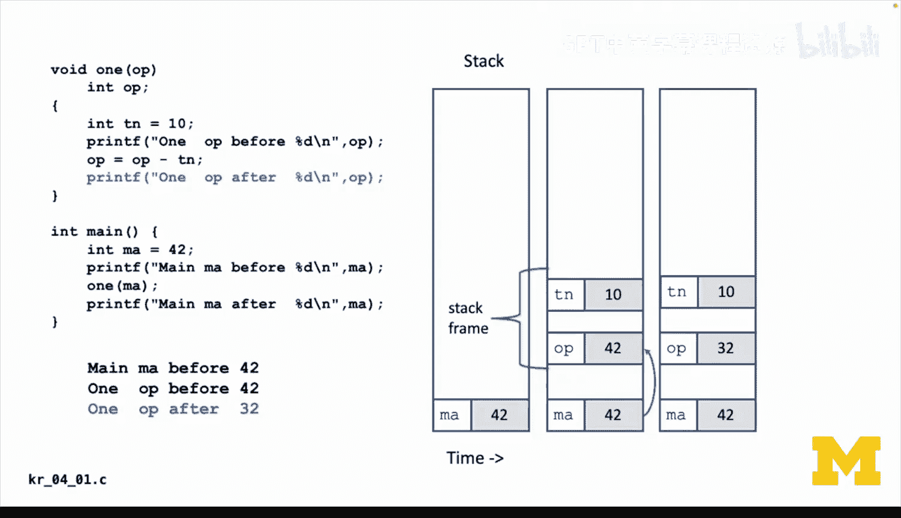

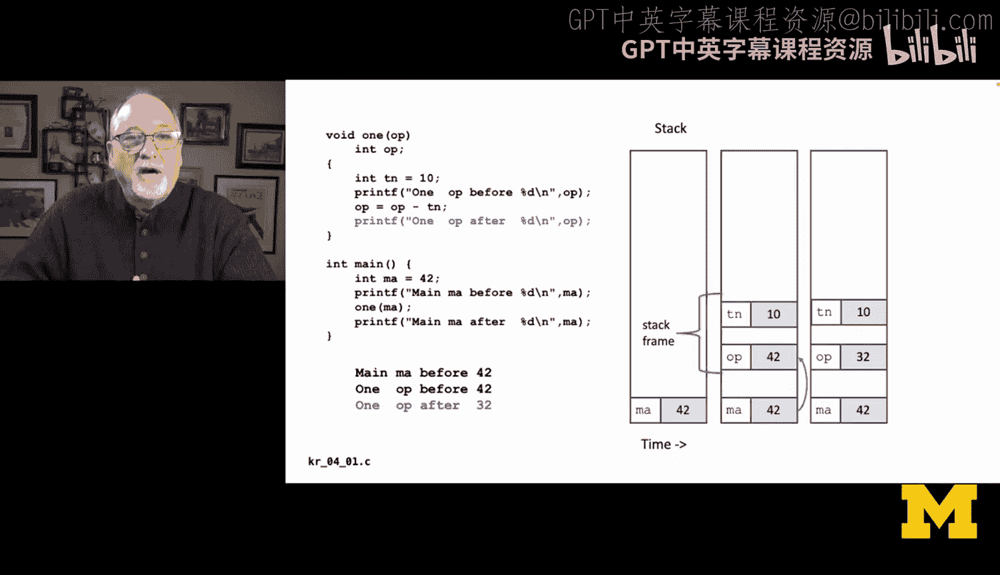

在这个例子中，我们会得到两个变量：整数参数`o`和整数自动变量`tn`。在函数开始前，值42会从`ma`复制到`o`中。因此，栈帧就是该函数运行的上下文环境。

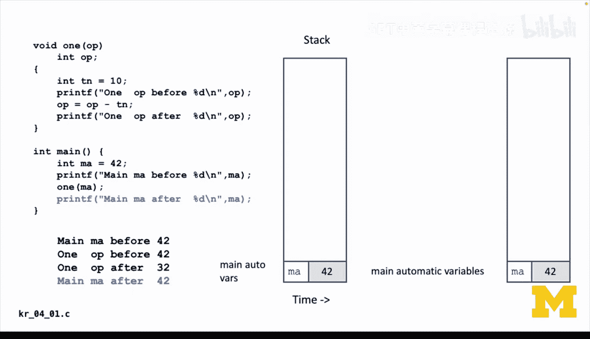

函数`one`开始执行时，`o`的值为42。此时栈上有两个42的副本：一个是`main`栈帧中的`ma`，另一个是`one`栈帧中的`o`。接着，执行`o = o - tn;`，`o`的值变为32。但请注意，在`one`的栈帧之外，`main`栈帧中的42依然存在且未改变。在函数内部，我们只能看到当前栈帧（栈顶部分），看不到属于主程序的那部分栈。

函数打印出32，然后返回。此时，C运行时会移除`one`的栈帧，弹出栈上所有属于它的数据。程序流回到`main`，`main`的栈帧中只有一个变量`ma`，其值仍是42。这是因为`one`只在自己的栈帧内操作，现在主程序回到了它自己的栈帧中运行。

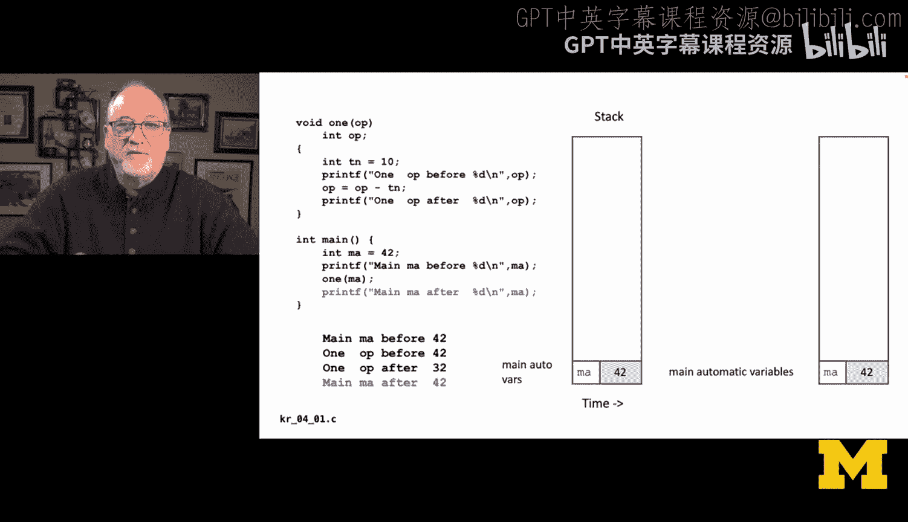

从`main`的视角看，`one`函数就像从未发生过一样。`main`有一些变量，`one`运行并创建了一个栈帧，`main`的部分数据被复制到`one`的栈帧中，`one`在其栈帧内操作，然后在返回的那一刻，栈帧消失。返回值也会放在栈帧中（图中未展示）。你可以看到，`main`开始时栈上有一个变量，`one`运行时栈增长，所有操作完成后栈又收缩回去，被改变的变量也随之消失。栈的升降过程，使得除了栈的临时变化外，仿佛什么都没发生。

## Python与C的对比：按值还是按引用？ 🔄

在Python中，我们也能观察到类似现象。例如，一个函数`zap`接收参数`x`，在函数内部改变了`y`（即传入的`x`的别名）的值并打印，但返回到主程序后，原始的`x`并未改变。这看起来很直观，似乎是按值传递，函数内部的改变不影响外部。

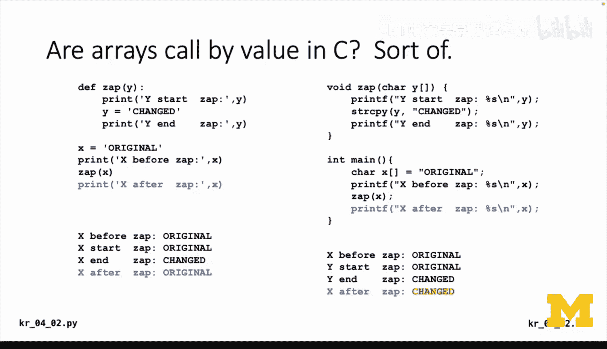

然而，其底层原理与简单的“按值传递”不同，更多是因为`y`实际上是一个指向对象的指针。当在`zap`内部执行`y = “changed”`时，`y`这个指针指向了另一个不同的字符串对象，但`x`这个指针本身从未改变。Python的运行时环境略有不同，但这导致了字符串变量在Python中表现得像是按值传递。

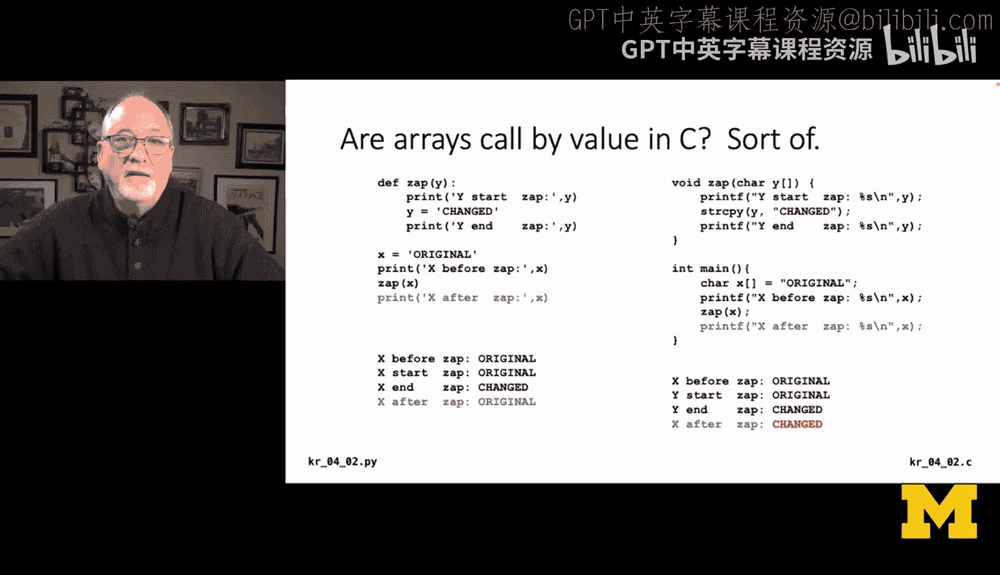

现在，让我们看一段相似但本质不同的C语言代码。在C中，`main`函数有一个字符数组`x`，其内容为“original”。然后调用`zap`函数并传入`x`。在`zap`函数内部，它接收一个字符数组参数`y`，开始时打印“original”，然后使用`strcpy`将“changed”复制到`y`中，最后打印“changed”。但当程序流回到`main`函数后，我们发现`x`的内容也变成了“changed”。

这是否意味着这是按引用传递呢？答案是：有点类似，但这有助于我们理解底层机制。

实际上，在C语言中，当你将一个**数组**传递给函数时，你传递的并不是数组的内容本身。因为数组可能非常庞大，所以C语言不会复制整个数组。当`x`被传递给`zap`并由`y`接收时，传递的实际上是字符串起始位置的**内存地址**，而不是字符串内容本身。这个地址（一个指针）被存储在`zap`的栈帧中。因此，`x`和`y`都指向内存中同一个位置（字母‘o’的地址）。当我们调用`strcpy`时，我们是在覆盖那个内存地址上的字符内容，所以主程序中的`x`自然也会看到变化。

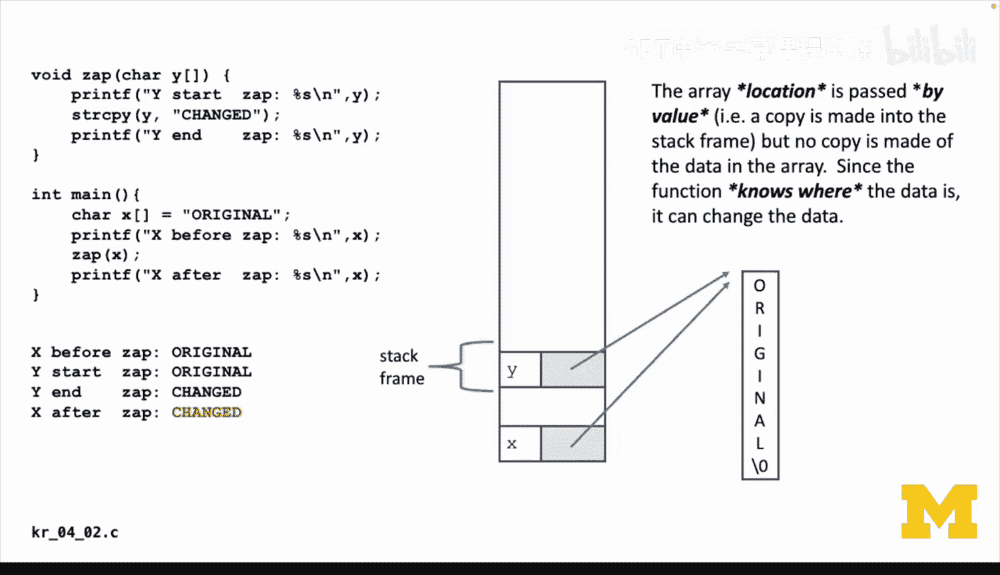

这并不完全是“按引用传递”，而是“按位置传递”。如果你错误地操作了这个位置（例如向只读内存写入），程序可能会崩溃。因此，当你在函数内操作传入的数组时，必须清楚自己在做什么。有时这是设计所需，有时则很危险。

## 寄存器变量 💾

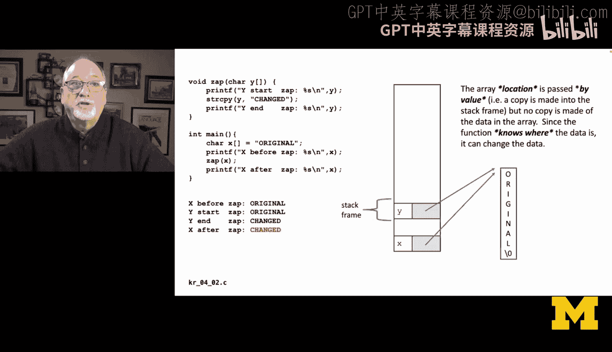

另一个你会看到的历史概念是**寄存器变量**。这主要是为了说服那些熟练的汇编语言程序员，让他们相信用C语言也能获得与汇编语言相当的性能。

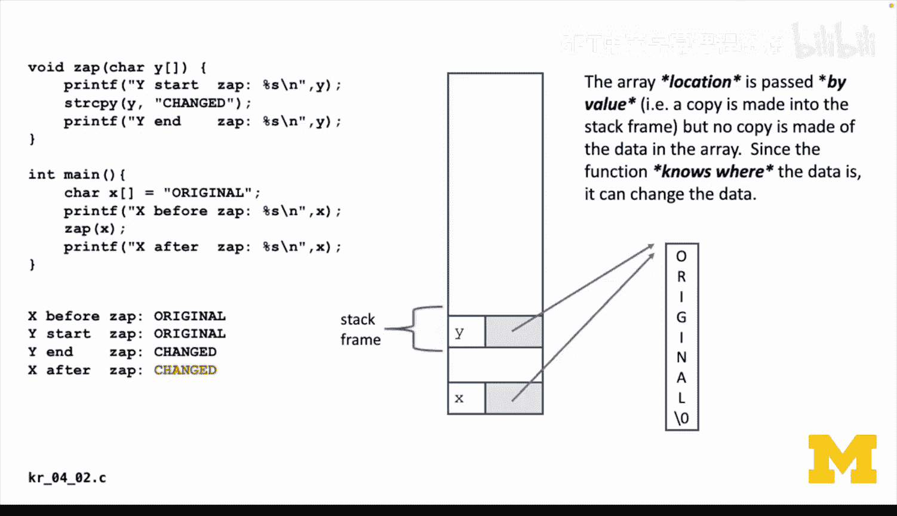

什么是寄存器？在中央处理单元中，数据通常存储在内存中，而寄存器则位于CPU内部。根据速度差异，访问寄存器可能比访问常规内存快数十倍。因此，如果你能将一个循环中频繁使用的变量（例如`i`）保存在寄存器中，速度会更快。

在C语言中，使用`register int x;`这样的声明，是在提示编译器：“接下来的几行代码中，`x`是一个非常重要的变量，我会频繁使用它。如果可能，请不要将其存储在内存中，尽量放在寄存器里。”寄存器变量一个奇怪的特点是：你无法获取寄存器变量的内存地址。

现代的编译器拥有近乎神奇的运行时优化器。即使是最简单的优化器也能显著提升代码速度。声明`register`实际上可能让优化器困惑。所以，`register`关键字的作用更像是告诉编译器：“我永远不会询问这个变量的地址，所以如果你觉得没必要，可以不把它放在内存里。”

尽管如今`register`关键字可能已不那么重要，但思考早期C开发者如何与底层运行时和汇编语言紧密联系，仍然是件有趣且引人入胜的事。

---

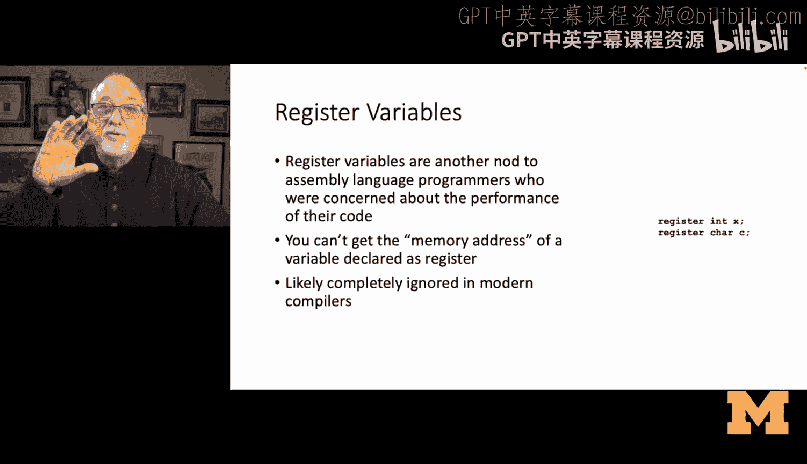


**本节课总结**：
在本节课中，我们一起深入探讨了C语言函数机制的基石。我们学习了**栈**这一后进先出的数据结构，并了解了它如何通过**栈帧**来管理函数调用，实现局部变量的隔离和**按值传递**的复制效果。通过对比Python和C语言中数组参数传递的不同，我们明白了C语言中传递数组实际上是传递其首地址，这是一种“按位置传递”，使得函数内部能修改原始数组数据。最后，我们还简要回顾了**寄存器变量**这一历史概念，理解了其提升性能的初衷。这些底层概念为我们理解程序如何运行以及后续学习更复杂的数据结构和算法打下了坚实的基础。